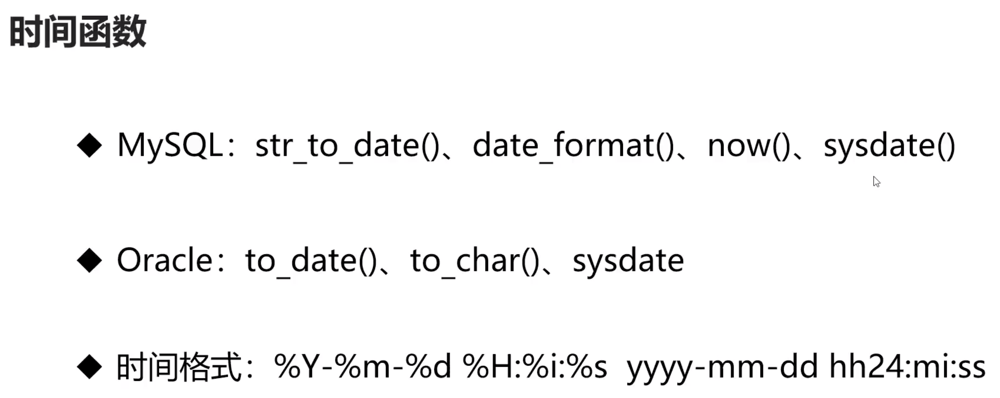

## Oracle 数据库开发基础
- connection 和 sqlstatement 类的使用和编译
- Oracle错误代码； 动手实践查看和MySQL错误代码的区别
- 其他注意事项（查询语句的结果集、数据库函数的使用）

### MySQL与Oracle 数据库函数的兼容性问题的解决
- 各种数据库的函数不一样，尽量不要使用数据库提供的函数
    - 分组函数没有区别  count() max() min() agv() sum()
- 用编程语言实现函数的功能（性能和兼容性）
    - 
    - 如 MySQL 中日期的表示为 '%Y-%m-%d %H:%i:%s'  Oracle 中日期的表示为 'yyyy-mm-dd hh24:mi:ss'
    - 对于C程序员来说，使用%作为日期的格式化表示是非常痛苦的。
``` cpp
    // 为了和oracle兼容
    // 把to_date规制成str_to_date。
    if (strstr(m_sql,"str_to_date")==0) MY__UpdateStr(m_sql,"to_date","str_to_date",false);
    // 把to_char替换成date_format。
    MY__UpdateStr(m_sql,"to_char","date_format",false);
    // 把"yyyy-mm-dd hh24:mi:ss"替换成"%Y-%m-%d %H:%i:%s"
    MY__UpdateStr(m_sql,"yyyy-mm-dd hh24:mi:ss","%Y-%m-%d %H:%i:%s",false);
    // 把"yyyymmddhh24miss"替换成"%Y%m%d%H%i%s"
    MY__UpdateStr(m_sql,"yyyymmddhh24miss","%Y%m%d%H%i%s",false);
    // 如果想兼容oracle和mysql更多的时间格式，可以在这里加代码。
    // 一定要把格式一一列出来，不能用"yyyy"替换"%Y"，因为在SQL语句的其它地方也可能存在"yyyy"。
```
- 用自定义数据库函数解决数据库之间不兼容的问题
    - 如oracle中没有now()函数，但是有sysdate函数。为了兼容mysql我们可以
```sql
SQL> create or replace function now return date
  2  as
  3  begin
  4  return sysdate;
  5  end;
  6  /

函数已创建。
```
    自定义一个now()函数