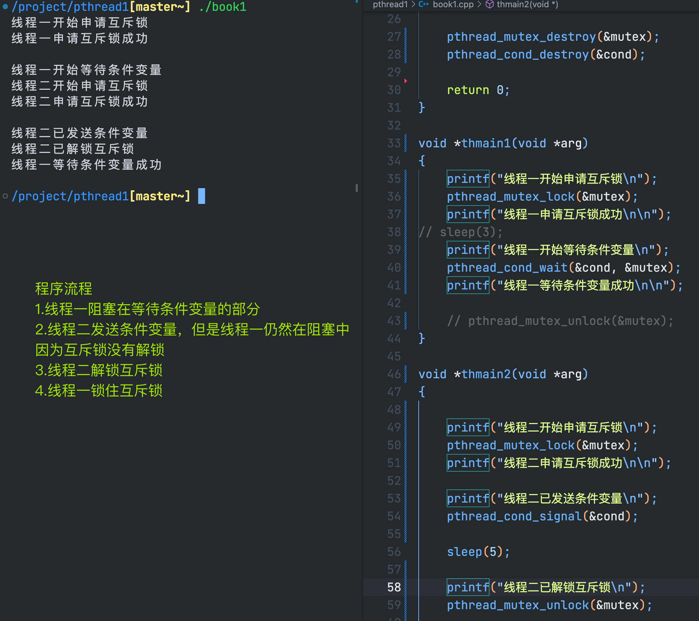

### 生产消费者模型
> - 了解生产消费者模型的概念
> - 使用 互斥锁 + 条件变量实现生产消费者模型
> - 使用信号量实现生产消费者模型

---
#### 了解生产消费者模型的概念
> 多线程可以使用以上两种方法来实现生产消费者模型
> 多进程只能使用信号量来实现生产消费者模型


这张图里的生产者和消费者对应为进程/线程
如果生产者和消费者是不同的进程，需要使用共享内存作为缓存
如果生产者和消费者是同一个进程中的不同线程，直接动态的分配一块内存出来就行

---
#### 使用 互斥锁 + 条件变量实现生产消费者模型
```cpp
// 条件变量的wait函数
pthread_cond_wait(&cond, &mutex)
```
- 把互斥锁解锁

当线程一开始等待条件变量（释放互斥锁）后，线程二才能够申请互斥锁成功
- 阻塞，等待条件（被唤醒）

当线程一等待条件变量成功（锁住互斥锁）后，线程一和线程二都无法成功申请互斥锁
- 条件触发+给互斥锁加锁（这里虽然是两步操作，但这两步合起来为原子操作）

上面的示例说明这两步操作是原子操作

#### 生产消费者模型的实现
采用条件变量和互斥锁来实现（条件变量就是为了解决生产消费者模型的）
有 生产者 和 消费者 缓冲区
##### 生产者

##### 消费者

##### 缓冲区

我们在这里使用容器来作为缓冲区，也可以使用链表...只要是进程中的公共资源就可以

#### 注意事项
> 在上面的实现中，我们使用了三个线程，并且生产者每次生产数据时，一次生产三份，每次只唤醒一个线程

> 这样做并不高效，我们希望线程能够并发的执行，可以尝试一次唤醒所有线程
##### 一次唤醒所有线程

当我们尝试一次唤醒所有线程之后，发现，线程能够并发的执行了。
不过在下面遇到了一个错误。这个错误在我们将改为生产者一次只生产两条数据之后更为明显

解决办法是将消费者的判断缓冲区是否为空的代码有if 改为 while
因为，如果是if，线程被唤醒之后，可能会读不到数据，在`memcpy`步骤出错


#### 消费函数的理解
一个结构体用于存放从缓存中出队的消息，消费者的功能是不断的处理缓存中的数据，所以。它的主流程是一个死循环。循环的开始，先给缓存队列加锁。然后再判断缓存中是否有数据，如果有数据就不进入这个while循环了。继续下面的流程。因为现在是持有锁的，所以这两行操作缓存的代码是安全的。从缓存中取出一条数据库，再给缓存解锁。下面是处理业务的代码，

把从缓存中拿出来的数据处理掉。刚才说的是缓存中有数据的情况，在这种情况下。这些代码的逻辑没有问题，对吧？再来看缓存中没有数据的情况，如果没有数据，就调用wait函数，wait函数会先解开互斥锁，然后再等待条件信号。因为等待条件信号的时候，互斥锁已经解开了，所以不会影响其他的线程操作缓存。对吧，如果有条件信号到了wait函数将返回，注意了wait函数返回的时候会持有锁。在持有锁的情况下，继续下面的流程也是安全的，这里一定要搞明白

这就明白了条件变量的wait函数为什么要这么设计

#### 线程退出时需要注意
在清理函数中释放锁，这个细节非常重要，不然线程无法正常的退出

在pthread_cond_wait时执行pthread_cancel后， 要先在线程清理函数中要先解锁已与相应条件变量绑定的mutex，这样是为了保证pthread_cond_wait可以返回到调用线程。


---
#### 使用信号量实现生产消费者模型


##### 注意
条件变量的触发条件和给互斥锁加锁是原子操作，如果用信号量来实现，它是两个步骤不是原始操作

在多线程程序中用信号量实现的生产消费者模型，不如条件变量方便，但是在多进程中只能用信号量，在操作系统里也是用信号量来实现生产消费者模型的，没有条件变量，

线程里面信号量的pv操作，只能把信号量的值减一或者加一。但是在进程里面没有这个限制。在线程里面，如果生产了多条数据，就要执行多次的加1操作。在进程中，只需要调用一次v操作就可以了。
```cpp
#include <stdio.h>
#include <stdlib.h>
#include <string.h>
#include <unistd.h>
#include <pthread.h>
#include <signal.h>
#include <semaphore.h>
#include <vector>

using namespace std;

struct st_args
{
    int  mesgid;
    char message[1024];
};

vector<struct st_args> vcache;

sem_t sem, lock;

void  incache(int sig);         // 生产者函数
void *outcache(void *arg);      // 消费者函数

int main(int argc, char *argv[])
{
    signal(15, incache);

    sem_init(&sem, 0, 0);       // 初始化通知信号量
    sem_init(&lock, 0, 1);      // 初始化加锁信号量

    pthread_t thid1 = 0, thid2 = 0, thid3 = 0;

    pthread_create(&thid1,  NULL, outcache,  NULL);
    pthread_create(&thid2,  NULL, outcache,  NULL);
    pthread_create(&thid3,  NULL, outcache,  NULL);

    pthread_join(thid1, NULL);
    pthread_join(thid2, NULL);
    pthread_join(thid3, NULL);

    sem_destroy(&sem);
    sem_destroy(&lock);

    return 0;
}

void incache(int sig)
{
    static int id = 1;
    struct st_args stargs;
    memset(&stargs, 0, sizeof(struct st_args));

    // 锁住加锁信号量
    sem_wait(&lock);

    // 生产数据，放入缓冲队列
    stargs.mesgid = id++; vcache.push_back(stargs);
    stargs.mesgid = id++; vcache.push_back(stargs);
    stargs.mesgid = id++; vcache.push_back(stargs);
    stargs.mesgid = id++; vcache.push_back(stargs);

    // 增加通知信号量，解锁加锁信号量
    sem_post(&lock);

    // 把信号量的值+1，生产了多少数据，就+多少次，这样可以保证线程并发执行
    sem_post(&sem);
    sem_post(&sem);
    sem_post(&sem);
    sem_post(&sem);
}

void *outcache(void *arg)
{
    struct st_args stargs;
    memset(&stargs, 0, sizeof(struct st_args));

    while (true)
    {
        sem_wait(&lock);

        // 判断是否有产品可供消费
        while (vcache.size() == 0)
        {
            // 没有产品可供消费，解锁互斥锁，供生产者访问互斥锁，并生产产品
            sem_post(&lock);
            sem_wait(&sem);
            sem_wait(&lock);
        }

        // 消费
        // 从缓冲池中取出一条信息
        memcpy(&stargs, &vcache[0], sizeof(struct st_args));
        vcache.erase(vcache.begin());

        sem_post(&lock);

        printf("thid = %lu, mesgid = %d\n", pthread_self(), stargs.mesgid);
        usleep(100);
    }
}
```


---