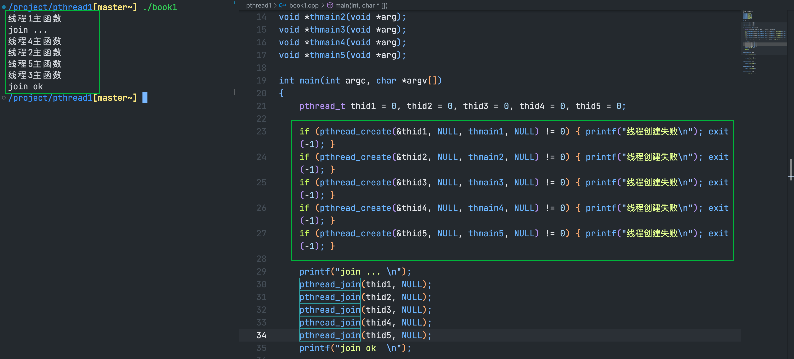
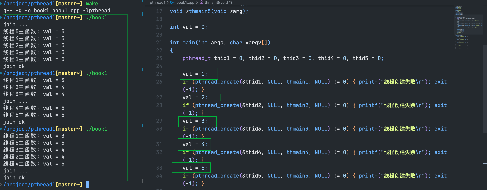
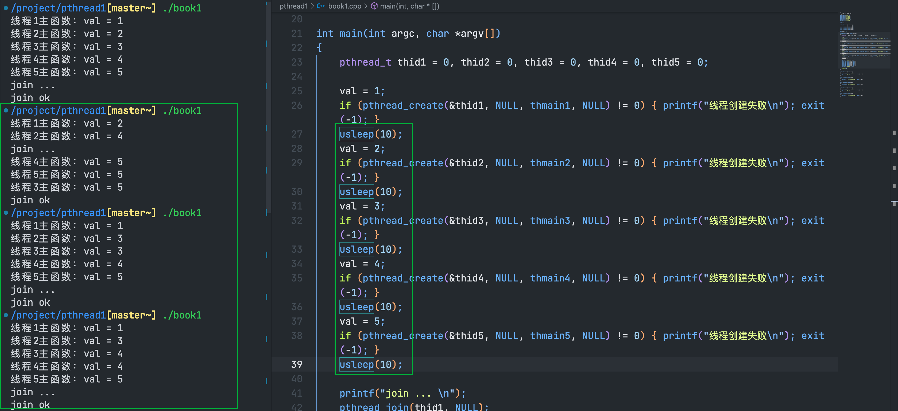
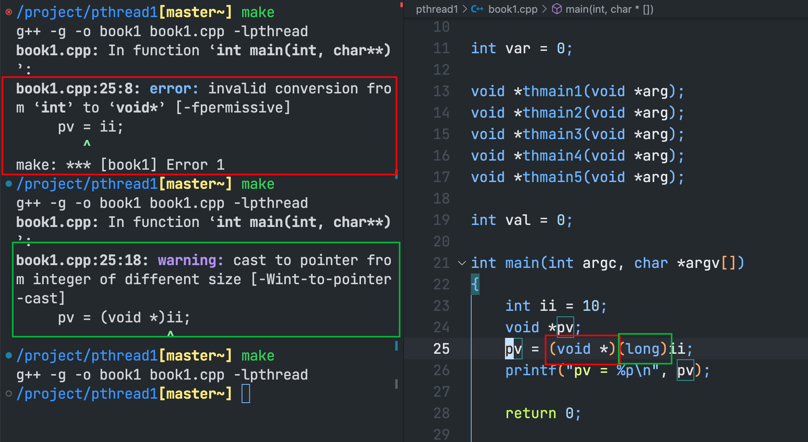
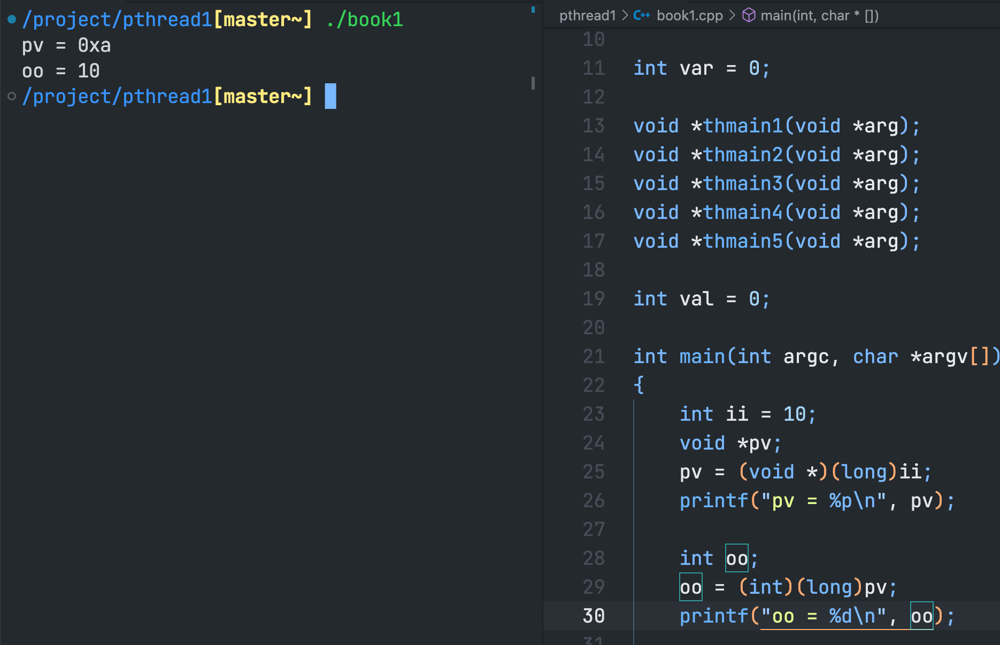
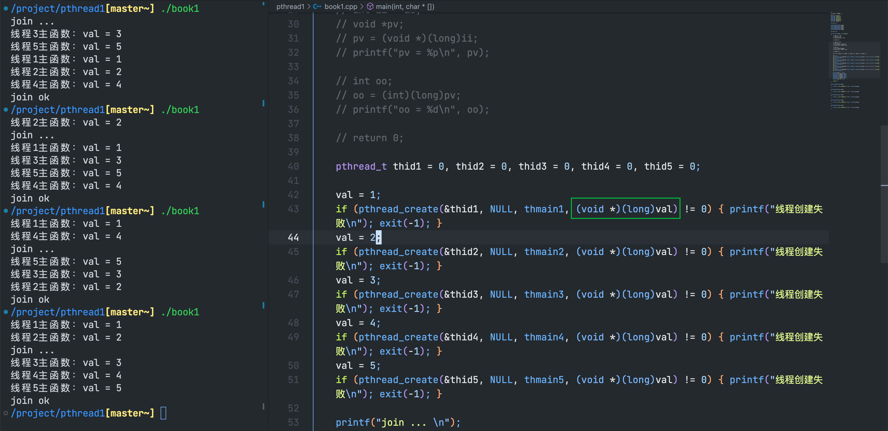
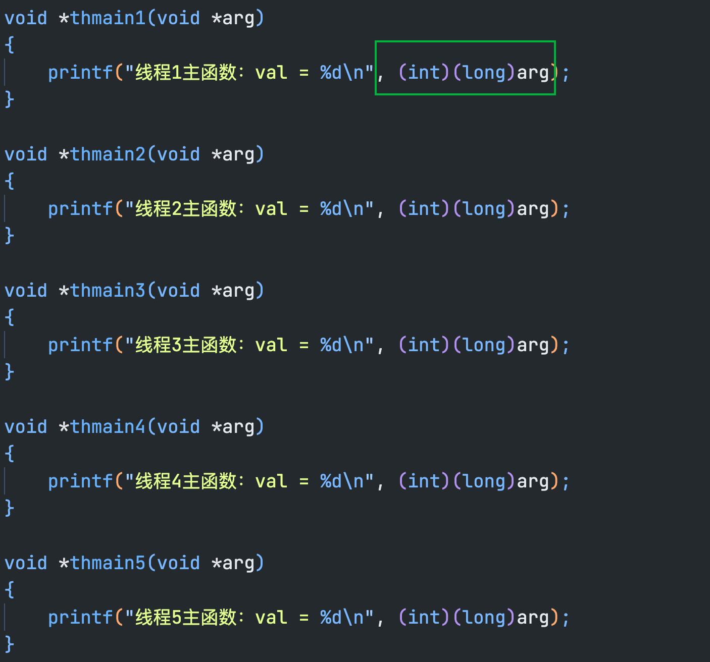
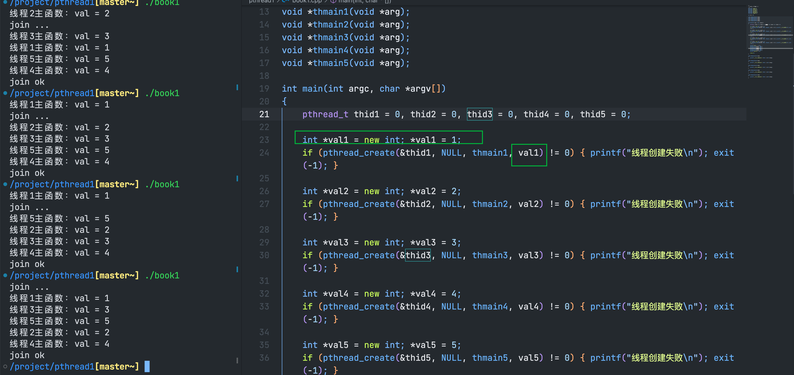
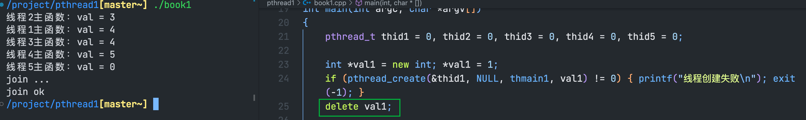

### 线程参数传递
#### 创建的多个线程并不能保证哪个线程先运行

#### 不能用全局变量代替线程函数的参数
在单进程和多进程的程序中，我们通常使用全局变量来代替多进程中进程的参数。
而由于多线程不能保证哪个线程先运行，对于全局变量的更改可能无法作用到想要作用的地方

如果我们在创建线程之后，`usleep(10)` 很短的时间，无法避免上述情况，只有sleep比较长的时间才可以避免

在实际开发中，不会使用sleep来控制线程参数的传递
#### 数据类型强制转换

将ii强制转换为void * 类型，就可以将ii的值赋予pv。但是此时会出现`损失精度`的警告，需要将ii转换成long(8字节 与 pv的大小相同)

如果使用传递地址的方法，那么与使用全局变量是一样的

正确的方法是传递全局变量的值，而不是地址
在create函数中，需要将int类型的全局变量的值赋值给void *类型，进行强制转换

在输出arg的值时，需要将void *类型的变量，强制转换为int类型

#### 如何传递地址参数(可以传多个整型参数)

给多个线程传同一个地址是不行的，要给每一个线程传一个地址，全局变量是同一个地址，不能这样，需要每次创建线程的时候，临时的分配一块内存出来

这样就可以

> ⚠️注意：但是此时，我们必须要在线程主函数中释放动态分配的内存，而不能在主线程中释放动态分配的内存。如果这样做，可能会出现线程还没开始运行，给其分配的参数的内存就已经被释放了

#### 线程的返回值

线程的返回函数这样写也可以`    pthread_exit((void*)stargs);`