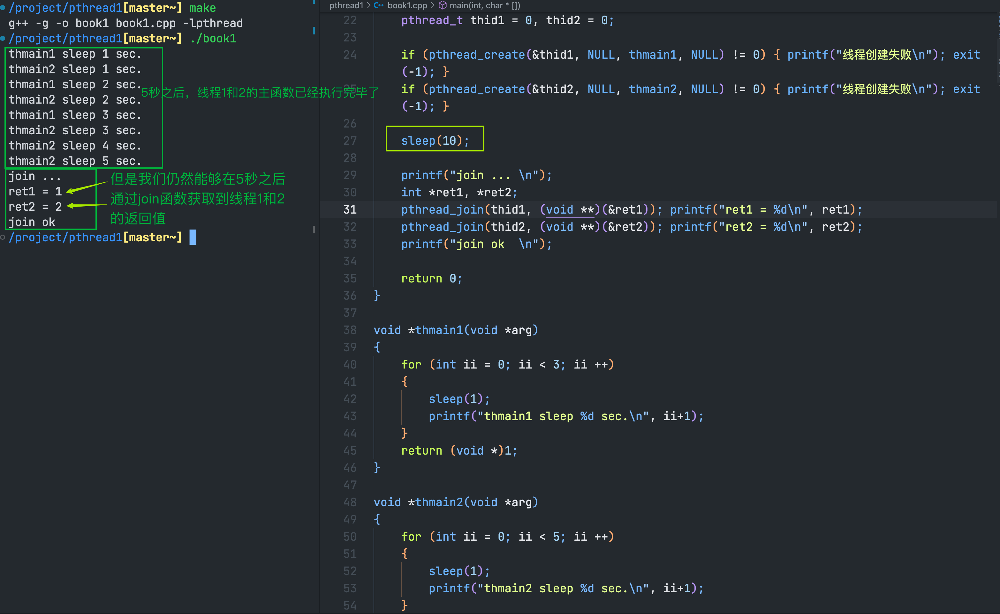
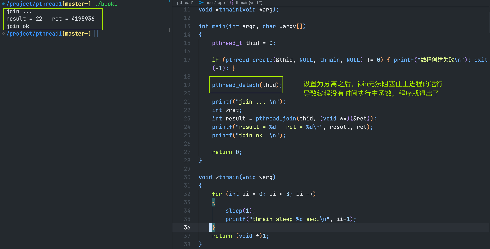
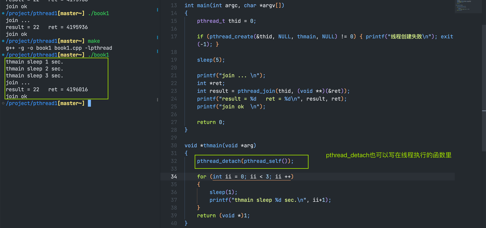
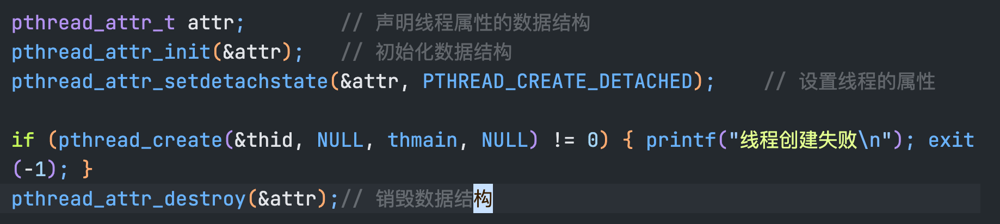

## 线程资源的回收

> 我们先回顾一下 `进程资源的回收`
> - 子进程退出时，向父进程发送SIGCHLD信号，如果父进程不对SIGCHLD信号进行处理，会产生僵尸进程
> - 1.父进程调用wait()函数等待子进程的退出 || 2.忽略SIGCHLD信号
> - 在信号处理函数中释放资源

### 线程的分离
- 线程有非分离(joinable) 和 分离(unjoinable)两种状态
- 线程缺省状态是非分离，或者称为可连接的(可 join)
- 非分离状态的线程终止时，不会释放线程全部的资源

> 通过上面的示例，我们可以看出，线程在执行完主函数(退出了)之后，并不是全部的资源都释放了
> 如果线程执行完主函数之后，就释放了资源，那么我们在sleep(10)秒之后，通过join函数无法获取到任何内容。

- 把线程的属性设置为分离，线程结束后，由系统回收资源
- 调用pthread_detach()函数分离线程


- 创建线程前，调用pthread_attr_setdetachstate()设置线程的属性


> 除了pthread_join()函数外，还有两个join函数
> pthread_tryjoin_np()，用法与join函数一样，不过是非阻塞的函数
> pthread_timejoin_np()，与join相比，多出了超市时间，timespec结构体

### 用线程清理函数释放资源
- 线程终止的时候，可以调用清理函数释放资源
- 清理函数入栈：pthread_cleanup_push();
- 清理函数出栈：pthread_cleanup_pop();
pop函数参数取值为0，表示清理函数出栈，但不执行，
取值不为0，表示清理函数出栈，且执行
```cpp
// void
// pthread_cleanup_push(void (*cleanup_routine)(void *), void *arg);

// void
// pthread_cleanup_pop(int execute);

void thcleanup(void *arg)
{
    // 在这里释放 关闭文件、断开网络连接、回滚数据库事务、释放锁等
    printf("clean ok\n");
}

void * thmain(void *arg)
{
    pthread_cleanup_push(thcleanup, NULL);

    ...

    pthread_cleanup_pop(1);
}
```

#### 线程清理函数
- 线程可以有多个清理函数，但是 push 和 pop 必须成对出现
- 线程终止(return 、 pthread_exit() 、 pthread_cancel())、语句块结束的时候，清理函数将被执行

#### ask chatgpt
在正常线程退出、调用pthread_exit函数以及由其他线程调用pthread_cancel函数取消线程时，清理函数会在这些情况下被动出栈执行。这是由系统自动管理的，确保清理函数在适当的时机执行。

而pthread_cleanup_pop函数是用于在需要取消注册清理函数时，手动进行主动出栈操作。当我们调用pthread_cleanup_pop时，会从清理函数栈中弹出一个或多个清理函数，以确保正确的执行顺序和下一个清理函数的执行。

因此，被动出栈是由线程退出或取消触发的，而主动出栈是由开发者手动调用pthread_cleanup_pop触发的。两者都起到了管理清理函数栈的作用，以确保清理函数的正确执行。