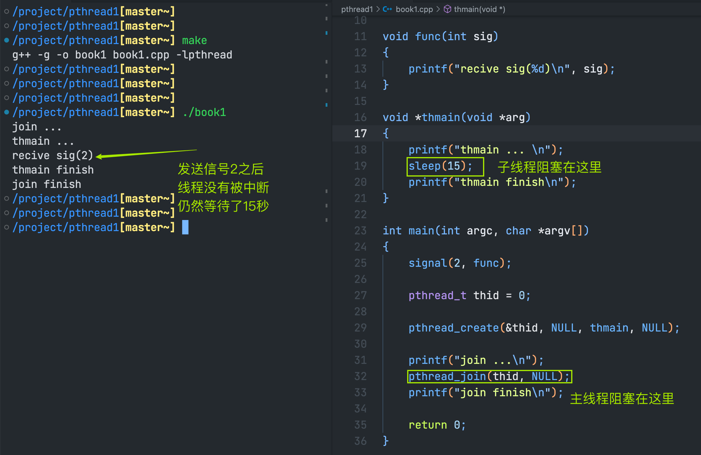
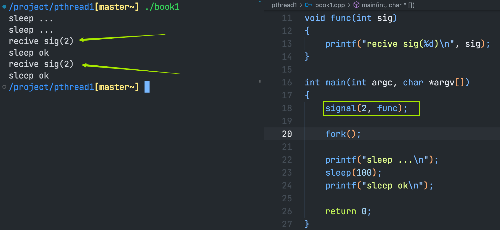
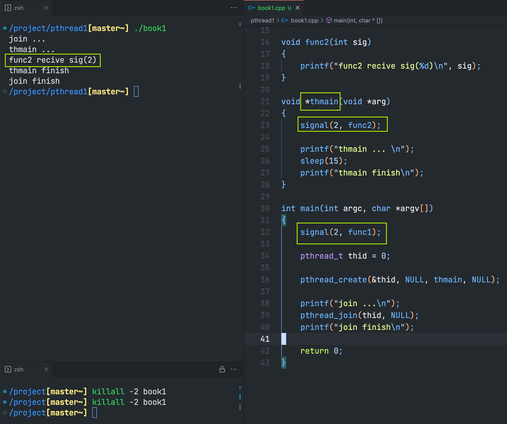
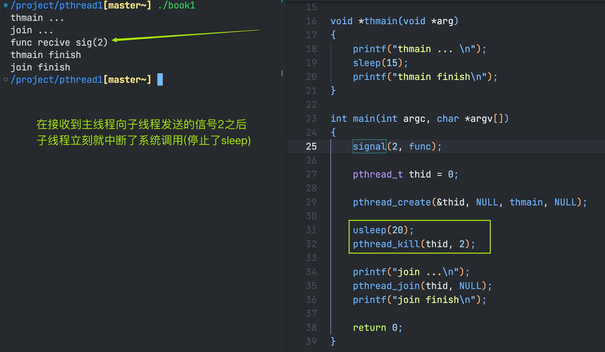
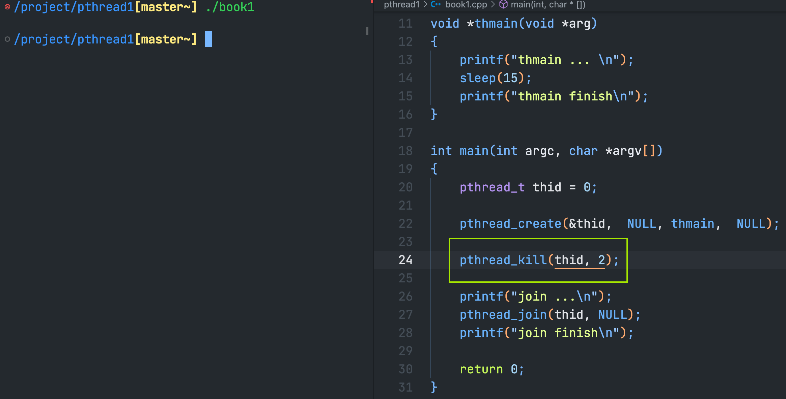
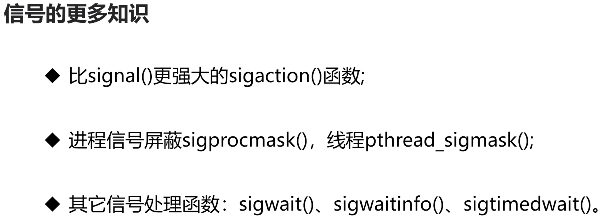

### 线程和信号
> 内容
> ---
> - 在多线程程序中，外部向进程发送信号不会中断系统调用
> - 在多线程程序中，信号的处理是所有线程共享的
> - 进程中的信号可以送达单个线程，会中断系统调用
> - 如果某个线程因为信号而终止，整个进程将终止
---
- 在多线程程序中，外部向进程发送信号不会中断系统调用

> 在多(单)进程程序中，外部向进程发送信号会中断系统调用
> 
> 当我们向book1进程发送`killall -2 book1`信号2时，系统中断了正在`sleep`中的进程。
---
- 在多线程程序中，信号的处理是所有线程共享的

在上面的示例中，子线程主函数使用信号处理函数func2，主线程使用信号处理函数func1。
最终只接收到了func2的处理结果，func1却没有。
原因是：在多线程程序中，信号的处理是共享的，以最后的信号接收为准
---
- 进程中的信号可以送达单个线程，会中断系统调用

---
- 如果某个线程因为信号而终止，整个进程将终止

这个程序没有对信号2的处理，因此默认为终端程序。
通过运行结果可以看粗，主线程向子线程发送信号2之后，整个进程都终止了
---
