### 线程安全
> - 多个线程访问共享资源（全局和静态）的时候会冲突
> - 三个概念：原子性、可见性、顺序性
> - 如何解决线程安全
>   - volatile关键字
>   - 原子操作（原子类型）
>   - 线程同步
---
#### 多个线程访问共享资源（全局和静态）的时候会冲突
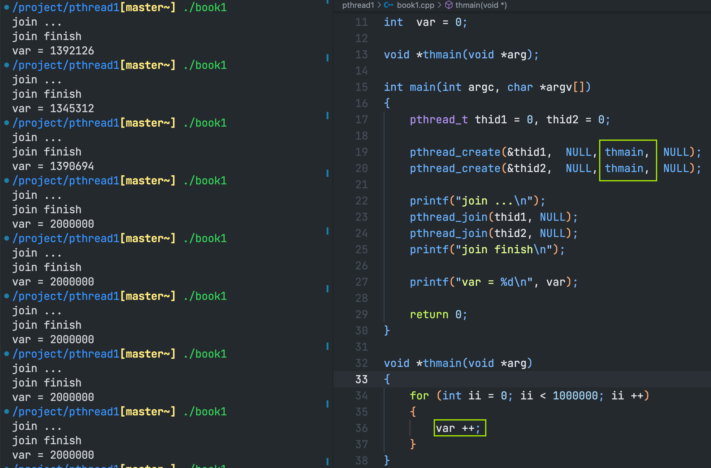
两个子线程公用一个线程主函数，同时对全局变量进行++操作
预期的结果应该为`var = 2000000`
但是实际结果却不一定

---
#### 三个概念：原子性、可见性、顺序性
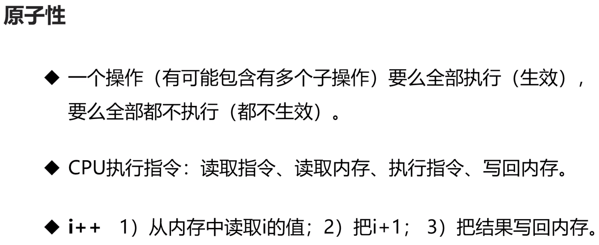
因此i++操作并不能成为原子性操作

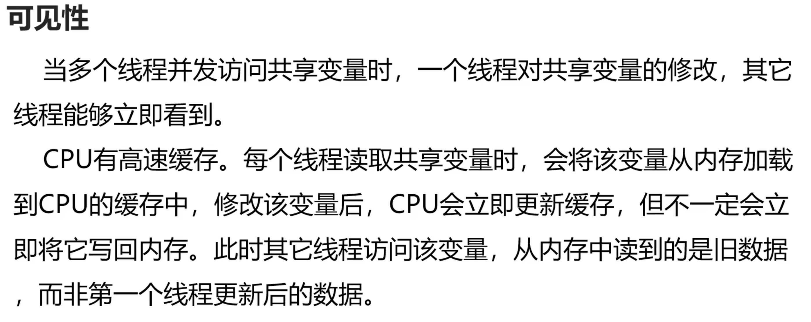

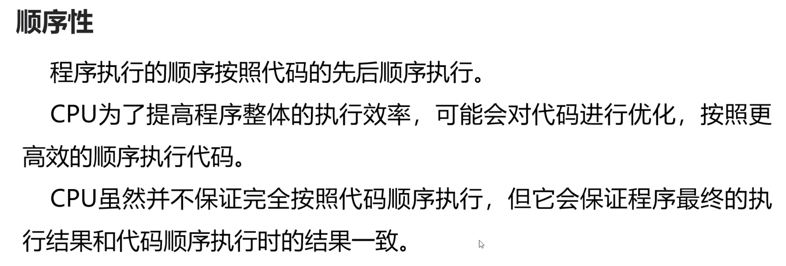
比如
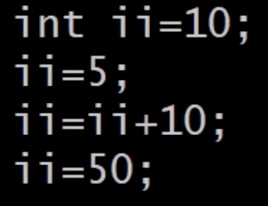
经过优化后可能直接写为

---
### 如何解决线程安全
#### volatile关键字
- 保证了变量的内存可见性
> 告诉CPU每次直接从内存中读取数据，不要放在缓存里
- 禁止代码重排序
- 不具有原子性
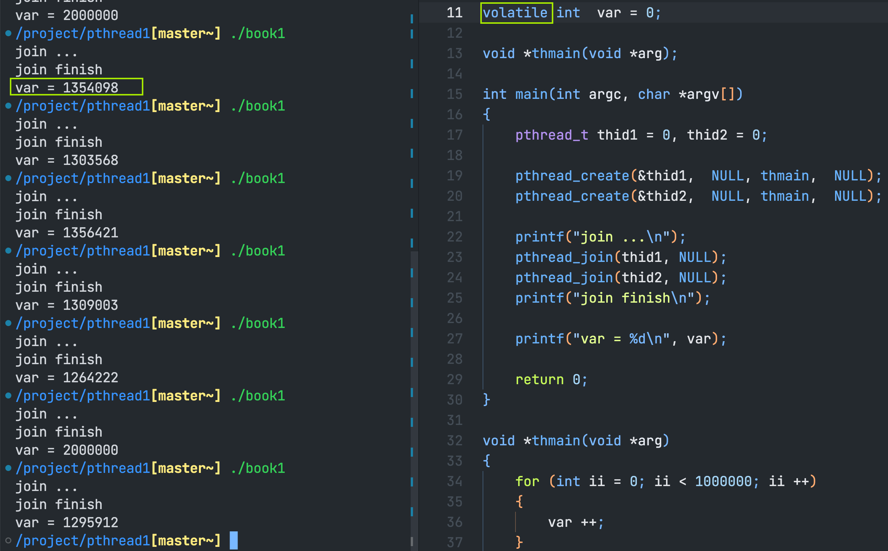
volatile关键字并不具有原子性，无法保证var的值
---
#### 原子操作（原子类型）
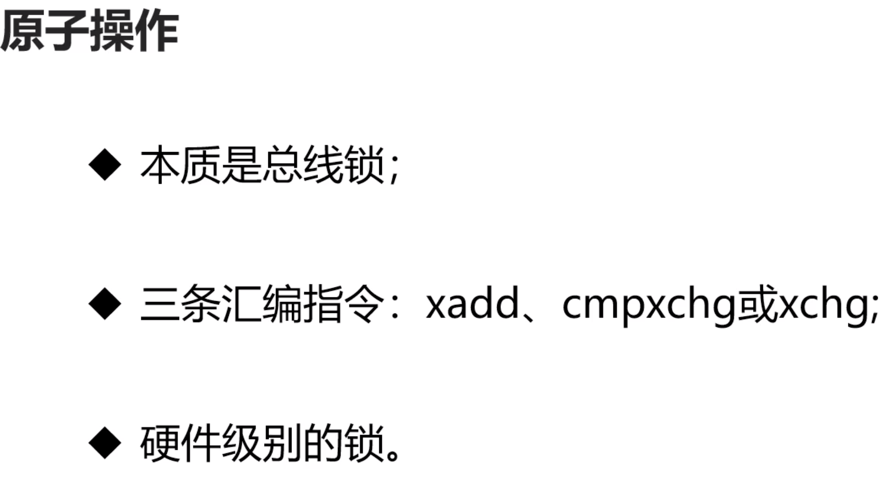
总线锁可以理解为硬件级别的锁，它的效率非常高。比线程库提供的锁要快10倍左右
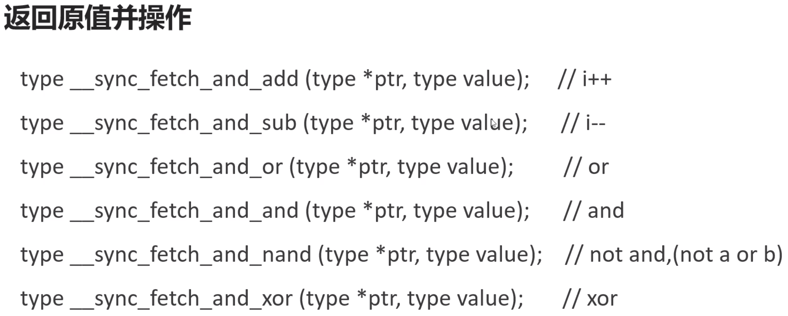
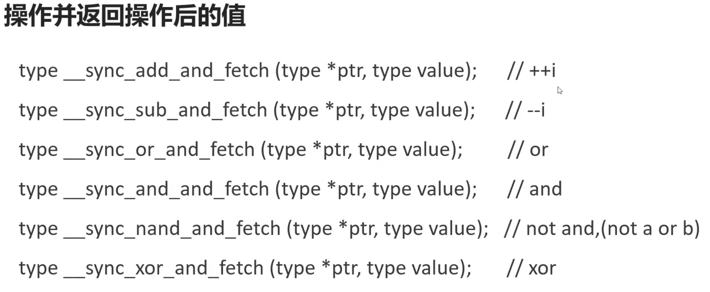
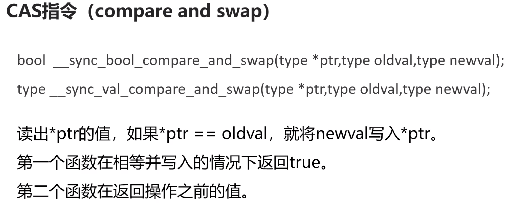
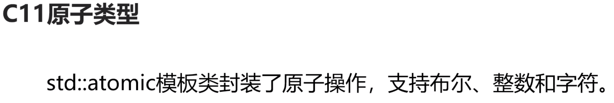
以上是C语言提供的原子操作的函数
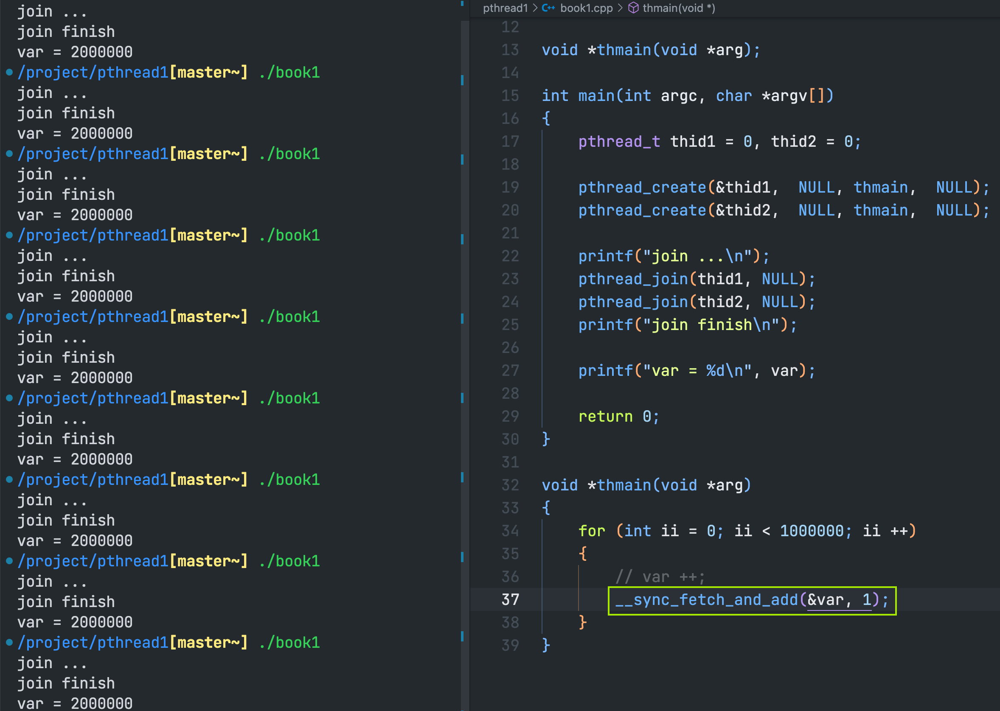
虽然总线锁的效率很高，但是它只能作用于整形变量

---
#### 线程同步