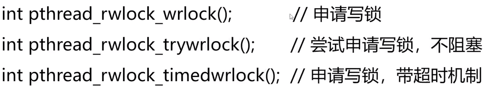

### 线程同步
> - 互斥锁
> - 读写锁
> - 信号量
> - 自旋锁
> - 条件变量
> - 生产消费者模型
---
#### 互斥锁


```cpp
pthread_mutex_t mutex;  // 声明互斥锁
pthread_mutex_t mutex = PTHREAD_MUTEX_INITIALIZER;  //初始化锁
// 也可以这样初始化
pthread_mutex_init(&mutex, NULL);   // 初始化锁
pthread_mutex_destory(&mutex);
```


---
#### 自旋锁
与互斥锁类似。互斥锁在等待锁的时候，线程会休眠不消耗CPU。
而自旋锁用一个循环，不断的检查锁是否可用
适用于等待时间很短的场景
自旋锁没有带超时机制的加锁函数。因为使用自旋锁有一个前提条件，就是假设等待的时间会很短，不应该等待很长时间，如果等待的时间比较长就用互斥锁
```
  pthread_spin_init();
  //它的第二个标志是共享标志

  //PTHREAD_PROCESS_SHARED表示在多个进程中的线程之间可以共享

  //PTHREAD_PROCESS_PRIVATE只在初始化本自旋锁的进程内的线程才能使用该自旋锁

  //在实际开发中，我们的服务程序要么是多线程，要么是多进程，其实可以在多进程的程序中创建线程，也可以在线程的fork创建进程，但几乎不用

  ///PTHREAD_PROCESS_PRIVATE它的意思是在多进程中创建了多线程，不同进程之间的线程是否可以共享自旋锁，一般填私有的
```


---
#### 读写锁





饿死写锁的示例

使用信号处理函数来申请写锁，三个线程主函数来申请读锁
在第50行加入`        if (ii == 3) sleep(7);`
让所有线程循环到第四次的时候休眠7秒，写锁可以被执行

---
#### 条件变量


---
#### 信号量
第二章讲进程通讯的时候介绍过信号量，用信号量给共享内存加锁，建议再看一遍，进程的信号量是全局的有一个key，线程的信号量是匿名的，只能在同一个程序中的多个进程的线程中使用，他们的信号量原理是一样的，在多线程的程序中，可以用进程的信号量，也可以用线程的信号量，但是线程的信号量更加方便，但是线程的信号量不能用在多进程的程序中


### 线程同步的细节
互斥锁、自旋锁、读写锁、条件变量、信号量的竞争机制
一个线程在释放锁之后，可能会连续很多次获得锁

互斥锁有两种竞争机制，一种是形成等待机制(不是绝对公平的，对应用开发没有影响)，另一种是重新竞争

自旋锁、条件变量、信号量都是形成等待队列

读写锁的写锁饥饿问题，在实际开发中，是饿不死的
在实际开发中，用其他的方法实现公平锁和写优先锁