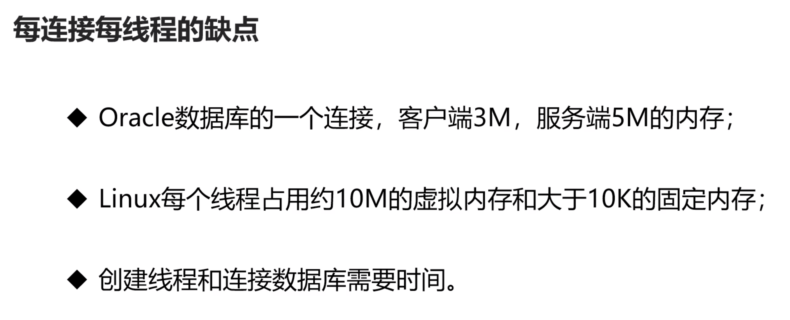

#### 功能需求
- 通过配置参数，实现不同的数据接口
- 权限控制（用户名/密码/ip限制）
- 访问日志（接口名/时间/数据量）

- 客户端调用接口的时间间隔比较长，通讯方式采用短连接
- 服务端采用每连接每线程

线程跑的太快，导致主进程还没有把线程id加入到容器中时，线程就已经终止了，这样线程在退出之前，没办法从容器中找到自己的id并把它从容器中清理掉，导致容器中始终保留着某个线程的id（实际上这个id是在线程已经退出之后，主进程将其加入到容器当中的），在信号处理函数中，取消线程出错，出现段错误
这种错误是因为某个线程运行的太快导致的，我们可以将线程主函数中，某个可能会让线程很快结束的地点usleep一下，让它慢点退出