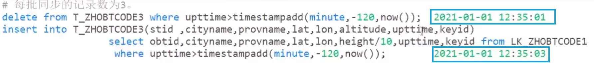
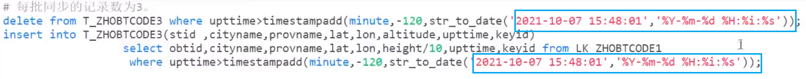

```cpp
where  同步数据的条件，本参数可以为空，如果为空，表示同步全部的记录。填充在delete本地表和select Federated表之后。
       注意：
        1）where中的字段必须同时在本地表和Federated表中；
        2）不要用系统时间作为条件
```
1 where中的字段必须同时在本地表和Federated表中；
> 在实际业务中，一般来说，本地表和Federated的字段都是相同的，我们可以使用同一个where来进行条件过滤
``` sql
delete from 本地表 where ...;
insert into 本地表(本地表字段)
    select Federated表字段 from Federated表 where ...;
```
> 如果这两张表的字段不同，我们可以使用两个where来进行条件过滤

<br>

2 不要用系统时间作为条件
> 可能在执行delete语句时的时间与执行insert语句时的时间不一致，导致delete语句删多了（或者删的刚刚好），而insert语句插入少了



> 解决 改成一个具体的时间
