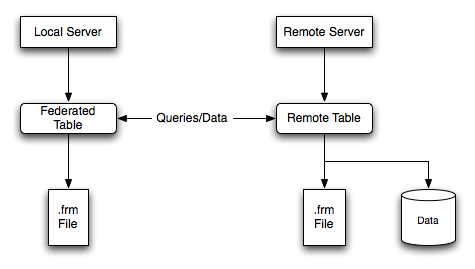

### FEDERATED 存储引擎架构
FEDERATED存储引擎能让你访问远程的MySQL数据库而不使用replication或cluster技术(类似于Oracle的dblink),使用FEDERATED存储引擎的表,本地只存储表的结构信息,数据都存放在远程数据库上,查询时通过建表时指定的连接符去获取远程库的数据返回到本地。
 

> 1 本地服务器 FEDERATED 存储引擎的表只存放表的.frm结构文件 
> 2 远程服务器 存放了.frm和数据文件 
> 3 增删改查操作都是通过建立的连接来访问远程数据库进行操作,把结果返回给本地。 
> 4 远程数据表的存储引擎为MySQL支持的存储引擎,如MyISAM,InnoDB等 