线程的创建与终止
===

- 线程创建、等待线程退出、查看线程
- 线程非正常终止
- 终止线程的三种方法

线程创建、等待线程退出、查看线程
===

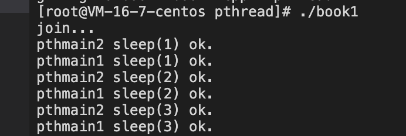

线程的非正常终止
===

- 如果主线程退出，全部线程将强行终止
- 在子线程调用exit()将终止整个进程
- 缺省行为使终止程序的信号将导致整个进程终止

如果是多进程，如果主进程退出，子进程将继续进行

如果是多进程，如果子进程退出，其他进程将继续进行

如果是多进程，子进程Core dump掉不影响其他进程

如果是多线程，子进程Core dump掉，整个进程玩完

如果某个字线程的代码有bug，出现内存溢出的情况，core dump掉了整个程序会怎么样？

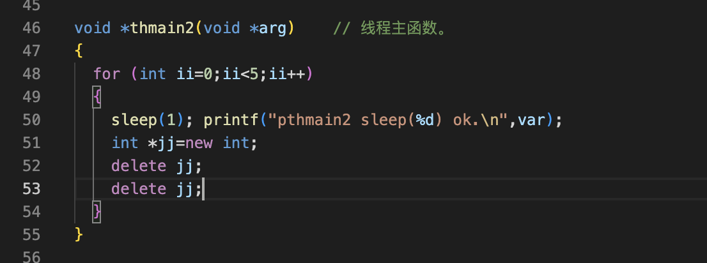

整个程序挂掉了

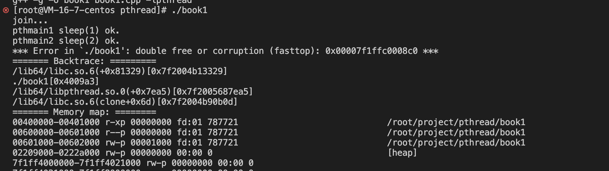

线程终止的三种方法
===

return与exit终止线程的区别
---

- 线程可以简单的从线程函数中返回，返回值是线程的退出码

- 线程可以被同一进程中的其他线程调用pthread_cancel()取消
- 在线程函数中，调用pthread_exit()退出
- 如果线程主函数调用了其他的函数，在其他的函数中用return只能回到线程主函数，不能终止线程，如果在其他的函数中用exit也可以终止线程

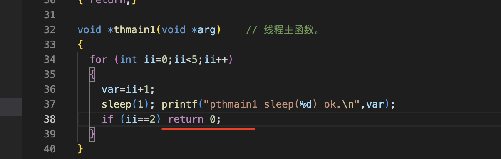

第一种 这样就行，返回值就是0

第二种 在线程1里面取消线程2

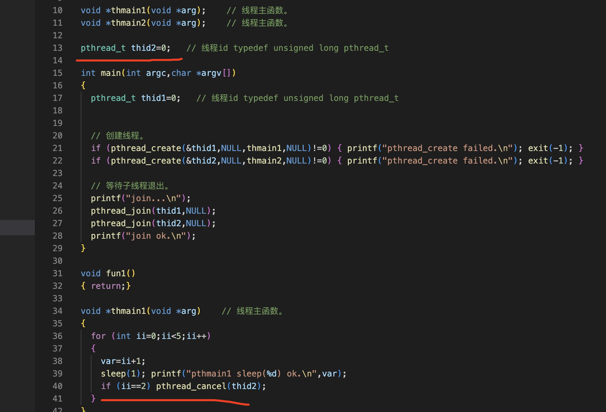

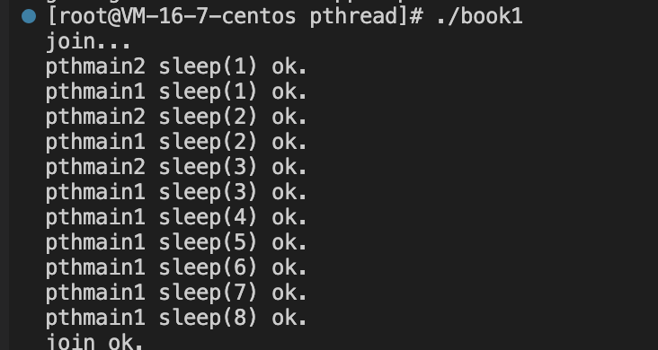

第三种： 三秒后线程1退出了

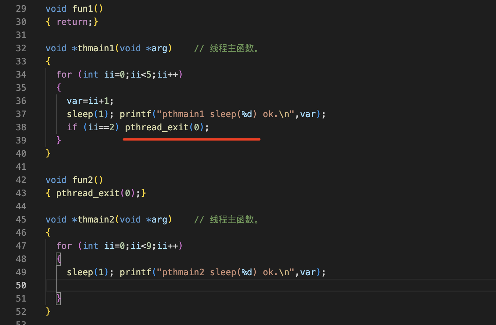

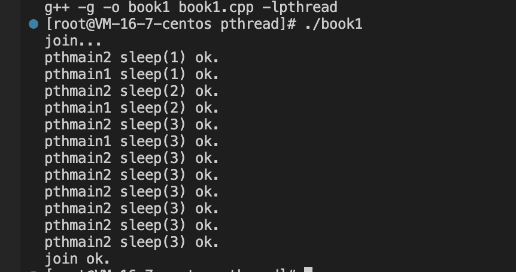

第四种：线程2终止了，线程1没有终止

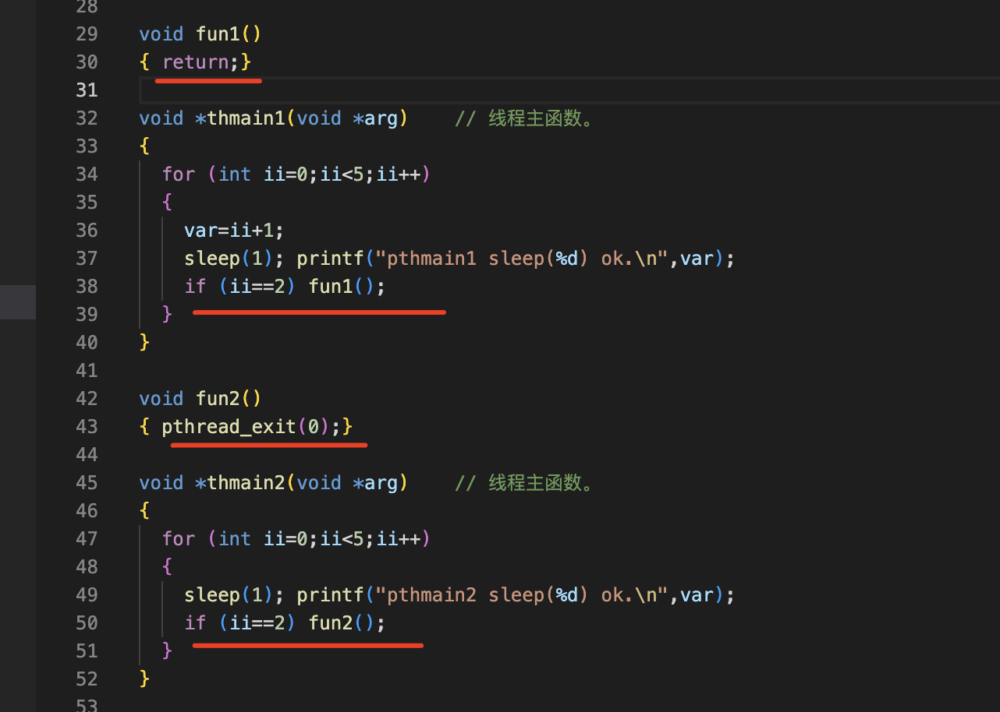

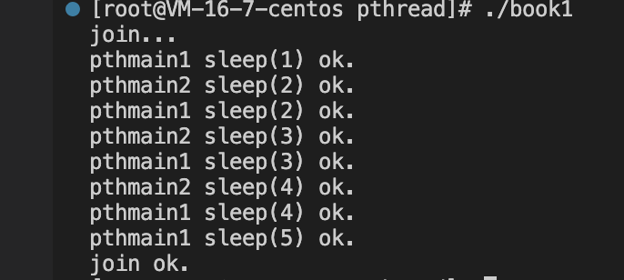

知识点
===

⚠️：返回值为不为0的数字在这个函数里需要进行转换

这里直接返回数字1会报错，根据void *thmain1说明需要进行强制转换，返回0的原因可以的原因是0表示为null，而不是数字的0

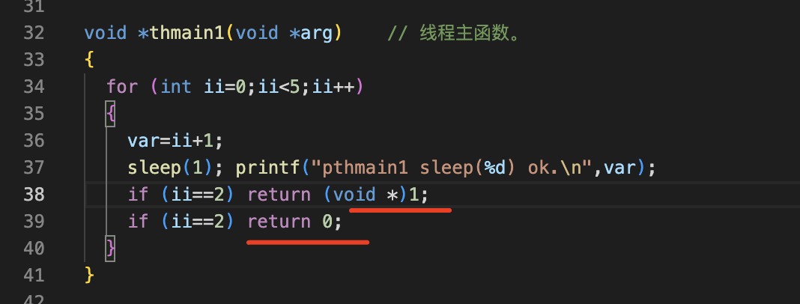