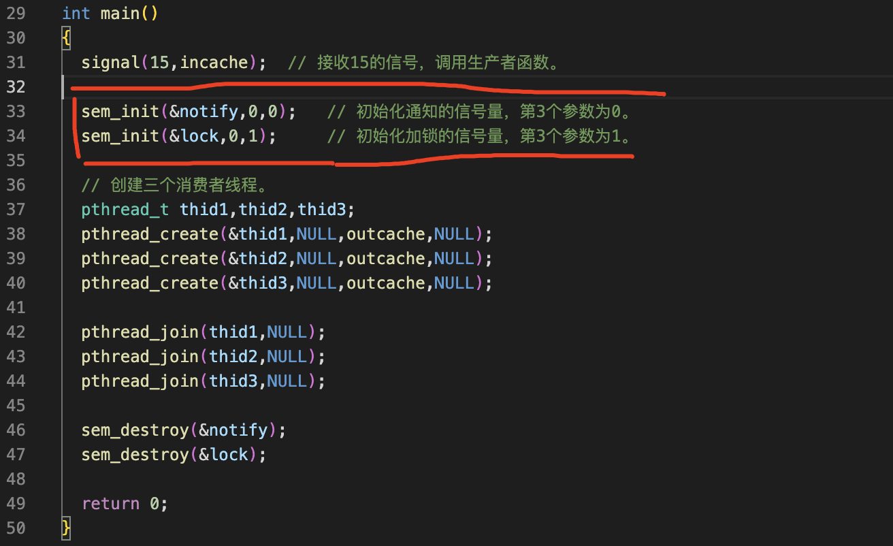
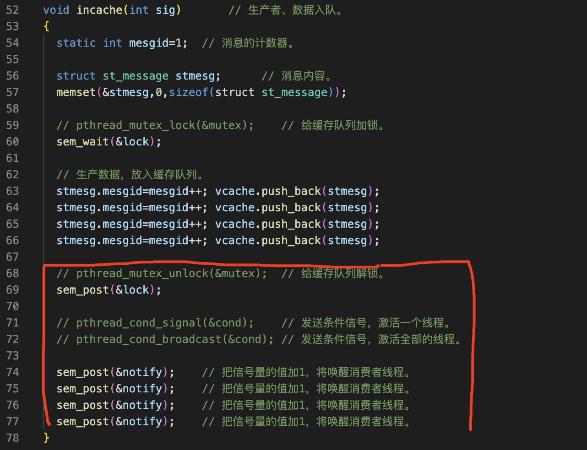
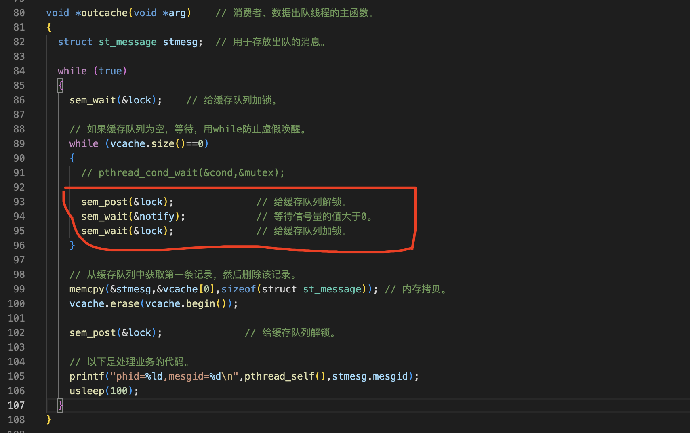
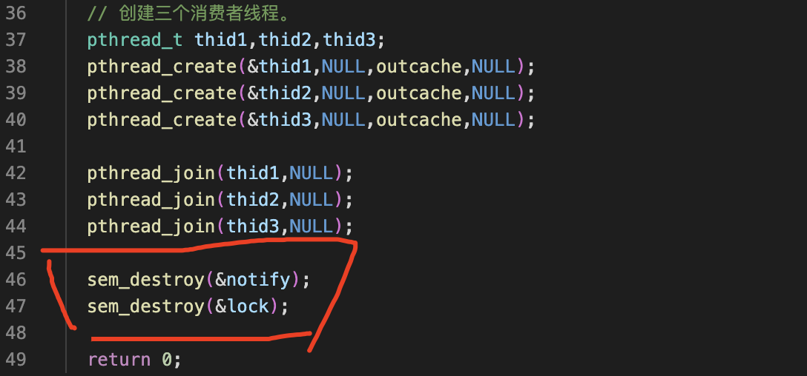
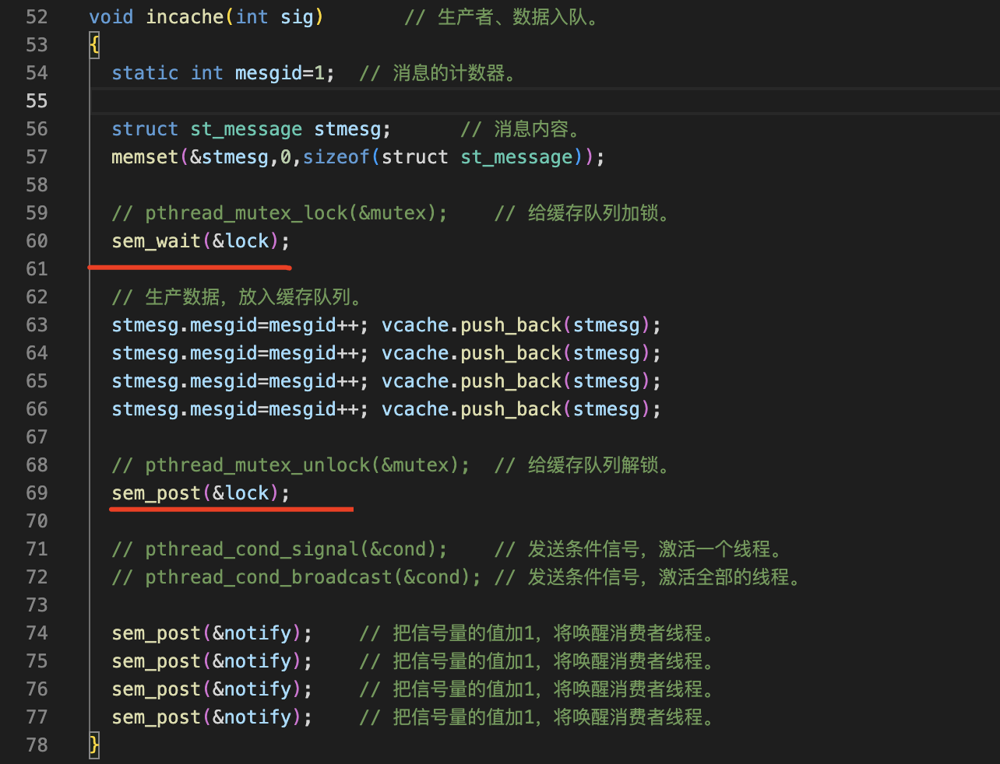
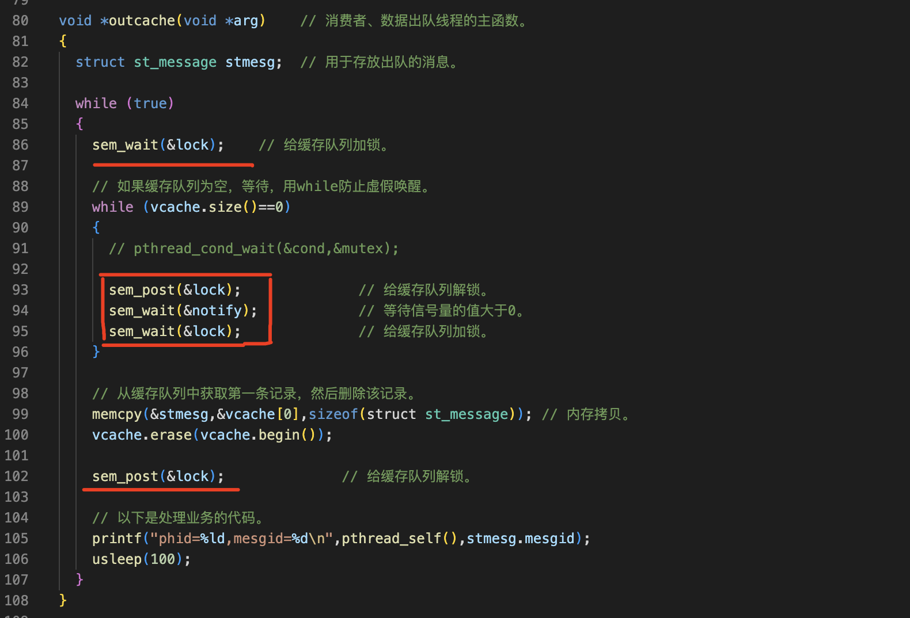

信号量实现生产消费者模型
===

信号量需要包括头文件

过程
===

分两步改这个程序

1. 先把条件变量改为信号量
2. 再把互斥锁改为信号量

1 用信号量代替条件变量
---

### 一、声明用于通知的信号量


### 二、初始化通知和加锁的信号量



### 三、在生产者函数中



### 四、在消费者函数中



2 再把互斥锁改为信号量
---

### 主函数中


增加销毁信号量的代码



### 在生产者函数中



去除线程清理函数的代码，信号量不存在条件变量这个问题

### 在消费者函数中



细节
===

条件变量的触发条件和给互斥锁加锁是原子操作，如果用信号量来实现，它是两个步骤不是原始操作

在多线程程序中用信号量实现的生产消费者模型，不如条件变量方便，但是在多进程中只能用信号量，在操作系统里也是用信号量来实现生产消费者模型的，没有条件变量，

线程里面信号量的pv操作，只能把信号量的值减一或者加一。但是在进程里面没有这个限制。在线程里面，如果生产了多条数据，就要执行多次的加1操作。在进程中，只需要调用一次v操作就可以了。

完整代码
===

```c++
// 本程序演示只用信号量实现高速缓存。
#include <stdio.h>
#include <pthread.h>
#include <stdlib.h>
#include <unistd.h>
#include <signal.h>
#include <string.h>
#include <semaphore.h>
#include <vector>

using namespace std;

// 缓存队列消息的结构体。
struct st_message
{
  int  mesgid;          // 消息的id。
  char message[1024];   // 消息的内容。
}stmesg;

vector<struct st_message> vcache;  // 用vector容器做缓存。

// pthread_cond_t  cond=PTHREAD_COND_INITIALIZER;     // 声明并初始化条件变量。
// pthread_mutex_t mutex=PTHREAD_MUTEX_INITIALIZER;   // 声明并初始化互斥锁。
sem_t notify,lock;     // 声明信号量。

void  incache(int sig);      // 生产者、数据入队。
void *outcache(void *arg);   // 消费者、数据出队线程的主函数。

int main()
{
  signal(15,incache);  // 接收15的信号，调用生产者函数。

  sem_init(&notify,0,0);   // 初始化通知的信号量，第3个参数为0。
  sem_init(&lock,0,1);     // 初始化加锁的信号量，第3个参数为1。

  // 创建三个消费者线程。
  pthread_t thid1,thid2,thid3;
  pthread_create(&thid1,NULL,outcache,NULL);
  pthread_create(&thid2,NULL,outcache,NULL);
  pthread_create(&thid3,NULL,outcache,NULL);

  pthread_join(thid1,NULL);
  pthread_join(thid2,NULL);
  pthread_join(thid3,NULL);

  sem_destroy(&notify);
  sem_destroy(&lock);

  return 0;
}

void incache(int sig)       // 生产者、数据入队。
{
  static int mesgid=1;  // 消息的计数器。

  struct st_message stmesg;      // 消息内容。
  memset(&stmesg,0,sizeof(struct st_message));

  // pthread_mutex_lock(&mutex);    // 给缓存队列加锁。
  sem_wait(&lock);

  // 生产数据，放入缓存队列。
  stmesg.mesgid=mesgid++; vcache.push_back(stmesg);  
  stmesg.mesgid=mesgid++; vcache.push_back(stmesg);  
  stmesg.mesgid=mesgid++; vcache.push_back(stmesg);  
  stmesg.mesgid=mesgid++; vcache.push_back(stmesg);  

  // pthread_mutex_unlock(&mutex);  // 给缓存队列解锁。
  sem_post(&lock);

  // pthread_cond_signal(&cond);    // 发送条件信号，激活一个线程。
  // pthread_cond_broadcast(&cond); // 发送条件信号，激活全部的线程。

  sem_post(&notify);    // 把信号量的值加1，将唤醒消费者线程。
  sem_post(&notify);    // 把信号量的值加1，将唤醒消费者线程。
  sem_post(&notify);    // 把信号量的值加1，将唤醒消费者线程。
  sem_post(&notify);    // 把信号量的值加1，将唤醒消费者线程。
}

void *outcache(void *arg)    // 消费者、数据出队线程的主函数。
{
  struct st_message stmesg;  // 用于存放出队的消息。

  while (true)
  {
    sem_wait(&lock);    // 给缓存队列加锁。

    // 如果缓存队列为空，等待，用while防止虚假唤醒。
    while (vcache.size()==0)
    {
      // pthread_cond_wait(&cond,&mutex);

      sem_post(&lock);              // 给缓存队列解锁。
      sem_wait(&notify);            // 等待信号量的值大于0。
      sem_wait(&lock);              // 给缓存队列加锁。
    }

    // 从缓存队列中获取第一条记录，然后删除该记录。
    memcpy(&stmesg,&vcache[0],sizeof(struct st_message)); // 内存拷贝。
    vcache.erase(vcache.begin());

    sem_post(&lock);              // 给缓存队列解锁。

    // 以下是处理业务的代码。
    printf("phid=%ld,mesgid=%d\n",pthread_self(),stmesg.mesgid);
    usleep(100);
  }
}
```

