线程参数的传递
===

1、创建的多个线程并不保证哪个线程先运行
---

要有序的进行的话，如果每次创建线程之后sleep很短的时间，顺序就没问题了(实际很少用)

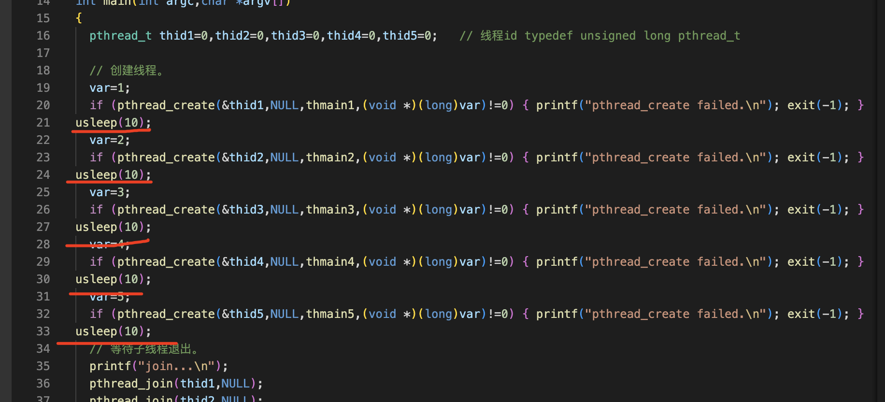

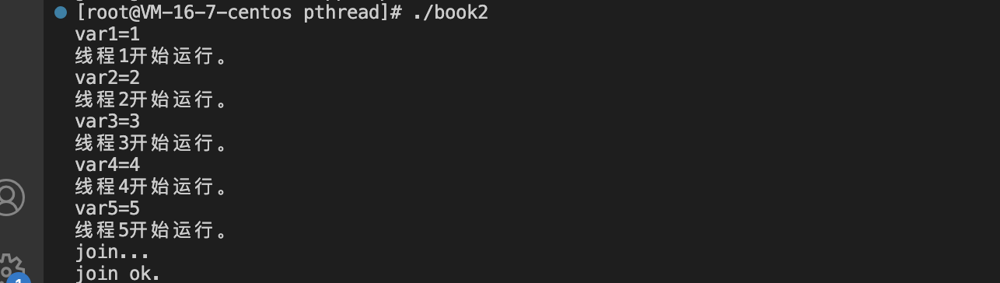

下面的线程运行顺序都有不同

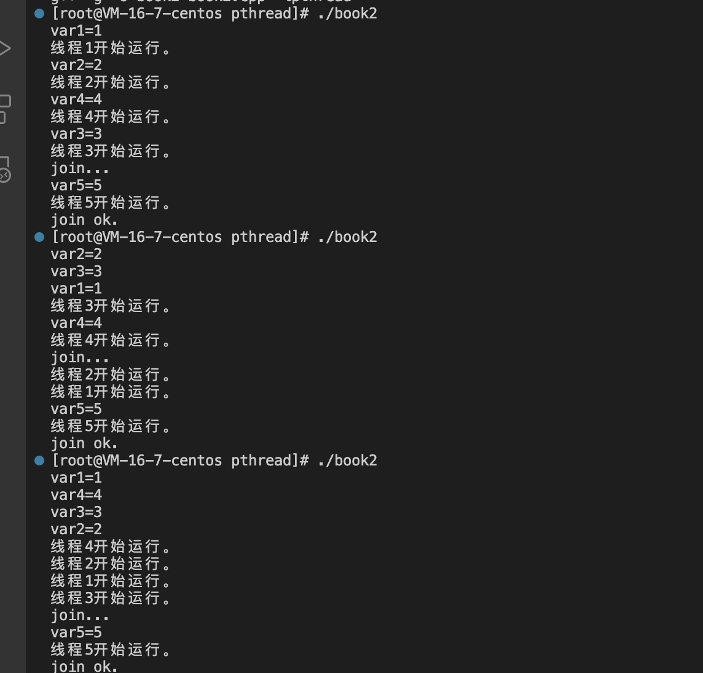

2、不能用全局变量代替线程函数的参数
---

但在单进程和多进程中可以用全局变量代替函数的参数

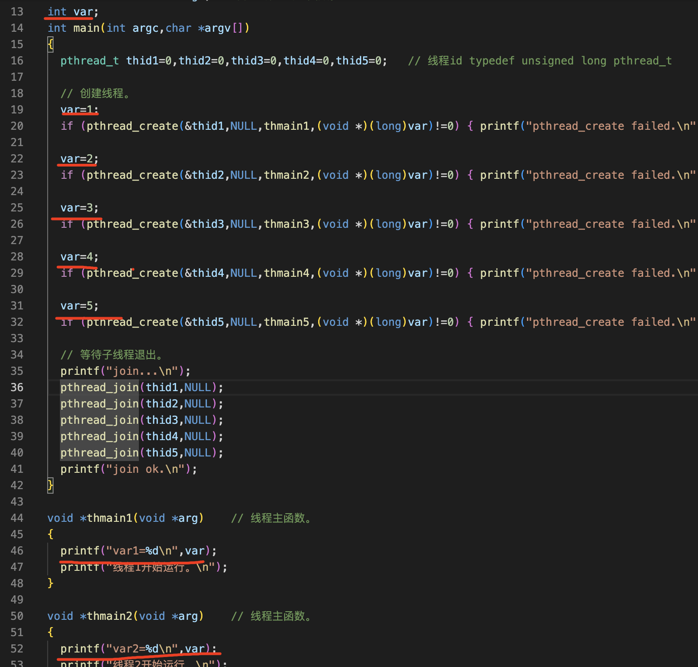

运行两次发现var对应不上，得出结论

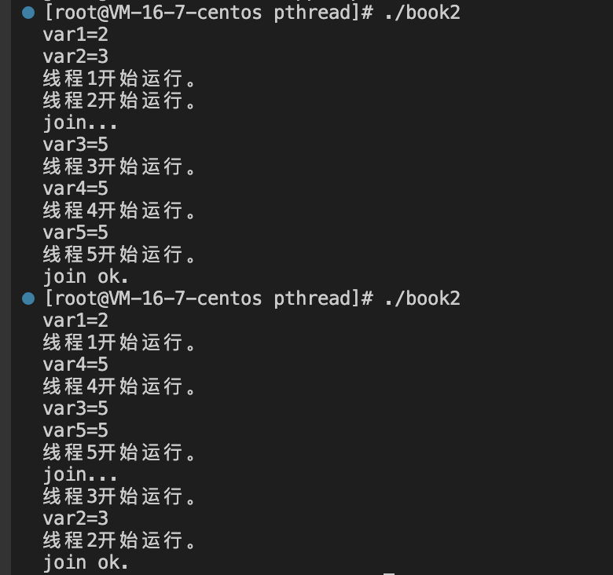


3、⚠️数据类型的强制转换(经常使用)
---

```
int main(int argc,char *argv[])
{
  int ii =10;
  void *pv=0;               //指针占8字节，用于存放变量的地址
  pv= (void *)(long)ii;     //先把ii转换成long，再转换成void *
  printf("pv=%p\n",pv);     //pv存放的不是变量的地址，而是变量ii的值
  
  int jj=0;
  jj=(int)(long)pv;					//把pv存放的内容先转换成long，再转换成int
  printf("jj=%d\n",jj); 

  return 0;
 }
```

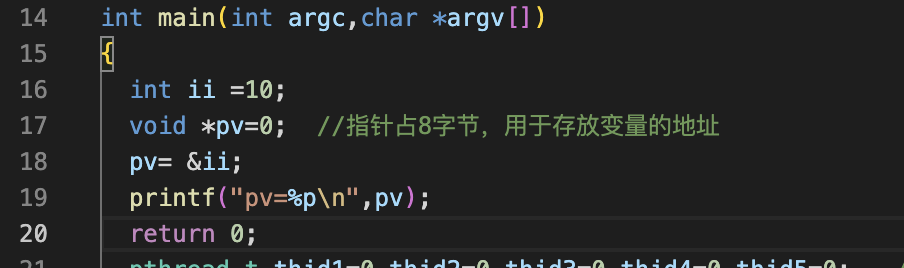

运行结果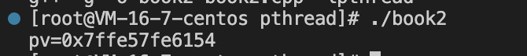


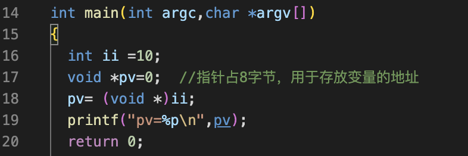

运行结果，报错的原因是因为int占4字节，指针占8字节，他们的长度不同，还需要进行一次转换

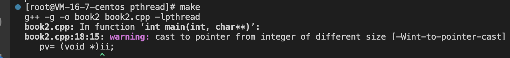

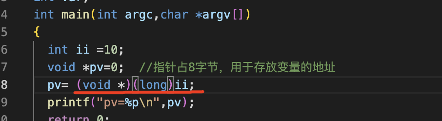

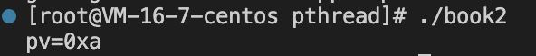

4、如何传递整型参数(整型参数只能传一个)
---

在创建线程的时候，我们把整数强制转换成了地址，那么在线程主函数中，要将地址强行转化为整数

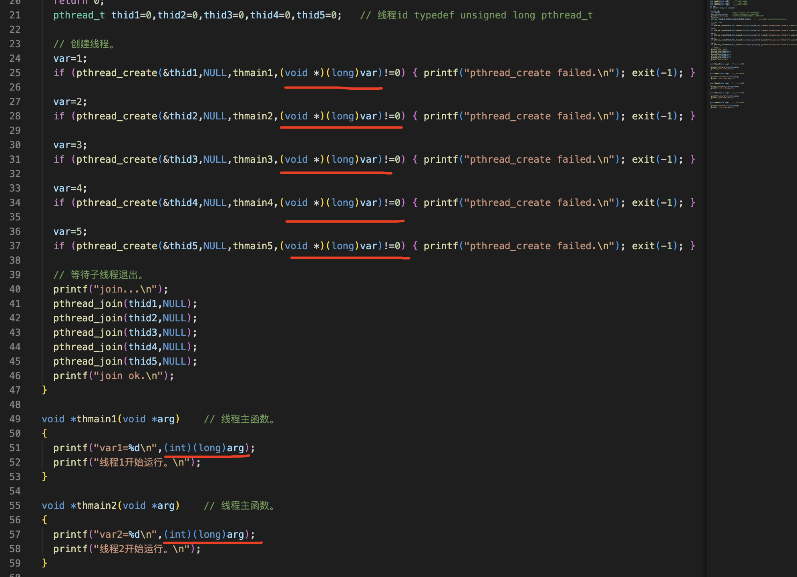

/root/project/pthread/book2.cpp

```
// 本程序演示线程参数的传递（用强制转换的方法传变量的值）。
#include <stdio.h>
#include <stdlib.h>
#include <string.h>
#include <unistd.h>
#include <pthread.h>

void *thmain1(void *arg);    // 线程1的主函数。
void *thmain2(void *arg);    // 线程2的主函数。
void *thmain3(void *arg);    // 线程3的主函数。
void *thmain4(void *arg);    // 线程4的主函数。
void *thmain5(void *arg);    // 线程5的主函数。
int var;
int main(int argc,char *argv[])
{
  pthread_t thid1=0,thid2=0,thid3=0,thid4=0,thid5=0;   // 线程id typedef unsigned long pthread_t

  // 创建线程。
  var=1;
  if (pthread_create(&thid1,NULL,thmain1,(void *)(long)var)!=0) { printf("pthread_create failed.\n"); exit(-1); }

  var=2;
  if (pthread_create(&thid2,NULL,thmain2,(void *)(long)var)!=0) { printf("pthread_create failed.\n"); exit(-1); }

  var=3;
  if (pthread_create(&thid3,NULL,thmain3,(void *)(long)var)!=0) { printf("pthread_create failed.\n"); exit(-1); }

  var=4;
  if (pthread_create(&thid4,NULL,thmain4,(void *)(long)var)!=0) { printf("pthread_create failed.\n"); exit(-1); }

  var=5;
  if (pthread_create(&thid5,NULL,thmain5,(void *)(long)var)!=0) { printf("pthread_create failed.\n"); exit(-1); }

  // 等待子线程退出。
  printf("join...\n");
  pthread_join(thid1,NULL);  
  pthread_join(thid2,NULL);  
  pthread_join(thid3,NULL);  
  pthread_join(thid4,NULL);  
  pthread_join(thid5,NULL);  
  printf("join ok.\n");
}

void *thmain1(void *arg)    // 线程主函数。
{
  printf("var1=%d\n",(int)(long)arg);
  printf("线程1开始运行。\n");
}

void *thmain2(void *arg)    // 线程主函数。
{
  printf("var2=%d\n",(int)(long)arg);
  printf("线程2开始运行。\n");
}

void *thmain3(void *arg)    // 线程主函数。
{
  printf("var3=%d\n",(int)(long)arg);
  printf("线程3开始运行。\n");
}

void *thmain4(void *arg)    // 线程主函数。
{
  printf("var4=%d\n",(int)(long)arg);
  printf("线程4开始运行。\n");
}

void *thmain5(void *arg)    // 线程主函数。
{
  printf("var5=%d\n",(int)(long)arg);
  printf("线程5开始运行。\n");
}
```


5、如何传递地址参数(可以传多个整型参数)
---

给多个线程传同一个地址是不行的，要给每一个线程传一个地址，全局变量是同一个地址，不能这样，需要每次创建线程的时候，临时的分配一块内存出来

这样就可以

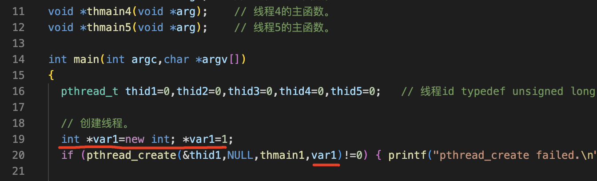


### ⚠️这个程序的bug

在主进程中创建线程的时候动态分配了内存，那么在线程子函数中应该把动态分配的内存删除掉，不能直接删除，要像下面那样

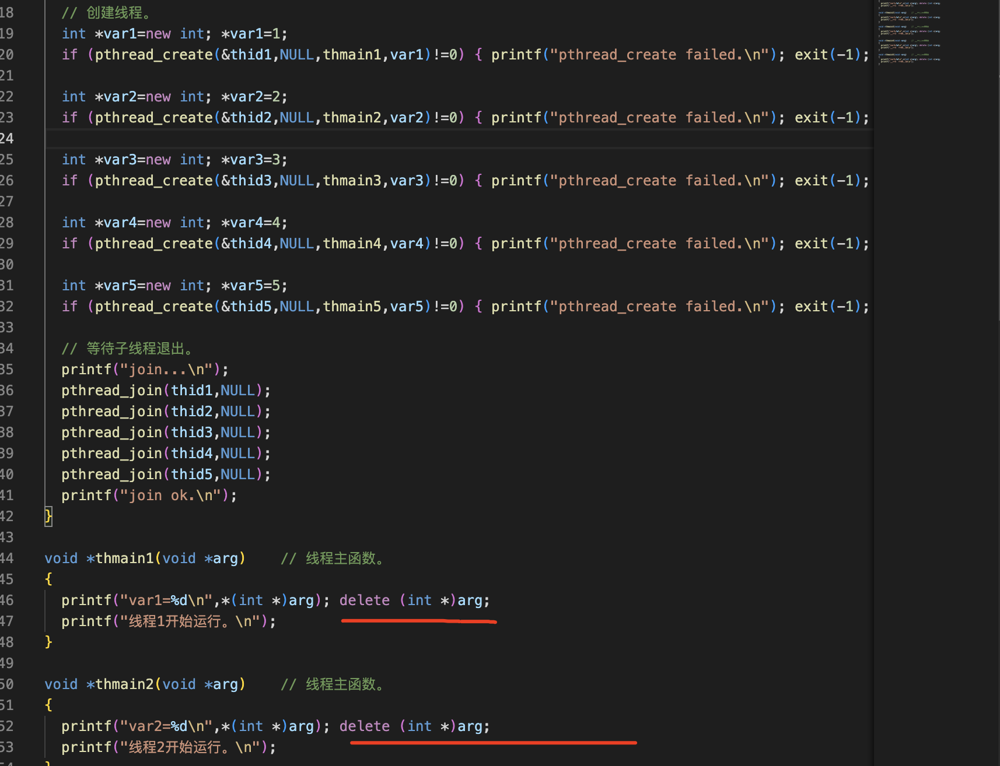

现在只能传单个参数，如果传地址就可以传多个参数，这是通过把多个参数放在一个结构体中，再把结构体的地址传进去，来传多个参数 book4.cpp

```
// 本程序演示线程参数的传递（用结构体的地址传递多个参数）。
#include <stdio.h>
#include <stdlib.h>
#include <string.h>
#include <unistd.h>
#include <pthread.h>

void *thmain(void *arg);    // 线程的主函数。

struct st_args
{
  int  no;        // 线程编号。
  char name[51];  // 线程名。
};

int main(int argc,char *argv[])
{
  pthread_t thid=0;

  // 创建线程。
  struct st_args *stargs=new struct st_args;
  stargs->no=15;   strcpy(stargs->name,"测试线程");
  if (pthread_create(&thid,NULL,thmain,stargs)!=0) { printf("pthread_create failed.\n"); exit(-1); }

  // 等待子线程退出。
  printf("join...\n");
  pthread_join(thid,NULL);  
  printf("join ok.\n");
}

void *thmain(void *arg)    // 线程主函数。
{
  struct st_args *pst=(struct st_args *)arg;
  printf("no=%d,name=%s\n",pst->no,pst->name);
  delete pst;
  printf("线程开始运行。\n");
}

```

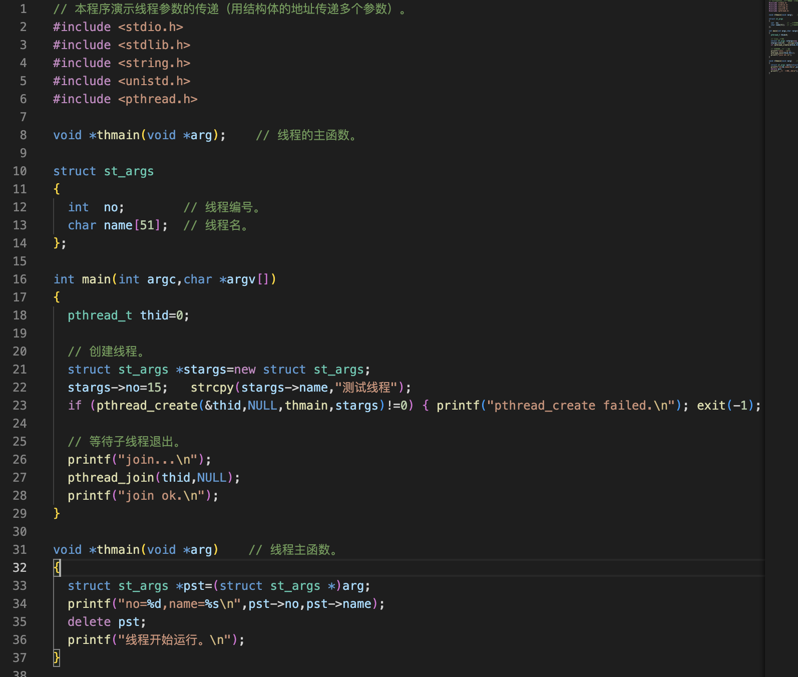

6、线程退出状态
---

⚠️：如果用结构体的地址作为线程的返回值，必须保存在线程主函数结束后地址仍然是有效的，所以，要采用动态分配内存的方法，不能用局部变量

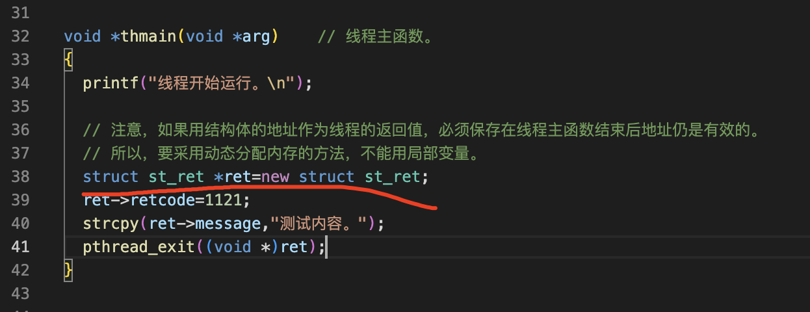

```
// 本程序演示线程线程退出（终止）的状态。
#include <stdio.h>
#include <stdlib.h>
#include <string.h>
#include <unistd.h>
#include <pthread.h>

void *thmain(void *arg);    // 线程的主函数。

struct st_ret
{
  int  retcode;          // 返回代码。
  char message[1024];    // 返回内容。
};

int main(int argc,char *argv[])
{
  pthread_t thid=0;

  // 创建线程。
  if (pthread_create(&thid,NULL,thmain,NULL)!=0) { printf("pthread_create failed.\n"); exit(-1); }

  // 等待子线程退出。
  printf("join...\n");
  struct st_ret *pst=0;
  pthread_join(thid,(void **)&pst);  
  printf("retcode=%d,message=%s\n",pst->retcode,pst->message);
  delete pst;
  printf("join ok.\n");
}

void *thmain(void *arg)    // 线程主函数。
{
  printf("线程开始运行。\n");

  // 注意，如果用结构体的地址作为线程的返回值，必须保存在线程主函数结束后地址仍是有效的。
  // 所以，要采用动态分配内存的方法，不能用局部变量。
  struct st_ret *ret=new struct st_ret;
  ret->retcode=1121;
  strcpy(ret->message,"测试内容。");
  pthread_exit((void *)ret);
}
```

