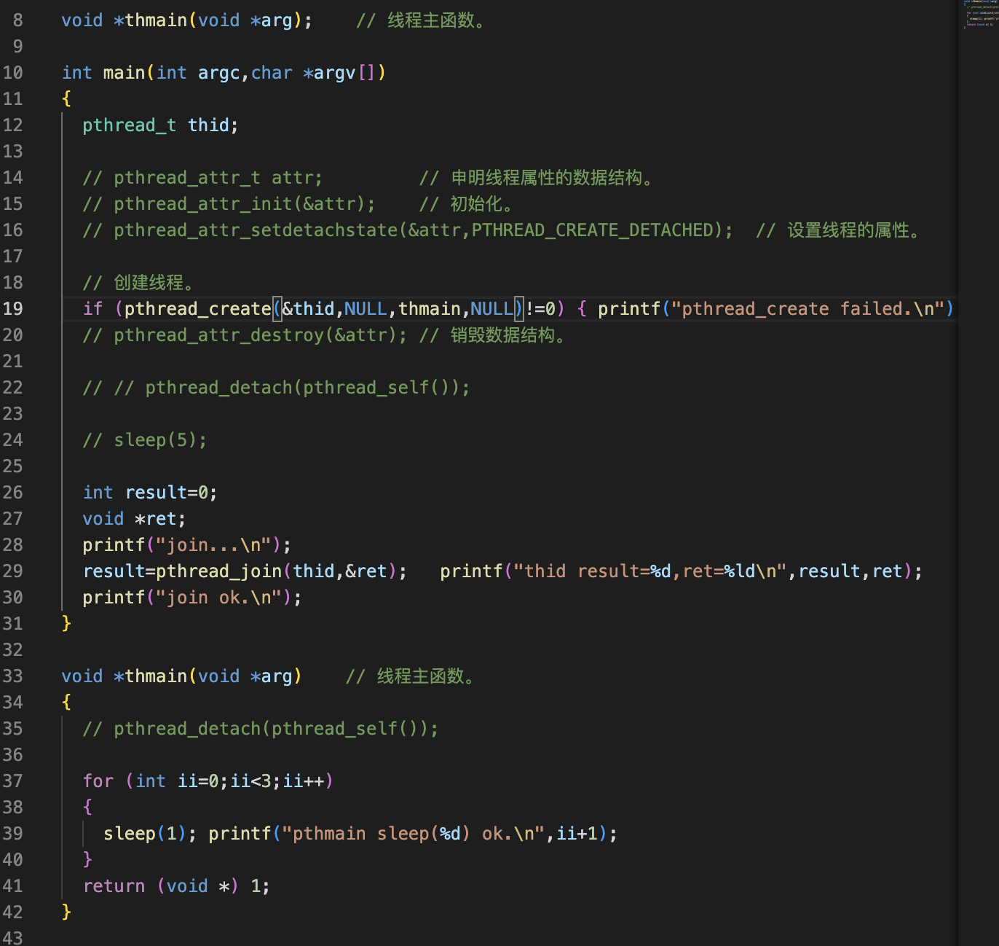

线程资源的回收
===

- 线程的分离
- 用线程清理函数释放资源

进程资源的回收
===

- 子进程退出时，向父进程发送SIGCHLD信号

如果父进程没有处理这个信号就会产生僵尸进程，以下两种方式可以解决这种问题

1、父进程调用wait()函数等待子进程的退出，

2、忽略子进程的SIGCHLD信号

- 在信号处理函数中释放资源

一、线程的分离
===

- 线程有非分离(joinable)和分离(unjoinable)两种状态
- 线程缺省状态是非分离的，或者称为可连接的(joinable)，可以join的
- 非分离状态的线程终止时，不会释放线程全部的资源，他一直在等待被join
- 把线程的属性设置为分离，线程结束后，由系统回收资源
- 调用pthread_detach()函数分离线程
- 创建线程前，调用pthread_attr_setdetatachstate()设置为线程的属性
- 非阻塞：pthread_tryjoin_np()

如果子线程没有终止，他不会等待立即返回

- 限时阻塞等待：pthread_timedjoin_np()

多了一个超时时间的函数，意思是等待若干秒后，如果子线程还没有终止函数就返回

1）以下演示未分离的进程退出之后，可以用join得到它退出的状态，并且释放资源
---

如果不关心线程的退出状态，可以把线程设置为分离，让操作系统在线程退出后回收它的资源

两个进程在运行结束了几秒之后。主进程成功join到每个进程的退出状态。说明线程在退出之后并不是全部的资源都释放了，线程退出的状态只有join之后才会被释放，

线程退出之后只能join一次，join多次就会报错因为资源以及释放掉了

join第二次的时候函数返回失败

2）调用pthread_detach()函数分离线程
---

这里是未分离的代码，运行结果：

### 1.放在主进程函数中

把线程设置为分离之后就不能被join了，join函数不会阻塞，立即返回失败，主进程结束的话子线程就不能运行，这里的问题是既然把线程设置成了分离状态，那么就不用去join它，并且应该留下时间，让子线程可以运行

这样就可以

### 2、放在线程的主函数中(倾向于这种)

### 3）调用pthread_attr_setdetachstate()(了解就行)

二、线程清理函数释放资源
===

- 线程终止的时候，可以调用清理函数释放空间

比如说关闭文件，断开网络连接，回滚数据库事务，释放锁

- 清理函数入栈：pthread_cleanup_push();
- 清理函数出栈：pthread_cleanup_pop();
- pthread_cleanup_push()、pthread_cleanup_pop()必须成对写在同一语句中
- 线程终止(return、pthread_exit()、pthread_cancel() )、语句块结束的时候，清理函数将被执行

刚好是后进先出

2 线程终止(return、pthread_exit()、pthread_cancel() )、语句块结束的时候，清理函数将被执行
---

### 3 放在子函数里面,只能用exit不能用return

4 线程清理函数
---

在实际的项目开发中，增加程序的可读性

  pthread_cleanup_pop(0)如果取值不为0清理函数出栈并且执行，如果取值为0清理函数出栈但是不执行

线程退出的时候需要关闭文件指针，关闭socket。和回滚数据库，把这三件事情用三个线程清理函数去做，分别把文件指针socker和数据库连接传进去

5 进程清理函数(扩展学习)
---

atexit()