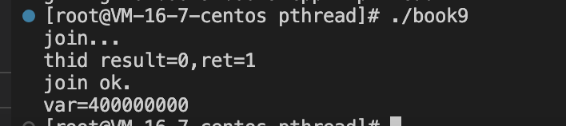
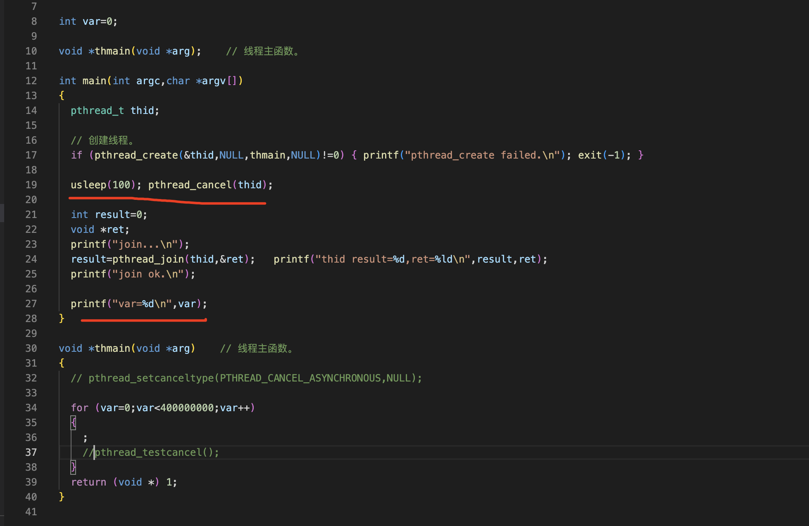
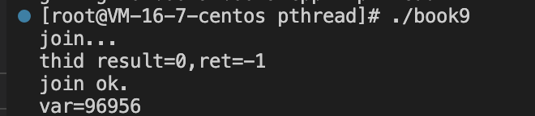
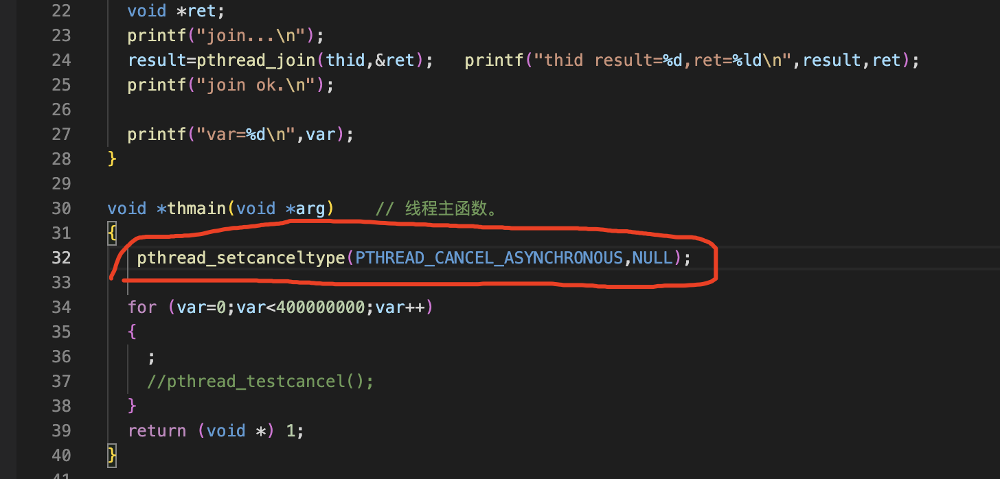
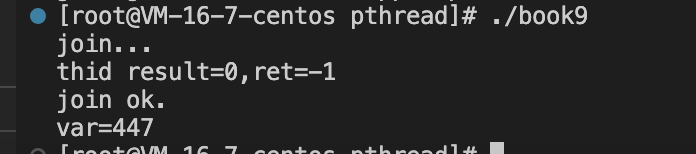
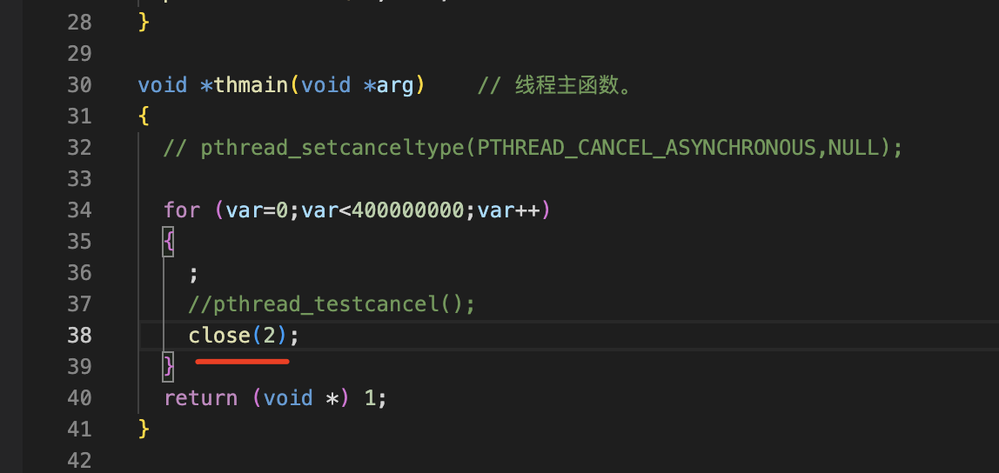
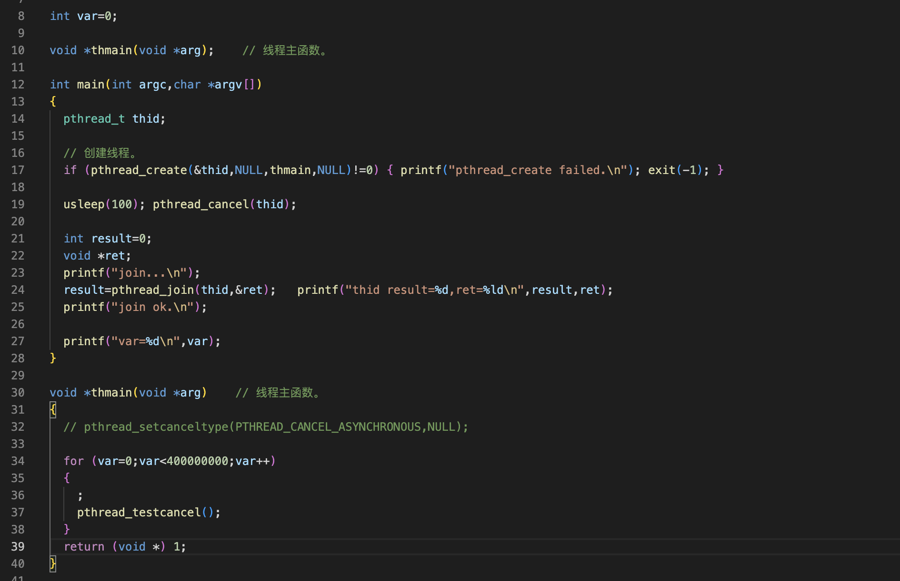
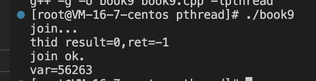

线程的取消
===

1、线程在运行的过程中，可以调用pthread_cancel()取消它
---

2 线程被取消后,返回状态PTHREAD_CANCELED,即-1
---

3  设置线程的取消状态pthread_setcancelstate()
---

int pthread_setcancelstate(int state, int *oldstate);

  设置线程的取消状态的代码只能放在线程主函数中

4 设置线程的取消方式pthread_setcanceltype()
---

int pthread_setcanceltype(int type, int *oldtype);

线程的终止状态是1说明线程没有被取消掉，变量的值四个亿，也说明子线程已经跑完了循环，出现这种情况有两种情况，一是线程没有被cancel掉，或者在cancel之前，子进程已运行结束

### 是哪种情况？

线程缺省的方式是延迟取消运行到下一个取消点才退，这次改为立即取消

线程的返回状态是-1，表示是被取消的，var没有到4个亿

### 什么是取消点？

这里设为缺省状态就是延迟取消，close就是取消点，可以看出这个线程主函数取消掉了

5、设置线程的取消点pthread_testcancel()
---

在实际开发中如果线程中的代码没有取消点，可以调用这个函数设置取消点，这是规范的做法

