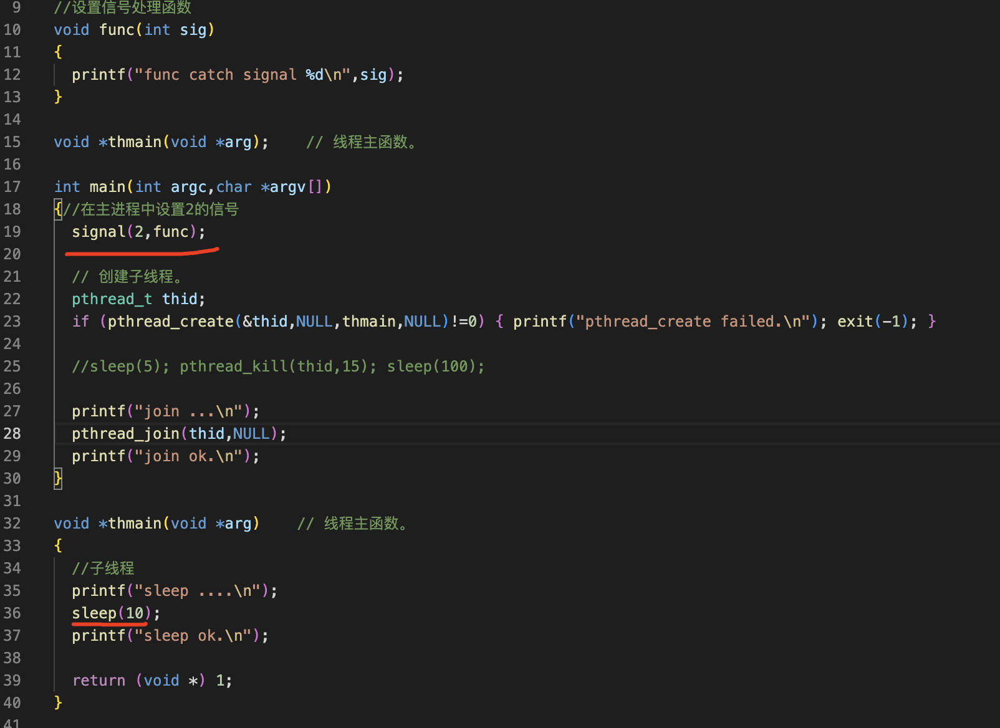
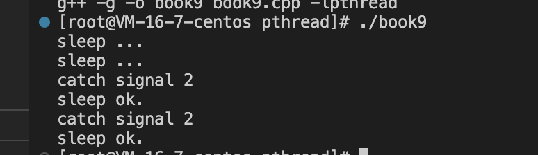
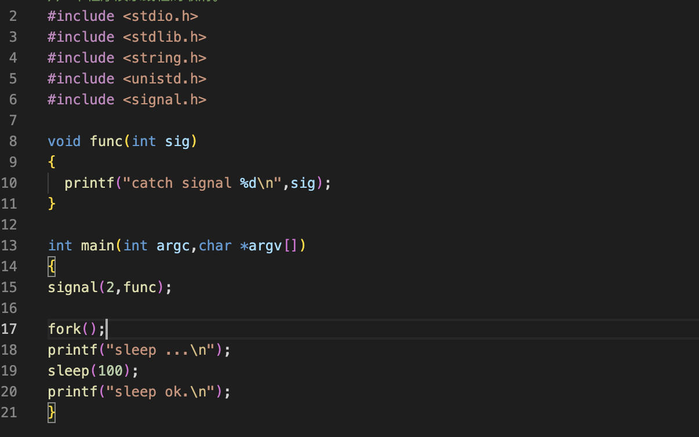
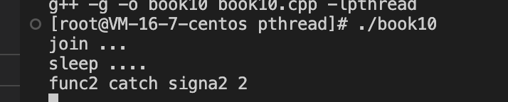
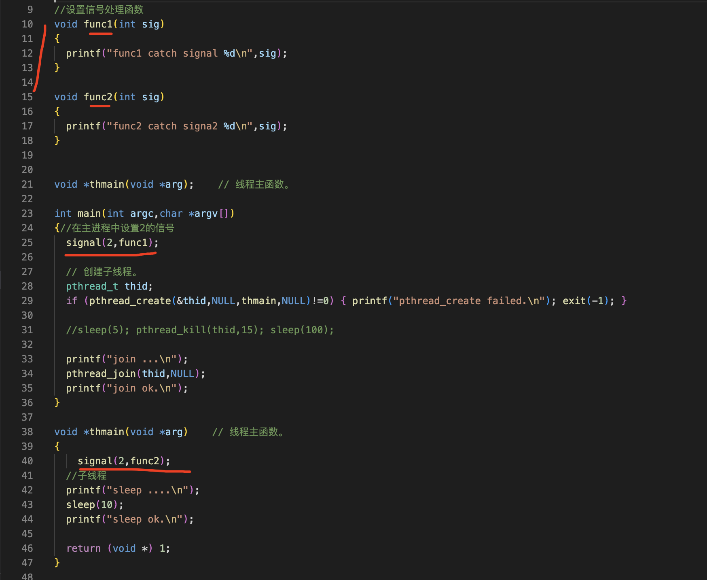
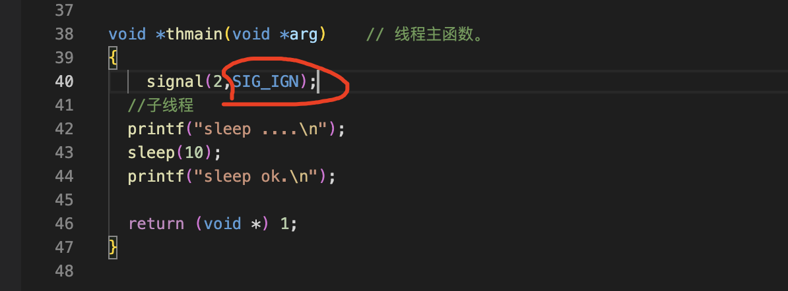
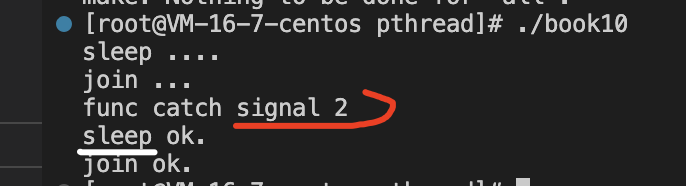
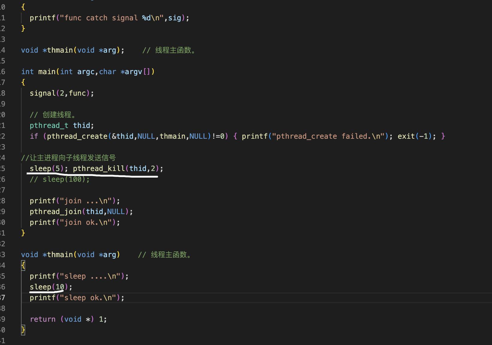
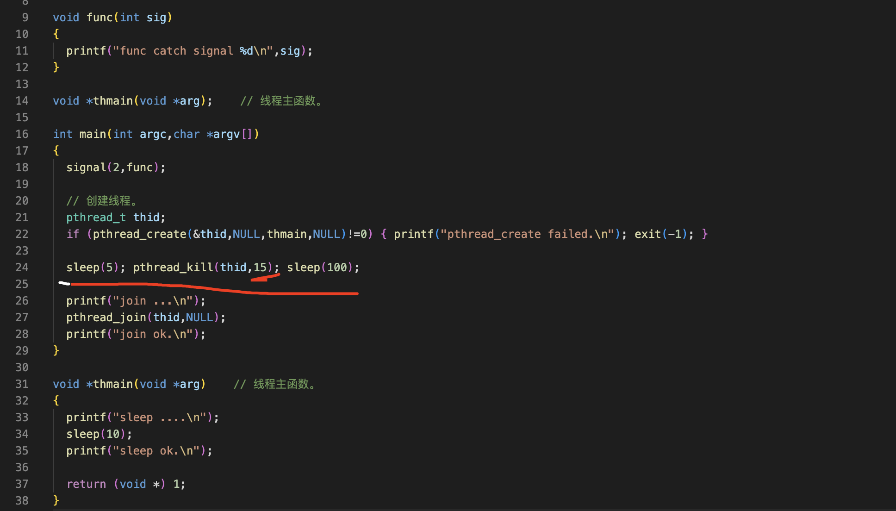

线程和信号
===

- 在多线程程序中，外部向进程发送信号不会中断系统调用
- 在多线程程序中，信号的处理是所有线程共享的
- 进程中的信号可以送达单个线程，会中断系统调用
- 如果某线程因为信号而终止，整个进程将终止

补充知识
===

- 比signal()更强大的sigaction()函数

- 进程信号屏蔽sigprocmask(), 线程pthread_sigmask()

- 其他信号处理函数：sigwait() 、sigwaitinfo()、sigtimedwait()

  

在多进程程序中，信号的处理比较复杂，但是在实际项目开发中用到的比较简单，

在多线程程序中，信号的处理更加复杂，但是在实际项目开发中用到的也比较简单，下面只介绍我们在项目开发中重点关心的内容，不深入讨论

1 在多线程程序中，外部向进程发送信号不会中断系统调用
===

book10





而在在多进程程序中，外部向进程发送信号将会会中断系统调用
---





```
void func(int sig)
{
  printf("catch signal %d\n",sig);
}

int main(int argc,char *argv[])
{
signal(2,func);

fork();
printf("sleep ...\n");
sleep(100);
printf("sleep ok.\n");
}
```

2 在多线程程序中，信号的处理是所有线程共享的
===

结论：在多线程的程序中，想对不同的线程设置不同的信号是不可能的


调用的信号处理函数是fun2，为什么这样？在多线程的程序中，信号的处理是所有线程共享的，包括主线程信号处理的代码，放哪里都一样，以最后被执行的那行代码为准





如果在子线程中忽略信号，也将会影响整个进程，这个信号被忽略掉了，没有任何其他的




而在多进程程序中，如果有必要，我们可以为每个进程设置不同的信号处理方式
---

3 进程中的信号可以送达单个线程，会中断系统调用
===

进程中的信号指多线程程序中某个线程给其他的线程发送信号，在多线程的程序中可以用pthread_kill函数向指定的线程发送信号

int pthread_kill(pthread_t thread, int sig);  //线程的id、信号的编号

信号2中断了sleep函数，因为显示信号2时里面显示sleep ok，正常情况应该在收到信号的五秒后才会显示





4 如果某线程因为信号而终止，整个进程将终止
===

在多进程中，每个进程退出是自己的事情，但是多线程中，一个线程被信号终止，整个进程玩完

这个程序没有处理15的信号，现在向子线程发送15的信号，缺省将终止子线程


