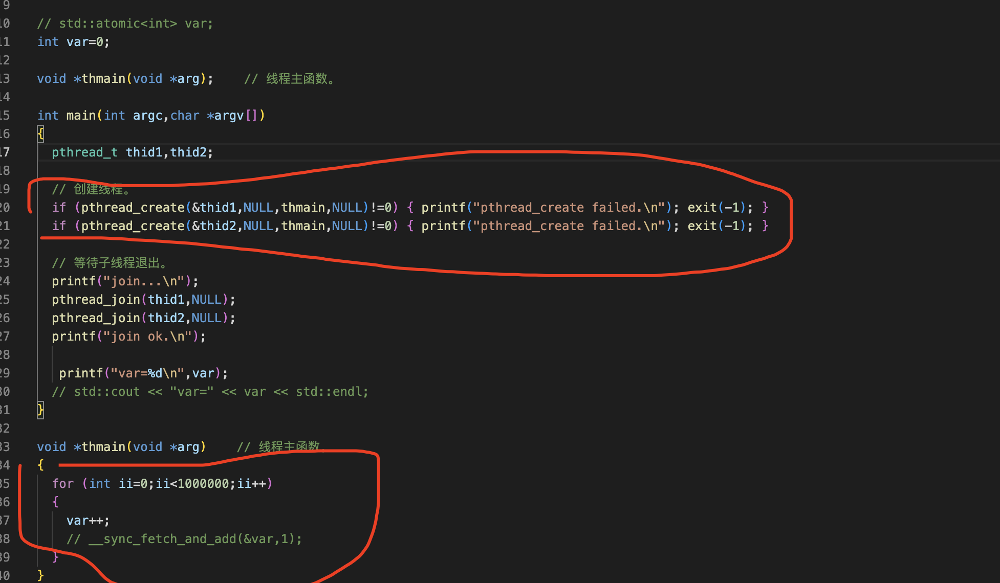
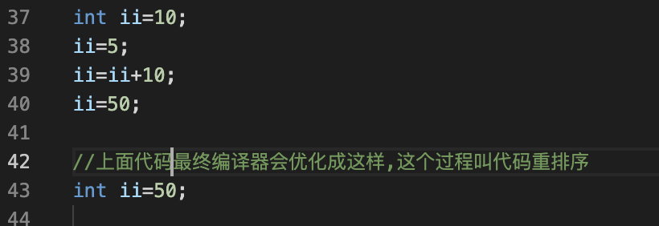
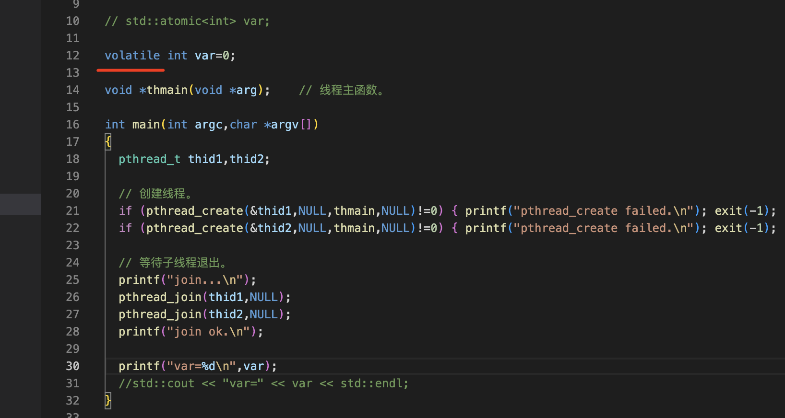
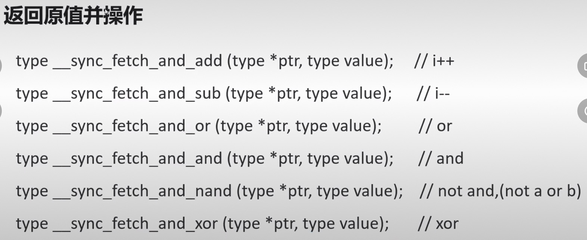
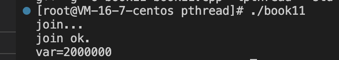
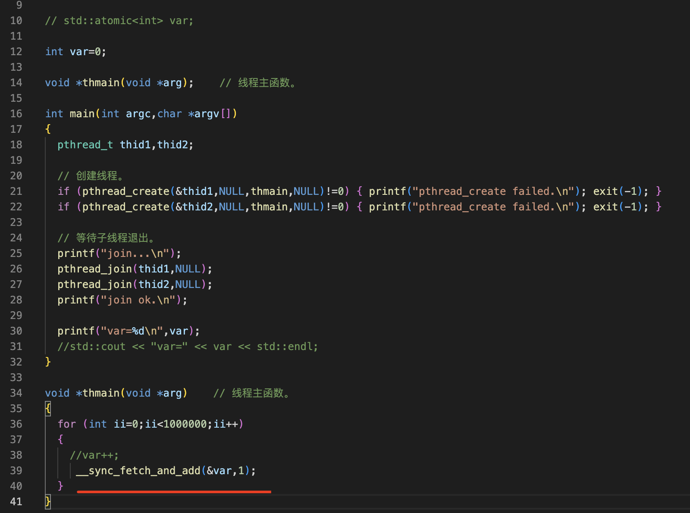
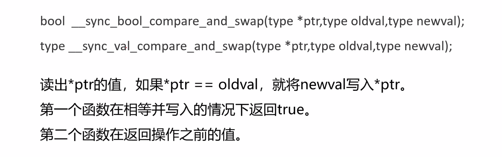
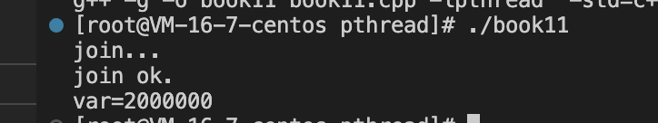
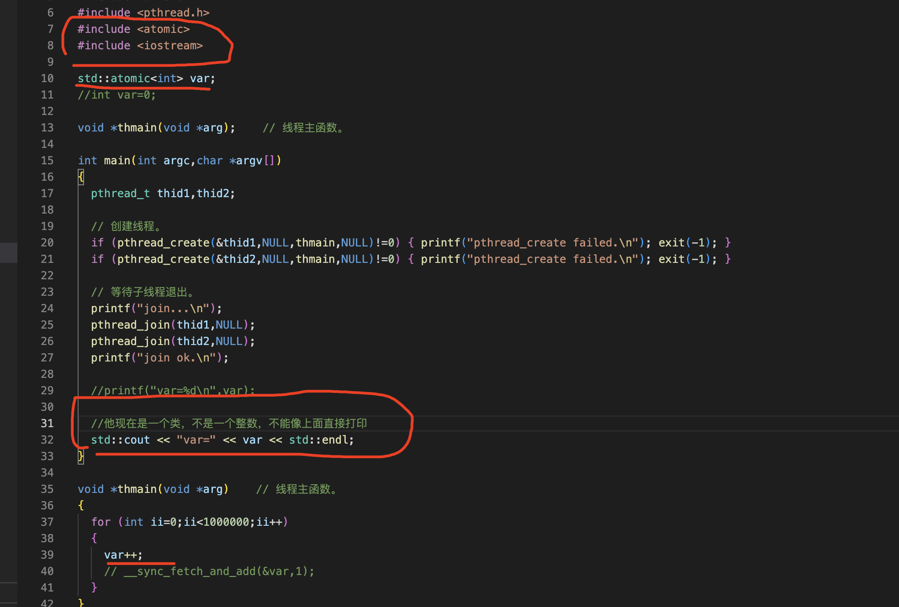

线程安全
===

在多线程程序中，地址空间是共享的，所以多个线程访问共享资源时会冲突

在线程中造成数据不同步的主要原因是非原子操作和不可见，代码的重排序很少被提到

- 多个线程访问共享资源(全局和静态)的时候会冲突
- 三个概念：原子性、可见性和顺序性
- 解决线程安全：volatile关键字 (❌他不是原子的)。原子操作(原子类型)(❌只支持整数)、线程同步(锁)(✅)

1、多个线程访问共享资源(全局和静态)的时候会冲突
===

这个代码的最后var应该是1000000*2=2000000，但是产生了竞争最后结果不确定多少

2、三个概念：原子性、可见性和顺序性
===

原子性
---

- 一个操作(有可能包含有多个子操作)，要么全部执行(生效)，要么全部不执行(都不生效)
- CPU执行指令：读取指令、读取内存、执行指令、写回内存
- i++   1）从内存中读取i的值      2）把i+1      3）把结果写回内存

可见性
---

当多个线程并发访问共享变量时，一个线程对共享变量的修改，其他线程能够立即看到

CPU有高速缓存。每个线程读取共享变量时，会将该变量从内存加载到CPU缓存中，修改该变量后，CPU回立即更新缓存，但不一定会立即将它写回内存。此时其他线程访问该变量，从内存中读到的是旧数据，而非第一个线程更新后的数据

顺序性
---

程序执行的顺序按照代码的先后顺序执行

CPU为了提高程序整体的执行效率，可能会对代码进行优化，按照更高效的顺序执行代码

CPU虽然并不保证完全按照代码顺序执行，但他会保证程序最终的执行结果和代码顺序执行时的结果一致

3解决线程安全
===

volatile关键字
---

- 让CPU每次都从内存中读取变量的值，不要放在缓存里，保证了变量的内存可见性
- 告诉编译器不要优化代码，不要重排序
- 但不是原子的

通过测试发现volatile解决不了线程安全的问题

原子操作
---

CPU与内存通过总线进行数据交换，在操作之前锁住总线，然后执行下面三条汇编指令，总线锁可以理解为硬件级别的锁，它的效率非常高，比线程库提供的锁要快十倍左右

- 本质是总线锁   

- 三条汇编指令：xadd、cmpxchg或xchg
- 硬件级别的锁

c语言提供了对整型变量进行原子操作的系列函数，这六个值是返回原值并操作，第一个fetch_and_add意思是把这个变量从内存里面拿出来，再加上value相当于i++的意思，实验成功！

### 1 操作并返回操作后的值

### 2 CAS指令(compare and swap)

他们是原子操作

3 C11原子类型
---

std::atomic模版类封装了原子操作，支持布尔、整数和字符，本质上都是整数

4 线程同步(锁)
---

原子操作只支持整数，如果要锁住一个对象或者一个代码，原子操作是做不到的，只能用线程同步，同步是协同工作的意思

协同如何使用共享资源？为共享资源加锁