线程同步
===

- 互斥锁

- 自旋锁

- 读写锁

- 条件变量

- 信号量

- 生产消费者模型

线程同步的细节
===

- 互斥锁、自旋锁、读写锁、条件变量、信号量的竞争机制

一个线程在释放锁之后，可能会连续很多次获得锁

互斥锁有两种竞争机制，一种是形成等待机制(不是绝对公平的，对应用开发没有影响)，另一种是重新竞争

自旋锁、条件变量、信号量都是形成等待队列

- 读写锁的写锁饥饿问题，在实际开发中，是饿不死的
- 在实际开发中，用其他的方法实现公平锁和写优先锁

一、线程同步-互斥锁
===

适用于等待时间可能比较长的场景

- 加锁和解锁，确保同一时间只有一个线程访问共享资源

- 线程在访问共享资源之前加锁，访问完成后释放锁

- 如果某线程持有锁，其他的线程形成等待队列

  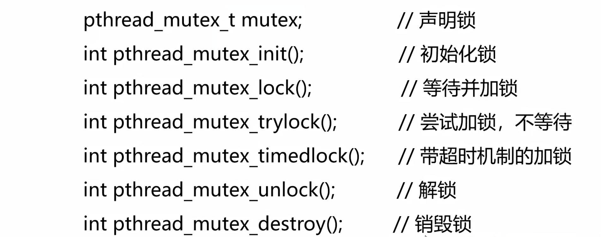


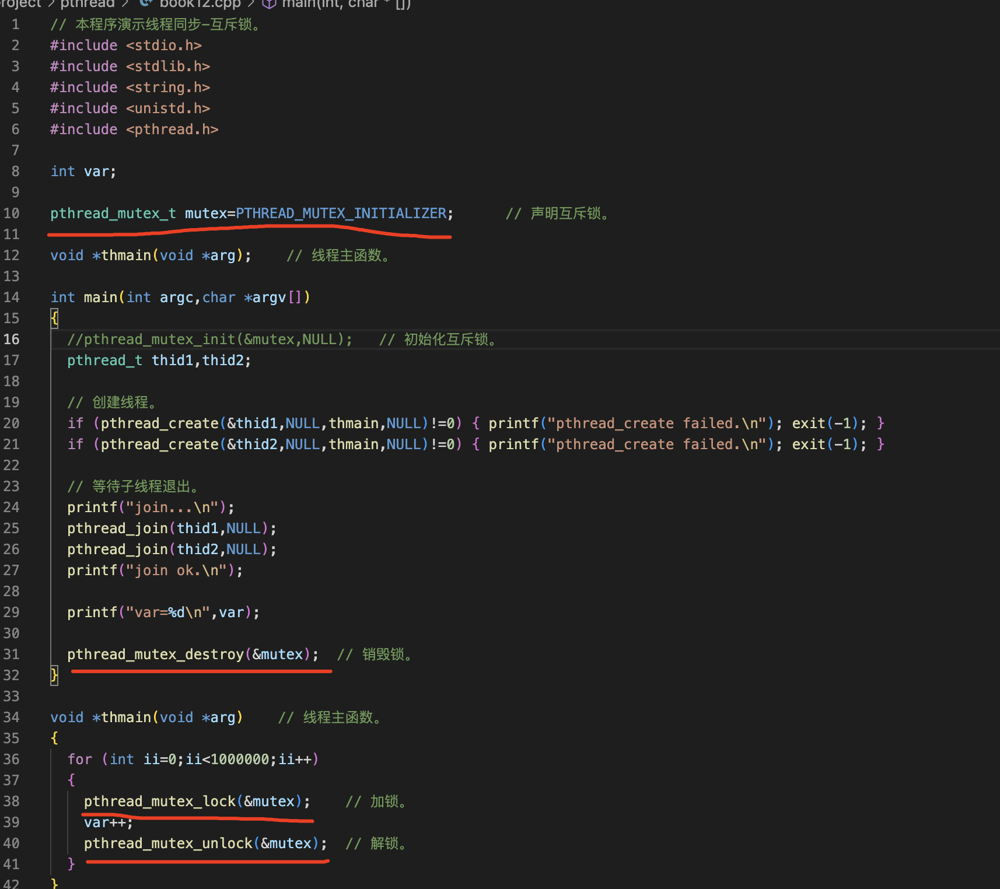

互斥锁的属性
---

PTHREAD_MUTEX_TIMED_NP，这是缺省值，也就是普通锁。当一个线程加锁以后，其余请求锁的线程将形成一个等待队列，并在解锁后按优先级获得锁。这种锁策略保证了资源分配的公平性

PTHREAD_MUTEX_RECURSIVE_NP，嵌套锁，允许同一个线程对同一个锁成功获得多次，并通过多次unlock解锁。如果是不同线程请求，则在加锁线程解锁时重新竞争

PTHREAD_MUTEX_ADAPTIVE_NP，适应锁，解锁后，请求锁的线程重新竞争

二、线程同步-自旋锁
===

适用于等待时间很短的场景

自旋锁的功能和互斥锁是一样的，只不过互斥锁在等待锁的时候线程会休眠，不消耗CPU，而自旋锁不断的检查锁是否可用，会消耗CPU

自旋锁没有带超时机制的加锁函数。因为使用自旋锁有一个前提条件，就是假设等待的时间会很短，不应该等待很长时间，如果等待的时间比较长就用互斥锁

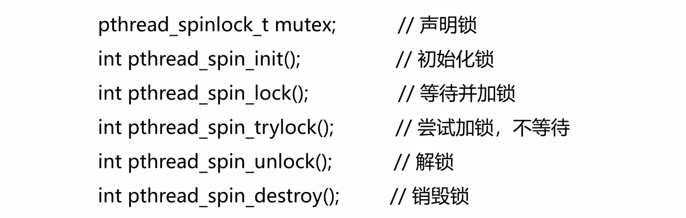


```
  //它的第二个标志是共享标志

  //PTHREAD_PROCESS_SHARED表示在多个进程中的线程之间可以共享

  //PTHREAD_PROCESS_PRIVATE只在初始化本自旋锁的进程内的线程才能使用该自旋锁

  //在实际开发中，我们的服务程序要么是多线程，要么是多进程，其实可以在多进程的程序中创建线程，也可以在线程的fork创建进程，但几乎不用

  ///PTHREAD_PROCESS_PRIVATE它的意思是在多进程中创建了多线程，不同进程之间的线程是否可以共享自旋锁，一般填私有的
```

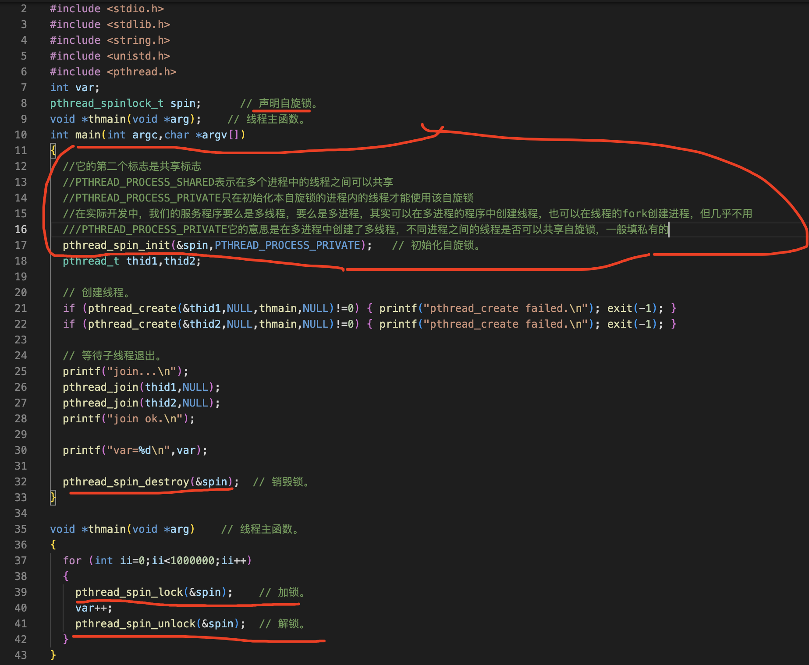

三、线程同步-读写锁
===

注意事项：⚠️1、读写锁适合于对读的次数远大于写的情况

​						2、Linux系统优先考虑读锁，这种实现方式有可能导致写入线程饿死的情况

- 与互斥锁类似，不过读写锁允许更高的并发性
- 三种状态：读模式加锁，写模式加锁和不加锁
- 只要没有线程持有写锁，任意线程都可以成功申请读锁
- 只有在不加锁状态时，才能成功申请写锁

读写锁的api
---

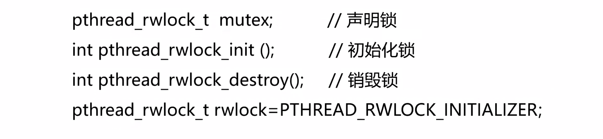

申请读锁的函数

申请写锁的函数解锁的函数

获取和设置读写锁的属性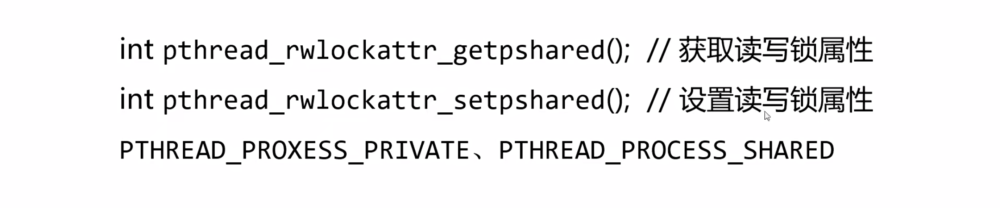

只有申请写锁的信号，没有申请成功的信号

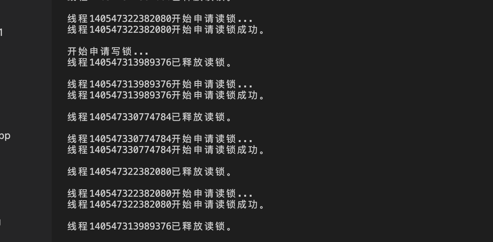

上面的结果是去掉39那一行

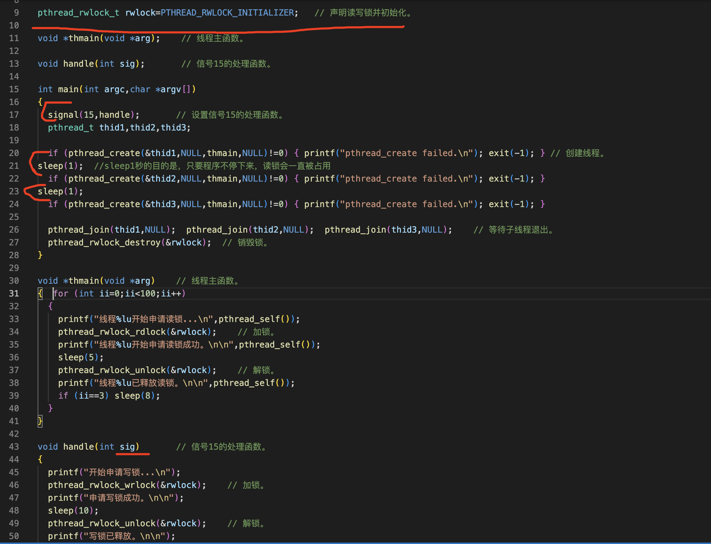

加上39那一行后的意思为，让全部的线程把读锁释放

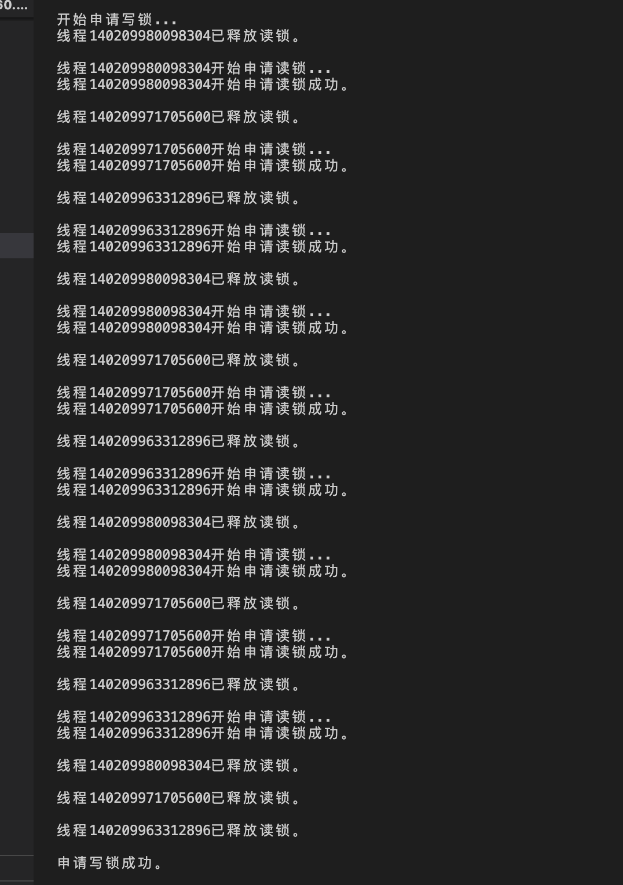

接上图

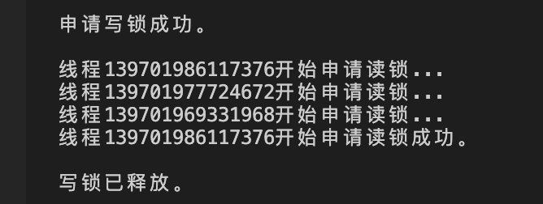

```
// 本程序演示线程同步-读写锁。 book14
#include <stdio.h>
#include <stdlib.h>
#include <string.h>
#include <unistd.h>
#include <pthread.h>
#include <signal.h>

pthread_rwlock_t rwlock=PTHREAD_RWLOCK_INITIALIZER;   // 声明读写锁并初始化。

void *thmain(void *arg);    // 线程主函数。

void handle(int sig);       // 信号15的处理函数。

int main(int argc,char *argv[])
{
  signal(15,handle);       // 设置信号15的处理函数。

  pthread_t thid1,thid2,thid3;

  // 创建线程。
  if (pthread_create(&thid1,NULL,thmain,NULL)!=0) { printf("pthread_create failed.\n"); exit(-1); }
sleep(1);
  if (pthread_create(&thid2,NULL,thmain,NULL)!=0) { printf("pthread_create failed.\n"); exit(-1); }
sleep(1);
  if (pthread_create(&thid3,NULL,thmain,NULL)!=0) { printf("pthread_create failed.\n"); exit(-1); }

  // 等待子线程退出。
  pthread_join(thid1,NULL);  pthread_join(thid2,NULL);  pthread_join(thid3,NULL);

  pthread_rwlock_destroy(&rwlock);  // 销毁锁。
}

void *thmain(void *arg)    // 线程主函数。
{
  for (int ii=0;ii<100;ii++)
  {
    printf("线程%lu开始申请读锁...\n",pthread_self());
    pthread_rwlock_rdlock(&rwlock);    // 加锁。
    printf("线程%lu开始申请读锁成功。\n\n",pthread_self());
    sleep(5);
    pthread_rwlock_unlock(&rwlock);    // 解锁。
    printf("线程%lu已释放读锁。\n\n",pthread_self());

    if (ii==3) sleep(8);
  }
}

void handle(int sig)       // 信号15的处理函数。
{
  printf("开始申请写锁...\n");
  pthread_rwlock_wrlock(&rwlock);    // 加锁。
  printf("申请写锁成功。\n\n");
  sleep(10);
  pthread_rwlock_unlock(&rwlock);    // 解锁。
  printf("写锁已释放。\n\n");
}

```

四、线程同步-条件变量
===

条件变量给多线程提供了一个汇合的机制，需要与互斥锁结合一起使用，可以实现生产消费者模型，也可以实现简单的通知功能

- 与互斥锁一起使用
- 实现生产消费者模型
- 实现通知的功能


下面的获取共享属性就是在多进程的多个线程之间是否可以共享条件变量？

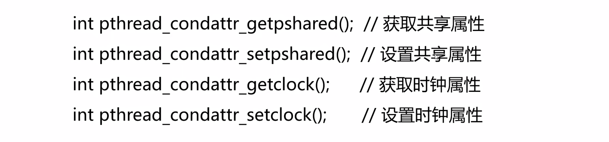

以下是使用唤醒等待条件变量的一个线程(pthread_cond_signal(&cond) ) 发送四次信号的结果

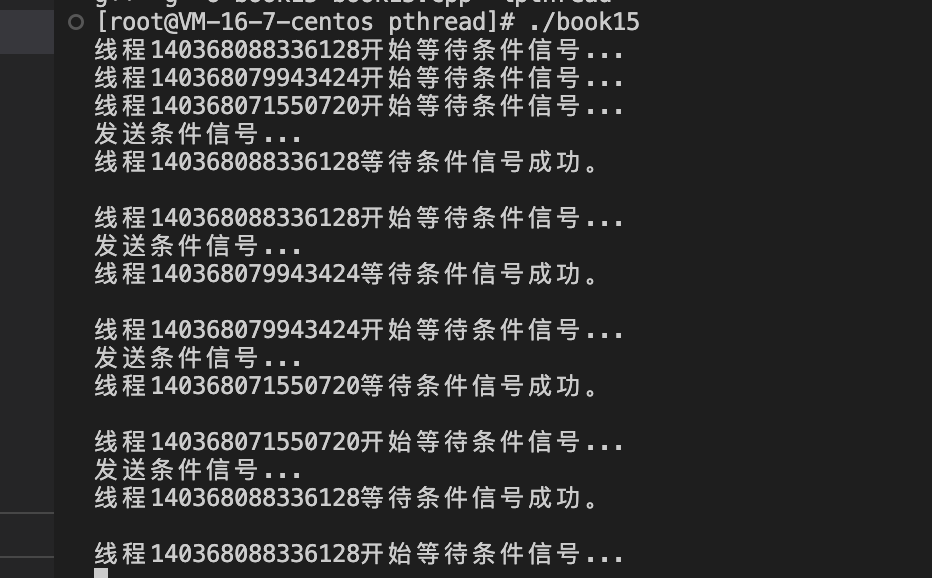

以下是使用唤醒等待条件变量的全部线程。(   pthread_cond_broadcast(&cond);  ) 发送一次就有这个结果

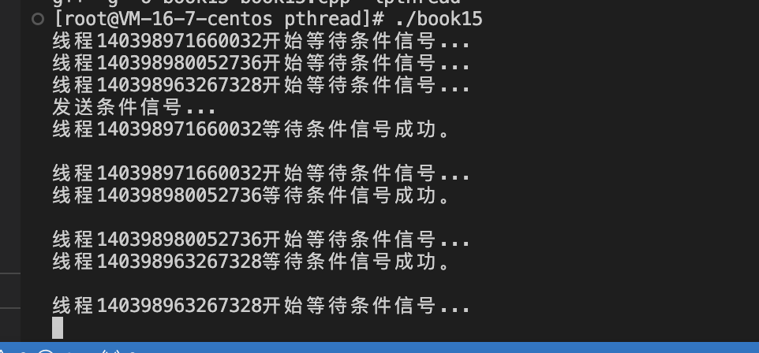

 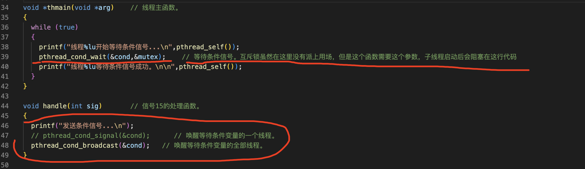

```
//book15
// 本程序演示线程同步-条件变量。
#include <stdio.h>
#include <stdlib.h>
#include <string.h>
#include <unistd.h>
#include <pthread.h>
#include <signal.h>

pthread_cond_t cond=PTHREAD_COND_INITIALIZER;     // 声明条件变量并初始化。
pthread_mutex_t mutex=PTHREAD_MUTEX_INITIALIZER;  // 声明互斥锁并初始化。

void *thmain(void *arg);    // 线程主函数。

void handle(int sig);       // 信号15的处理函数。

int main(int argc,char *argv[])
{
  signal(15,handle);       // 设置信号15的处理函数。

  pthread_t thid1,thid2,thid3;

  // 创建线程。
  if (pthread_create(&thid1,NULL,thmain,NULL)!=0) { printf("pthread_create failed.\n"); exit(-1); }
  if (pthread_create(&thid2,NULL,thmain,NULL)!=0) { printf("pthread_create failed.\n"); exit(-1); }
  if (pthread_create(&thid3,NULL,thmain,NULL)!=0) { printf("pthread_create failed.\n"); exit(-1); }

  // 等待子线程退出。
  pthread_join(thid1,NULL);  pthread_join(thid2,NULL);  pthread_join(thid3,NULL);

  pthread_cond_destroy(&cond);    // 销毁条件变量。
  pthread_mutex_destroy(&mutex);  // 销毁互斥锁。
}

void *thmain(void *arg)    // 线程主函数。
{
  while (true)
  {
    printf("线程%lu开始等待条件信号...\n",pthread_self());
    pthread_cond_wait(&cond,&mutex);    // 等待条件信号。互斥锁虽然在这里没有派上用场，但是这个函数需要这个参数，子线程启动后会阻塞在这行代码
    printf("线程%lu等待条件信号成功。\n\n",pthread_self());
  }
}

void handle(int sig)       // 信号15的处理函数。
{
  printf("发送条件信号...\n");
  // pthread_cond_signal(&cond);      // 唤醒等待条件变量的一个线程。
  pthread_cond_broadcast(&cond);   // 唤醒等待条件变量的全部线程。
}
```

五、线程同步-(匿名)信号量
===

第二章讲进程通讯的时候介绍过信号量，用信号量给共享内存加锁，建议再看一遍，进程的信号量是全局的有一个key，线程的信号量是匿名的，只能在同一个程序中的多个进程的线程中使用，他们的信号量原理是一样的，在多线程的程序中，可以用进程的信号量，也可以用线程的信号量，但是线程的信号量更加方便，但是线程的信号量不能用在多进程的程序中

- 一个整数计数器，其数值用于表示空闲临界资源的数量
- 申请资源时，信号量减少，表示可用资源数减少
- 释放资源时，信号量增加，表示可用资源数增加

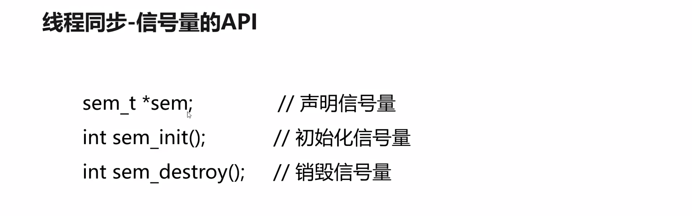


演示实现互斥锁的功能
---


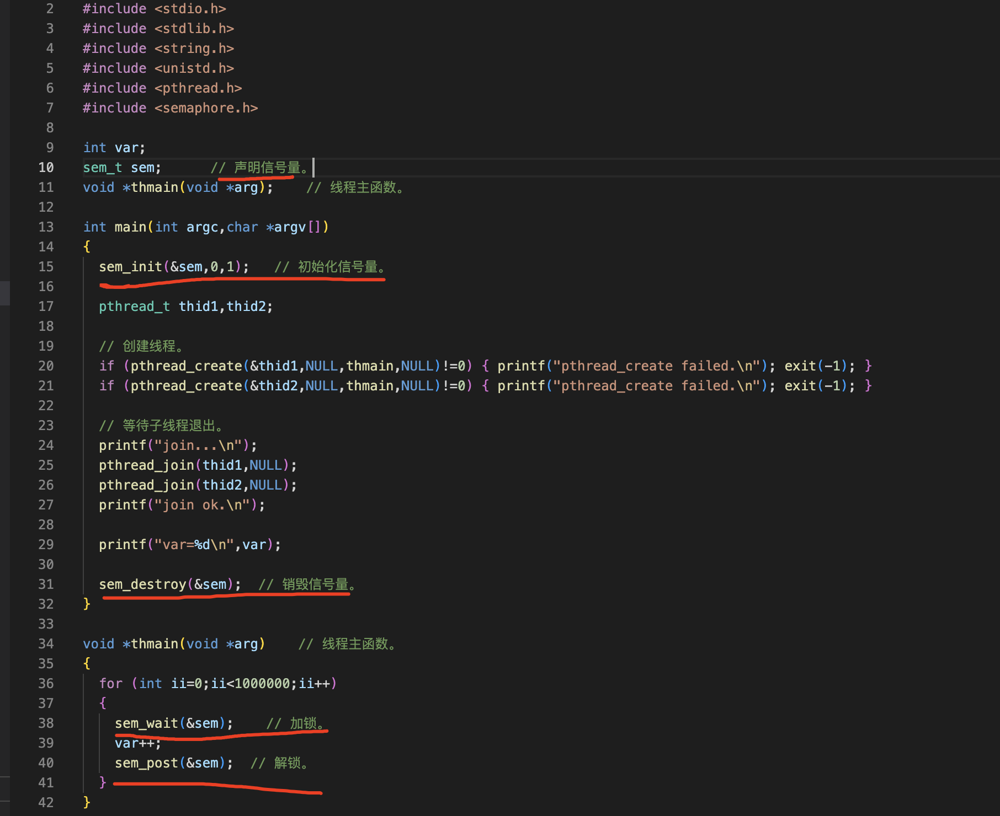

```
book16
// 本程序演示线程同步-信号量。
#include <stdio.h>
#include <stdlib.h>
#include <string.h>
#include <unistd.h>
#include <pthread.h>
#include <semaphore.h>

int var;

sem_t sem;      // 声明信号量。

void *thmain(void *arg);    // 线程主函数。

int main(int argc,char *argv[])
{
  sem_init(&sem,0,1);   // 初始化信号量。

  pthread_t thid1,thid2;

  // 创建线程。
  if (pthread_create(&thid1,NULL,thmain,NULL)!=0) { printf("pthread_create failed.\n"); exit(-1); }
  if (pthread_create(&thid2,NULL,thmain,NULL)!=0) { printf("pthread_create failed.\n"); exit(-1); }

  // 等待子线程退出。
  printf("join...\n");
  pthread_join(thid1,NULL);
  pthread_join(thid2,NULL);
  printf("join ok.\n");

  printf("var=%d\n",var);

  sem_destroy(&sem);  // 销毁信号量。
}

void *thmain(void *arg)    // 线程主函数。
{
  for (int ii=0;ii<1000000;ii++)
  {
    sem_wait(&sem);    // 加锁。
    var++;
    sem_post(&sem);  // 解锁。
  }
}

```

