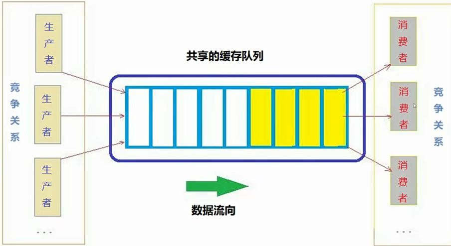
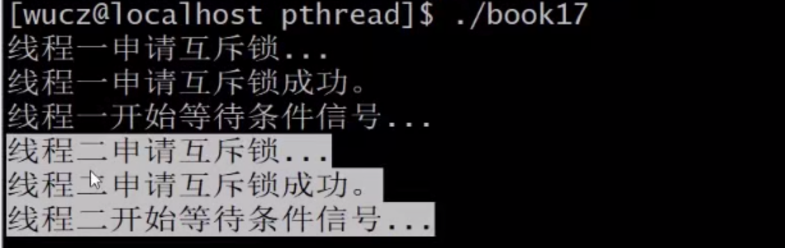
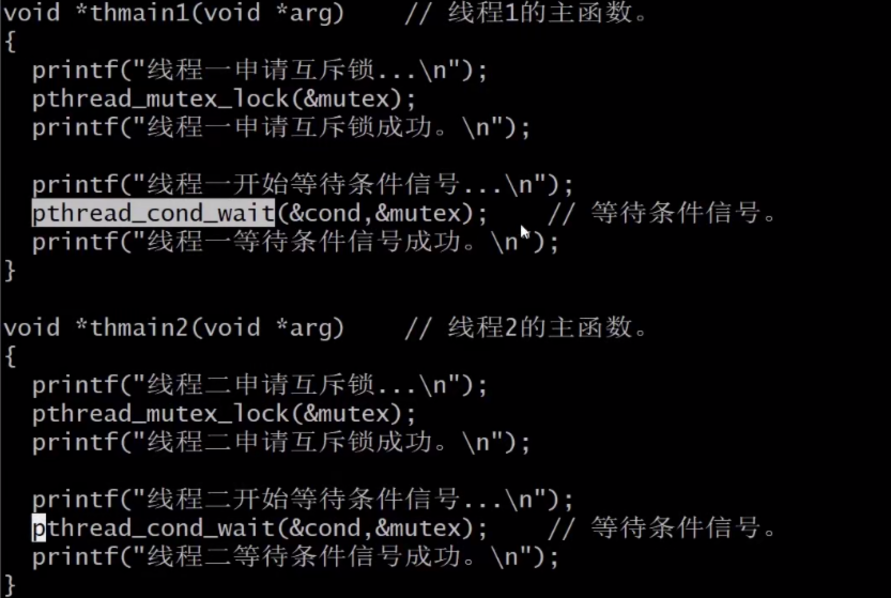
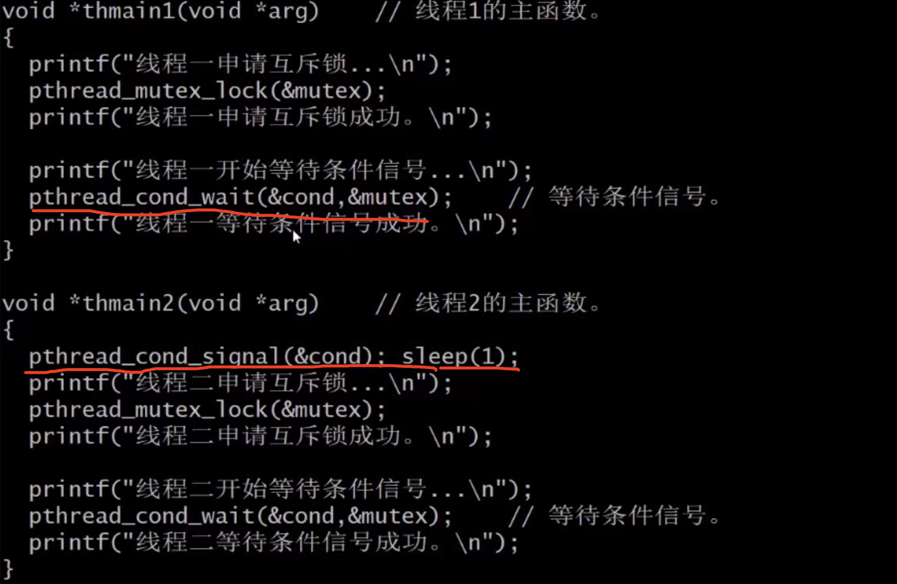

实现生产消费者模型
===

- 生产消费者模型的基本概念
- 互斥锁+条件变量实现生产消费者模型
- 信号量实现生产消费者模型

多个生产者生产数据放在共享的缓存队列中。消费者从缓存队列中获取数据。并且处理掉这个图中的生产者和消费者，对应了我们的进程或者线程。如果生产者和消费者是不同程序中的进程，可以用共享内存来做缓存。如果生产者和消费者是同一个程序中的多个线程，直接动态的分配一块内存出来就行，也可以用数组链表等等。生产者和消费者都要操作共享的缓存队列，肯定会有竞争，所以要给缓存加锁。还有生产者生产数据之后，要通知消费者取走数据，大家思考一下有什么方法可以实现这个功能。想不明白是正常的，如果能想明白，那你是天才。在多线程中，最常见的是用复式锁加条件变量，实现生产消费者模型复式锁，用于给缓存加锁条件变量，用于通知消费者。也可以用两个信号量来实现生产消费者模型，一个用于加锁，另一个用于通知

pthread_con_wait(&cond,&mutex)
===

这是条件变量的wait函数，条件变量需要一把互斥锁，这是系统设计的需要

1）把互斥锁解锁
---

2）阻塞，等待条件信号(被唤醒)
---

这个说明线程1把互斥锁给解锁了，不然线程2是申请不了互斥锁的

 

3）条件被触发+给互斥锁加锁。第三个步骤的两个动作是原子操作
---

线程1收到了线程2的信号，但是线程2申请互斥锁一直没成功，线程1在收到信号之后，把互斥锁加上了锁

互斥锁+条件变量实现生产消费者模型
===

条件变量就是为了生产消费者模型设计的，用互斥锁加条件变量实现高速缓存

