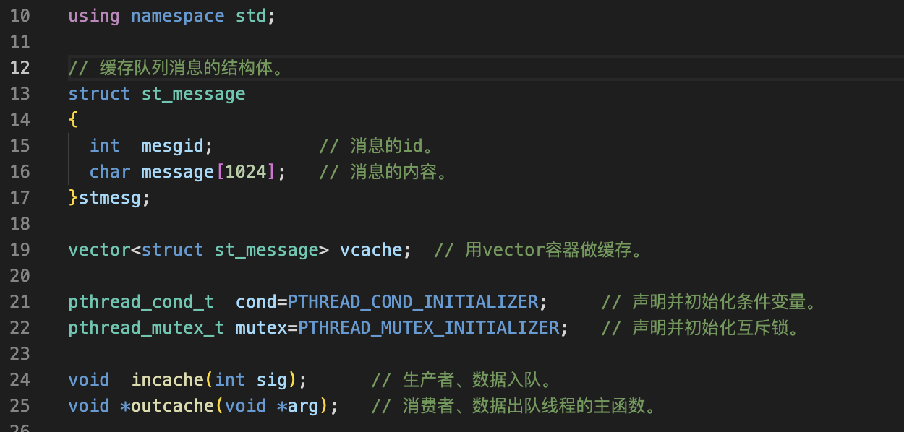
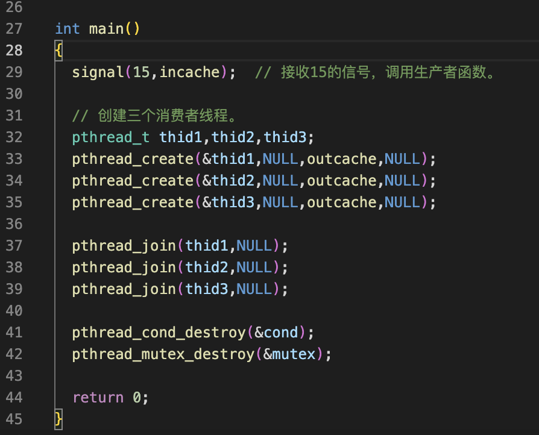
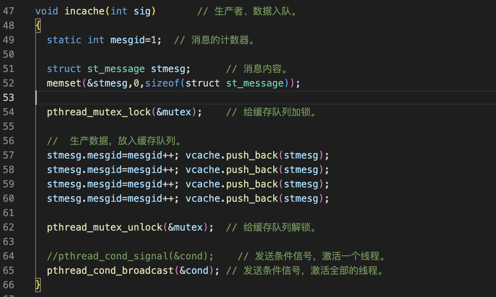
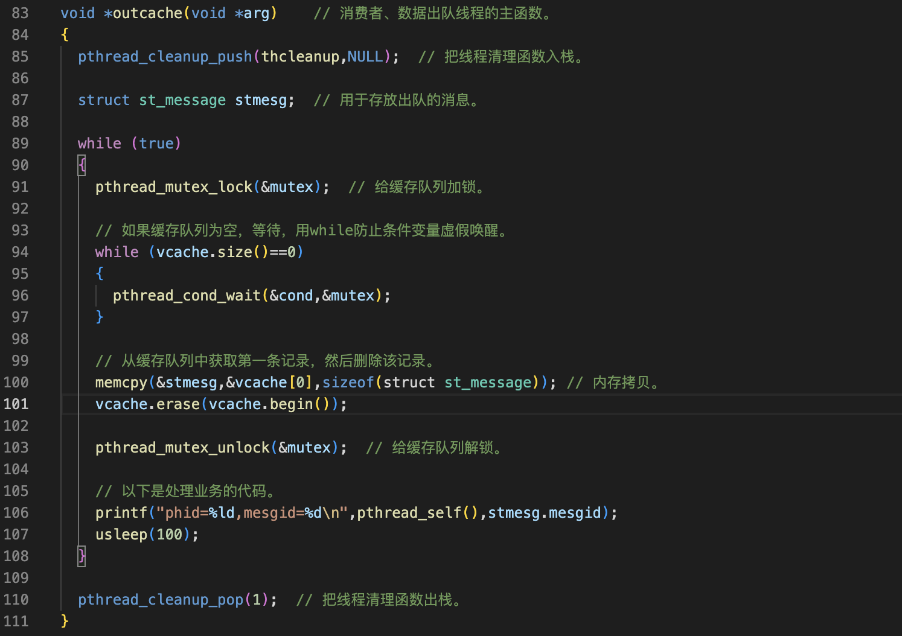
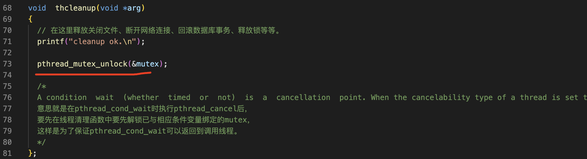

互斥锁+条件变量实现生产消费者模型
===

条件变量就是为了生产消费者模型设计的，用互斥锁加条件变量实现高速缓存

过程
===

1 声明
---



2 主函数中
---

在进程组函数中设置15的信号，从外部向这个程序发送一次信号，就调用生产者函数，生产一批数据，并且放入缓存的队列中。




3 生产者函数代码
---

生产者函数的代码逻辑非常简单，静态变量消息的计数器。在声明结构体存放消息的内容。给缓存加锁生产数据，放入缓存队列，给缓存解锁，然后。发送条件信号激活 全部的线程，线程收到条件信号后将会处理缓存队列中的数据。



4 消费者函数代码(仔细琢磨)
---

一个结构体用于存放从缓存中出队的消息，消费者的功能是不断的处理缓存中的数据，所以。它的主流程是一个死循环。循环的开始，先给缓存队列加锁。然后再判断缓存中是否有数据，如果有数据就不进入这个while循环了。继续下面的流程。因为现在是持有锁的，所以这两行操作缓存的代码是安全的。从缓存中取出一条数据库，再给缓存解锁。下面是处理业务的代码，

把从缓存中拿出来的数据处理掉。刚才说的是缓存中有数据的情况，在这种情况下。这些代码的逻辑没有问题，对吧？再来看缓存中没有数据的情况，如果没有数据，就调用wait函数，wait函数会先解开互斥锁，然后再等待条件信号。因为等待条件信号的时候，互斥锁已经解开了，所以不会影响其他的线程操作缓存。对吧，如果有条件信号到了wait函数将返回，注意了wait函数返回的时候会持有锁。在持有锁的情况下，继续下面的流程也是安全的，这里一定要搞明白

这就明白了条件变量的wait函数为什么要这么设计



我们希望生产一批数据后，每个进程都消费一点，这样才能充分的利用CPU资源提升处理效率

细节
===

在清理函数中释放锁，这个细节非常重要，不然线程无法正常的退出

在pthread_cond_wait时执行pthread_cancel后，  要先在线程清理函数中要先解锁已与相应条件变量绑定的mutex，这样是为了保证pthread_cond_wait可以返回到调用线程。




完整代码
===

```c++
// 本程序演示用互斥锁和条件变量实现高速缓存。
#include <stdio.h>
#include <pthread.h>
#include <stdlib.h>
#include <unistd.h>
#include <signal.h>
#include <string.h>
#include <vector>

using namespace std;

// 缓存队列消息的结构体。
struct st_message
{
  int  mesgid;          // 消息的id。
  char message[1024];   // 消息的内容。
}stmesg;

vector<struct st_message> vcache;  // 用vector容器做缓存。

pthread_cond_t  cond=PTHREAD_COND_INITIALIZER;     // 声明并初始化条件变量。
pthread_mutex_t mutex=PTHREAD_MUTEX_INITIALIZER;   // 声明并初始化互斥锁。

void  incache(int sig);      // 生产者、数据入队。
void *outcache(void *arg);   // 消费者、数据出队线程的主函数。

int main()
{
  signal(15,incache);  // 接收15的信号，调用生产者函数。

  // 创建三个消费者线程。
  pthread_t thid1,thid2,thid3;
  pthread_create(&thid1,NULL,outcache,NULL);
  pthread_create(&thid2,NULL,outcache,NULL);
  pthread_create(&thid3,NULL,outcache,NULL);

  pthread_join(thid1,NULL);
  pthread_join(thid2,NULL);
  pthread_join(thid3,NULL);

  pthread_cond_destroy(&cond);
  pthread_mutex_destroy(&mutex);

  return 0;
}

void incache(int sig)       // 生产者、数据入队。
{
  static int mesgid=1;  // 消息的计数器。

  struct st_message stmesg;      // 消息内容。
  memset(&stmesg,0,sizeof(struct st_message));

  pthread_mutex_lock(&mutex);    // 给缓存队列加锁。

  //  生产数据，放入缓存队列。
  stmesg.mesgid=mesgid++; vcache.push_back(stmesg);  
  stmesg.mesgid=mesgid++; vcache.push_back(stmesg);  
  stmesg.mesgid=mesgid++; vcache.push_back(stmesg);  
  stmesg.mesgid=mesgid++; vcache.push_back(stmesg);  

  pthread_mutex_unlock(&mutex);  // 给缓存队列解锁。

  //pthread_cond_signal(&cond);    // 发送条件信号，激活一个线程。
  pthread_cond_broadcast(&cond); // 发送条件信号，激活全部的线程。
}

void  thcleanup(void *arg)
{
  // 在这里释放关闭文件、断开网络连接、回滚数据库事务、释放锁等等。
  printf("cleanup ok.\n");

  pthread_mutex_unlock(&mutex);

  /*
  A condition  wait  (whether  timed  or  not)  is  a  cancellation  point. When the cancelability type of a thread is set to PTHREAD_CAN_CEL_DEFERRED, a side-effect of acting upon a cancellation request while in a condition wait is that the mutex is (in effect)  re-acquired before  calling the first cancellation cleanup handler. The effect is as if the thread were unblocked, allowed to execute up to the point of returning from the call to pthread_cond_timedwait() or pthread_cond_wait(), but at that point notices  the  cancellation  request  and instead  of  returning to the caller of pthread_cond_timedwait() or pthread_cond_wait(), starts the thread cancellation activities, which includes calling cancellation cleanup handlers.
  意思就是在pthread_cond_wait时执行pthread_cancel后，
  要先在线程清理函数中要先解锁已与相应条件变量绑定的mutex，
  这样是为了保证pthread_cond_wait可以返回到调用线程。
  */
};

void *outcache(void *arg)    // 消费者、数据出队线程的主函数。
{
  pthread_cleanup_push(thcleanup,NULL);  // 把线程清理函数入栈。

  struct st_message stmesg;  // 用于存放出队的消息。

  while (true)
  {
    pthread_mutex_lock(&mutex);  // 给缓存队列加锁。

    // 如果缓存队列为空，等待，用while防止条件变量虚假唤醒。
    while (vcache.size()==0)
    {
      pthread_cond_wait(&cond,&mutex);
    }

    // 从缓存队列中获取第一条记录，然后删除该记录。
    memcpy(&stmesg,&vcache[0],sizeof(struct st_message)); // 内存拷贝。
    vcache.erase(vcache.begin());

    pthread_mutex_unlock(&mutex);  // 给缓存队列解锁。

    // 以下是处理业务的代码。
    printf("phid=%ld,mesgid=%d\n",pthread_self(),stmesg.mesgid);
    usleep(100);
  }

  pthread_cleanup_pop(1);  // 把线程清理函数出栈。
}
```

