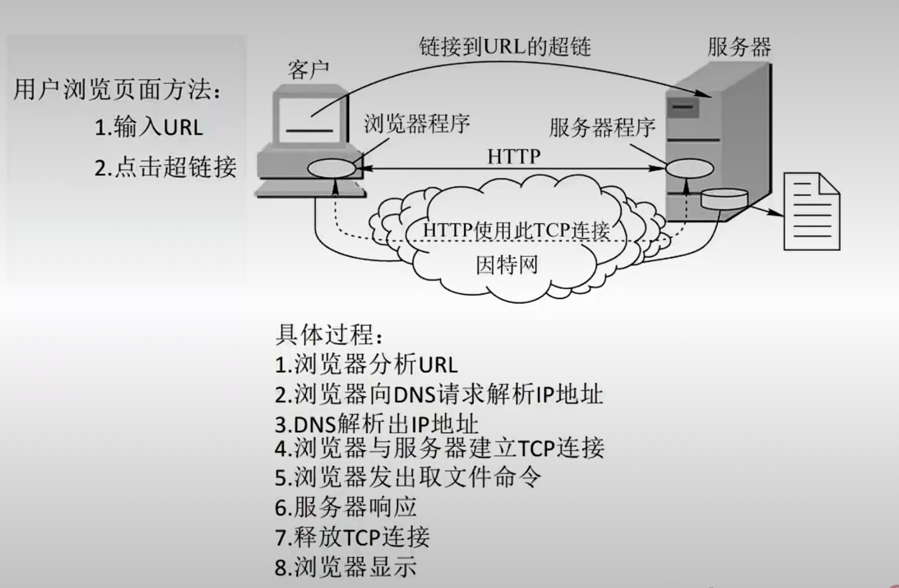
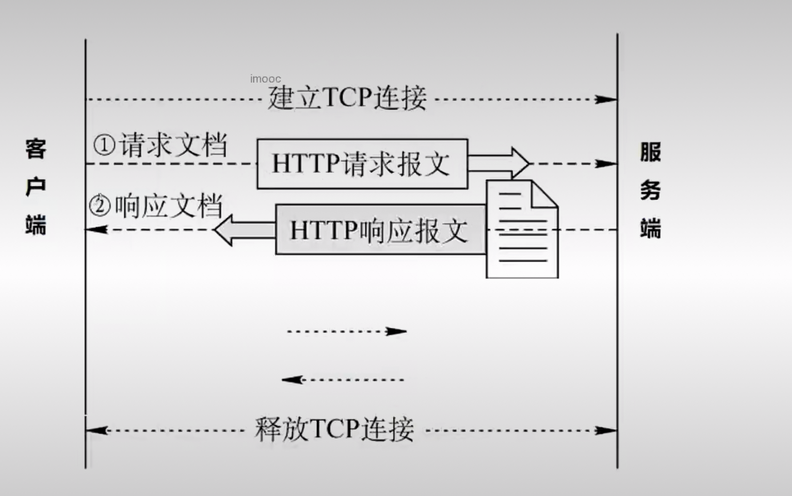
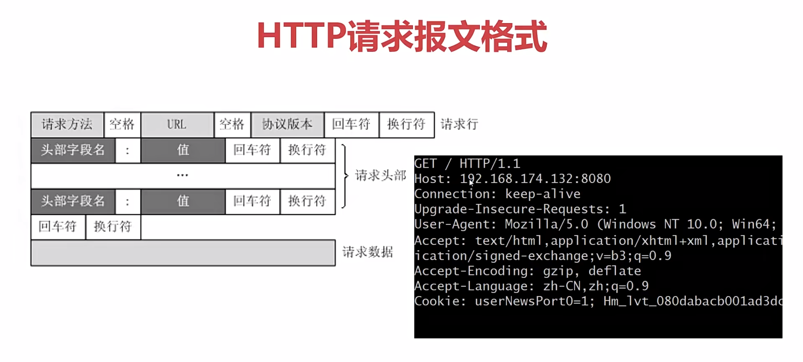
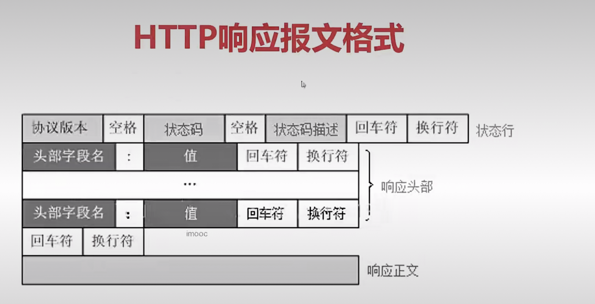
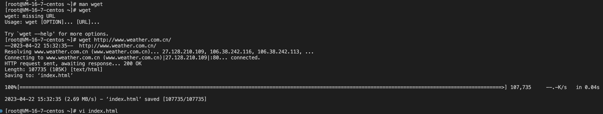

HTTP协议的本质
===

- HTTP协议的基础知识
- HTTP请求和响应报文的格式
- HTTP协议的客户端工具和字符集转换的工具

1 HTTP的原理和工作过程
===

如果要用c语言实现HTTP协议，我们只需要关心三个方面，一是通信的方式，二是请求报文的格式，三是响应报文的格式

它的意思是请求的内容按这个格式拼接成一个字符串发送给服务端就行了，https是加密的传输通道，比较安全

2 HTTP请求和响应报文的格式
===

客户端如何判断http响应数据的结束
---

- 判断网络连接是否断开(已断开，通信结束)
- 检查头部Content-Length=x
- 如果Content-Length=x不存在，Transfer-Encoding：chunked表示响应内容的长度不固定

3 HTTP协议的客户端工具和字符集转换的工具
===

我们经常使用的工具是wget，用于获取网页的内容，支持http、https和FTP协议,除了不能把网页的内容显示出来，其他浏览器有的功能它都有

字符集转换的工具