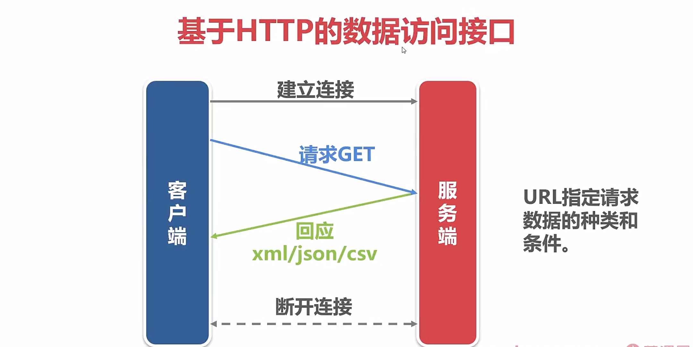
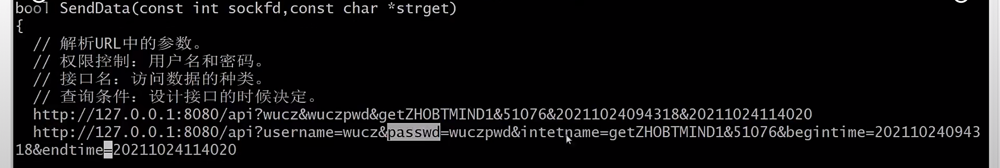
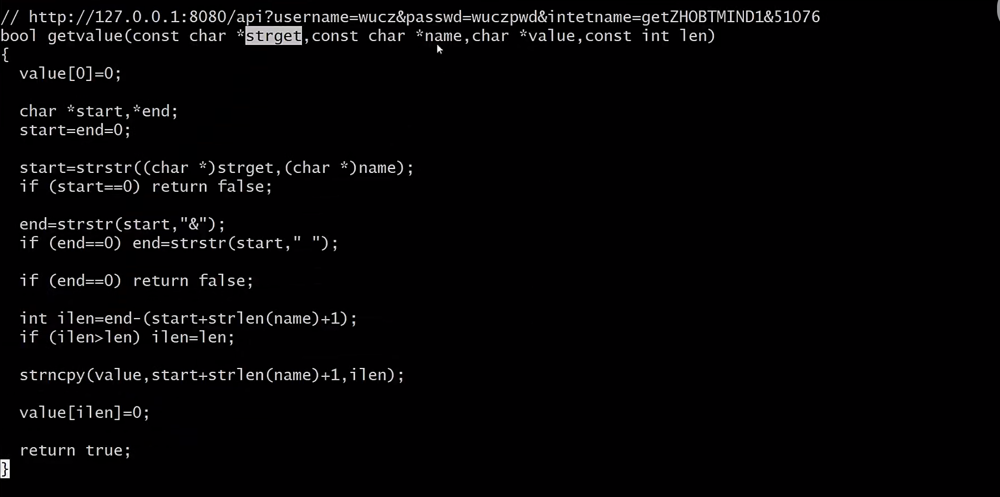
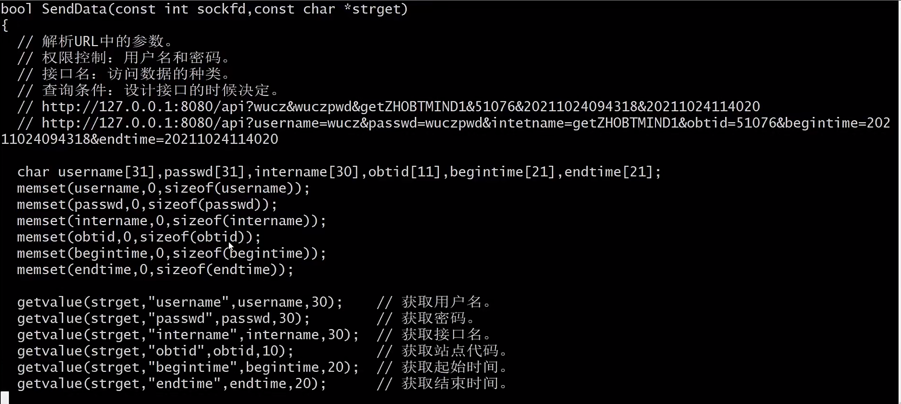
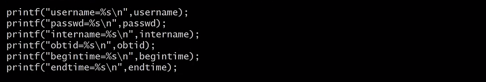
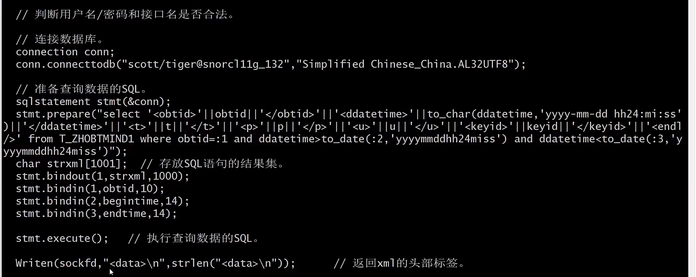
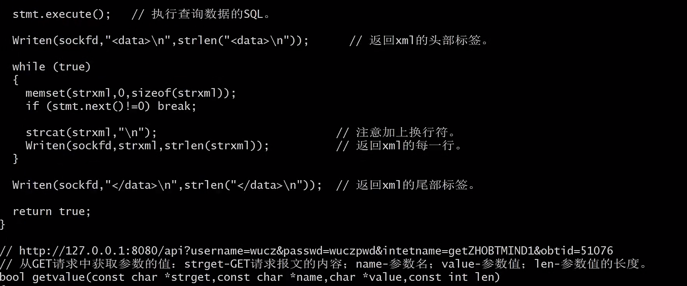
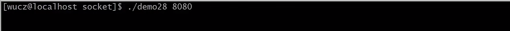
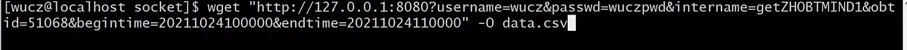

- 实现简单的数据访问接口

起一个高大上的名字就叫数据服务总线

过程
===

- 接受客户端的请求报文

- 解析URL中的参数，参数中指定了查询数据的条件

  权限控制：用户名和密码

  接口名：访问数据的种类

  查询条件：设计接口的时候决定

  

  通过下面那一行给每个参数起个名字，使可读性比较好，参数的顺序谁在前，谁在后都没有关系，如果某个参数有缺省值可以不填

  ## 1、写解析URL的函数

  第一个参数：请求报文的内容

  第二个参数：参数名

  第三个参数：用于存放参数的值

  第四个参数：参数值的最大长度

  先找到参数名的位置，再找到参数值结束的位置(要么是&，要么是空格)，因为URL不会有空格

  

- 从T_ZHOBTMIND表中查询数据，以xml格式返回给客户端

解析GET请求中的参数，从T_ZHOBTMIND表中查询数据，返回给客户端

2、声明几个变量用于存放参数的值，从请求报告中解析参数
---

3、把参数的值显示出来
---

4、解析完参数，应该判断用户名/密码和接口名是否合法
---

5、连接数据库
---

获取结果集，返回给客户端

6 
---

先运行服务端

再运行客户端

在这个站点和时间段在表中一定要有数据，得到数据文件 data.csv

