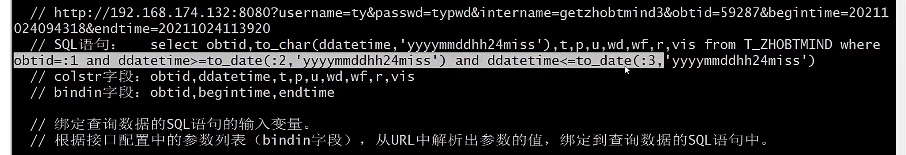
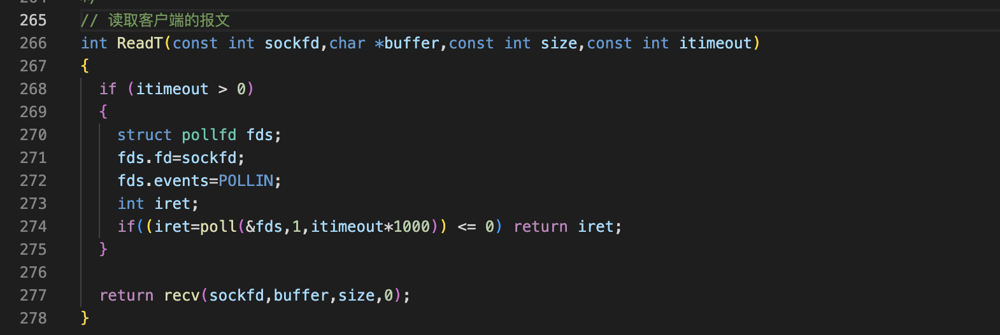
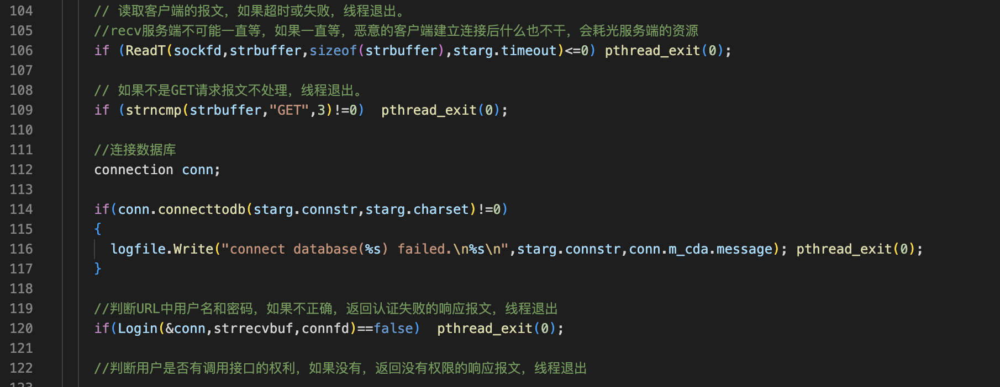
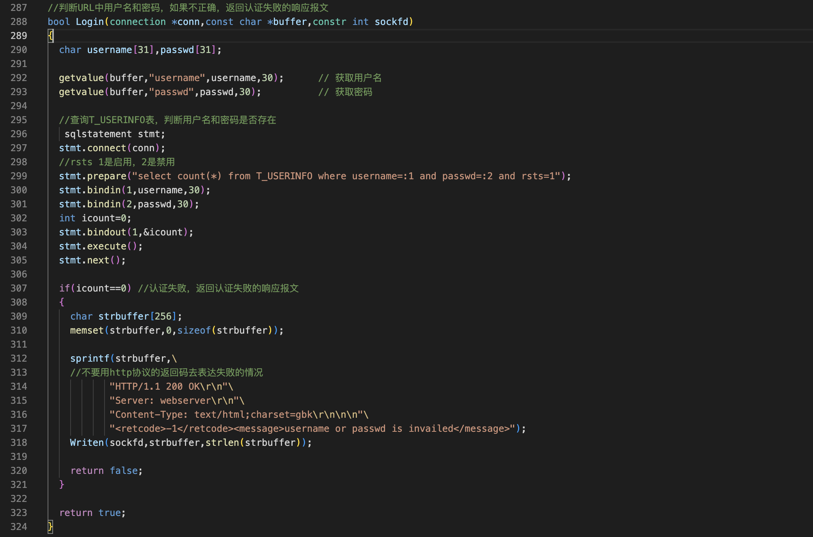
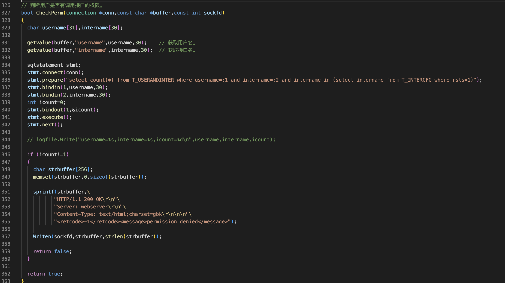
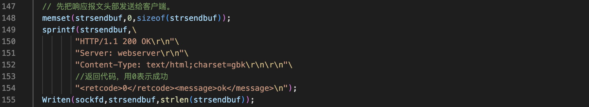
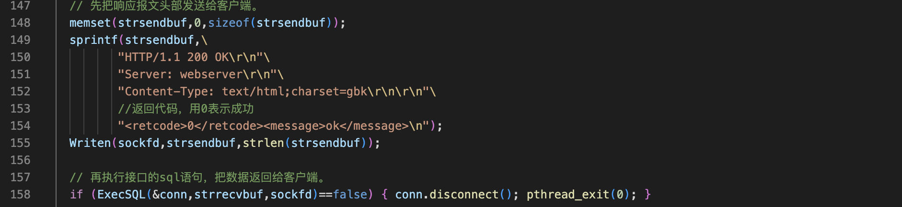
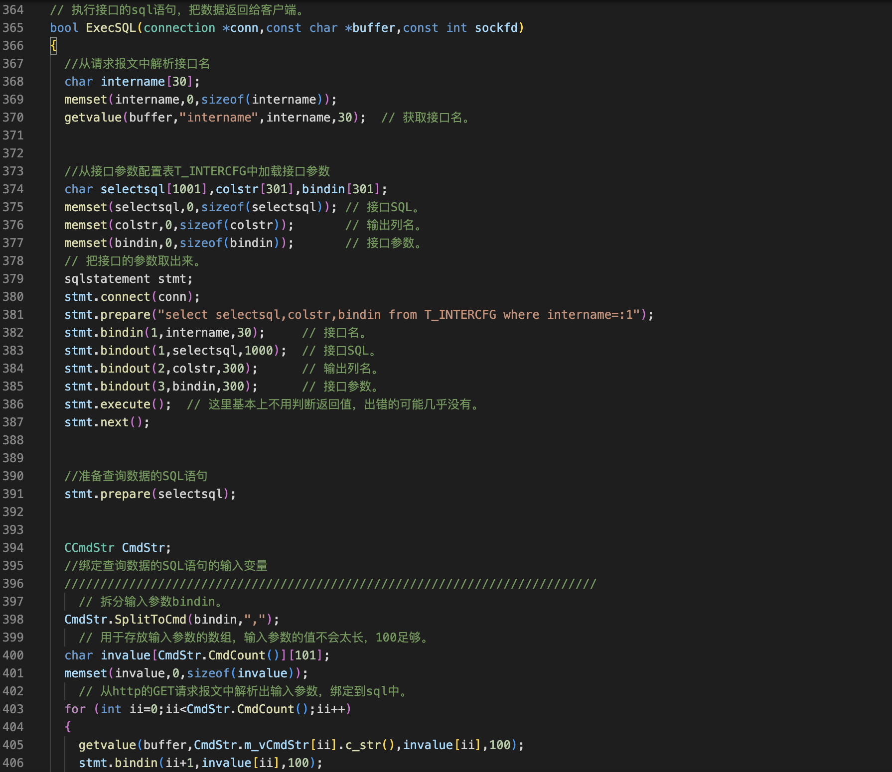
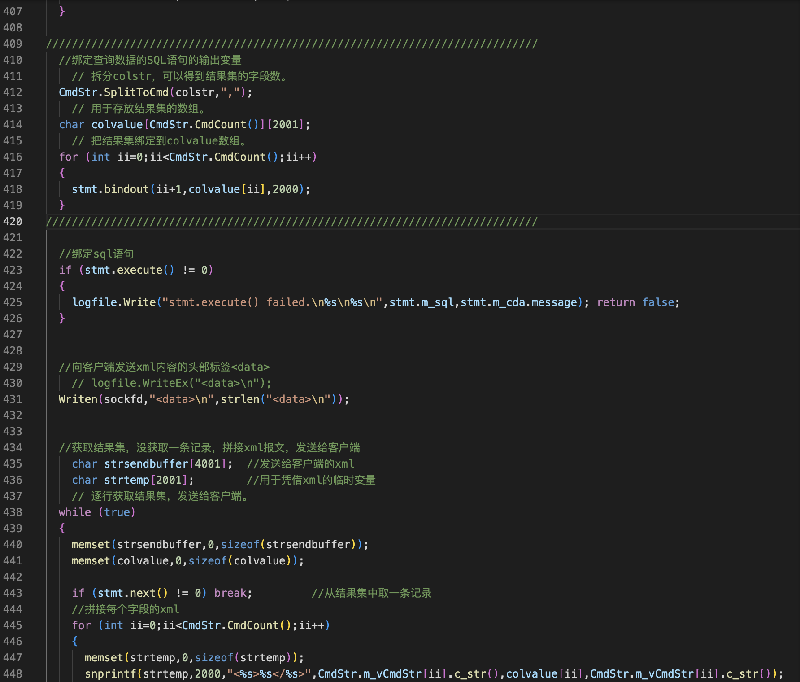
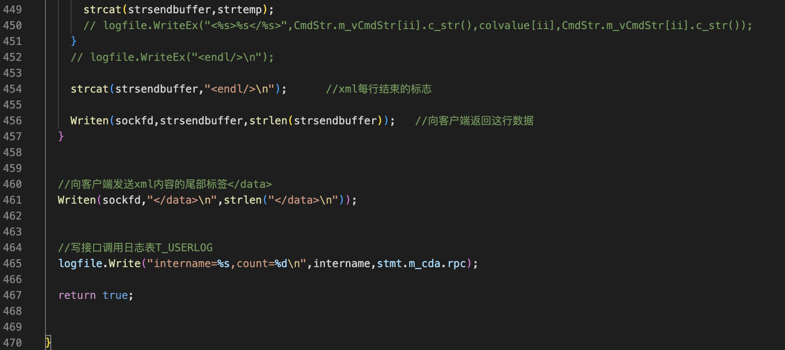

九分半之后放弃了

功能实现
===

- 客户端调用接口的时间间隔比较长，通讯方式采用短连接
- 服务端采用每连接每线程(只要有一个客户端连上来，服务端就先开一个线程，用新开的线程处理这个客户端，处理完成之后这个线程就结束了)

webserver.cpp

过程
===

- 读取客户端的报文，如果超时或失败，线程退出。

- 如果不是GET请求报文不处理，线程退出。

- 连接数据库

- 判断URL中用户名和密码，如果不正确，返回认证失败的响应报文，线程退出

- 判断用户是否有调用接口的权利，如果没有，返回没有权限的响应报文，线程退出

- 先把响应报文头部发送给客户端

- 再执行接口的sql语句，把数据返回给客户端

  - 从请求报文中解析接口名
  - 从接口参数配置表T_INTERCFG中加载接口参数
  - 准备查询数据的SQL语句
  - 绑定查询数据的SQL语句的输入变量

  - 根据接口配置中的参数列表(bindin字段)，从URL中解析出参数的值，绑定到查询数据的SQL语句中

  最后一句是根据binding字段，从http：//192.168.174.132.8080?...中解析出参数的值，绑定在sql语句中，下图

  ## 

  - 绑定查询数据的SQL语句的输出变量
  - 根据接口配置中的列名(colstr字段)，bindout结果集
  - 执行SQL语句
  - 在取结果集之前，向客户端发送xml内容的头部标签<data>
  - 获取结果集，没获取一条记录，拼接xml报文，发送给客户端
  - 向客户端发送xml内容的尾部标签</data>
  - 写接口调用日志表T_USERLOG

  

1 读取客户端的报文，如果超时或失败，线程退出。
---

需要写一个没有报头的有超时机制的接收函数，要实现超时的功能需要用到，要实现超时的功能，需要用到IO复用的poll函数



2
---

- 如果不是GET请求报文不处理，线程退出。
- 连接数据库
- 判断URL中用户名和密码，如果不正确，返回认证失败的响应报文，线程退出



判断URL中用户名和密码，如果不正确，返回认证失败的响应报文，线程退出



3 判断用户是否有调用接口的权利，如果没有，返回没有权限的响应报文，线程退出
---




4 把响应报文头部发送给客户端
---

用户名，密码，权限都没有问题开始调用接口，调用接口之前，先把响应报文头部发送给客户端

5 执行接口的sql语句，把数据返回给客户端
---

流程比较多



- 从请求报文中解析接口名
- 从接口参数配置表T_INTERCFG中加载接口参数
- 准备查询数据的SQL语句
- 绑定查询数据的SQL语句的输入变量

- 根据接口配置中的参数列表(bindin字段)，从URL中解析出参数的值，绑定到查询数据的SQL语句中

最后一句是根据binding字段，从http：//192.168.174.132.8080?...中解析出参数的值，绑定在sql语句中，下图


---

- 绑定查询数据的SQL语句的输出变量
- 根据接口配置中的列名(colstr字段)，bindout结果集
- 执行SQL语句
- 在取结果集之前，向客户端发送xml内容的头部标签<data>
- 获取结果集，没获取一条记录，拼接xml报文，发送给客户端
- 向客户端发送xml内容的尾部标签</data>
- 写接口调用日志表T_USERLOG



代码

```c++
// 执行接口的sql语句，把数据返回给客户端。
bool ExecSQL(connection *conn,const char *buffer,const int sockfd)
{
  //从请求报文中解析接口名
  char intername[30];
  memset(intername,0,sizeof(intername));
  getvalue(buffer,"intername",intername,30);  // 获取接口名。


  //从接口参数配置表T_INTERCFG中加载接口参数
  char selectsql[1001],colstr[301],bindin[301];
  memset(selectsql,0,sizeof(selectsql)); // 接口SQL。
  memset(colstr,0,sizeof(colstr));       // 输出列名。
  memset(bindin,0,sizeof(bindin));       // 接口参数。
  // 把接口的参数取出来。
  sqlstatement stmt;
  stmt.connect(conn);
  stmt.prepare("select selectsql,colstr,bindin from T_INTERCFG where intername=:1");
  stmt.bindin(1,intername,30);     // 接口名。
  stmt.bindout(1,selectsql,1000);  // 接口SQL。
  stmt.bindout(2,colstr,300);      // 输出列名。
  stmt.bindout(3,bindin,300);      // 接口参数。
  stmt.execute();  // 这里基本上不用判断返回值，出错的可能几乎没有。
  stmt.next();
  

  //准备查询数据的SQL语句
  stmt.prepare(selectsql);


  CCmdStr CmdStr;
  //绑定查询数据的SQL语句的输入变量
  //////////////////////////////////////////////////////////////////////////
    // 拆分输入参数bindin。
  CmdStr.SplitToCmd(bindin,",");
    // 用于存放输入参数的数组，输入参数的值不会太长，100足够。
  char invalue[CmdStr.CmdCount()][101];
  memset(invalue,0,sizeof(invalue));
    // 从http的GET请求报文中解析出输入参数，绑定到sql中。
  for (int ii=0;ii<CmdStr.CmdCount();ii++)
  {
    getvalue(buffer,CmdStr.m_vCmdStr[ii].c_str(),invalue[ii],100); 
    stmt.bindin(ii+1,invalue[ii],100);
  }

////////////////////////////////////////////////////////////////////////////
  //绑定查询数据的SQL语句的输出变量
    // 拆分colstr，可以得到结果集的字段数。
  CmdStr.SplitToCmd(colstr,",");
    // 用于存放结果集的数组。
  char colvalue[CmdStr.CmdCount()][2001];
    // 把结果集绑定到colvalue数组。
  for (int ii=0;ii<CmdStr.CmdCount();ii++)
  {
    stmt.bindout(ii+1,colvalue[ii],2000);
  }
////////////////////////////////////////////////////////////////////////////

  //绑定sql语句
  if (stmt.execute() != 0)
  {
    logfile.Write("stmt.execute() failed.\n%s\n%s\n",stmt.m_sql,stmt.m_cda.message); return false;
  }


  //向客户端发送xml内容的头部标签<data>
    // logfile.WriteEx("<data>\n");
  Writen(sockfd,"<data>\n",strlen("<data>\n"));


  //获取结果集，没获取一条记录，拼接xml报文，发送给客户端
    char strsendbuffer[4001];  //发送给客户端的xml
    char strtemp[2001];        //用于凭借xml的临时变量
    // 逐行获取结果集，发送给客户端。
  while (true)
  {
    memset(strsendbuffer,0,sizeof(strsendbuffer));
    memset(colvalue,0,sizeof(colvalue));

    if (stmt.next() != 0) break;         //从结果集中取一条记录
    //拼接每个字段的xml
    for (int ii=0;ii<CmdStr.CmdCount();ii++)
    {
      memset(strtemp,0,sizeof(strtemp));
      snprintf(strtemp,2000,"<%s>%s</%s>",CmdStr.m_vCmdStr[ii].c_str(),colvalue[ii],CmdStr.m_vCmdStr[ii].c_str());
      strcat(strsendbuffer,strtemp);
      // logfile.WriteEx("<%s>%s</%s>",CmdStr.m_vCmdStr[ii].c_str(),colvalue[ii],CmdStr.m_vCmdStr[ii].c_str());
    }
    // logfile.WriteEx("<endl/>\n");

    strcat(strsendbuffer,"<endl/>\n");      //xml每行结束的标志

    Writen(sockfd,strsendbuffer,strlen(strsendbuffer));   //向客户端返回这行数据
  }


  //向客户端发送xml内容的尾部标签</data>
  Writen(sockfd,"</data>\n",strlen("</data>\n"));


  //写接口调用日志表T_USERLOG
  logfile.Write("intername=%s,count=%d\n",intername,stmt.m_cda.rpc);
  
  return true;
}
```

