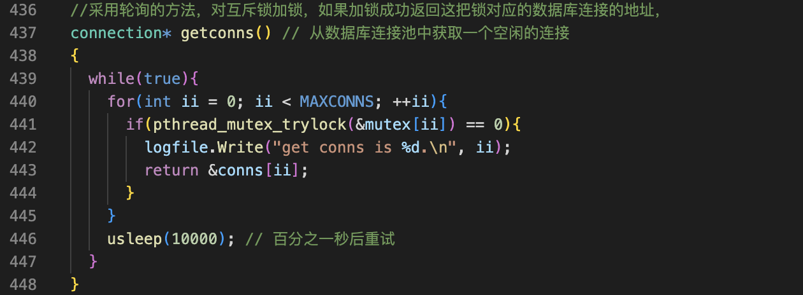
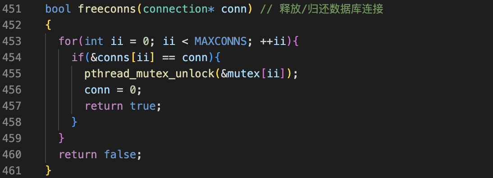
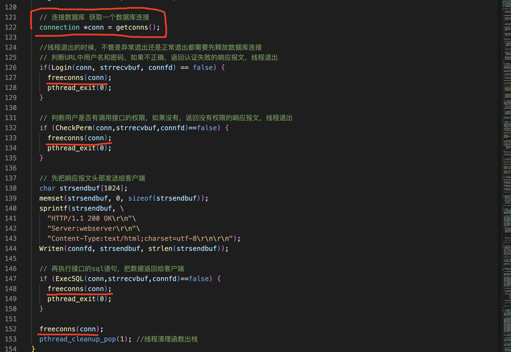

采用每连接每线程的方式实现了数据总线的基本功能，但服务程序消耗的资源比较多，性能比较低

每连接每线程的缺点
===

- Oracle数据库连接占用的内存很多，每创建一个新的连接，需要客户端3M，服务端5M的内存
- Linux每个线程占用越10M的虚拟内存和大于10k的固定内存，线程越复杂，占用的内存越多
- 创建线程(消耗时间非常短，可以忽略不计)和连接数据库需要时间

优化方案
===

- 数据库连接池
- 线程池

数据库连接池

数据库连接池(就跟公共卫生间的原理一样)
===

- 在主进程中，预先创建n个数据库连接
- 每个线程需要用到数据库的时候，从数据库连接池中取一个空闲的连接，用完之后归还
- 数据库连接需要用锁保护

数据库连接池的性能
===

- CPU1核2G，性能在100次/秒以上
- CPU16核32G，性能可达2000次/秒
- 可以满足普通业务的需求，无法满足互联网大厂的并发需求

过程
===

1 声明数据库连接池的数据机构和操作的函数
---

这里只能用互斥锁，不能用自旋锁，因为如果数据量比较大的话，数据库连接占用的时间可能会比较长，自旋锁不合适


2 实现功能
---

### 1）初始数据库连接池

需要连接数据库，初始化互斥锁


### 2）从数据库连接池中获取一个空闲的连接

usleep的目的是如果失败了，不断的尝试一直到成功为止



### 3）释放数据库连接

取地址之后地址相等就释放锁



### 4）断开数据库连接，销毁锁


### 5）在main函数中

初始化数据库连接池


### 6）修改线程主函数



细节
===

进行压力测试


完整代码
===

```c++
/*
 * 程序名：demo20.cpp，此程序演示采用开发框架的CTcpServer类实现socket通信多线程的服务器。
 * 作者：gmc
*/
#include "_public.h"
#include "_ooci.h"

CLogFile logfile; // 服务程序的运行日志
CTcpServer TcpServer; // 创建服务端对象

void EXIT(int sig); // 父进程退出函数

vector<pthread_t> vthid; //存放全部线程id
pthread_spinlock_t vthidlock; // 用于锁定vthid的自旋锁
void* thmain(void* arg); // 线程主函数

void thecleanup(void* arg); // 线程清理函数

// 主进程参数的结构体
struct st_arg{
  char connstr[101]; // 数据库的连接参数
  char charset[51]; // 数据库的字符集
  int port; // web服务监听的端口
}starg;

// 显示程序的帮助
void _help(char* argv[]);

// 把xml解析到参数starg结构中
bool _xmltoarg(char* strxmlbuffer);

// 读取客户端的报文
int ReadT(const int sockfd, char* buffer, const int size, const int itimeout);

// 判断URL中用户名和密码，如果不正确，返回认证失败的响应报文，线程退出
bool Login(connection* conn, const char* buffer, const int sockfd);

// 从GET请求中获取参数的值：strget-GET请求报文的内容；name-参数名；value-参数值；len-参数值的长度。
bool getvalue(const char* strget, const char* name, char* value, const int len);

// 判断用户是否有调用接口的权限，如果没有，返回没有权限的响应报文。
bool CheckPerm(connection *conn,const char *buffer,const int sockfd);

// 执行接口的sql语句，把数据返回给客户端
bool ExecSQL(connection *conn,const char *buffer,const int sockfd);

#define MAXCONNS 10 // 数据库连接池的大小
connection conns[MAXCONNS]; // 数据库连接池的数组
pthread_mutex_t mutex[MAXCONNS]; // 数据库连接池的锁
bool initconns(); // 初始数据库连接池
connection* getconns(); // 从数据库连接池中获取一个空闲的连接
bool freeconns(connection* conn); // 释放/归还数据库连接
bool destroyconns(); // 释放数据库连接占用的资源（断开数据库连接，销毁锁）

int main(int argc,char *argv[])
{
  if (argc!=3){
    _help(argv); return -1;
  }

  CloseIOAndSignal(); signal(SIGINT, EXIT); signal(SIGTERM, EXIT);
  
  if(logfile.Open(argv[1], "a+") == false){
    printf("logfile.Open(%s) failed\n", argv[1]);
    return -1;
  }

  // 把xml解析到参数starg结构中
  if(_xmltoarg(argv[2]) == false) EXIT(-1);

  // 服务端初始化
  if(TcpServer.InitServer(starg.port) == false){
    logfile.Write("TcpServer.InitServer(%d) failed.\n", starg.port);
    EXIT(-1);
  }

  if(initconns() == false){// 初始化数据库连接池
    logfile.Write("initconns() failed.\n");
    return -1;
  }

  pthread_spin_init(&vthidlock, 0);

  while(true){
    // 等待客户端的连接
    if(TcpServer.Accept() == false){
      logfile.Write("TcpServer.Accept() failed.\n");
      EXIT(-1);
    }

    logfile.Write("客户端（%s）已连接。\n", TcpServer.GetIP());

    // 创建一个线程，让它与客户端通讯
    pthread_t thid;
    if(pthread_create(&thid, NULL, thmain, (void*)(long)TcpServer.m_connfd) != 0){
      logfile.Write("pthread_create() failed.\n"); TcpServer.CloseListen(); continue;
    }
    pthread_spin_lock(&vthidlock);
    vthid.push_back(thid); // 把线程id保存到容器中
    pthread_spin_unlock(&vthidlock);
  }
}

void* thmain(void* arg){ // 线程主函数
  pthread_cleanup_push(thecleanup, arg); // 把线程清理函数入栈（关闭客户端的socket）
  int connfd = (int)(long)arg;
  pthread_setcanceltype(PTHREAD_CANCEL_ASYNCHRONOUS, NULL);
  pthread_detach(pthread_self());
  
  char strrecvbuf[1024]; // 接收客户端请求报文的buffer
  memset(strrecvbuf, 0, sizeof(strrecvbuf));

  // 读取客户端的报文，如果超时或者失败，线程退出
  if(ReadT(connfd, strrecvbuf, sizeof(strrecvbuf), 3) <= 0) pthread_exit(0);

  // 如果不是GET请求报文不处理，线程退出
  if(strncmp(strrecvbuf, "GET", 3) != 0) pthread_exit(0);

  logfile.Write("%s\n", strrecvbuf);

  // 连接数据库 获取一个数据库连接
  connection *conn = getconns();

  // 判断URL中用户名和密码，如果不正确，返回认证失败的响应报文，线程退出
  if(Login(conn, strrecvbuf, connfd) == false) {
    freeconns(conn);
    pthread_exit(0);
  }

  // 判断用户是否有调用接口的权限，如果没有，返回没有权限的响应报文，线程退出
  if (CheckPerm(conn,strrecvbuf,connfd)==false) {
    freeconns(conn);
    pthread_exit(0);
  }

  // 先把响应报文头部发送给客户端
  char strsendbuf[1024];
  memset(strsendbuf, 0, sizeof(strsendbuf));
  sprintf(strsendbuf, \
    "HTTP/1.1 200 OK\r\n"\
    "Server:webserver\r\n"\
    "Content-Type:text/html;charset=utf-8\r\n\r\n");
  Writen(connfd, strsendbuf, strlen(strsendbuf));

  // 再执行接口的sql语句，把数据返回给客户端
  if (ExecSQL(conn,strrecvbuf,connfd)==false) {
    freeconns(conn);
    pthread_exit(0);
  }

  freeconns(conn);
  pthread_cleanup_pop(1); //线程清理函数出栈
}

void EXIT(int sig){// 父进程退出函数
// 以下代码是为了防止信号处理函数在执行的过程中被信号中断
  signal(SIGINT, SIG_IGN); signal(SIGTERM, SIG_IGN);
  logfile.Write("父进程退出。sig = %d.\n", sig);
  TcpServer.CloseListen(); // 关闭监听的socket
  // 取消线程
  pthread_spin_lock(&vthidlock);
  for(int ii = 0; ii < vthid.size(); ++ii){
    pthread_cancel(vthid[ii]);
  }
  pthread_spin_unlock(&vthidlock);

  sleep(1);
  pthread_spin_destroy(&vthidlock);
  exit(0);
}

void thecleanup(void* arg){ // 线程清理函数
  close((int)(long)arg); // 关闭客户端的socket
  // 把本线程的id从容器中删除
  pthread_spin_lock(&vthidlock);
  for(int ii = 0; ii < vthid.size(); ++ii){
    if(pthread_equal(pthread_self(), vthid[ii])){
      vthid.erase(vthid.begin() + ii);
      break;
    }
  }
  pthread_spin_unlock(&vthidlock);

  logfile.Write("线程%lu退出。\n", pthread_self());
  // delete (int*)arg;
}

// 显示程序的帮助
void _help(char *argv[])
{
  printf("Using:/project/tools1/bin/webserver logfilename xmlbuffer\n\n");

  printf("Sample:/project/tools1/bin/procctl 10 /project/tools1/bin/webserver /log/idc/webserver.log \"<connstr>qxidc/qxidcpwd@snorcl11g_132</connstr><charset>Simplified Chinese_China.AL32UTF8</charset><port>8080</port>\"\n\n");

  printf("本程序是数据总线的服务端程序，为数据中心提供http协议的数据访问接口。\n");
  printf("logfilename 本程序运行的日志文件。\n");
  printf("xmlbuffer   本程序运行的参数，用xml表示，具体如下：\n\n");

  printf("connstr     数据库的连接参数，格式：username/password@tnsname。\n");
  printf("charset     数据库的字符集，这个参数要与数据源数据库保持一致，否则会出现中文乱码的情况。\n");
  printf("port        web服务监听的端口。\n\n");
}

// 把xml解析到参数starg结构中
bool _xmltoarg(char *strxmlbuffer)
{
  memset(&starg,0,sizeof(struct st_arg));

  GetXMLBuffer(strxmlbuffer,"connstr",starg.connstr,100);
  if (strlen(starg.connstr)==0) { logfile.Write("connstr is null.\n"); return false; }

  GetXMLBuffer(strxmlbuffer,"charset",starg.charset,50);
  if (strlen(starg.charset)==0) { logfile.Write("charset is null.\n"); return false; }

  GetXMLBuffer(strxmlbuffer,"port",&starg.port);
  if (starg.port==0) { logfile.Write("port is null.\n"); return false; }

  return true;
}

// 读取客户端的报文
int ReadT(const int sockfd, char* buffer, const int size, const int itimeout){
  if(itimeout > 0){
    struct pollfd fds;
    fds.fd = sockfd;
    fds.events = POLLIN;
    int iret;
    if((iret = poll(&fds, 1, itimeout*1000)) <= 0) return iret;
  }
  return recv(sockfd, buffer, size, 0);
}

// 判断URL中用户名和密码，如果不正确，返回认证失败的响应报文，线程退出
bool Login(connection* conn, const char* buffer, const int sockfd) {
  char username[31], passwd[31];
  getvalue(buffer, "username", username, 30); // 获取用户名；
  getvalue(buffer, "passwd", passwd, 30); // 获取密码；

  // 查询T_USERINFO表，判断用户名和密码是否存在
  sqlstatement stmt;
  stmt.connect(conn);
  stmt.prepare("select count(*) from T_USERINFO where username = :1 and passwd = :2 and rsts = 1");
  stmt.bindin(1, username, 30);
  stmt.bindin(2, passwd, 30);
  int icount = 0;
  stmt.bindout(1, &icount);
  stmt.execute();
  stmt.next();

  if(icount == 0) {// 认证失败，返回认证失败的响应报文，线程退出
    char strbuffer[256];
    memset(strbuffer, 0, sizeof(strbuffer));
    sprintf(strbuffer,\
    "HTTP/1.1 200 OK\r\n"\
               "Server: webserver_\r\n"\
               "Content-Type: text/html;charset=utf-8\r\n\r\n"\
               "<retcode>-1</retcode><message>username or passwd is invailed</message>");

    Writen(sockfd, strbuffer, strlen(strbuffer));

    return false;
  }
  return true;
}

// 从GET请求中获取参数的值：strget-GET请求报文的内容；name-参数名；value-参数值；len-参数值的长度。
bool getvalue(const char* strget, const char* name, char* value, const int len){
  value[0] = 0;
  char *start, *end;
  start = end = 0;
  start = strstr((char*)strget, (char*)name);
  if(start == 0) return false;
  end = strstr(start, "&");
  if(end == 0) end = strstr(start, " ");

  if(end == 0) return false;

  int ilen = end - start - strlen(name) - 1;
  if(ilen > len) ilen = len;
  strncpy(value, start + strlen(name) + 1, ilen);

  value[ilen] = 0;
  return true;
}

// 判断用户是否有调用接口的权限，如果没有，返回没有权限的响应报文。 
bool CheckPerm(connection *conn,const char *buffer,const int sockfd)
{
  char username[31],intername[30];

  getvalue(buffer,"username",username,30);    // 获取用户名。
  getvalue(buffer,"intername",intername,30);  // 获取接口名。

  sqlstatement stmt;
  stmt.connect(conn);
  stmt.prepare("select count(*) from T_USERANDINTER where username=:1 and intername=:2 and intername in (select intername from T_INTERCFG where rsts=1)");
  stmt.bindin(1,username,30);
  stmt.bindin(2,intername,30);
  int icount=0;
  stmt.bindout(1,&icount);
  stmt.execute();
  stmt.next();

  if (icount!=1)
  {
    char strbuffer[256];
    memset(strbuffer,0,sizeof(strbuffer));

    sprintf(strbuffer,\
           "HTTP/1.1 200 OK\r\n"\
           "Server: webserver\r\n"\
           "Content-Type: text/html;charset=utf-8\r\n\n\n"\
           "<retcode>-1</retcode><message>permission denied</message>");

    Writen(sockfd,strbuffer,strlen(strbuffer));

    return false;
  }

  return true;
}

// 执行接口的sql语句，把数据返回给客户端
bool ExecSQL(connection *conn,const char *buffer,const int sockfd){
  // 从请求报文中解析接口名
  char intername[30];
  memset(intername, 0, sizeof(intername));
  getvalue(buffer, "intername", intername, 30);

  // 从接口参数配置表T_INTERCFG中加载接口参数
  char selectsql[1001], colstr[301], bindin[301];
  memset(selectsql, 0, sizeof(selectsql));
  memset(colstr, 0, sizeof(colstr));
  memset(bindin, 0, sizeof(bindin));
  sqlstatement stmt;
  stmt.connect(conn);
  stmt.prepare("select selectsql, colstr, bindin from T_INTERCFG where intername = :1");
  stmt.bindin(1, intername, 30);
  stmt.bindout(1, selectsql, 1000);
  stmt.bindout(2, colstr, 300);
  stmt.bindout(3, bindin, 300);
  stmt.execute();
  stmt.next();

  // 准备查询数据的SQL语句
  stmt.prepare(selectsql);  

  // 绑定查询数据的SQL语句的输入变量
  // 拆分输入参数bindin
  CCmdStr CmdStr;
  CmdStr.SplitToCmd(bindin, ",");

  // 声明用于存放输入参数的数组
  char invalue[CmdStr.CmdCount()][101];
  memset(invalue, 0, sizeof(invalue));

  // 从http的GET请求报文中解析出输入参数，绑定到sql中
  for(int ii = 0; ii < CmdStr.CmdCount(); ++ii){
    getvalue(buffer, CmdStr.m_vCmdStr[ii].c_str(), invalue[ii], 100);
    stmt.bindin(ii + 1, invalue[ii], 100);
  }

  // 根据接口配置中的参数列表（bindin字段），从URL中解析参数的值，bindin到查询数据的SQL语句中
  // 拆分colstr，可以得到结果集的字段数
  CmdStr.SplitToCmd(colstr, ",");

  // 用于存放结果集的数组
  char colvalue[CmdStr.CmdCount()][2001];
  
  // 把结果集绑定到colvalue数组
  for(int ii = 0; ii < CmdStr.CmdCount(); ++ii){
    stmt.bindout(ii + 1, colvalue[ii], 2000);
  }

  // 执行SQL语句
  char strsendbuf[4001]; // 发送给客户的xml
  memset(strsendbuf, 0, sizeof(strsendbuf));

  if(stmt.execute() != 0){
    sprintf(strsendbuf, "<retcode>%d</retcode><message>%s</message>\n", stmt.m_cda.rc, stmt.m_cda.message);
    Writen(sockfd, strsendbuf, strlen(strsendbuf));
    logfile.Write("stmt.execute() failed.\n%s\n%s\n", stmt.m_sql, stmt.m_cda.message);
    return false;
  }
  strcpy(strsendbuf, "<retcode>0</retcode><message>ok</message>\n");
  Writen(sockfd, strsendbuf, strlen(strsendbuf));

  // 向客户端发送xml内容的头部标签<data>
  Writen(sockfd, "<data>\n", strlen("<data>\n"));

  // 获取结果集，获取每一条记录，拼接xml报文，发送给客户端
  
  char strtemp[2001]; // 用于拼接xml的临时变量

  // 逐行获取结果集，发送给客户端
  while(true){
    memset(strsendbuf, 0, sizeof(strsendbuf));
    memset(colvalue, 0, sizeof(colvalue));

    if(stmt.next() != 0) break; // 从结果集中取出一条记录

    for(int ii = 0; ii < CmdStr.CmdCount(); ++ii){
      memset(strtemp, 0, sizeof(strtemp));
      snprintf(strtemp, 2000, "<%s>%s</%s>", CmdStr.m_vCmdStr[ii].c_str(), colvalue[ii], CmdStr.m_vCmdStr[ii].c_str());
      strcat(strsendbuf, strtemp);
    }
    strcat(strsendbuf, "<endl/>\n"); // xml每行结束标志

    Writen(sockfd, strsendbuf, strlen(strsendbuf)); // 向客户端返回这行数据
  }

  // 向客户端发送xml内容的尾部标签</data>
  Writen(sockfd, "</data>\n", strlen("</data>\n"));

  logfile.Write("intername = %s, count = %d\n", intername, stmt.m_cda.rpc);

  // 写接口调用日志表T_USERLOG

  return true;
}

bool initconns() // 初始数据库连接池
{
  for(int ii = 0; ii < MAXCONNS; ++ii){
    // 连接数据库
    if(conns[ii].connecttodb(starg.connstr, starg.charset) != 0){
      logfile.Write("connect database(%s) failed.\n%s\n", starg.connstr, conns[ii].m_cda.message);
      return false;
    }

    // 初始化互斥锁
    pthread_mutex_init(&mutex[ii], 0);
  }
  return true;
}

connection* getconns() // 从数据库连接池中获取一个空闲的连接
{
  while(true){
    for(int ii = 0; ii < MAXCONNS; ++ii){
      if(pthread_mutex_trylock(&mutex[ii]) == 0){
        logfile.Write("get conns is %d.\n", ii);
        return &conns[ii];
      }
    }
    usleep(10000); // 百分之一秒后重试
  }
}

bool freeconns(connection* conn) // 释放/归还数据库连接
{
  for(int ii = 0; ii < MAXCONNS; ++ii){
    if(&conns[ii] == conn){
      pthread_mutex_unlock(&mutex[ii]);
      conn = 0;
      return true;
    }  
  }
  return false;
}

bool destroyconns() // 释放数据库连接占用的资源（断开数据库连接，销毁锁）
{
  for(int ii = 0; ii < MAXCONNS; ++ii){
    conns[ii].disconnect();
    pthread_mutex_destroy(&mutex[ii]);
  }
  return true;
}
```

