数据库连接池的优化
===

- 设定数据库连接池的最大连接数
- 连接数不够时，自动扩展，建立新的连接
- 连接空闲时(n秒未使用)，自动断开，释放资源

过程
===

1 把数据结构和函数封装成类(重要‼️)
---

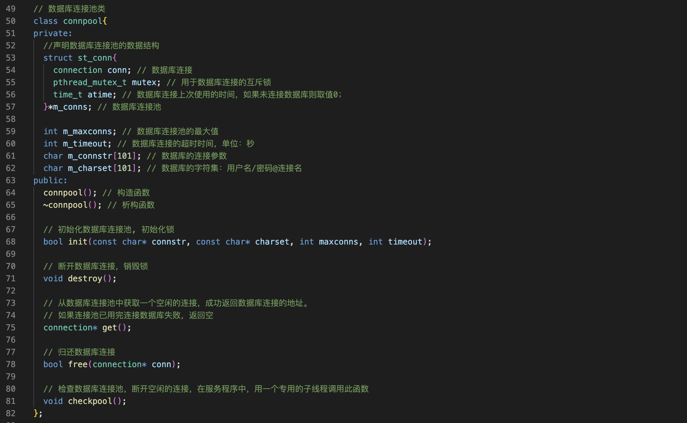

2 实现
---

### 1）构造函数、析构函数、初始化数据库连接池，初始化锁

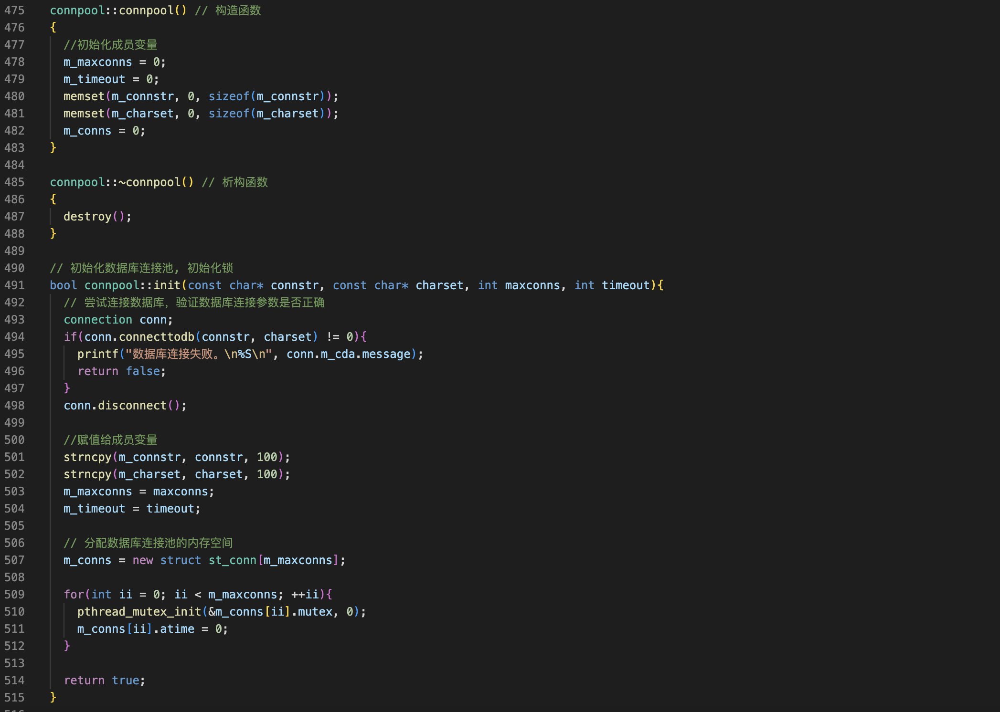

### 2）断开数据库连接，销毁锁

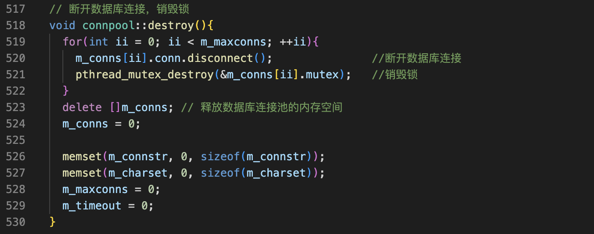

### 3）

#### 1)从数据库连接池中寻找一个空闲的、已连接好的connection，如果找到了，返回它的地址。

#### 2)如果没有找到，在连接池中找一个未连接数据库的connection，连接数据库，如果成功，返回connection的地址。

#### 3)如果第2)步找到了未连接数据库的connection，但是，连接数据库失败，返回空。

#### 4)如果第2)步没有找到未连接数据库的connection，表示数据库连接池已用完，也返回空。

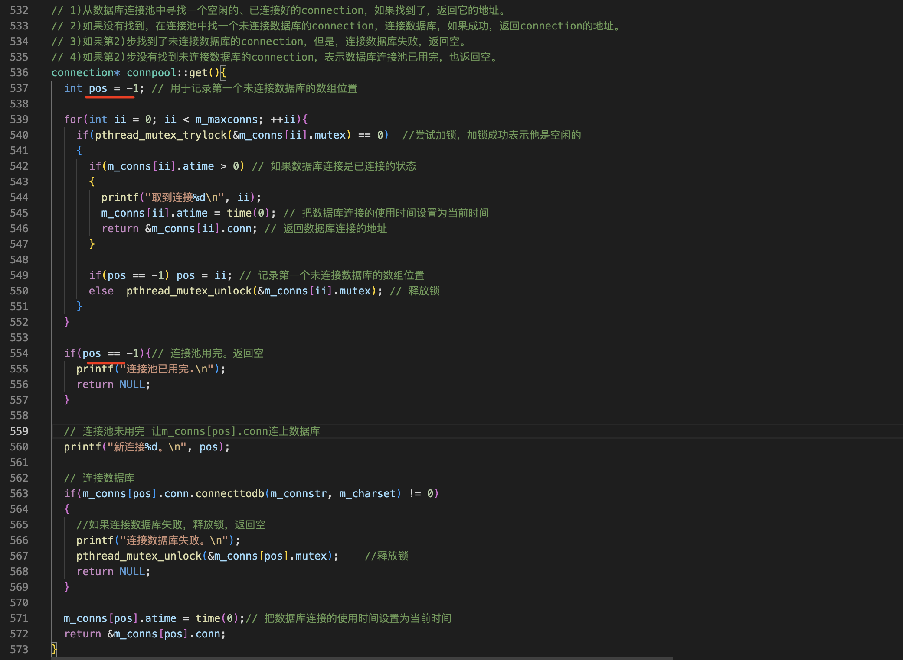

### 4）归还数据库连接。 ii不知道是++ii 还是ii++

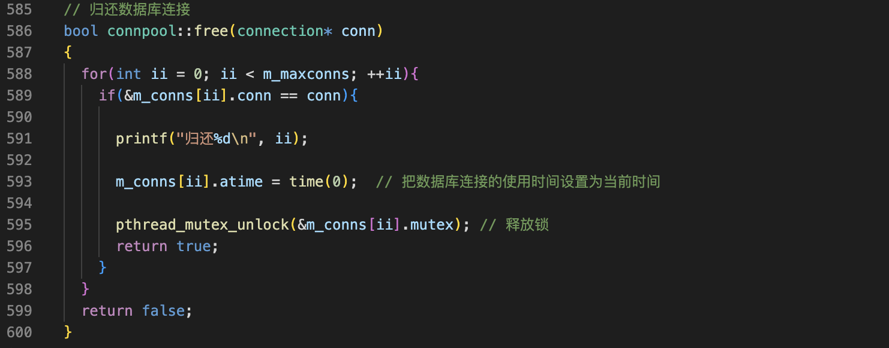

### 5）检查数据库连接池，断开空闲的连接，在服务程序中，用一个专用的子线程调用此函数。      ii不知道是++ii 还是ii++

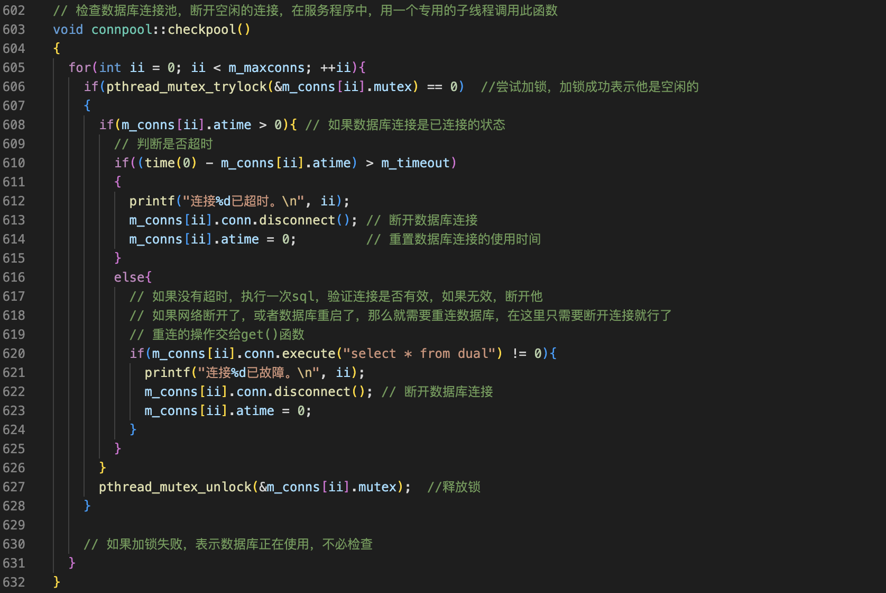

### 6）声明连接池对象


### 7）修改线程主函数代码

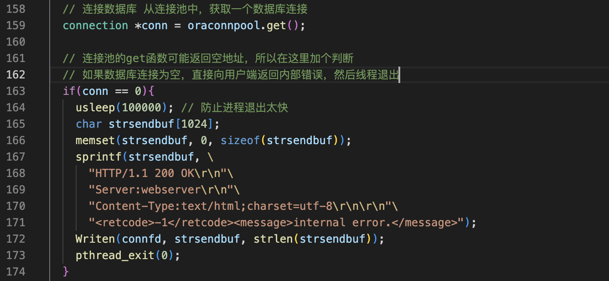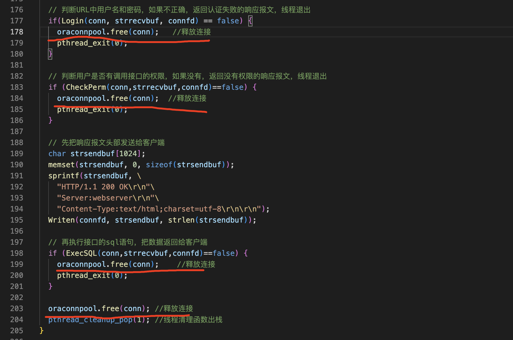

### 8）连接词的检查

在初始化连接词之后创建一个线程，专门负责连接词的检查


写检查数据库连接的函数


知识点
===

连接词的测试技巧

连接词用于多线程的服务程序，但是，我们并不需要用一个多线程的服务程序来测试它

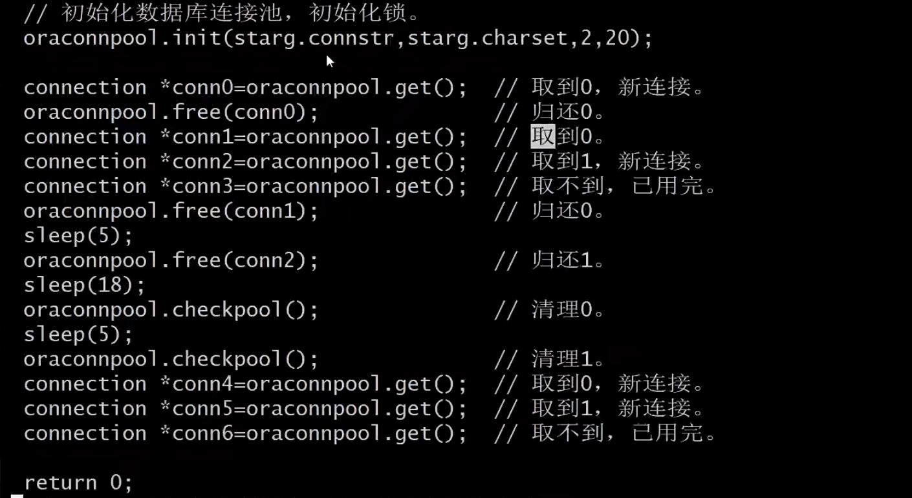段错误‼️
---

这是多线程中很容易遇到的一个坑，

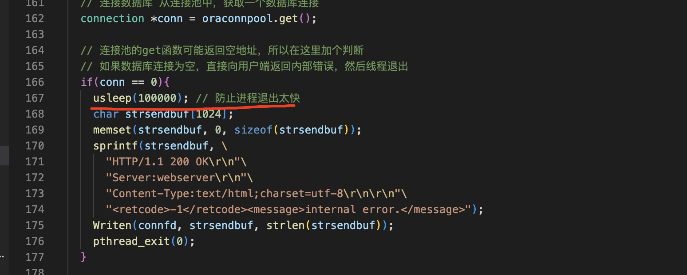

我们先来看进程主函数。在主进程中，创建线程之后。会把现成的ID放入容器中。


在线程清理函数中。线程退出的时候，调用线程清理函数，在线程清理函数中把自己的ID从容器中删除。注意特别注意，如果线程跑的太快，主进程可能还来不及把线程的ID放入容器。那么，这里就会出现找不到现成ID的情况。


在进程退出的信号处理函数中。如果线程退出的时候没有把自己从容器中删掉，那么这行代码就会出问题。因为容器中的这个线程根本已经不存在了。

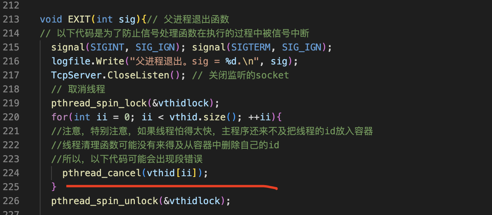那怎么解决这个问题嘞？这个事情还真的不太好办，但是在实际开发中，线程不会这么快退出的，在我们这个程序中，如果线程取数据库连接时失败。就会很快退出。在线程主函数中加上这行代码，就可以了

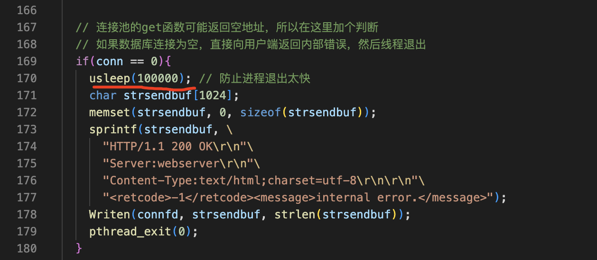


完整代码
===

```c++
/*
 * 程序名：demo20.cpp，此程序演示采用开发框架的CTcpServer类实现socket通信多线程的服务器。
 * 作者：gmc
*/
#include "_public.h"
#include "_ooci.h"

CLogFile logfile; // 服务程序的运行日志
CTcpServer TcpServer; // 创建服务端对象

void EXIT(int sig); // 父进程退出函数

vector<pthread_t> vthid; //存放全部线程id
pthread_spinlock_t vthidlock; // 用于锁定vthid的自旋锁
void* thmain(void* arg); // 线程主函数

void thecleanup(void* arg); // 线程清理函数

void* checkpool(void* arg); // 检查数据库连接池的线程函数

// 主进程参数的结构体
struct st_arg{
  char connstr[101]; // 数据库的连接参数
  char charset[51]; // 数据库的字符集
  int port; // web服务监听的端口
}starg;

// 显示程序的帮助
void _help(char* argv[]);

// 把xml解析到参数starg结构中
bool _xmltoarg(char* strxmlbuffer);

// 读取客户端的报文
int ReadT(const int sockfd, char* buffer, const int size, const int itimeout);

// 判断URL中用户名和密码，如果不正确，返回认证失败的响应报文，线程退出
bool Login(connection* conn, const char* buffer, const int sockfd);

// 从GET请求中获取参数的值：strget-GET请求报文的内容；name-参数名；value-参数值；len-参数值的长度。
bool getvalue(const char* strget, const char* name, char* value, const int len);

// 判断用户是否有调用接口的权限，如果没有，返回没有权限的响应报文。
bool CheckPerm(connection *conn,const char *buffer,const int sockfd);

// 执行接口的sql语句，把数据返回给客户端
bool ExecSQL(connection *conn,const char *buffer,const int sockfd);

// 数据库连接池类
class connpool{
private:
  //声明数据库连接池的数据结构
  struct st_conn{
    connection conn; // 数据库连接
    pthread_mutex_t mutex; // 用于数据库连接的互斥锁
    time_t atime; // 数据库连接上次使用的时间，如果未连接数据库则取值0；
  }*m_conns; // 数据库连接池

  int m_maxconns; // 数据库连接池的最大值
  int m_timeout; // 数据库连接的超时时间，单位：秒
  char m_connstr[101]; // 数据库的连接参数
  char m_charset[101]; // 数据库的字符集：用户名/密码@连接名
public:
  connpool(); // 构造函数
  ~connpool(); // 析构函数

  // 初始化数据库连接池, 初始化锁
  bool init(const char* connstr, const char* charset, int maxconns, int timeout);

  // 断开数据库连接，销毁锁
  void destroy();

  // 从数据库连接池中获取一个空闲的连接，成功返回数据库连接的地址。
  // 如果连接池已用完连接数据库失败，返回空
  connection* get();

  // 归还数据库连接
  bool free(connection* conn);

  // 检查数据库连接池，断开空闲的连接，在服务程序中，用一个专用的子线程调用此函数
  void checkpool();
};

connpool oraconnpool; // 声明连接池对象

int main(int argc,char *argv[])
{
  if (argc!=3){
    _help(argv); return -1;
  }

  CloseIOAndSignal(); signal(SIGINT, EXIT); signal(SIGTERM, EXIT);
  
  if(logfile.Open(argv[1], "a+") == false){
    printf("logfile.Open(%s) failed\n", argv[1]);
    return -1;
  }

  // 把xml解析到参数starg结构中
  if(_xmltoarg(argv[2]) == false) EXIT(-1);

  // 服务端初始化
  if(TcpServer.InitServer(starg.port) == false){
    logfile.Write("TcpServer.InitServer(%d) failed.\n", starg.port);
    EXIT(-1);
  }

  if(oraconnpool.init(starg.connstr, starg.charset, 10 ,50)  == false){// 初始化数据库连接池
    logfile.Write("oraconnpool.init() failed.\n");
    return -1;
  }
  else
  {
  //在初始化连接词之后创建一个线程，专门负责连接词的检查
    pthread_t thid;
    if(pthread_create(&thid, NULL, checkpool, 0) != 0){
      logfile.Write("pthread_create() failed.\n");
      return -1;
    }
  }

  pthread_spin_init(&vthidlock, 0);

  while(true)
  {
    // 等待客户端的连接
    if(TcpServer.Accept() == false){
      logfile.Write("TcpServer.Accept() failed.\n");
      EXIT(-1);
    }

    logfile.Write("客户端（%s）已连接。\n", TcpServer.GetIP());

    // 创建一个线程，让它与客户端通讯
    pthread_t thid;
    if(pthread_create(&thid, NULL, thmain, (void*)(long)TcpServer.m_connfd) != 0)
    {
      logfile.Write("pthread_create() failed.\n"); TcpServer.CloseListen(); continue;
    }

    pthread_spin_lock(&vthidlock);
    vthid.push_back(thid); // 把线程id保存到容器中
    pthread_spin_unlock(&vthidlock);
  }
}

void* thmain(void* arg){ // 线程主函数
  pthread_cleanup_push(thecleanup, arg); // 把线程清理函数入栈（关闭客户端的socket）
  int connfd = (int)(long)arg;
  pthread_setcanceltype(PTHREAD_CANCEL_ASYNCHRONOUS, NULL);
  pthread_detach(pthread_self());
  
  char strrecvbuf[1024]; // 接收客户端请求报文的buffer
  memset(strrecvbuf, 0, sizeof(strrecvbuf));

  // 读取客户端的报文，如果超时或者失败，线程退出
  if(ReadT(connfd, strrecvbuf, sizeof(strrecvbuf), 3) <= 0) pthread_exit(0);

  // 如果不是GET请求报文不处理，线程退出
  if(strncmp(strrecvbuf, "GET", 3) != 0) pthread_exit(0);

  logfile.Write("%s\n", strrecvbuf);

  // 连接数据库 从连接池中，获取一个数据库连接
  connection *conn = oraconnpool.get();

  // 连接池的get函数可能返回空地址，所以在这里加个判断
  // 如果数据库连接为空，直接向用户端返回内部错误，然后线程退出
  if(conn == 0){
    usleep(100000); // 防止进程退出太快
    char strsendbuf[1024];
    memset(strsendbuf, 0, sizeof(strsendbuf));
    sprintf(strsendbuf, \
      "HTTP/1.1 200 OK\r\n"\
      "Server:webserver\r\n"\
      "Content-Type:text/html;charset=utf-8\r\n\r\n"\
      "<retcode>-1</retcode><message>internal error.</message>");
    Writen(connfd, strsendbuf, strlen(strsendbuf));
    pthread_exit(0);
  }

  // 判断URL中用户名和密码，如果不正确，返回认证失败的响应报文，线程退出
  if(Login(conn, strrecvbuf, connfd) == false) {
    oraconnpool.free(conn);   //
    pthread_exit(0);
  }

  // 判断用户是否有调用接口的权限，如果没有，返回没有权限的响应报文，线程退出
  if (CheckPerm(conn,strrecvbuf,connfd)==false) {
    oraconnpool.free(conn);  //释放连接
    pthread_exit(0);
  }

  // 先把响应报文头部发送给客户端
  char strsendbuf[1024];
  memset(strsendbuf, 0, sizeof(strsendbuf));
  sprintf(strsendbuf, \
    "HTTP/1.1 200 OK\r\n"\
    "Server:webserver\r\n"\
    "Content-Type:text/html;charset=utf-8\r\n\r\n");
  Writen(connfd, strsendbuf, strlen(strsendbuf));

  // 再执行接口的sql语句，把数据返回给客户端
  if (ExecSQL(conn,strrecvbuf,connfd)==false) {
    oraconnpool.free(conn);    //释放连接
    pthread_exit(0);        
  }

  oraconnpool.free(conn); //释放连接
  pthread_cleanup_pop(1); //线程清理函数出栈
}

void EXIT(int sig){// 父进程退出函数
// 以下代码是为了防止信号处理函数在执行的过程中被信号中断
  signal(SIGINT, SIG_IGN); signal(SIGTERM, SIG_IGN);
  logfile.Write("父进程退出。sig = %d.\n", sig);
  TcpServer.CloseListen(); // 关闭监听的socket
  // 取消线程
  pthread_spin_lock(&vthidlock);
  for(int ii = 0; ii < vthid.size(); ++ii){
  //注意，特别注意，如果线程怕得太快，主程序还来不及把线程的id放入容器
  //线程清理函数可能没有来得及从容器中删除自己的id
  //所以，以下代码可能会出现段错误
    pthread_cancel(vthid[ii]);
  }
  pthread_spin_unlock(&vthidlock);

  sleep(1);
  pthread_spin_destroy(&vthidlock);
  exit(0);
}

void thecleanup(void* arg){ // 线程清理函数
  close((int)(long)arg); // 关闭客户端的socket
  // 把本线程的id从容器中删除
  //注意，特别注意，如果线程怕得太快，主程序还来不及把线程的id放入容器
  //所以这里可能会出现找不到线程id的情况
  pthread_spin_lock(&vthidlock);
  for(int ii = 0; ii < vthid.size(); ++ii)
  {
    if(pthread_equal(pthread_self(), vthid[ii])){ vthid.erase(vthid.begin() + ii);  break;}
  }
  pthread_spin_unlock(&vthidlock);

  logfile.Write("线程%lu退出。\n", pthread_self());
  // delete (int*)arg;
}

// 显示程序的帮助
void _help(char *argv[])
{
  printf("Using:/project/tools1/bin/webserver logfilename xmlbuffer\n\n");

  printf("Sample:/project/tools1/bin/procctl 10 /project/tools1/bin/webserver /log/idc/webserver.log \"<connstr>qxidc/qxidcpwd@snorcl11g_132</connstr><charset>Simplified Chinese_China.AL32UTF8</charset><port>8080</port>\"\n\n");

  printf("本程序是数据总线的服务端程序，为数据中心提供http协议的数据访问接口。\n");
  printf("logfilename 本程序运行的日志文件。\n");
  printf("xmlbuffer   本程序运行的参数，用xml表示，具体如下：\n\n");

  printf("connstr     数据库的连接参数，格式：username/password@tnsname。\n");
  printf("charset     数据库的字符集，这个参数要与数据源数据库保持一致，否则会出现中文乱码的情况。\n");
  printf("port        web服务监听的端口。\n\n");
}

// 把xml解析到参数starg结构中
bool _xmltoarg(char *strxmlbuffer)
{
  memset(&starg,0,sizeof(struct st_arg));

  GetXMLBuffer(strxmlbuffer,"connstr",starg.connstr,100);
  if (strlen(starg.connstr)==0) { logfile.Write("connstr is null.\n"); return false; }

  GetXMLBuffer(strxmlbuffer,"charset",starg.charset,50);
  if (strlen(starg.charset)==0) { logfile.Write("charset is null.\n"); return false; }

  GetXMLBuffer(strxmlbuffer,"port",&starg.port);
  if (starg.port==0) { logfile.Write("port is null.\n"); return false; }

  return true;
}

// 读取客户端的报文
int ReadT(const int sockfd, char* buffer, const int size, const int itimeout){
  if(itimeout > 0){
    struct pollfd fds;
    fds.fd = sockfd;
    fds.events = POLLIN;
    int iret;
    if((iret = poll(&fds, 1, itimeout*1000)) <= 0) return iret;
  }
  return recv(sockfd, buffer, size, 0);
}

// 判断URL中用户名和密码，如果不正确，返回认证失败的响应报文，线程退出
bool Login(connection* conn, const char* buffer, const int sockfd) {
  char username[31], passwd[31];
  getvalue(buffer, "username", username, 30); // 获取用户名；
  getvalue(buffer, "passwd", passwd, 30); // 获取密码；

  // 查询T_USERINFO表，判断用户名和密码是否存在
  sqlstatement stmt;
  stmt.connect(conn);
  stmt.prepare("select count(*) from T_USERINFO where username = :1 and passwd = :2 and rsts = 1");
  stmt.bindin(1, username, 30);
  stmt.bindin(2, passwd, 30);
  int icount = 0;
  stmt.bindout(1, &icount);
  stmt.execute();
  stmt.next();

  if(icount == 0) {// 认证失败，返回认证失败的响应报文，线程退出
    char strbuffer[256];
    memset(strbuffer, 0, sizeof(strbuffer));
    sprintf(strbuffer,\
    "HTTP/1.1 200 OK\r\n"\
               "Server: webserver_\r\n"\
               "Content-Type: text/html;charset=utf-8\r\n\r\n"\
               "<retcode>-1</retcode><message>username or passwd is invailed</message>");

    Writen(sockfd, strbuffer, strlen(strbuffer));

    return false;
  }
  return true;
}

// 从GET请求中获取参数的值：strget-GET请求报文的内容；name-参数名；value-参数值；len-参数值的长度。
bool getvalue(const char* strget, const char* name, char* value, const int len){
  value[0] = 0;
  char *start, *end;
  start = end = 0;
  start = strstr((char*)strget, (char*)name);
  if(start == 0) return false;
  end = strstr(start, "&");
  if(end == 0) end = strstr(start, " ");

  if(end == 0) return false;

  int ilen = end - start - strlen(name) - 1;
  if(ilen > len) ilen = len;
  strncpy(value, start + strlen(name) + 1, ilen);

  value[ilen] = 0;
  return true;
}

// 判断用户是否有调用接口的权限，如果没有，返回没有权限的响应报文。 
bool CheckPerm(connection *conn,const char *buffer,const int sockfd)
{
  char username[31],intername[30];

  getvalue(buffer,"username",username,30);    // 获取用户名。
  getvalue(buffer,"intername",intername,30);  // 获取接口名。

  sqlstatement stmt;
  stmt.connect(conn);
  stmt.prepare("select count(*) from T_USERANDINTER where username=:1 and intername=:2 and intername in (select intername from T_INTERCFG where rsts=1)");
  stmt.bindin(1,username,30);
  stmt.bindin(2,intername,30);
  int icount=0;
  stmt.bindout(1,&icount);
  stmt.execute();
  stmt.next();

  if (icount!=1)
  {
    char strbuffer[256];
    memset(strbuffer,0,sizeof(strbuffer));

    sprintf(strbuffer,\
           "HTTP/1.1 200 OK\r\n"\
           "Server: webserver\r\n"\
           "Content-Type: text/html;charset=utf-8\r\n\n\n"\
           "<retcode>-1</retcode><message>permission denied</message>");

    Writen(sockfd,strbuffer,strlen(strbuffer));

    return false;
  }

  return true;
}

// 执行接口的sql语句，把数据返回给客户端
bool ExecSQL(connection *conn,const char *buffer,const int sockfd){
  // 从请求报文中解析接口名
  char intername[30];
  memset(intername, 0, sizeof(intername));
  getvalue(buffer, "intername", intername, 30);

  // 从接口参数配置表T_INTERCFG中加载接口参数
  char selectsql[1001], colstr[301], bindin[301];
  memset(selectsql, 0, sizeof(selectsql));
  memset(colstr, 0, sizeof(colstr));
  memset(bindin, 0, sizeof(bindin));
  sqlstatement stmt;
  stmt.connect(conn);
  stmt.prepare("select selectsql, colstr, bindin from T_INTERCFG where intername = :1");
  stmt.bindin(1, intername, 30);
  stmt.bindout(1, selectsql, 1000);
  stmt.bindout(2, colstr, 300);
  stmt.bindout(3, bindin, 300);
  stmt.execute();
  stmt.next();

  // 准备查询数据的SQL语句
  stmt.prepare(selectsql);  

  // 绑定查询数据的SQL语句的输入变量
  // 拆分输入参数bindin
  CCmdStr CmdStr;
  CmdStr.SplitToCmd(bindin, ",");

  // 声明用于存放输入参数的数组
  char invalue[CmdStr.CmdCount()][101];
  memset(invalue, 0, sizeof(invalue));

  // 从http的GET请求报文中解析出输入参数，绑定到sql中
  for(int ii = 0; ii < CmdStr.CmdCount(); ++ii){
    getvalue(buffer, CmdStr.m_vCmdStr[ii].c_str(), invalue[ii], 100);
    stmt.bindin(ii + 1, invalue[ii], 100);
  }

  // 根据接口配置中的参数列表（bindin字段），从URL中解析参数的值，bindin到查询数据的SQL语句中
  // 拆分colstr，可以得到结果集的字段数
  CmdStr.SplitToCmd(colstr, ",");

  // 用于存放结果集的数组
  char colvalue[CmdStr.CmdCount()][2001];
  
  // 把结果集绑定到colvalue数组
  for(int ii = 0; ii < CmdStr.CmdCount(); ++ii){
    stmt.bindout(ii + 1, colvalue[ii], 2000);
  }

  // 执行SQL语句
  char strsendbuf[4001]; // 发送给客户的xml
  memset(strsendbuf, 0, sizeof(strsendbuf));

  if(stmt.execute() != 0){
    sprintf(strsendbuf, "<retcode>%d</retcode><message>%s</message>\n", stmt.m_cda.rc, stmt.m_cda.message);
    Writen(sockfd, strsendbuf, strlen(strsendbuf));
    logfile.Write("stmt.execute() failed.\n%s\n%s\n", stmt.m_sql, stmt.m_cda.message);
    return false;
  }
  strcpy(strsendbuf, "<retcode>0</retcode><message>ok</message>\n");
  Writen(sockfd, strsendbuf, strlen(strsendbuf));

  // 向客户端发送xml内容的头部标签<data>
  Writen(sockfd, "<data>\n", strlen("<data>\n"));

  // 获取结果集，获取每一条记录，拼接xml报文，发送给客户端
  
  char strtemp[2001]; // 用于拼接xml的临时变量

  // 逐行获取结果集，发送给客户端
  while(true){
    memset(strsendbuf, 0, sizeof(strsendbuf));
    memset(colvalue, 0, sizeof(colvalue));

    if(stmt.next() != 0) break; // 从结果集中取出一条记录

    for(int ii = 0; ii < CmdStr.CmdCount(); ++ii){
      memset(strtemp, 0, sizeof(strtemp));
      snprintf(strtemp, 2000, "<%s>%s</%s>", CmdStr.m_vCmdStr[ii].c_str(), colvalue[ii], CmdStr.m_vCmdStr[ii].c_str());
      strcat(strsendbuf, strtemp);
    }
    strcat(strsendbuf, "<endl/>\n"); // xml每行结束标志

    Writen(sockfd, strsendbuf, strlen(strsendbuf)); // 向客户端返回这行数据
  }

  // 向客户端发送xml内容的尾部标签</data>
  Writen(sockfd, "</data>\n", strlen("</data>\n"));

  logfile.Write("intername = %s, count = %d\n", intername, stmt.m_cda.rpc);

  // 写接口调用日志表T_USERLOG

  return true;
}

//////////////////////////////////////////////////////////////////////////////////////////////////

connpool::connpool() // 构造函数
{
  //初始化成员变量
  m_maxconns = 0;
  m_timeout = 0;
  memset(m_connstr, 0, sizeof(m_connstr));
  memset(m_charset, 0, sizeof(m_charset));
  m_conns = 0;
}

connpool::~connpool() // 析构函数
{
  destroy();
}

// 初始化数据库连接池, 初始化锁
bool connpool::init(const char* connstr, const char* charset, int maxconns, int timeout){
  // 尝试连接数据库，验证数据库连接参数是否正确
  connection conn;
  if(conn.connecttodb(connstr, charset) != 0){
    printf("数据库连接失败。\n%S\n", conn.m_cda.message);
    return false;
  }
  conn.disconnect();

  //赋值给成员变量
  strncpy(m_connstr, connstr, 100);
  strncpy(m_charset, charset, 100);
  m_maxconns = maxconns;
  m_timeout = timeout;

  // 分配数据库连接池的内存空间
  m_conns = new struct st_conn[m_maxconns];

  for(int ii = 0; ii < m_maxconns; ++ii){
    pthread_mutex_init(&m_conns[ii].mutex, 0);
    m_conns[ii].atime = 0;
  }

  return true;
}

// 断开数据库连接，销毁锁
void connpool::destroy(){
  for(int ii = 0; ii < m_maxconns; ++ii){
    m_conns[ii].conn.disconnect();               //断开数据库连接
    pthread_mutex_destroy(&m_conns[ii].mutex);   //销毁锁
  }
  delete []m_conns; // 释放数据库连接池的内存空间
  m_conns = 0;

  memset(m_connstr, 0, sizeof(m_connstr));
  memset(m_charset, 0, sizeof(m_charset));
  m_maxconns = 0;
  m_timeout = 0;
}

// 1)从数据库连接池中寻找一个空闲的、已连接好的connection，如果找到了，返回它的地址。
// 2)如果没有找到，在连接池中找一个未连接数据库的connection，连接数据库，如果成功，返回connection的地址。
// 3)如果第2)步找到了未连接数据库的connection，但是，连接数据库失败，返回空。
// 4)如果第2)步没有找到未连接数据库的connection，表示数据库连接池已用完，也返回空。
connection* connpool::get(){
  int pos = -1; // 用于记录第一个未连接数据库的数组位置

  for(int ii = 0; ii < m_maxconns; ++ii){
    if(pthread_mutex_trylock(&m_conns[ii].mutex) == 0)  //尝试加锁，加锁成功表示他是空闲的
    {
      if(m_conns[ii].atime > 0) // 如果数据库连接是已连接的状态
      {
        printf("取到连接%d\n", ii);
        m_conns[ii].atime = time(0); // 把数据库连接的使用时间设置为当前时间
        return &m_conns[ii].conn; // 返回数据库连接的地址
      }

      if(pos == -1) pos = ii; // 记录第一个未连接数据库的数组位置
      else  pthread_mutex_unlock(&m_conns[ii].mutex); // 释放锁
    }
  }

  if(pos == -1){// 连接池用完。返回空
    printf("连接池已用完.\n");
    return NULL;
  }

  // 连接池未用完 让m_conns[pos].conn连上数据库
  printf("新连接%d。\n", pos);

  // 连接数据库
  if(m_conns[pos].conn.connecttodb(m_connstr, m_charset) != 0)
  {
    //如果连接数据库失败，释放锁，返回空
    printf("连接数据库失败。\n");
    pthread_mutex_unlock(&m_conns[pos].mutex);    //释放锁
    return NULL;
  }

  m_conns[pos].atime = time(0);// 把数据库连接的使用时间设置为当前时间
  return &m_conns[pos].conn;
}

// 归还数据库连接
bool connpool::free(connection* conn)
{
  for(int ii = 0; ii < m_maxconns; ++ii){
    if(&m_conns[ii].conn == conn){

      printf("归还%d\n", ii);

      m_conns[ii].atime = time(0);  // 把数据库连接的使用时间设置为当前时间

      pthread_mutex_unlock(&m_conns[ii].mutex); // 释放锁
      return true;
    }
  }
  return false;
}

// 检查数据库连接池，断开空闲的连接，在服务程序中，用一个专用的子线程调用此函数
void connpool::checkpool()
{
  for(int ii = 0; ii < m_maxconns; ++ii){
    if(pthread_mutex_trylock(&m_conns[ii].mutex) == 0)  //尝试加锁，加锁成功表示他是空闲的
    {
      if(m_conns[ii].atime > 0){ // 如果数据库连接是已连接的状态
        // 判断是否超时
        if((time(0) - m_conns[ii].atime) > m_timeout)
        {
          printf("连接%d已超时。\n", ii);
          m_conns[ii].conn.disconnect(); // 断开数据库连接
          m_conns[ii].atime = 0;         // 重置数据库连接的使用时间
        }
        else{ 
          // 如果没有超时，执行一次sql，验证连接是否有效，如果无效，断开他
          // 如果网络断开了，或者数据库重启了，那么就需要重连数据库，在这里只需要断开连接就行了
          // 重连的操作交给get()函数
          if(m_conns[ii].conn.execute("select * from dual") != 0){
            printf("连接%d已故障。\n", ii);
            m_conns[ii].conn.disconnect(); // 断开数据库连接
            m_conns[ii].atime = 0;
          }
        }
      }
      pthread_mutex_unlock(&m_conns[ii].mutex);  //释放锁
    }

    // 如果加锁失败，表示数据库正在使用，不必检查
  }
}

void* checkpool(void* arg) // 检查数据库连接池的线程函数
{
  while(true){
    oraconnpool.checkpool();
    sleep(30);
  }
}
```

