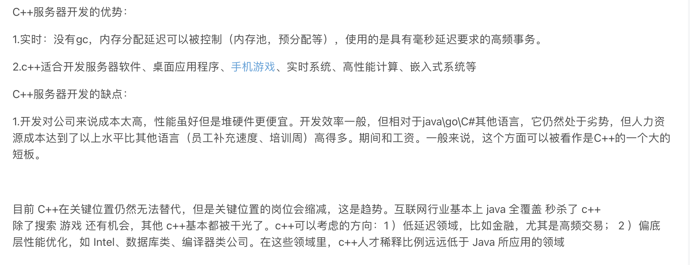
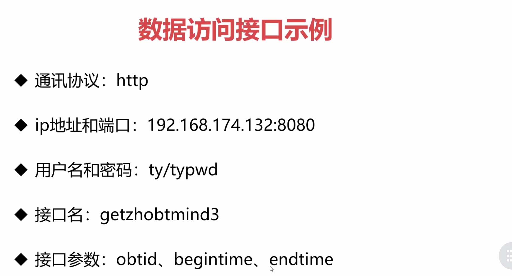
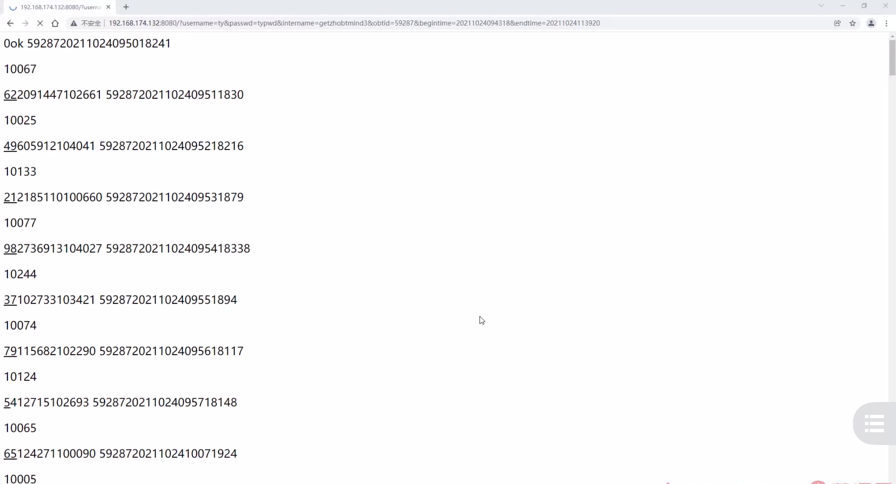
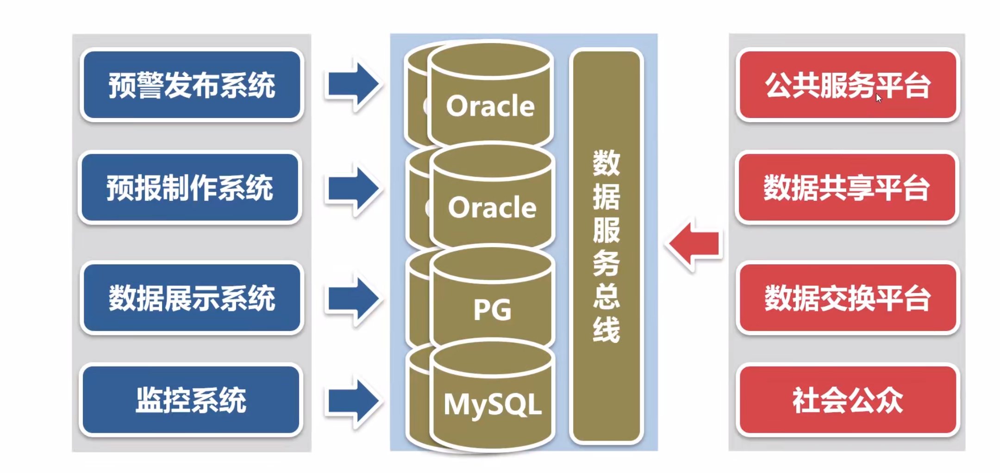

业务需求
===

- 数据中心的目标是为业务系统提供数据支撑环境
- 业务系统直连数据中心的应用数据库，任意访问数据

这种方式的优势是业务系统的主动权很大，想查什么数据就查什么数据，就像我们后台服务程序和数据库客户端软件一样连上数据库之后只要有权限，就能进行很多操作

- 业务系统通过数据服务总线，访问数据中心的数据，采用HTTP协议获取数据

数据服务总线它的本质是**数据访问接口**，这种方式对业务系统的限制很大，业务系统必须按数据服务总线规定的方法访问数据

对客户端来说，用这种方法获取数据非常简单，写代码也很容易，数据访问接口使用起来很简单，但是对客户端来说是有限制的，访问数据的种类和条件是服务端规定好的，不能想拿什么数据就拿什么数据，没有SQL语句那么灵活

业务需要这个限制，因为在实际应用中，使用数据的业务系统有两种，一种是重要的内部使用的业务系统，左边这些系统直接连数据中心的数据库，需要什么数据就拿出来，还有一种不重要的对外的系统，右边

实现方案
===

- Java、php、.net等语言都可以做web服务端，但性能一般
- 用c/c++实现的web服务端性能卓越
- ngix

这个章节我们用c语言写一个web服务端

学习任务
===

- 熟悉http协议(通讯方式和报文格式)
- 设计数据服务总线的功能和表结构
- 实现数据服务总线的功能