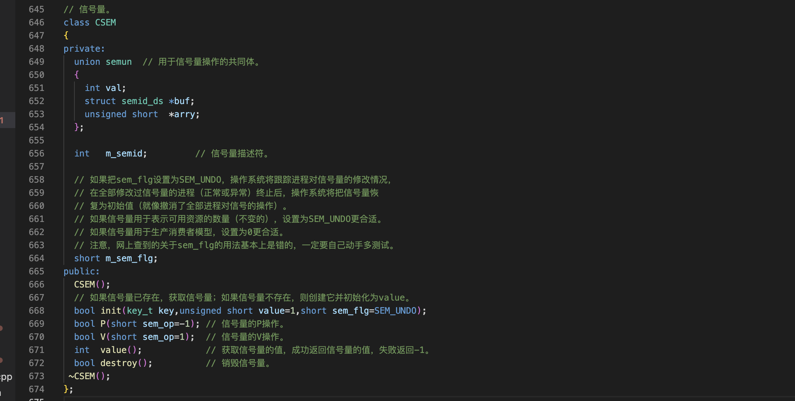
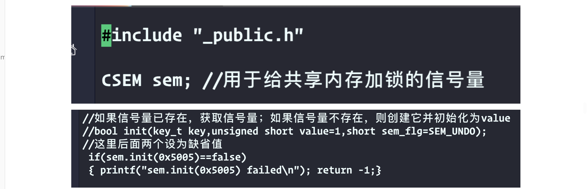
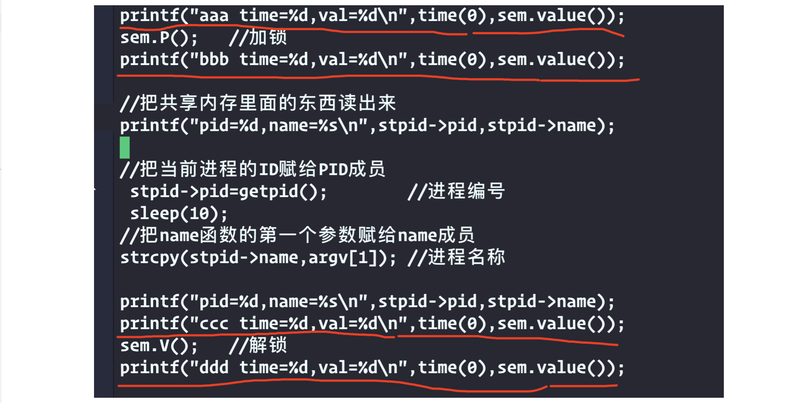
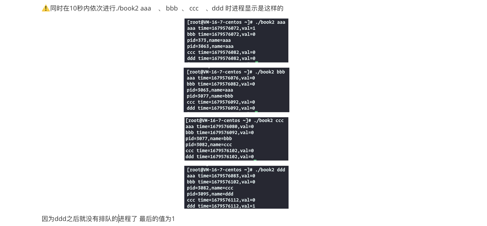

上一节介绍了共享内存，实现了多个进程对同一块内存进行读写操作的功能，但是缺点是如果一个进程正在往共享内存中写数据，在写入没有完成之前，其他的进程是不应该读取这些数据的，共享内存没有提供锁机制，这里用信号量给共享内存加锁

信号量的重点是解决生产消费者问题、吸烟者问题和哲学家进餐问题

2）Linux信号量
===

用信号量给共享内存加锁

- 信号量本质上是一个非负数的计数器
- 给共享资源建立一个标志，表示该共享资源被占用情况
- p操作(申请资源-1)，v操作(释放资源+1)
- 二值信号量是信号量的一种特殊形式，表示资源只有可用和不可用两种状态  0-不可用；1-可用    它的功能与互斥锁相同，只有开和关两种状态

在_public.h中已经封装了




实现过程
===





结果
---


解释：第一行没加锁 val为1 第二行加锁之后val为0   第三行锁还在持有中val为0   第四行已经解锁了 val为1

同时启动几个试试看
===



第一个窗口启动book aaa第二个book bbb第三个book ccc第四个book ddd。按照顺序，从一到四先启动第一个，再启动第二个，然后第三个。第四个等他们运行完aaa，它是72秒启动的。信号量的值是一，他做了一个p操作，信号量的值变成了零，到82秒的时候。他还是持有锁的，信号量的值还是零。接下来，他做了一个v操作，v操作把信号量的值加1，同时唤醒正在等待中的第一个进程，就是bbb进程bbb进程在唤醒的同时，把信号量的值减一。注意这里，这里用的是同时，而不是一步在某一步之后，为什么呢？因为这几步操作是原子操作，进程aaa它的v操作、进程bbb的唤醒、以及把信号的值减一，他们是原子操作，所以一通原子操作之后。信号量的值又成了零，虽然ddd time=紧跟着v操作，但是aaa窗口的ddd显示val还是为0，进程aaa在72秒持有锁，82秒释放锁，进程b在82秒持有所。92秒释放锁，ccc在92秒持有锁，102秒释放锁，进程ddd在102秒持有锁，112秒释放锁，ddd释放锁之后已经没有排队中的进程了。ddd最后一条显示的信号量的值是一，它跟aaa不太一样。跟其他几个都不一样，

用二值信号量给共享内存加锁的实现方法比较简单。等待并加锁词语锁解锁在这个课程的项目中，也只用到了二次信号量。

但是学过操作系统的人都知道。信号量的重点是解决生产消费者问题，吸烟者问题，还有哲学家进餐的问题。非常重要，所以接下来是信号量的更多的细节


更多细节
===

从信号量的初始化开始
---

需要注意：

信号量的初始化不能直接用semget(key,1,0666|IPC_CREAT),因为信号量创建后，初始值是0  0表示没有可用资源(只用这行代码，然后再设置信号量的初始值，这样的话如果其他的进程正在加锁中，这样不就把锁解开了)

semget函数，用于获取或者创建信号量

```
int semget(key_t key, int nsems, int semflg);  第一个是key，第二个参数是信号量的个数
```

