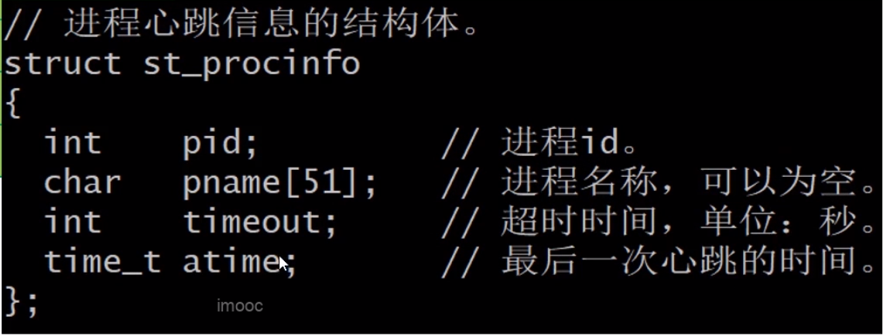

book3.cpp

守护进程
===

- 服务程序由调度程序启动(procctl)
- 如果服务程序死机(挂起)，守护进程将终止它
- 服务程序被终止后，调度程序(procctl)将重新启动它

这样就可以保证系统稳定运行，守护进程是如何判断服务程序死机呢？我们采用心跳机制

心跳机制
===

- 服务程序在共享内存中维护自己的心跳信息
- 开发守护程序，检查共享内存，终止已经死机的服务程序

具体设计：创建一块共享内存用于存放服务程序心跳信息的结构体数组，心跳信息的结构体包括四个成员，进程id、进程的名称、超时时间、最后一次心跳的时间，每个服务程序启动的时候会查找共享内存，在数组中找一个空白的位置，把自己的心跳信息写进去，并且在程序运行的过程中还会不断的把自己的心跳信息更新到数组中表示自己是“活着的”，守护进程每隔若干秒遍历一次共享内存，检查每个服务程序的心跳信息，如果当前时间减最后一次心跳的时间大于超时时间，表示服务程序死掉，就发送信号终止它，之后调度程序将重新启动

