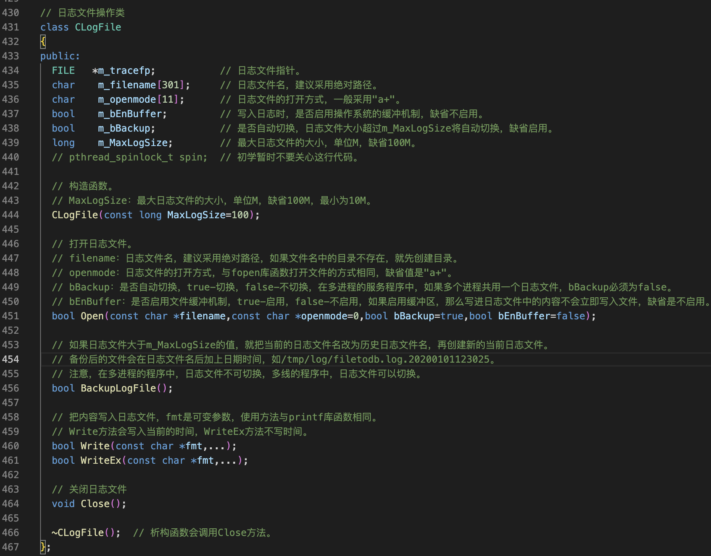

project/idc1/c

1）搭建程序框架(运行的参数、说明文档、运行日志)
===


\# mysql头文件存放路径.        \# 开发框架cpp文件名，这里直接包含进来，没有采用链接库，是为了方便调试。


日志文件操作
---



```c++
/*  project/idc1/c
 *  程序名：crtsurfdata1.cpp  本程序用于生成全国气象站点观测的分钟数据。
 *  作者：gmc。
*/

#include "_public.h"

CLogFile logfile;    // 日志类。

int main(int argc,char *argv[])
{
  if (argc!=4) 
  {
    // 如果参数非法，给出帮助文档。
    printf("Using:./crtsurfdata1 inifile outpath logfile\n");
    printf("Example:/project/idc1/bin/crtsurfdata1 /project/idc1/ini/stcode.ini /tmp/surfdata /log/idc/crtsurfdata1.log\n\n");

    printf("inifile 全国气象站点参数文件名。\n");
    printf("outpath 全国气象站点数据文件存放的目录。\n");
    printf("logfile 本程序运行的日志文件名。\n\n");

    return -1;
  }

  // 打开程序的日志文件。
  if (logfile.Open(argv[3],"a+",false)==false)
  {
    printf("logfile.Open(%s) failed.\n",argv[3]); return -1;
  }

  logfile.Write("crtsurfdata1 开始运行。\n");

  // 在这里插入处理业务的代码。

  logfile.WriteEx("crtsurfdata1 运行结束。\n");

  return 0;
}

```

