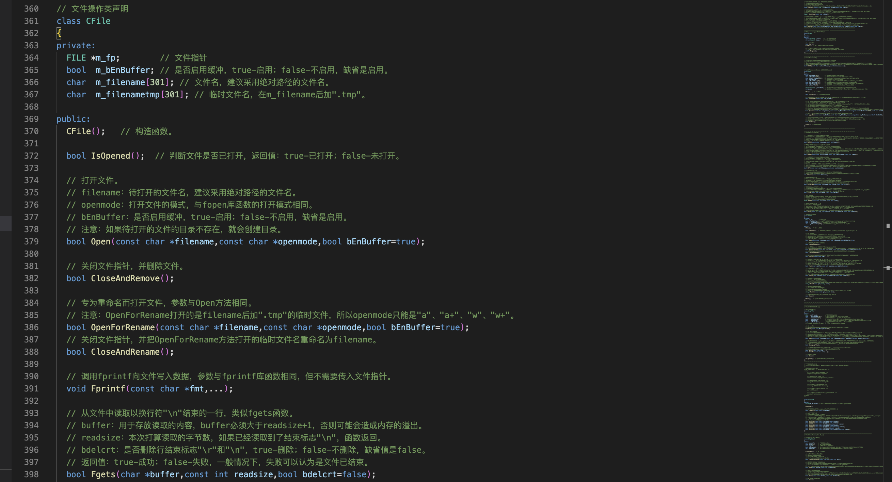
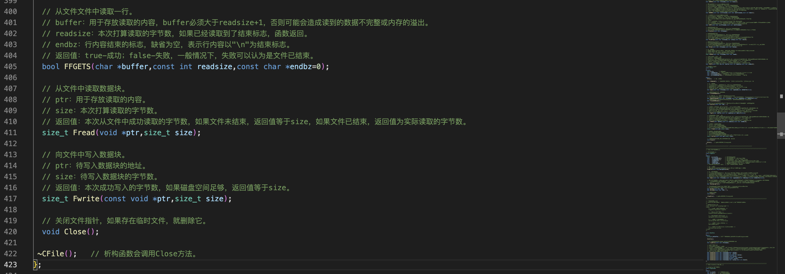
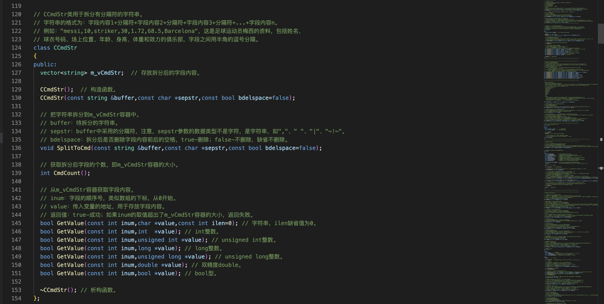

2）把全国气象站点参数文件加载到站点参数的容器中
===

project/idc1/c

本节是用于生成全国气象站点观测的分钟数据。
===

文件操作类
===

对文件的操作进行了一些封装,c语言的文件操作需要一个文件指针，它的本质是动态分配出来的内存空间，用完之后需要释放，Fget不需要初始化，在Fget里面会初始化





拆分字符串
===



过程
===


这个函数的实现

```c++
// 把站点参数文件中加载到vstcode容器中。 
bool LoadSTCode(const char *inifile)
{
  CFile File;

  // 打开站点参数文件。
  if (File.Open(inifile,"r")==false)
  {
    logfile.Write("File.Open(%s) failed.\n",inifile); return false;
  }
  char strBuffer[301];
  CCmdStr CmdStr;
  struct st_stcode stcode;

  while (true)
  {
    // 从站点参数文件中读取一行，如果已读取完，跳出循环。
    if (File.Fgets(strBuffer,300,true)==false) break;

    // 把读取到的一行拆分。
    CmdStr.SplitToCmd(strBuffer,",",true);

    if (CmdStr.CmdCount()!=6) continue;     // 扔掉无效的行。

    // 把站点参数的每个数据项保存到站点参数结构体中。
    memset(&stcode,0,sizeof(struct st_stcode));
    CmdStr.GetValue(0, stcode.provname,30); // 省
    CmdStr.GetValue(1, stcode.obtid,10);    // 站号
    CmdStr.GetValue(2, stcode.obtname,30);  // 站名
    CmdStr.GetValue(3,&stcode.lat);         // 纬度
    CmdStr.GetValue(4,&stcode.lon);         // 经度
    CmdStr.GetValue(5,&stcode.height);      // 海拔高度

    // 把站点参数结构体放入站点参数容器。
    vstcode.push_back(stcode);
  }
  /*
  for (int ii=0;ii<vstcode.size();ii++)
    logfile.Write("provname=%s,obtid=%s,obtname=%s,lat=%.2f,lon=%.2f,height=%.2f\n",\
                   vstcode[ii].provname,vstcode[ii].obtid,vstcode[ii].obtname,vstcode[ii].lat,\
                   vstcode[ii].lon,vstcode[ii].height);
  */
  return true;
}
```

完整代码
===

```c++
/*
 *  程序名：crtsurfdata2.cpp  本程序用于生成全国气象站点观测的分钟数据。
 *  作者：gmc
*/

#include "_public.h"

// 全国气象站点参数结构体。
struct st_stcode
{
  char provname[31]; // 省
  char obtid[11];    // 站号
  char obtname[31];  // 站名
  double lat;        // 纬度
  double lon;        // 经度
  double height;     // 海拔高度
};

// 存放全国气象站点参数的容器。
vector<struct st_stcode> vstcode;

// 把站点参数文件中加载到vstcode容器中。
bool LoadSTCode(const char *inifile);

CLogFile logfile;    // 日志类。

int main(int argc,char *argv[])
{
  if (argc!=4) 
  {
    // 如果参数非法，给出帮助文档。
    printf("Using:./crtsurfdata2 inifile outpath logfile\n");
    printf("Example:/project/idc1/bin/crtsurfdata2 /project/idc1/ini/stcode.ini /tmp/surfdata /log/idc/crtsurfdata2.log\n\n");

    printf("inifile 全国气象站点参数文件名。\n");
    printf("outpath 全国气象站点数据文件存放的目录。\n");
    printf("logfile 本程序运行的日志文件名。\n\n");

    return -1;
  }

  // 打开程序的日志文件。
  if (logfile.Open(argv[3],"a+",false)==false)
  {
    printf("logfile.Open(%s) failed.\n",argv[3]); return -1;
  }

  logfile.Write("crtsurfdata2 开始运行。\n");

  // 把站点参数文件中加载到vstcode容器中。 
  if (LoadSTCode(argv[1])==false) return -1;


  logfile.WriteEx("crtsurfdata2 运行结束。\n");

  return 0;
}

// 把站点参数文件中加载到vstcode容器中。 
bool LoadSTCode(const char *inifile)
{
  CFile File;

  // 打开站点参数文件。
  if (File.Open(inifile,"r")==false)
  {
    logfile.Write("File.Open(%s) failed.\n",inifile); return false;
  }

  char strBuffer[301];

  CCmdStr CmdStr;

  struct st_stcode stcode;

  while (true)
  {
    // 从站点参数文件中读取一行，如果已读取完，跳出循环。
    if (File.Fgets(strBuffer,300,true)==false) break;
    
    // 把读取到的一行拆分。
    CmdStr.SplitToCmd(strBuffer,",",true);

    if (CmdStr.CmdCount()!=6) continue;     // 扔掉无效的行。

    // 把站点参数的每个数据项保存到站点参数结构体中。
    memset(&stcode,0,sizeof(struct st_stcode));
    CmdStr.GetValue(0, stcode.provname,30); // 省
    CmdStr.GetValue(1, stcode.obtid,10);    // 站号
    CmdStr.GetValue(2, stcode.obtname,30);  // 站名
    CmdStr.GetValue(3,&stcode.lat);         // 纬度
    CmdStr.GetValue(4,&stcode.lon);         // 经度
    CmdStr.GetValue(5,&stcode.height);      // 海拔高度

    // 把站点参数结构体放入站点参数容器。
    vstcode.push_back(stcode);
  }

  /*
  for (int ii=0;ii<vstcode.size();ii++)
    logfile.Write("provname=%s,obtid=%s,obtname=%s,lat=%.2f,lon=%.2f,height=%.2f\n",\
                   vstcode[ii].provname,vstcode[ii].obtid,vstcode[ii].obtname,vstcode[ii].lat,\
                   vstcode[ii].lon,vstcode[ii].height);
  */

  return true;
}
```

