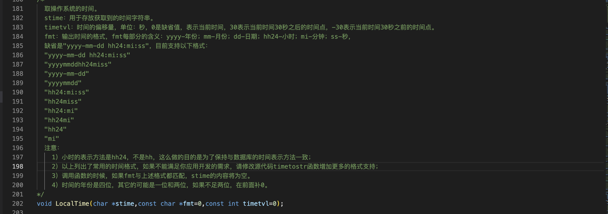
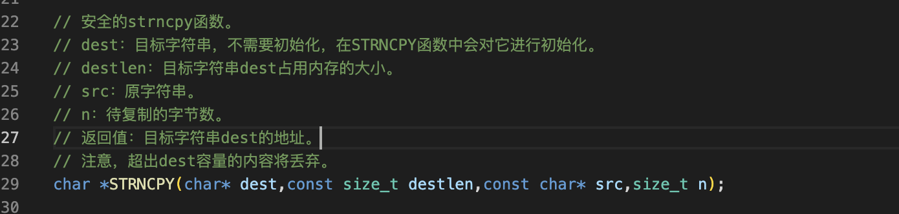
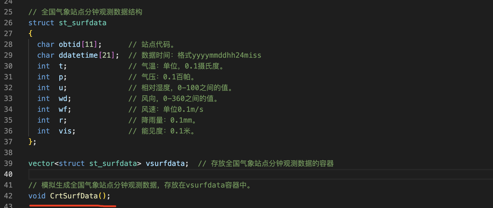

project/idc1/c

3）遍历站点参数容器，生成每个站点的观测数据，存放在站点容器中
===

取操作系统的时间
---



strncpy函数
---

拷贝src字符串的前n个字符至dest

说明：1、当src字符串长度小于n时，则拷贝完字符串后，剩余部分将用空字节填充，直到n个strncpy不会向dest追加’\0’。
		    2、src和dest所指的内存区域不能重叠，且dest必须有足够的空间放置n个字符



过程
===

这种函数他根据一个容器再加上随机数生成另一个容器，这种函数的运行不会失败所以不需要返回值



实现代码
===


```c++
// 模拟生成全国气象站点分钟观测数据，存放在vsurfdata容器中。
void CrtSurfData()
{
  // 播随机数种子。
  srand(time(0));

  // 获取当前时间，当作观测时间。
  char strddatetime[21];
  memset(strddatetime,0,sizeof(strddatetime));
  LocalTime(strddatetime,"yyyymmddhh24miss");

  struct st_surfdata stsurfdata;

  // 遍历气象站点参数的vstcode容器。
  for (int ii=0;ii<vstcode.size();ii++)
  {
    memset(&stsurfdata,0,sizeof(struct st_surfdata));

    // 用随机数填充分钟观测数据的结构体。
    strncpy(stsurfdata.obtid,vstcode[ii].obtid,10); // 站点代码。
    strncpy(stsurfdata.ddatetime,strddatetime,14);  // 数据时间：格式yyyymmddhh24miss
    stsurfdata.t=rand()%351;       // 气温：单位，0.1摄氏度
    stsurfdata.p=rand()%265+10000; // 气压：0.1百帕
    stsurfdata.u=rand()%100+1;     // 相对湿度，0-100之间的值。
    stsurfdata.wd=rand()%360;      // 风向，0-360之间的值。
    stsurfdata.wf=rand()%150;      // 风速：单位0.1m/s
    stsurfdata.r=rand()%16;        // 降雨量：0.1mm
    stsurfdata.vis=rand()%5001+100000;  // 能见度：0.1米

    // 把观测数据的结构体放入vsurfdata容器。
    vsurfdata.push_back(stsurfdata);
  }
```

