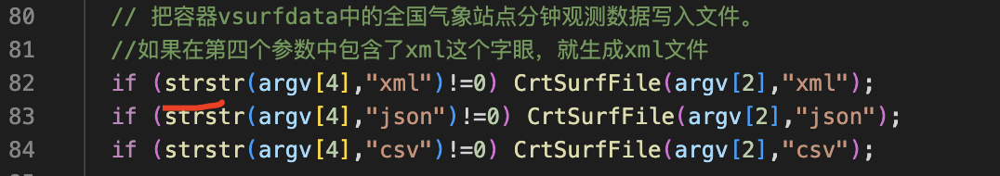
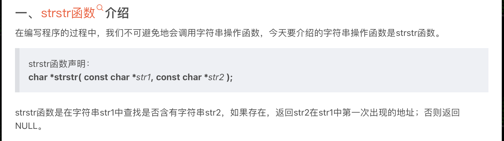
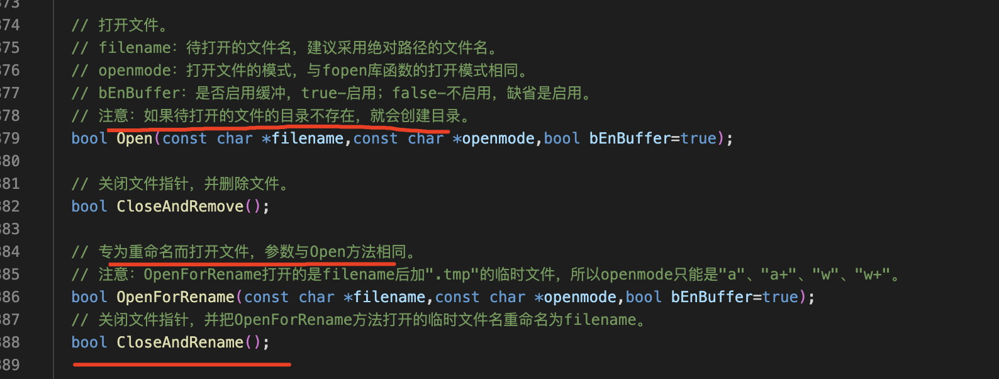
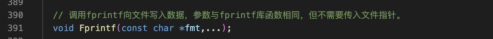
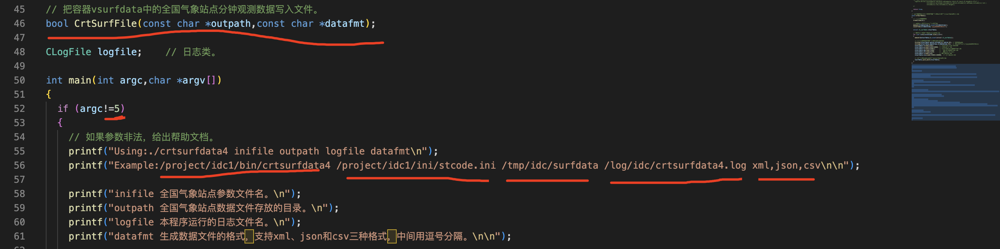
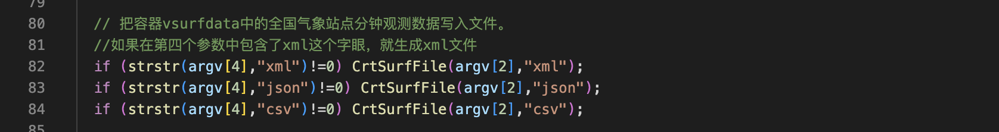
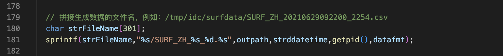

project/idc1/c

4）把站点观测数据容器中的记录写入文件
===

strstr函数
---





专为重命名打开文件
---

通过下面函数解决如何把数据写入文件，初学者的方法是第一步创作文件，往文件写入数据，关闭文件，如果在写入数据时，其他的程序读取了这个文件，就会读到不完整的内容的问题



向文件写入数据
---




过程
===



在主函数中
---





实现代码
===

```c++

// 把容器vsurfdata中的全国气象站点分钟观测数据写入文件。
bool CrtSurfFile(const char *outpath,const char *datafmt)
{
  CFile File;

  // 拼接生成数据的文件名，例如：/tmp/idc/surfdata/SURF_ZH_20210629092200_2254.csv
  char strFileName[301];
  sprintf(strFileName,"%s/SURF_ZH_%s_%d.%s",outpath,strddatetime,getpid(),datafmt);

  // 打开文件。
  if (File.OpenForRename(strFileName,"w")==false)
  {
    logfile.Write("File.OpenForRename(%s) failed.\n",strFileName); return false;
  }

  // 写入第一行标题。
  if (strcmp(datafmt,"csv")==0) File.Fprintf("站点代码,数据时间,气温,气压,相对湿度,风向,风速,降雨量,能见度\n");

  // 遍历存放观测数据的vsurfdata容器。
  for (int ii=0;ii<vsurfdata.size();ii++)
  {
    // 写入一条记录。
    if (strcmp(datafmt,"csv")==0)
      File.Fprintf("%s,%s,%.1f,%.1f,%d,%d,%.1f,%.1f,%.1f\n",\
         vsurfdata[ii].obtid,vsurfdata[ii].ddatetime,vsurfdata[ii].t/10.0,vsurfdata[ii].p/10.0,\
         vsurfdata[ii].u,vsurfdata[ii].wd,vsurfdata[ii].wf/10.0,vsurfdata[ii].r/10.0,vsurfdata[ii].vis/10.0);
  }

  // 关闭文件。
  File.CloseAndRename();

  logfile.Write("生成数据文件%s成功，数据时间%s，记录数%d。\n",strFileName,strddatetime,vsurfdata.size());

  return true;
}
```

知识点
===

提前创建目录的方法很容易失误

如何把数据写入文件，初学者的方法是第一步创作文件，往文件写入数据，关闭文件，如果在写入数据时，其他的程序读取了这个文件，就会读到不完整的内容

正确的文件写入方法 1）创建临时文件    2）往临时文件中写入数据     3）关闭临时文件   4）把临时文件改名为正式的文件
