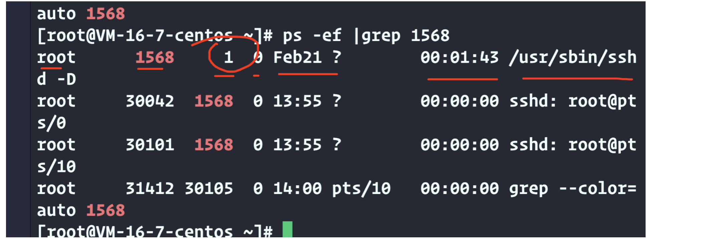
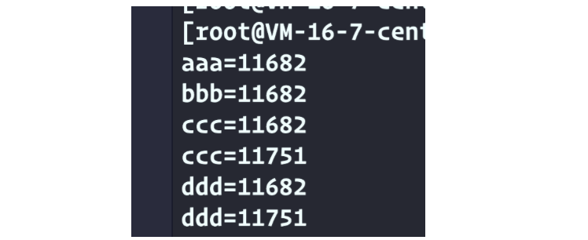
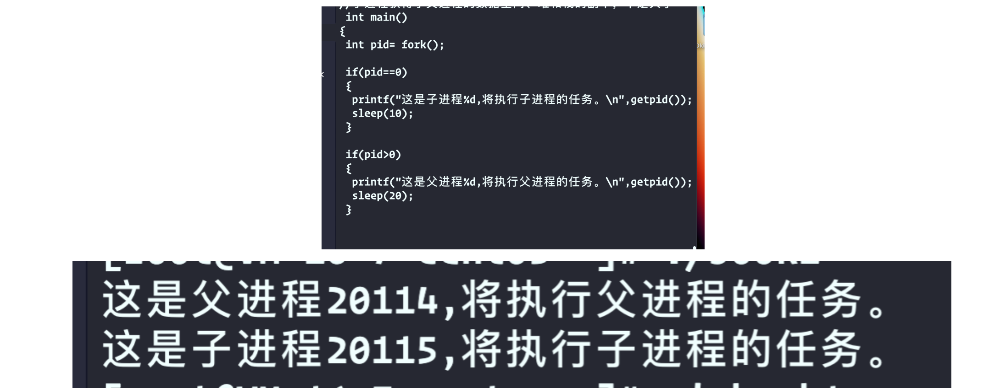
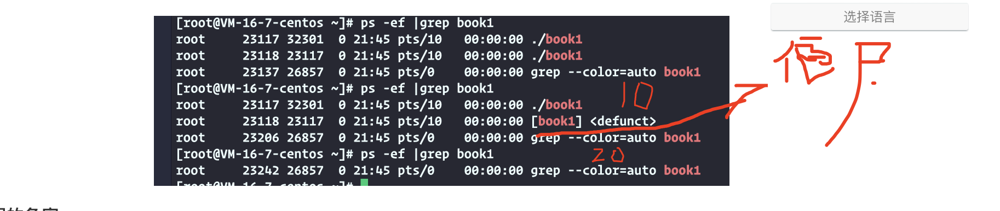
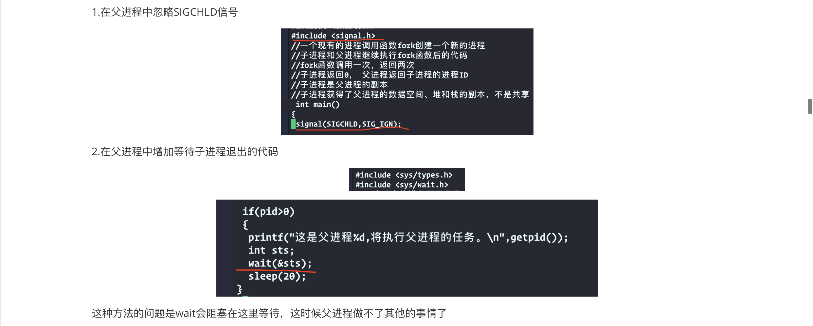
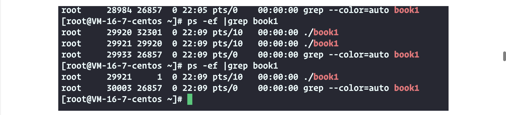

2）Linux多进程
===

#  Linux的0、1、2号进程

- idle进程：系统创建的第一个进程，加载系统.      (0)
- systemd进程：系统初始化，是所有其他用户进程的祖先. init  (1)
- kthreadd进程：负责所有内核线程的调度和管理.    (2)

进程标识
===

- 每个进程都有一个非负整数表示的唯一进程ID
- 查看进程：ps -ef|grep 进程名

下面这几个分别代表

第一列是启动操作系统的用户名，第二列是进程的编号。第三列是进程的父进程编号，第四列是cpu的占用率，第五列是进程的开始时间，第六列是启动进程的终端设备 第七列是进程运行的总时间 最后一列是启动这个进程的时候执行的命令，包括参数



最后还是到了1这个进程

如何在程序中创建进程？
===

## 进程标识

- getpid(void),获取进程ID、
- getppid(void),获取父进程ID

## fork进程

注意：⚠️第3、4特别重要！！！

1. 一个现有的进程调用函数fork创建一个新的进程
2. 子进程和父进程继续执行fork函数后的代码
3. **fork函数调用一次，返回两次，fork是分叉的意思，在调用fork之前只有一个进程，刚进入fork的时候也只有一个进程，然后在fork函数中产生了一个新的子进程，在fork函数中一个进程分叉成了两个进程，接下来子进程和父进程都要从fork函数中返回，所以fork函数返回了两次，fork后父进程和子进程都继续执行fork函数后面的代码，虽然他们的代码是相同的，但我们可以利用fork函数的返回值让子进程和父进程进入不同的流程，执行不同的任务**
4. **子进程返回0，父进程返回子进程的进程ID**
5. 子进程是父进程的副本，子进程获得了父进程的数据空间、栈和堆的副本，不是共享
6. 父进程中打开的文件描述符也被复制到了子进程中

### 验证第1.2个

```c++
#include <stdio.h>
#include <stdlib.h>
#include <string.h>
#include <unistd.h>

 int main()
{
 printf("aaa=%d\n",getpid());
 
 sleep(10);
 
 printf("bbb=%d\n",getpid());
 
//通过这个创建子进程
 fork();
 
//打印出父进程和子进程
 printf("ccc=%d\n",getpid());
 sleep(30);
 printf("ddd=%d\n",getpid());
}
```



### 验证第3个

### 非常重要！利用fork函数的返回值让子进程和父进程进入不同的流程，执行不同的任务



### 验证第5个

在fork函数之前定义一个变量，在子进程中修改这个变量的值，看看在父进程中这个变量的值会不会改变，发现不改变，第五个得到验证

```c++
#include <stdio.h>
#include <stdlib.h>
#include <string.h>
#include <unistd.h>

int main()
{
 int ii=1;
 int pid= fork();

 if(pid==0)
 {
  printf("这是子进程%d,将执行子进程的任务。\n",getpid());
  printf("aaaa ii=%d\n",ii++); sleep(1);
  printf("aaaa ii=%d\n",ii++); sleep(1);
  printf("aaaa ii=%d\n",ii++); sleep(1);
  printf("aaaa ii=%d\n",ii++); sleep(1);
 }

 if(pid>0)
 {
  printf("这是父进程%d,将执行父进程的任务。\n",getpid());
  printf("bbbb ii=%d\n",ii); sleep(1);
  printf("bbbb ii=%d\n",ii); sleep(1);
  printf("bbbb ii=%d\n",ii); sleep(1);
  printf("bbbb ii=%d\n",ii); sleep(1);
  printf("bbbb ii=%d\n",ii); sleep(1);
 }
```


### 验证第6个

在fork之前打开一个文件，向文件里写入一条内容，在子进程里写入一条内容，在父进程里也写入一条内容，最后关闭文件，打开文件发现都有，说明在父进程中打开的文件描述符被复制到了子进程中，应该是只有三行，这里有四行的原因是因为文件的缓冲区

分析：在fork之前打开文件，往文件里写入 fprintf(fp,"我要成为优秀。\n");，这一行代码并没有真的把内容写到文件里去，因为写入的内容太少了，有文件缓冲区，缓冲区就是内存，也就是说在fork之前这些内容还在内存里，并没有写到内存里去，接下来fork的时候，父进程的数据空间被复制一份，给了子进程，数据空间包括了文件的缓冲区，所以fork之后在父进程的数据空间里面的文件缓冲区有 fprintf(fp,"我要成为优秀。\n");这个内容，而子进程的文件缓冲区也有这个内容，fork之后子进程的 fprintf(fp,"aaa 我要成为优秀。\n");，和父进程的  fprintf(fp,"bbb 我要成为优秀。\n");他们实际上把内容放在各自的缓冲区里面，最后关闭文件的时候把各自的缓冲区的内容写入文件，所以我要成为优秀就有了两行，

他们文字的写作顺序是不确定的，因为fork之后，父进程和子进程的执行顺序是不确定的，取决于操作系统使用的算法

父进程和子进程实际上是两个独立的进程，如果在子进程中关闭了文件不会影响父进程，如果在父进程中关闭了文件不会影响子进程


```c++
 int main()
{
 FILE *fp=fopen("/tmp/tmp.txt","w+");
 fprintf(fp,"我要成为优秀。\n");

 //在fork之前把缓冲区的内容写作文件
 //fflush(fp);  把这个加上就只有一个了
 

 int ii=1;
 int pid= fork();

 if(pid==0)
 {
  printf("这是子进程%d,将执行子进程的任务。\n",getpid());
  fprintf(fp,"aaa 我要成为优秀。\n");
 }

 if(pid>0)
 {
  printf("这是父进程%d,将执行父进程的任务。\n",getpid());
  fprintf(fp,"bbb 我要成为优秀。\n");
 }

 fclose(fp);
 }
```

僵尸进程的问题
===

如果子进程先退出，内核向父进程发送SIGCHLD信号，如果父进程不处理这个信号，子进程会成为僵尸进程
---

```c++
int main()
{
// signal(SIGCHLD,SIG_IGN);

 int pid= fork();

 if(pid==0)
 {
  printf("这是子进程%d,将执行子进程的任务。\n",getpid());
  sleep(10);
}

 if(pid>0)
 {
  printf("这是父进程%d,将执行父进程的任务。\n",getpid());
  sleep(20);
}
}
```



上面那个僵尸进程过一会才消失

## ⚠️僵尸进程的危害：

如果子进程在父进程之前终止，内核为每个子进程保留了一个数据结构，包括进程编号，终止状态和使用cpu时间等，父进程如果处理子进程退出的信息，内核就会释放这个数据结构

如果父进程没有处理子进程退出的信息，内核就不会释放这个数据结构，子进程编号就会一直被占用，但是系统可可用的进程号是有限的，如果大量的产生僵尸进程，将因为没有可用的进程号而导致系统不能产生新的进程。

解决僵尸进程的三种方法：
---




# 孤儿进程

如果父进程先退出，子进程会成为孤儿进程,将被1号进程收养，由1号进程对他们完成状态收集工作


