demo05 demo06中解决这个问题

粘包和分包
===

- 粘包：发送方发送了两个字符串“hello”和“world”，接收方却一次性接收到了“helloworld”
- 分包：发送方发送了一个字符串“helloworld”，接收方却接收到了两个字符串“hello”和“world”

客户端发送多个报文时，服务端返回的结果是这样的，粘在一起了，为了解决粘包和分包的问题，我们在报文内容前面加了报文长度，这也算通信协议，既然是协议那么我们socket通信的两端就要按协议来发送和接受报文

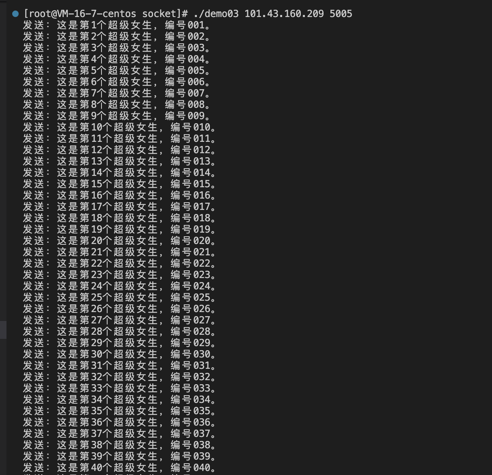

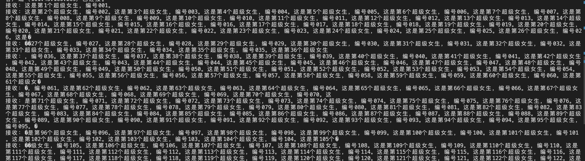

TCP协议的保证
===

- 报文内容的顺序不变，如果发送方发送“hello”，接收方也一定顺序收到“hello”
- 分割的包中间不会插入其他数据

TCP报文的粘包和分包
===

- 在项目开发中，采用自定义的报文格式
- **报文长度+报文内容。 0010abcdefghi**

在开发框架中，TcpRead和TcpWrite这两个函数解决了粘包和分包的问题

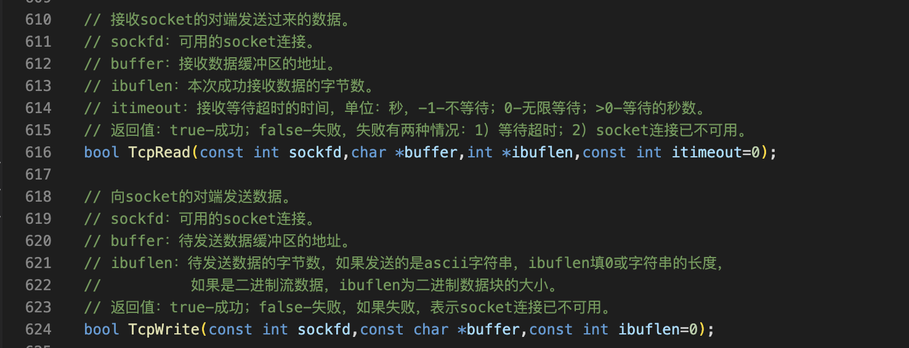

将recv改为TcpRead

过程
===

1 在客户端中把图一改为图二
---

图一：

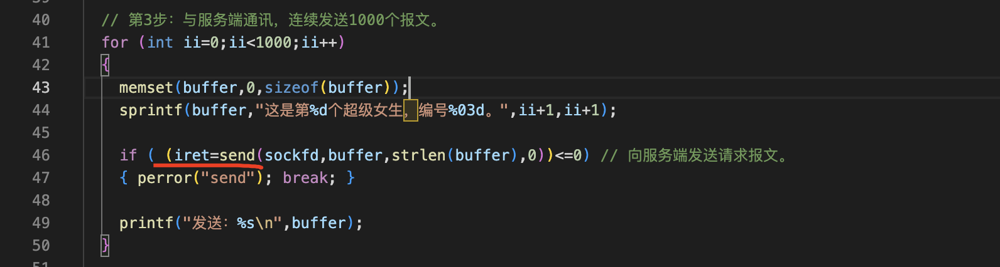

图二：

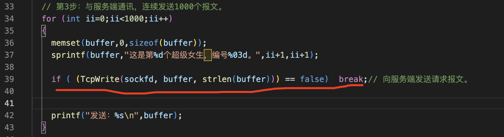

2 在服务端中把图一改为图二
---

图一

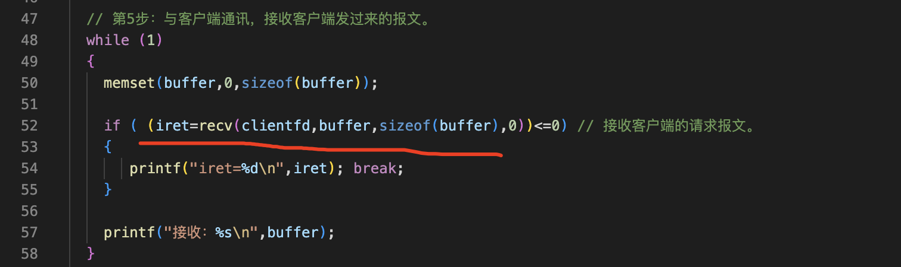

图二

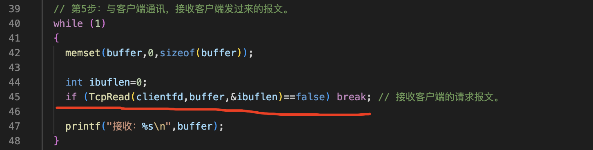

细节
===

TcpRead函数的实现细节
---

代码先是处理超时的，*ibuflen是一个整型变量地址，整个报文是由报文长度加上报文内容组成，报文长度是整数固定四个字节，先读取出来，再把报文长度由网络字节序转换为主机字节序，最后再把报文内容读取出来，放在buffer里面，在Readn函数读取报文，而不是c语言的recv函数，也是为了解决粘包和分包的问题

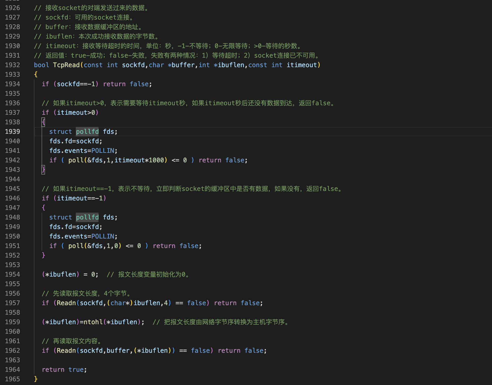

Readn的实现函数，它的第一个参数是sockfd，第二个参数是存放数据的buffer，第三个参数是需要读取数据的大小。每次调用Readn函数，只会读取第三个参数，指定大小的数据不会多也不会少。在函数里面循环调用recv读取数据，如果成功的读取到了n个字节的数据。函数返回true，如果读取的过程中发生了意外，比如说连接被断开。那么我们就返回false有了Readn函数Tcp协议，把报文分成多少个包都没有关系。对于我们应用开发来说，只需要调用一次Readn就可以读到一个完整的报文。

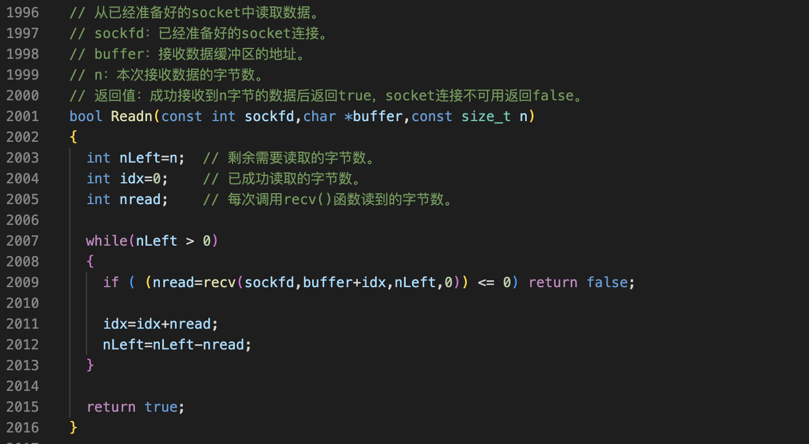

TcpWrite实现细节
---

这段代码先得到报文的长度，然后再把报文长度转化为网络字节序，定义一个TBuffer，再把报文长度和报文内容拷贝到Tbuffer中，最后调用Writen把缓冲区的数据发送出去，这里没用c语言的send函数

这里要注意。发送数据，我采用的是框架中的Writen函数，而不是C语言提供的原生send函数。C语言的send函数是在调用它发送数据的时候，如果你想发送1000个字节，他可能只发送了500字节。为什么会出现这种情况呢？因为sockfd有缓冲区，读和写两个缓冲区，这两个缓冲区的大小。是有上限的，如果现在的写缓冲区快满了，还有500个字节的空间可以用。这时候调用send函数只能成功的写入500字节，剩下的500字节必须等到写缓冲区空闲的时候才能够再次写入。我们看看send的这个函数的返回值。成功的时候返回发送的字节数，他没有说全部帮你发送完。在项目开发中，我们会调用Writen函数取代send函数，

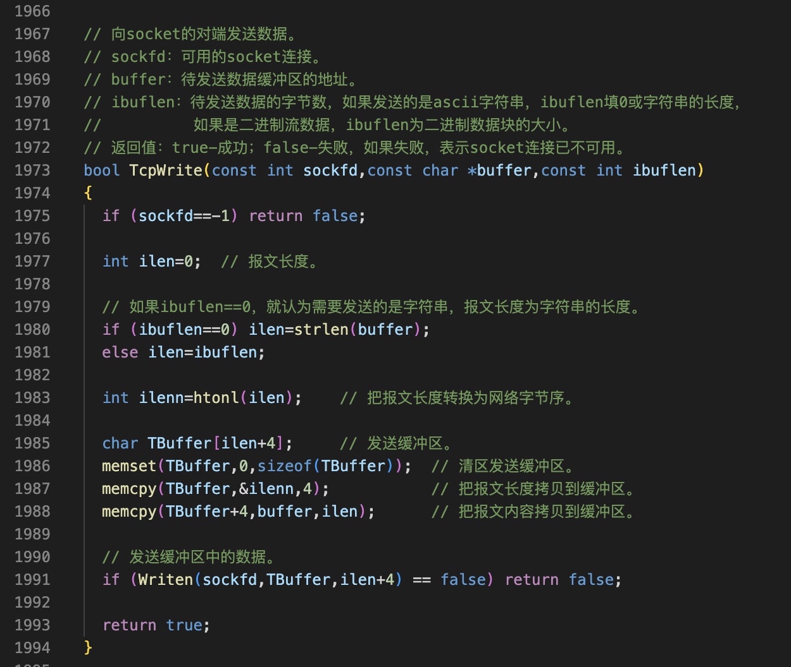

在writen函数中循环调用send函数，直到全部的数据被成功的发送，如果发送的过程中，tcp连接断开了或其他的原因返回false

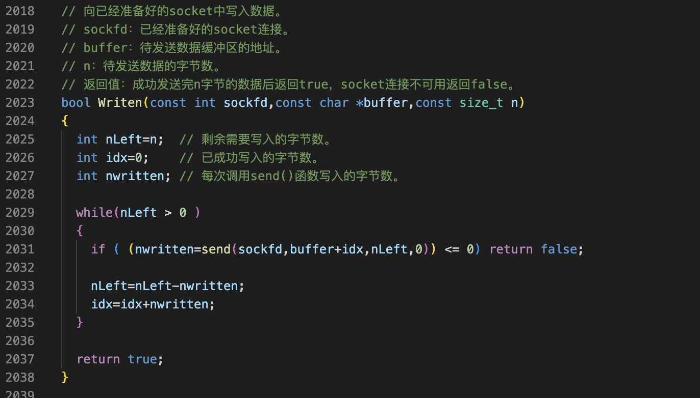