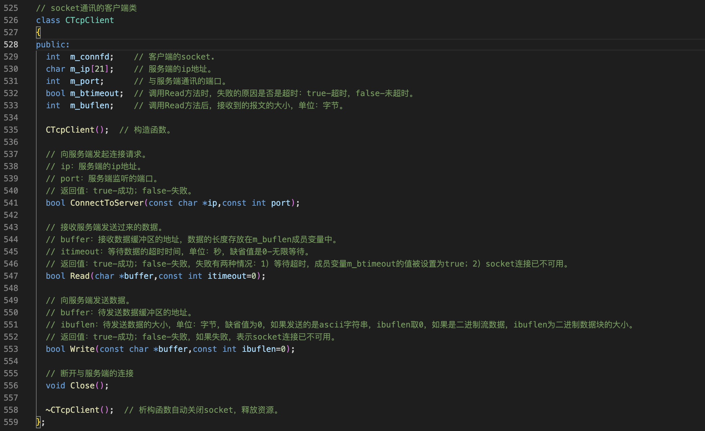
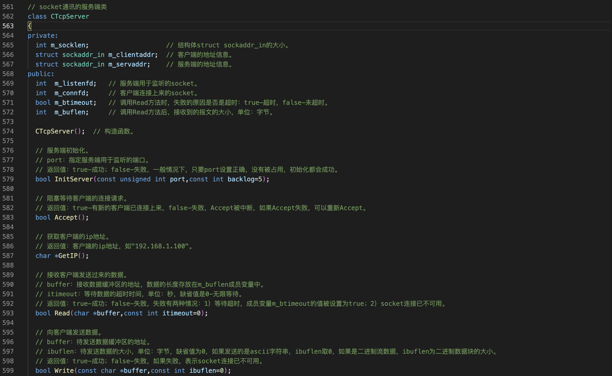
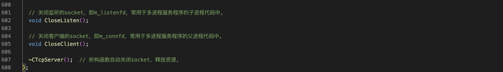
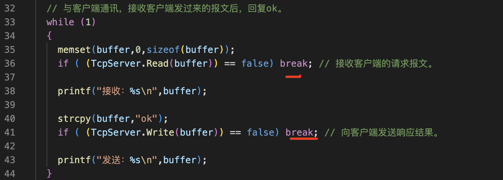
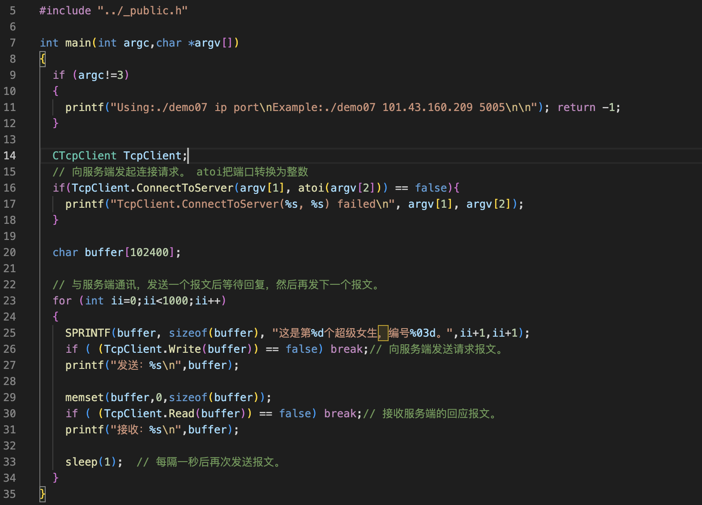
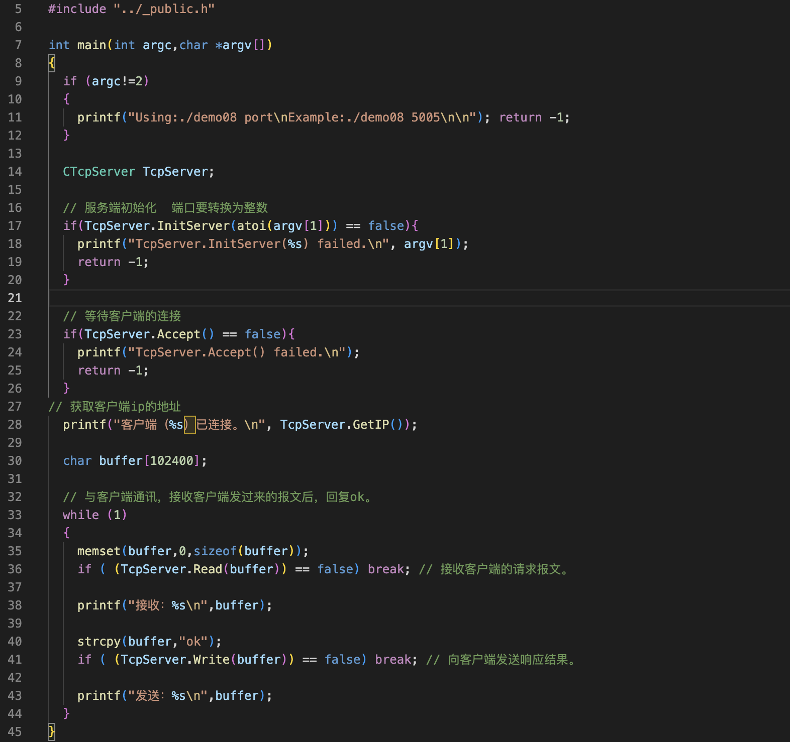
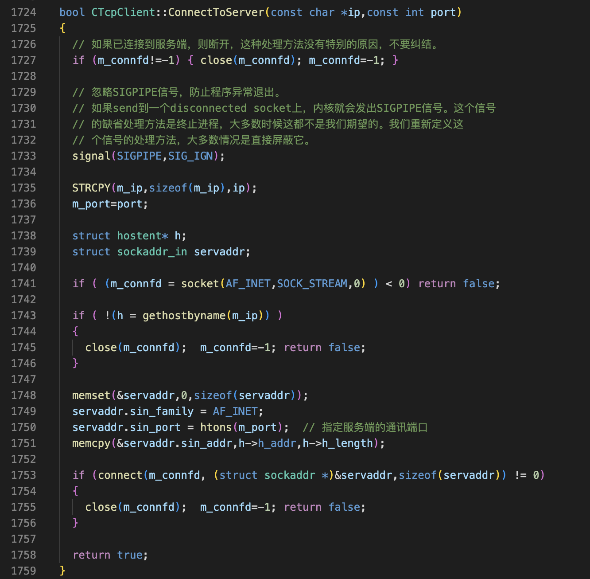
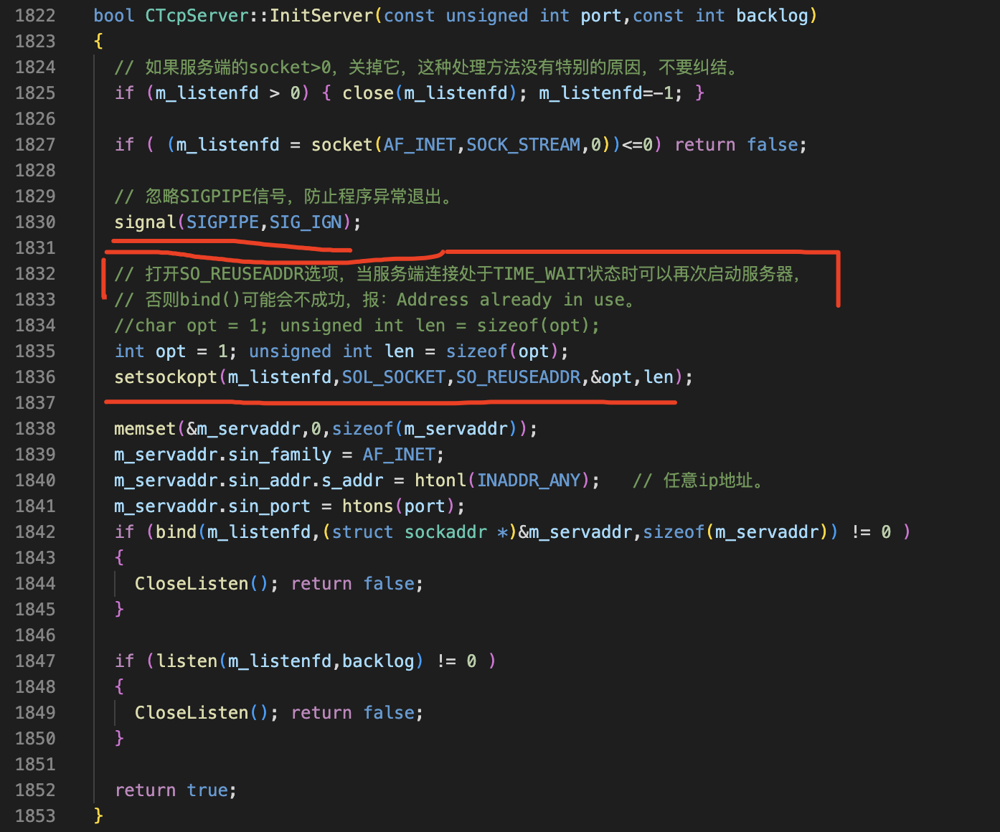
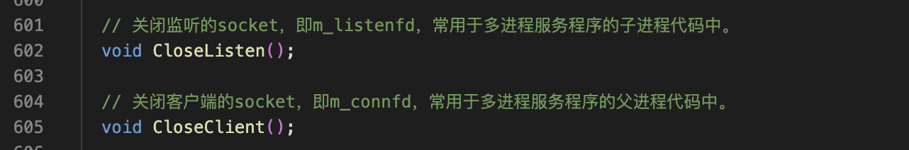

封装socket的API
===

- 解决TCP报文粘包/分包的问题
- 封装socket的常用函数

开发框架_public.h 525行-644行     _public.cpp。1714行-2039行

在开发框架中，已经把socket通信封装成了 两个类一个是socker通信的客户端CTcpClient，还有一个是socker通信的服务端CTcpServer。

我们先在demo程序中把这两个类给用起来，然后再来讨论它的封装细节。

过程
===

需要用atoi把端口转换为整数

注意了，在网络通讯的程序里面。不管是服务端还是客户端，如果发送或者接收函数失败，百分之九十九点九九的原因是网络连接被断开了。或者说对方已经关闭了这个socker，在这种情况下没有其他的办法可以想。要不要记录更详细的错误日志，也不是太有必要，所以这里直接break，然后程序退出了。客户端也是这样，

1 编写客户端
---

2 编写服务端
---

细节
===

重要‼️
---

一、在网络通讯的程序中，需要忽略SIGPIPE信号，防止程序异常退出，在网络通讯的程序中，需要忽略SIGPIPE信号，防止程序异常退出。具体原因是这样的，如果向一个已关闭的socket发送数据，内核就会发出SIGPIPE信号。这个信号缺省的处理方法是终止进程，我们肯定不希望程序终止，也没有必要重新定义这个信号的处理方法。直接屏蔽他就可以了，signal函数返回错误，这个细节非常重要，如果没有项目开发经验。一般不会注意这个细节，在找工作的时候很有可能问这个问题

在应用开发中会忽略这个信号。然后通过判断send和recv的返回值来决定程序的流程，而不是任由SIGPIPE信号。终止程序，

二、打开SO_REUSEADDR选项，一定要打开这个选项，否则下面的bind调用很容易出现地址已经被使用的这个问题。，在绝大数情况下backlog这个参数用缺省值5就可以了，如果客户端很多可以改大一点

三、关闭烧烤的函数有两个，一个是关闭监听的，一个是关闭客户端连接的。因为在多进程的服务程序中，需要分开来关闭

