如果c程序中用到了mysql的函数，编译的时候需要把/usr/local/mysql/lib/libmysqlclient.so链接进来

在环境变量中，LD_LIBRARY_PATH="/usr/local/mysql/lib:/usr/lib:/project:.  这个变量动态库的搜索目录需要把mysql的函数库目录包含进来

在这个开发框架中，我们把mysql的函数做了封装

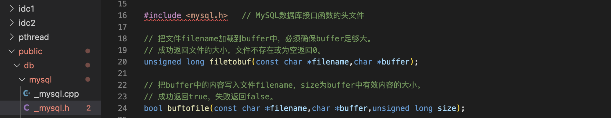

18-24用来操作二进制文件

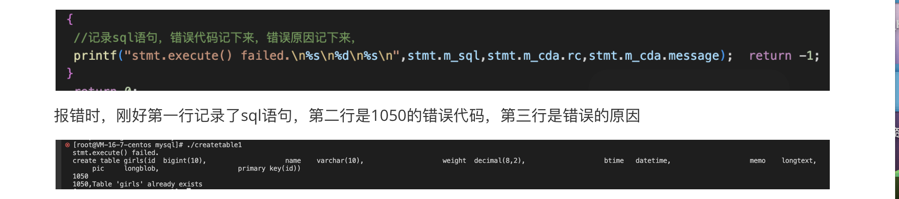


过程
===

1、登陆数据库
---

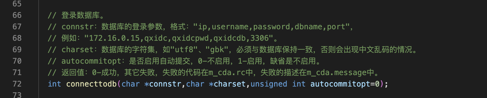

2、调用数据库接口函数返回的结果
---

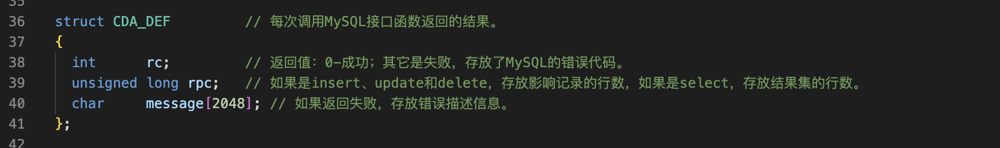

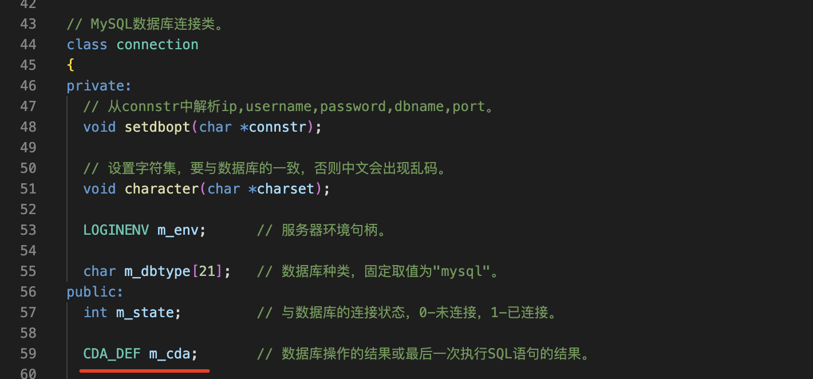

3 在makeffile中添加参数
---

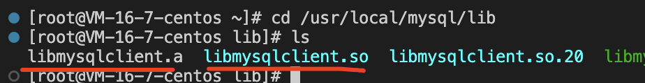

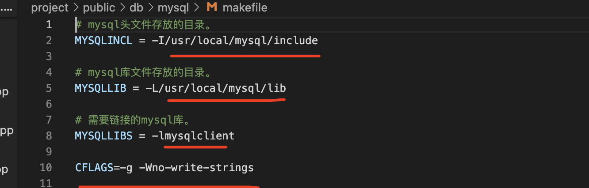

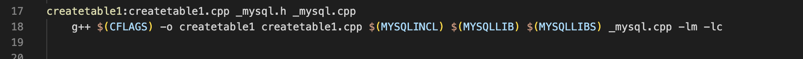

4 在运行之前设置好环境变量
---

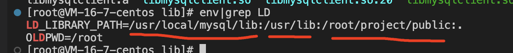

5 绑定数据库连接
---

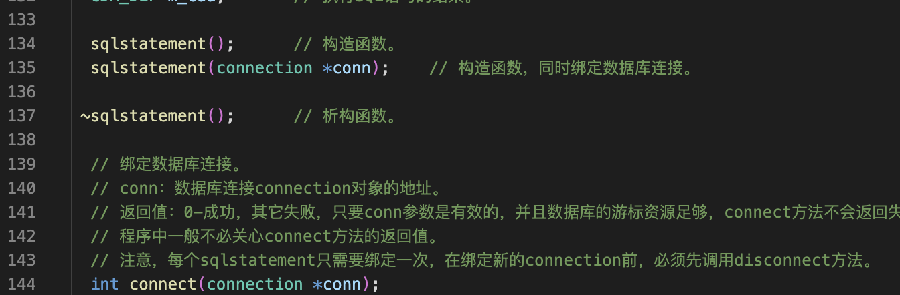

6 准备sql语句
---

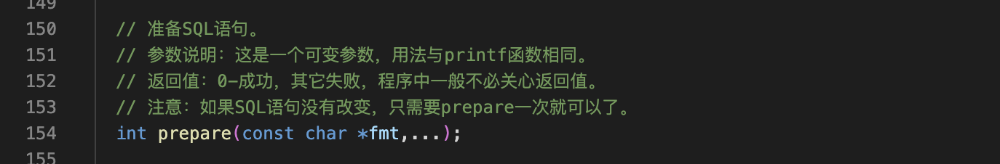

7 执行sql语句
---

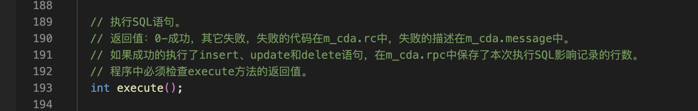

实现代码
===

```
/*
 *  程序名：createtable1.cpp，此程序演示开发框架操作MySQL数据库（创建表）。
 *  作者：gmc。
*/

#include "_mysql.h" //开发框架操作MySQL的头文件

int main(int argc,char *argv[])
{
    connection conn;    //数据库连接类

    //登陆数据库 0成功 其他的失败，存放MySQL的错误代码
    //失败代码在conn.m_cda.rc中，失败描述在conn.m_cda.message中
  if (conn.connecttodb("127.0.0.1,root,mysqlpwd,mysql,3306","utf8")!=0)
  {
    printf("connect database failed.\n%s\n",conn.m_cda.message); return -1;
  }
    //绑定数据库连接
    sqlstatement stmt(&conn);  //操作SQL语句的对象

    //准备创建表的SQL语句
    //超女表girls，超女编号id，超女姓名name，体重weight，报名时间btime，超女说明memo 超女照片pic
    stmt.prepare("create table girls(id  bigint(10),\
                    name    varchar(30),\
                    weight  decimal(8,2),\
                    btime   datetime,\
                    memo    longtext,\
                    pic     longblob,\
                    primary key(id))");
    /*
    1、int prepare(const char *fmt,...). SQL语句可以多行书写
    2、SQL语句最后的分号可有可无建议不要写(兼容性考虑)
    3、SQL语句中不能有说明文字
    4、可以不用判断stmt.prepare()的返回值， stmt.execute()时再判断
    */

   //执行SQL语句，一定要判断返回值， 0-成功 其他-失败
   //失败代码在stmt.m_cda.rc中，失败描述在stmt.m_cda.message中
   if(stmt.execute()!=0)
   //记录详细的日志
   {
    //记录sql语句，错误代码记下来，错误原因记下来，
    printf("stmt.execute() failed.\n%s\n%d\n%s\n",stmt.m_sql,stmt.m_cda.rc,stmt.m_cda.message);  return -1;
   }
    return 0;
}
```

小记
===

一、
---

lvalue 左值是可以出现在赋值号左边的表达式，是一个可以被存储的单元，它是一个被明确了的数值单元的数据，

​            可以用来赋值，可以被引用         

rvalue 右值是可以出现在赋值号右边的表达式，是一个可以被读取的数据，必须是一个可以被读取出来的值

​            可以被读取，不能被引用

二、
---

1、int prepare(const char *fmt,...). SQL语句可以多行书写

2、SQL语句最后的分号可有可无建议不要写(兼容性考虑)

3、SQL语句中不能有说明文字

4、可以不用判断stmt.prepare()的返回值， stmt.execute()时再判断
