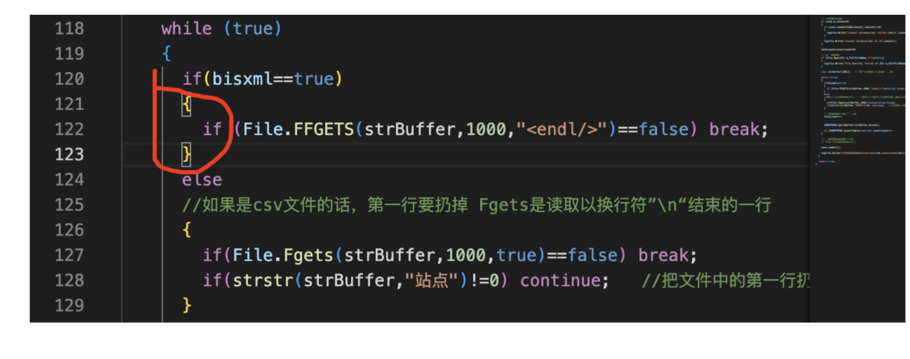

2）优化数据入库程序

用一个头文件，加两个cpp构成一个可复用的构件

**/root/project/idc/c/idcapp.h**

**/root/project/idc/c/obtmindtodb.cpp**

**/root/project/idc/c/idcapp.cpp**

这里要加括号，不然会产生歧义

主代码

```c++
/*
 *  obtmindtodb.cpp，本程序用于把全国站点分钟观测数据入库到T_ZHOBTMIND表中，支持xml和csv两种文件格式。
 *  作者：gmc。
*/
#include "idcapp.h"

CLogFile logfile;

connection conn;

CPActive PActive;

void EXIT(int sig);

// 业务处理主函数。
bool _obtmindtodb(char *pathname,char *connstr,char *charset);

int main(int argc,char *argv[])
{
  // 帮助文档。
  if (argc!=5)
  {
    printf("\n");
    printf("Using:./obtmindtodb pathname connstr charset logfile\n");

    printf("Example:/project/tools1/bin/procctl 10 /project/idc1/bin/obtmindtodb /idcdata/surfdata \"127.0.0.1,root,mysqlpwd,mysql,3306\" utf8 /log/idc/obtmindtodb.log\n\n");

    printf("本程序用于把全国站点分钟观测数据保存到数据库的T_ZHOBTMIND表中，数据只插入，不更新。\n");
    printf("pathname 全国站点分钟观测数据文件存放的目录。\n");
    printf("connstr  数据库连接参数：ip,username,password,dbname,port\n");
    printf("charset  数据库的字符集。\n");
    printf("logfile  本程序运行的日志文件名。\n");
    printf("程序每10秒运行一次，由procctl调度。\n\n\n");

    return -1;
  }

  // 关闭全部的信号和输入输出。
  // 设置信号,在shell状态下可用 "kill + 进程号" 正常终止些进程。
  // 但请不要用 "kill -9 +进程号" 强行终止。
  CloseIOAndSignal(); signal(SIGINT,EXIT); signal(SIGTERM,EXIT);

  // 打开日志文件。
  if (logfile.Open(argv[4],"a+")==false)
  {
    printf("打开日志文件失败（%s）。\n",argv[4]); return -1;
  }

  PActive.AddPInfo(30,"obtmindtodb");   // 进程的心跳，30秒足够。
  // 注意，在调试程序的时候，可以启用类似以下的代码，防止超时。
  // PActive.AddPInfo(5000,"obtmindtodb");

  // 业务处理主函数。
  _obtmindtodb(argv[1],argv[2],argv[3]);

  return 0;
}

void EXIT(int sig)
{
  logfile.Write("程序退出，sig=%d\n\n",sig);

  conn.disconnect();

  exit(0);
}

// 业务处理主函数。
bool _obtmindtodb(char *pathname,char *connstr,char *charset)
{
  CDir Dir;

  // 打开目录。
  if (Dir.OpenDir(pathname,"*.xml,*.csv")==false)
  {
    logfile.Write("Dir.OpenDir(%s) failed.\n",pathname); return false;
  }

  CFile File;

  CZHOBTMIND ZHOBTMIND(&conn,&logfile);

  int  totalcount=0;  // 文件的总记录数。
  int  insertcount=0; // 成功插入记录数。
  CTimer Timer;       // 计时器，记录每个数据文件的处理耗时。
  bool bisxml=false;  // 文件格式，true-xml；false-csv。

  while (true)
  {
    // 读取目录，得到一个数据文件名。
    if (Dir.ReadDir()==false) break;

    if (MatchStr(Dir.m_FullFileName,"*.xml")==true) bisxml=true;
    else bisxml=false;

    // 连接数据库。
    if (conn.m_state==0)
    {
      if (conn.connecttodb(connstr,charset)!=0)
      {
        logfile.Write("connect database(%s) failed.\n%s\n",connstr,conn.m_cda.message); return -1;
      }
    
      logfile.Write("connect database(%s) ok.\n",connstr);
    }

    totalcount=insertcount=0;

    // 打开文件。
    if (File.Open(Dir.m_FullFileName,"r")==false)
    {
      logfile.Write("File.Open(%s) failed.\n",Dir.m_FullFileName); return false;
    }

    char strBuffer[1001];   // 存放从文件中读取的一行。

    while (true)
    {
      if (bisxml==true)
      {
        if (File.FFGETS(strBuffer,1000,"<endl/>")==false) break;
      }
      else
      {
        if (File.Fgets(strBuffer,1000,true)==false) break;
        if (strstr(strBuffer,"站点")!=0) continue;   // 把csv文件中的第一行扔掉。
      }

      // 处理文件中的每一行。
      totalcount++;

      ZHOBTMIND.SplitBuffer(strBuffer,bisxml);  

      if (ZHOBTMIND.InsertTable()==true) insertcount++;
    }

    // 删除文件、提交事务。
    File.CloseAndRemove();

    conn.commit();

    logfile.Write("已处理文件%s（totalcount=%d,insertcount=%d），耗时%.2f秒。\n",Dir.m_FullFileName,totalcount,insertcount,Timer.Elapsed());
  }

  return true;
}
```

**/root/project/idc/c/idcapp.h**

```c++
/****************************************************************************************/
/*   程序名：idcapp.h，此程序是数据中心项目公用函数和类的声明文件。                     */
/*   作者：吴从周                                                                       */
/****************************************************************************************/

#ifndef IDCAPP_H
#define IDCAPP_H

#include "_public.h"
#include "_mysql.h"

struct st_zhobtmind
{
  char obtid[11];      // 站点代码。
  char ddatetime[21];  // 数据时间，精确到分钟。
  char t[11];          // 温度，单位：0.1摄氏度。
  char p[11];          // 气压，单位：0.1百帕。
  char u[11];          // 相对湿度，0-100之间的值。
  char wd[11];         // 风向，0-360之间的值。
  char wf[11];         // 风速：单位0.1m/s。
  char r[11];          // 降雨量：0.1mm。
  char vis[11];        // 能见度：0.1米。
};

// 全国站点分钟观测数据操作类。
class CZHOBTMIND
{
public:
  connection  *m_conn;     // 数据库连接。
  CLogFile    *m_logfile;  // 日志。

  sqlstatement m_stmt;     // 插入表操作的sql。

  char m_buffer[1024];   // 从文件中读到的一行。
  struct st_zhobtmind m_zhobtmind; // 全国站点分钟观测数据结构。

  CZHOBTMIND();
  CZHOBTMIND(connection *conn,CLogFile *logfile);

 ~CZHOBTMIND();

  void BindConnLog(connection *conn,CLogFile *logfile);  // 把connection和CLogFile的传进去。
  bool SplitBuffer(char *strBuffer,bool bisxml);  // 把从文件读到的一行数据拆分到m_zhobtmind结构体中。
  bool InsertTable();  // 把m_zhobtmind结构体中的数据插入到T_ZHOBTMIND表中。
};


#endif
```

**/root/project/idc/c/idcapp.cpp**

```c++
/****************************************************************************************/
/*   程序名：idcapp.cpp，此程序是数据中心项目公用函数和类的实现文件。                   */
/*   作者：gmc                                                                       */
/****************************************************************************************/

#include "idcapp.h"


CZHOBTMIND::CZHOBTMIND()
{
  m_conn=0;  m_logfile=0;
}

CZHOBTMIND::CZHOBTMIND(connection *conn,CLogFile *logfile)
{
  m_conn=conn;
  m_logfile=logfile;
}

CZHOBTMIND::~CZHOBTMIND()
{
}

void CZHOBTMIND::BindConnLog(connection *conn,CLogFile *logfile)
{
  m_conn=conn;
  m_logfile=logfile;
}

// 把从文件读到的一行数据拆分到m_zhobtmind结构体中。
bool CZHOBTMIND::SplitBuffer(char *strBuffer,bool bisxml)
{
  memset(&m_zhobtmind,0,sizeof(struct st_zhobtmind));
 
  if (bisxml==true)
  {
    GetXMLBuffer(strBuffer,"obtid",m_zhobtmind.obtid,10);
    GetXMLBuffer(strBuffer,"ddatetime",m_zhobtmind.ddatetime,14);
    char tmp[11];
    GetXMLBuffer(strBuffer,"t",tmp,10);   if (strlen(tmp)>0) snprintf(m_zhobtmind.t,10,"%d",(int)(atof(tmp)*10));
    GetXMLBuffer(strBuffer,"p",tmp,10);   if (strlen(tmp)>0) snprintf(m_zhobtmind.p,10,"%d",(int)(atof(tmp)*10));
    GetXMLBuffer(strBuffer,"u",m_zhobtmind.u,10);
    GetXMLBuffer(strBuffer,"wd",m_zhobtmind.wd,10);
    GetXMLBuffer(strBuffer,"wf",tmp,10);  if (strlen(tmp)>0) snprintf(m_zhobtmind.wf,10,"%d",(int)(atof(tmp)*10));
    GetXMLBuffer(strBuffer,"r",tmp,10);   if (strlen(tmp)>0) snprintf(m_zhobtmind.r,10,"%d",(int)(atof(tmp)*10));
    GetXMLBuffer(strBuffer,"vis",tmp,10); if (strlen(tmp)>0) snprintf(m_zhobtmind.vis,10,"%d",(int)(atof(tmp)*10));
  }
  //处理csv格式
  else
  {
    CCmdStr CmdStr;
    CmdStr.SplitToCmd(strBuffer,",");
    CmdStr.GetValue(0,m_zhobtmind.obtid,10);
    CmdStr.GetValue(1,m_zhobtmind.ddatetime,14);
    char tmp[11];
    CmdStr.GetValue(2,tmp,10); if (strlen(tmp)>0) snprintf(m_zhobtmind.t,10,"%d",(int)(atof(tmp)*10));
    CmdStr.GetValue(3,tmp,10); if (strlen(tmp)>0) snprintf(m_zhobtmind.p,10,"%d",(int)(atof(tmp)*10));
    CmdStr.GetValue(4,m_zhobtmind.u,10);
    CmdStr.GetValue(5,m_zhobtmind.wd,10);
    CmdStr.GetValue(6,tmp,10); if (strlen(tmp)>0) snprintf(m_zhobtmind.wf,10,"%d",(int)(atof(tmp)*10));
    CmdStr.GetValue(7,tmp,10); if (strlen(tmp)>0) snprintf(m_zhobtmind.r,10,"%d",(int)(atof(tmp)*10));
    CmdStr.GetValue(8,tmp,10); if (strlen(tmp)>0) snprintf(m_zhobtmind.vis,10,"%d",(int)(atof(tmp)*10));
  }

  STRCPY(m_buffer,sizeof(m_buffer),strBuffer);

  return true;
}

// 把m_zhobtmind结构体中的数据插入到T_ZHOBTMIND表中。
bool CZHOBTMIND::InsertTable()
{
  if (m_stmt.m_state==0)
  {
    m_stmt.connect(m_conn);
    m_stmt.prepare("insert into T_ZHOBTMIND(obtid,ddatetime,t,p,u,wd,wf,r,vis) values(:1,str_to_date(:2,'%%Y%%m%%d%%H%%i%%s'),:3,:4,:5,:6,:7,:8,:9)");
    m_stmt.bindin(1,m_zhobtmind.obtid,10);
    m_stmt.bindin(2,m_zhobtmind.ddatetime,14);
    m_stmt.bindin(3,m_zhobtmind.t,10);
    m_stmt.bindin(4,m_zhobtmind.p,10);
    m_stmt.bindin(5,m_zhobtmind.u,10);
    m_stmt.bindin(6,m_zhobtmind.wd,10);
    m_stmt.bindin(7,m_zhobtmind.wf,10);
    m_stmt.bindin(8,m_zhobtmind.r,10);
    m_stmt.bindin(9,m_zhobtmind.vis,10);
  }

  // 把结构体中的数据插入表中。
  if (m_stmt.execute()!=0)
  {
    // 1、失败的情况有哪些？是否全部的失败都要写日志？
    // 答：失败的原因主要有二：一是记录重复，二是数据内容非法。
    // 2、如果失败了怎么办？程序是否需要继续？是否rollback？是否返回false？
    // 答：如果失败的原因是数据内容非法，记录日志后继续；如果是记录重复，不必记录日志，且继续。
    if (m_stmt.m_cda.rc!=1062)
    {
      m_logfile->Write("Buffer=%s\n",m_buffer);
      m_logfile->Write("m_stmt.execute() failed.\n%s\n%s\n",m_stmt.m_sql,m_stmt.m_cda.message);
    }

    return false;
  }

  return true;
}
```

