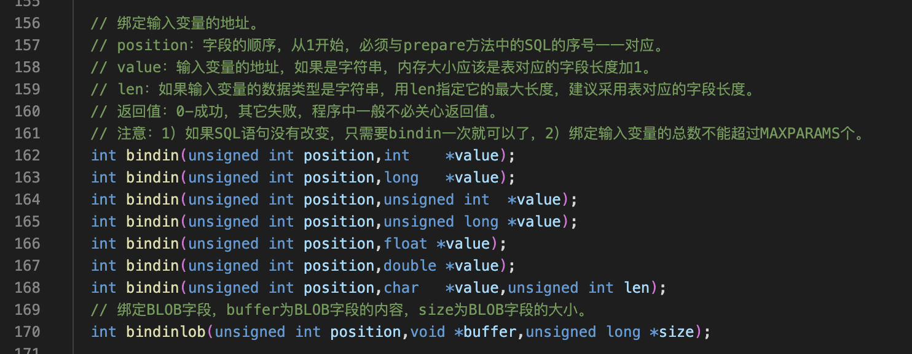
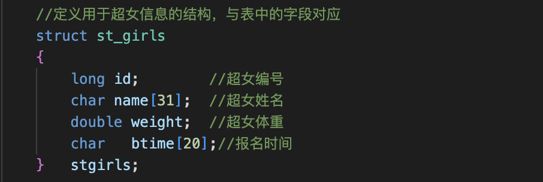
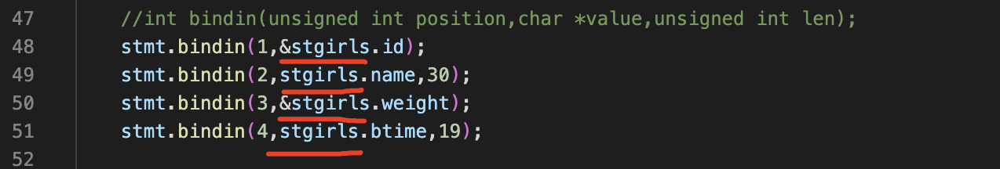
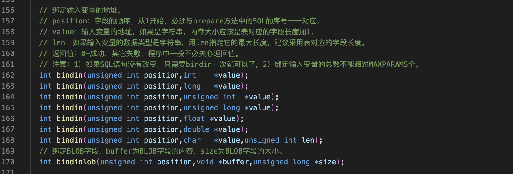
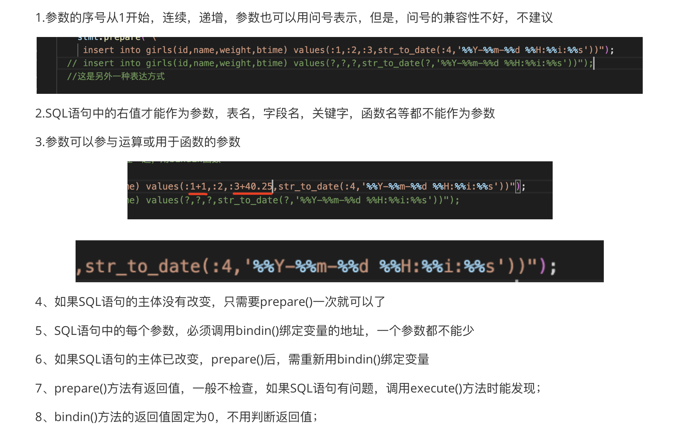
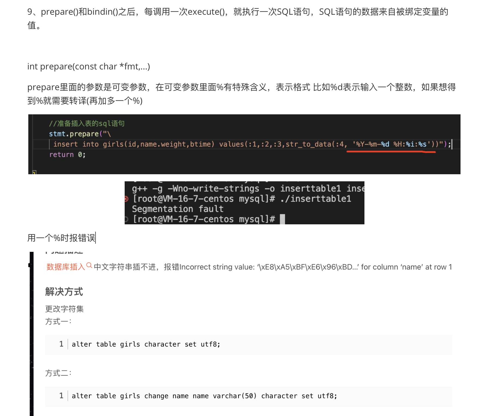
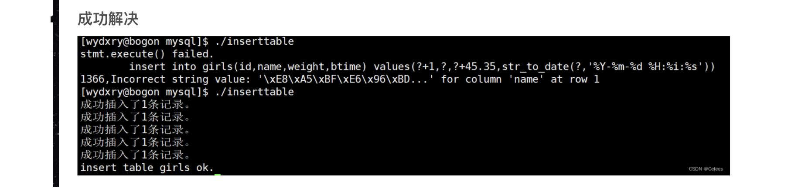

过程
===

绑定输入变量的地址




最终代码
===

```c++
/*
 *  程序名：createtable1.cpp，此程序演示开发框架操作MySQL数据库（创建表）。
 *  作者：gmc。
*/

#include "_mysql.h" //开发框架操作MySQL的头文件

int main(int argc,char *argv[])
{
    connection conn;    //数据库连接类

    //登陆数据库 0成功 其他的失败，存放MySQL的错误代码
    //失败代码在conn.m_cda.rc中，失败描述在conn.m_cda.message中
  if (conn.connecttodb("127.0.0.1,root,mysqlpwd,mysql,3306","utf8")!=0)
  {
    printf("connect database failed.\n%s\n",conn.m_cda.message); return -1;
  }
    //定义用于超女信息的结构，与表中的字段对应
    struct st_girls
    {
        long id;        //超女编号
        char name[31];  //超女姓名
        double weight;  //超女体重
        char   btime[20];//报名时间
    }   stgirls;
     
    //绑定数据库连接
    sqlstatement stmt(&conn);  //操作SQL语句的对象

    //准备插入表的sql语句
    //int prepare(const char *fmt,...)
    //prepare里面的参数是可变参数，在可变参数里面%有特殊含义，表示格式 比如%d表示输入一个整数，如果想得到%就需要转译(再加多一个%)
    //把上面struct st_girls的变量与mysql绑定在一起，用bindin函数
    stmt.prepare("\
     insert into girls(id,name,weight,btime) values(:1,:2,:3,str_to_date(:4,'%%Y-%%m-%%d %%H:%%i:%%s'))");
  // insert into girls(id,name,weight,btime) values(?,?,?,str_to_date(?,'%%Y-%%m-%%d %%H:%%i:%%s'))");
  //这是另外一种表达方式

    //绑定输入变量的地址
    //position:字段的顺序，从1开始，必须与prepare方法中的SQL序号一一对应
    //value:输入变量的地址，如果是字符串，内存大小应该是表对应的字段长度加1
    //len 如果输入变量的数据类型是字符串，用len指定他的最大长度，建议采用表对应的字段长度
    //返回值： 0-成功 其他失败，程序中一般不必关心返回值
    //注意：1）如果SQL语句没有改变，只需要binin一次就可以了 2）绑定输入变量的总数不能超过MAXPARAMS个
    //int bindin(unsigned int position,char *value,unsigned int len);
    stmt.bindin(1,&stgirls.id);
    stmt.bindin(2,stgirls.name,30);
    stmt.bindin(3,&stgirls.weight);
    stmt.bindin(4,stgirls.btime,19);

    //模拟超女数据，向表中插入5条测试数据
    for(int ii=0; ii<5; ii++)
    {
        memset(&stgirls,0,sizeof(struct st_girls));    //结构体变量初始化

        //为结构体变量的成员赋值 
        stgirls.id=ii+1;                                    //超女编号
        sprintf(stgirls.name,"西施%05dgirl",ii+1);           //超女姓名
        stgirls.weight=45.25+ii;                            //超女体重
        sprintf(stgirls.btime,"2023-1-15 12:30:%02d",ii);   //报名时间

        if(stmt.execute()!=0)
        {
            printf("stmt.execute() failed. \n%s\n%s\n",stmt.m_sql,stmt.m_cda.message); return -1;
        }
        //这里用rpc
        printf("成功插入了%ld条记录。 \n",stmt.m_cda.rpc);      //stmt.m_cda.rpc是本次执行SQL影响的记录数
    }
    printf("insert table girls ok.\n");
   
    conn.commit();     //提交数据库事务
    
    return 0;
}
```


细节
===

这里有的是&的原因
---

id和weight需要用&取地址，而name和btime它们是数组不需要取地址








‼️重要：

prepare里面的参数是可变参数，在可变参数里面%有特殊含义，表示格式 比如%d表示输入一个整数，如果想得到%就需要转译(再加多一个%)





