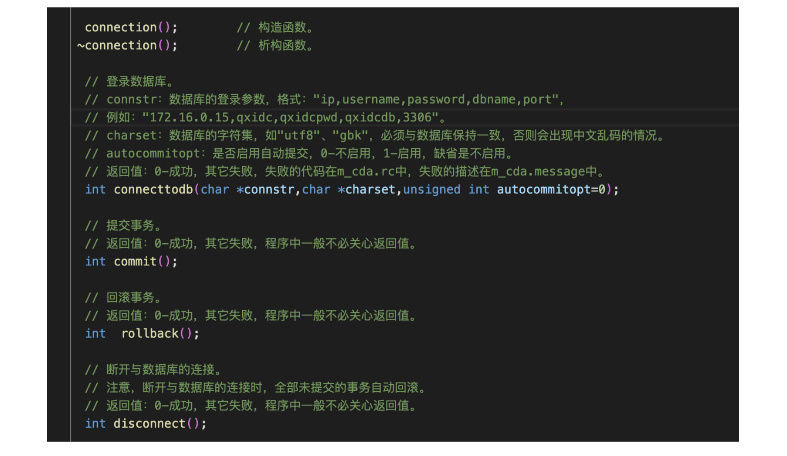
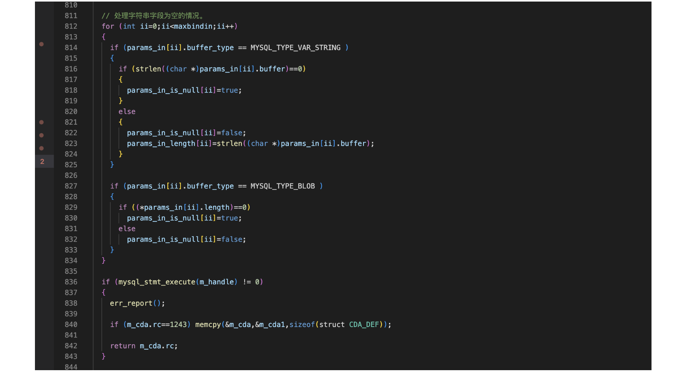

数据库开发注意事项和技巧
---

### 注意事项：⚠️：

- 一个connectio对象同一时间只能连一个数据库(断开可重连)
- 同一程序中，创建多个connection对象可以同时连多个数据库
- 每个connection对象的事务是独立的
- 多个进程不能共享同一个已连接成功的connection对象
- 多个sqlstateme对象可以绑定同一个connection对象
- ⚠️：如果执行了select语句，在结果集没有获取完之前，同以connection中的全部sqlstatement对象都不能执行任何SQL语句 ！！！5.7这个数据库的缺点

### 应用技巧：

c语言不能表示空的整数和浮点数，实战中可以用字符串存放整数和浮点数，可以表示空值，可以把变量设为char

在这个项目中我们在execute这个函数里面进行了封装，来处理字符串字段为空的情况
---