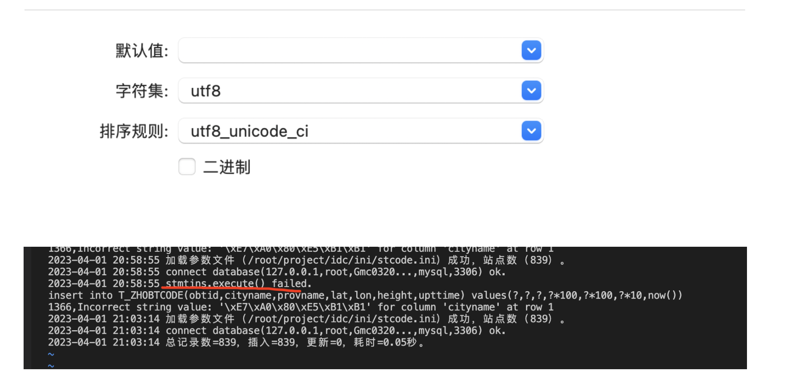

准备
===

sql文件

```sql
create table T_ZHOBICODE
(
	obtid			varchar(10) not null comment'站点代码',
	cityname	varchar(30) not null comment'城 市名称',
	provname	varchar(30) not null comment' 省名称',
	lat				int not null comment '纬度，单位: 0.01度',
	lon				int not null comment '经度，单位: 0.01度',
	height		int comment '海拔高度，单位: 0.1米。',
	upttime		timestamp not null comment '更新时间，数据被插入或更新的时间',
	keyid			int not null auto_increment comment '记录编号，自动增长列',
	primary key (obtid),
	unique key ZHOBTCODE_KEYID (keyid)
);

alter table T_ZHOBTCODE comment '这是一个参数表,存放了全国的站点参数,约800条记录,本表的数据极少变更.应用程序对本表有inser和up'
```

要设置为这个，不然会报错，插入不进去




实现过程
===

```
- 帮助文档
- 处理程序退出的信号
- 打开日志文件
- 把全国站点参数文件加载到vstcode容器中
- 连接数据库
- 准备插入表的SQL语句
- 准备更新表的SQL语句
- 遍历vstcode容器
- 提交事务
```


最终代码
===

/root/project/idc/c/obtcodetodb1.cpp

```c++
/*
 *  obtcodetodb.cpp，本程序用于把全国站点参数数据保存到数据库T_ZHOBTCODE表中。
 *  作者：gmc。
*/
#include "_public.h"
#include "_mysql.h"

// 全国气象站点参数结构体。
struct st_stcode
{
  char provname[31]; // 省
  char obtid[11];    // 站号
  char cityname[31];  // 站名
  char lat[11];      // 纬度
  char lon[11];      // 经度
  char height[11];   // 海拔高度
};

vector<struct st_stcode> vstcode; // 存放全国气象站点参数的容器。

// 把站点参数文件中加载到vstcode容器中。
bool LoadSTCode(const char *inifile);

CLogFile logfile;

connection conn;

CPActive PActive;

void EXIT(int sig);

int main(int argc,char *argv[])
{
  // 帮助文档。
  if (argc!=5)
  {
    printf("\n");
    printf("Using:./obtcodetodb inifile connstr charset logfile\n");

    printf("Example:/root/project/tools1/bin/procctl 120  /root/project/idc/bin/obtcodetodb1 /root/project/idc/ini/stcode.ini \"127.0.0.1,root,mysqlpwd,mysql,3306\" utf8 /root/project/idc/obtcodetodb1.log\n\n");

    printf("本程序用于把全国站点参数数据保存到数据库表中，如果站点不存在则插入，站点已存在则更新。\n");
    printf("inifile 站点参数文件名（全路径）。\n");
    printf("connstr 数据库连接参数：ip,username,password,dbname,port\n");
    printf("charset 数据库的字符集。\n");
    printf("logfile 本程序运行的日志文件名。\n");
    printf("程序每120秒运行一次，由procctl调度。\n\n\n");

    return -1;
  }

  // 关闭全部的信号和输入输出。
  // 设置信号,在shell状态下可用 "kill + 进程号" 正常终止些进程。
  // 但请不要用 "kill -9 +进程号" 强行终止。
  CloseIOAndSignal(); signal(SIGINT,EXIT); signal(SIGTERM,EXIT);

  // 打开日志文件。
  if (logfile.Open(argv[4],"a+")==false)
  {
    printf("打开日志文件失败（%s）。\n",argv[4]); return -1;
  }

  PActive.AddPInfo(10,"obtcodetodb1");   // 进程的心跳，10秒足够。
  // 注意，在调试程序的时候，可以启用类似以下的代码，防止超时。
  // PActive.AddPInfo(5000,"obtcodetodb");

  // 把全国站点参数文件加载到vstcode容器中。  
  if (LoadSTCode(argv[1])==false) return -1;

  logfile.Write("加载参数文件（%s）成功，站点数（%d）。\n",argv[1],vstcode.size());

  // 连接数据库。
  if (conn.connecttodb(argv[2],argv[3])!=0)
  {
    logfile.Write("connect database(%s) failed.\n%s\n",argv[2],conn.m_cda.message); return -1;
  }

  logfile.Write("connect database(%s) ok.\n",argv[2]);

  struct st_stcode stcode;

  // 准备插入表的SQL语句。
  sqlstatement stmtins(&conn);
  stmtins.prepare("insert into T_ZHOBTCODE(obtid,cityname,provname,lat,lon,height,upttime) values(:1,:2,:3,:4*100,:5*100,:6*10,now())");
  stmtins.bindin(1,stcode.obtid,10);
  stmtins.bindin(2,stcode.cityname,30);
  stmtins.bindin(3,stcode.provname,30);
  stmtins.bindin(4,stcode.lat,10);
  stmtins.bindin(5,stcode.lon,10);
  stmtins.bindin(6,stcode.height,10);

  // 准备更新表的SQL语句。
  sqlstatement stmtupt(&conn);
  stmtupt.prepare("update T_ZHOBTCODE set cityname=:1,provname=:2,lat=:3*100,lon=:4*100,height=:5*10,upttime=now() where obtid=:6");
  stmtupt.bindin(1,stcode.cityname,30);
  stmtupt.bindin(2,stcode.provname,30);
  stmtupt.bindin(3,stcode.lat,10);
  stmtupt.bindin(4,stcode.lon,10);
  stmtupt.bindin(5,stcode.height,10);
  stmtupt.bindin(6,stcode.obtid,10);
  // 抄以上代码的时候要小心，经常有人在这里栽跟斗。

  int inscount=0,uptcount=0;
  CTimer Timer;

  // 遍历vstcode容器。
  for (int ii=0;ii<vstcode.size();ii++)
  {
    // 从容器中取出一条记录到结构体stcode中。
    memcpy(&stcode,&vstcode[ii],sizeof(struct st_stcode));

    // 执行插入的SQL语句。
    if (stmtins.execute()!=0)
    {
      if (stmtins.m_cda.rc==1062)
      {
        // 如果记录已存在，执行更新的SQL语句。
        if (stmtupt.execute()!=0) 
        {
          logfile.Write("stmtupt.execute() failed.\n%s\n%s\n",stmtupt.m_sql,stmtupt.m_cda.message); return -1;
        }
        else
          uptcount++;
      }
      else
      {
        // 抄这行代码的时候也要小心，经常有人在这里栽跟斗。
        logfile.Write("stmtins.execute() failed.\n%s\n%s\n",stmtins.m_sql,stmtins.m_cda.message); return -1;
      }
    }
    else
      inscount++;
  }
  
  // 把总记录数、插入记录数、更新记录数、消耗时长记录日志。
  logfile.Write("总记录数=%d，插入=%d，更新=%d，耗时=%.2f秒。\n",vstcode.size(),inscount,uptcount,Timer.Elapsed());

  // 提交事务。
  conn.commit();

  return 0;
}

// 把站点参数文件中加载到vstcode容器中。
bool LoadSTCode(const char *inifile)
{
  CFile File;

  // 打开站点参数文件。
  if (File.Open(inifile,"r")==false)
  {
    logfile.Write("File.Open(%s) failed.\n",inifile); return false;
  }

  char strBuffer[301];

  CCmdStr CmdStr;

  struct st_stcode stcode;

  while (true)
  {
    // 从站点参数文件中读取一行，如果已读取完，跳出循环。
    if (File.Fgets(strBuffer,300,true)==false) break;

    // 把读取到的一行拆分。
    CmdStr.SplitToCmd(strBuffer,",",true);

    if (CmdStr.CmdCount()!=6) continue;     // 扔掉无效的行。

    // 把站点参数的每个数据项保存到站点参数结构体中。
    memset(&stcode,0,sizeof(struct st_stcode));
    CmdStr.GetValue(0, stcode.provname,30); // 省
    CmdStr.GetValue(1, stcode.obtid,10);    // 站号
    CmdStr.GetValue(2, stcode.cityname,30);  // 站名
    CmdStr.GetValue(3, stcode.lat,10);      // 纬度
    CmdStr.GetValue(4, stcode.lon,10);      // 经度
    CmdStr.GetValue(5, stcode.height,10);   // 海拔高度

    // 把站点参数结构体放入站点参数容器。
    vstcode.push_back(stcode);
  }

  /*
  for (int ii=0;ii<vstcode.size();ii++)
    logfile.Write("provname=%s,obtid=%s,cityname=%s,lat=%.2f,lon=%.2f,height=%.2f\n",\
                   vstcode[ii].provname,vstcode[ii].obtid,vstcode[ii].cityname,vstcode[ii].lat,\
                   vstcode[ii].lon,vstcode[ii].height);
  */

  return true;
}

void EXIT(int sig)
{
  logfile.Write("程序退出，sig=%d\n\n",sig);

  conn.disconnect();

  exit(0);
}

```

小细节
===

这个程序心跳时间很短如果我们用gdb调试代码的时候很容易被守护进程杀掉，那么我们在调试代码的时候，将进程的心跳给注释掉，要么就设置一个很长的时间
