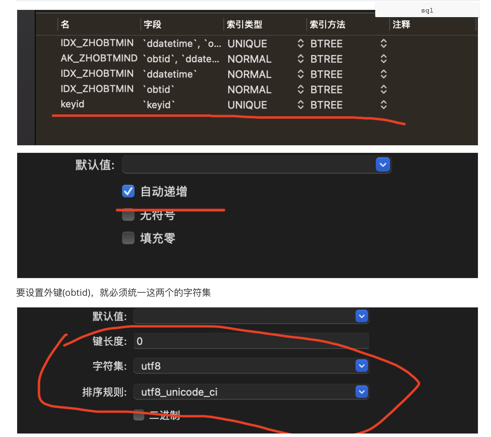
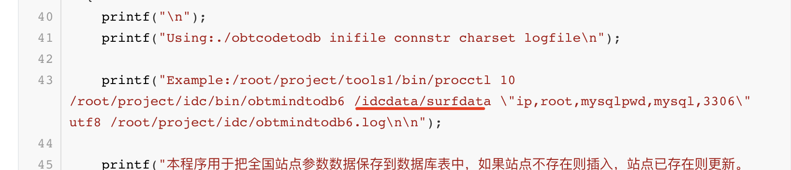
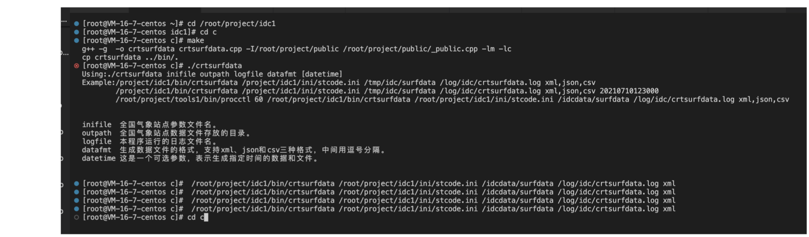
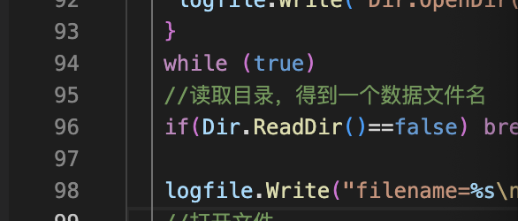

过程：
===

因为没有学第三章，所以直接把生成测试的全国站点观测的分钟数据直接导入/idcdata/surfdata中

步骤：1、先创建与T_ZHOBTCODE相关的数据库T_ZHOBTMIND

```sql
drop index IDX_ZHOBTMIND_3 on T_ZHOBTMIND;

drop index IDX_ZHOBTMIND_2 on T_ZHOBTMIND;

drop index IDX_ZHOBTMIND_1 on T_ZHOBTMIND;

drop table if exists T_ZHOBTMIND;

/*==============================================================*/
/* Table: T_ZHOBTMIND                                           */
/*==============================================================*/
create table T_ZHOBTMIND
(
   obtid                varchar(10) not null comment '站点代码',
   ddatetime            datetime not null comment '数据时间，精确到分钟',
   t                    int comment '湿度， 单位：0.1摄氏度',
   p                    int comment '气压， 单位：0.1百帕',
   u                    int comment '相对湿度，0-100之间的值',
   wd                   int comment '风向：0-360之间的值',
   wf                   int comment '风速：单位0.1m/s',
   r                    int comment 'j降雨量：0.1mm',
   vis                  int comment '能见度：0.1米',
   upttime              timestamp not null comment '更新时间',
   keyid                bigint not null comment '记录编号，自动增长列',
  primary key (obtid, ddatetime),
   key AK_ZHOBTMIND_KEYID (obtid, ddatetime)
);

alter table T_ZHOBTMIND comment '本表存放了全国站点分钟数据，站点数约840个，数据周期为1分钟，应用程序对本表只有insert操作，没有update和d';

/*==============================================================*/
/* Index: IDX_ZHOBTMIND_1                                       */
/*==============================================================*/
create unique index IDX_ZHOBTMIND_1 on T_ZHOBTMIND
(
   ddatetime,
	 obtid
);

/*==============================================================*/
/* Index: IDX_ZHOBTMIND_2                                       */
/*==============================================================*/
create index IDX_ZHOBTMIND_2 on T_ZHOBTMIND
(
   ddatetime
);

/*==============================================================*/
/* Index: IDX_ZHOBTMIND_3                                       */
/*==============================================================*/
create index IDX_ZHOBTMIND_3 on T_ZHOBTMIND
(
	obtid
);

alter table T_ZHOBTMIND add constraint FK_Reference_1 foreign key (obtid)
      references T_ZHOBTCODE (obtid) on delete restrict on update restrict;

```




2、因为这个的意思是往/idcdata/surfdata中提取数据，所以要进入/idcdata/surfdata生成数据






3.这一步是打开目录，读取目录，得到一个数据文件名



最终代码
===

```c++
/*
 *  obtmindtodb2.cpp，本程序用于把全国站点分钟观测数据入库到T_ZHOBTMIND表中，支持xml和csv两种文件格式。
 *  作者：gmc。
*/
#include "_public.h"
#include "_mysql.h"

struct st_zhobtmind
{
  char obtid[11];      // 站点代码。
  char ddatetime[21];  // 数据时间，精确到分钟。
  char t[11];          // 温度，单位：0.1摄氏度。
  char p[11];          // 气压，单位：0.1百帕。
  char u[11];          // 相对湿度，0-100之间的值。
  char wd[11];         // 风向，0-360之间的值。
  char wf[11];         // 风速：单位0.1m/s。
  char r[11];          // 降雨量：0.1mm。
  char vis[11];        // 能见度：0.1米。
}stzhobtmind;

CLogFile logfile;

connection conn;

CPActive PActive;

void EXIT(int sig);

// 业务处理主函数。
bool _obtmindtodb(char *pathname,char *connstr,char *charset);

int main(int argc,char *argv[])
{
  // 帮助文档。
  if (argc!=5)
  {
    printf("\n");
    printf("Using:./obtmindtodb pathname connstr charset logfile\n");

    printf("Example:/project/tools1/bin/procctl 10 /project/idc1/bin/obtmindtodb /idcdata/surfdata \"127.0.0.1,root,mysqlpwd,mysql,3306\" utf8 /log/idc/obtmindtodb.log\n\n");

    printf("本程序用于把全国站点分钟观测数据保存到数据库的T_ZHOBTMIND表中，数据只插入，不更新。\n");
    printf("pathname 全国站点分钟观测数据文件存放的目录。\n");
    printf("connstr  数据库连接参数：ip,username,password,dbname,port\n");
    printf("charset  数据库的字符集。\n");
    printf("logfile  本程序运行的日志文件名。\n");
    printf("程序每10秒运行一次，由procctl调度。\n\n\n");

    return -1;
  }

  // 关闭全部的信号和输入输出。
  // 设置信号,在shell状态下可用 "kill + 进程号" 正常终止些进程。
  // 但请不要用 "kill -9 +进程号" 强行终止。
  CloseIOAndSignal(); signal(SIGINT,EXIT); signal(SIGTERM,EXIT);

  // 打开日志文件。
  if (logfile.Open(argv[4],"a+")==false)
  {
    printf("打开日志文件失败（%s）。\n",argv[4]); return -1;
  }

  // PActive.AddPInfo(30,"obtmindtodb");   // 进程的心跳，30秒足够。
  // 注意，在调试程序的时候，可以启用类似以下的代码，防止超时。
  PActive.AddPInfo(5000,"obtmindtodb");

  // 业务处理主函数。
  _obtmindtodb(argv[1],argv[2],argv[3]);

  return 0;
}

void EXIT(int sig)
{
  logfile.Write("程序退出，sig=%d\n\n",sig);

  conn.disconnect();

  exit(0);
}

// 业务处理主函数。
bool _obtmindtodb(char *pathname,char *connstr,char *charset)
{
  sqlstatement stmt;

  CDir Dir;

  // 打开目录。
  if (Dir.OpenDir(pathname,"*.xml")==false)
  {
    logfile.Write("Dir.OpenDir(%s) failed.\n",pathname); return false;
  }

  CFile File;

  while (true)
  {
    // 读取目录，得到一个数据文件名。
    if (Dir.ReadDir()==false) break;

    // 连接数据库。
    if (conn.m_state==0)
    {
      if (conn.connecttodb(connstr,charset)!=0)
      {
        logfile.Write("connect database(%s) failed.\n%s\n",connstr,conn.m_cda.message); return -1;
      }
    
      logfile.Write("connect database(%s) ok.\n",connstr);
    }

    if (stmt.m_state==0)
    {
      stmt.connect(&conn);
      stmt.prepare("insert into T_ZHOBTMIND(obtid,ddatetime,t,p,u,wd,wf,r,vis) values(:1,str_to_date(:2,'%%Y%%m%%d%%H%%i%%s'),:3,:4,:5,:6,:7,:8,:9)");
      stmt.bindin(1,stzhobtmind.obtid,10);
      stmt.bindin(2,stzhobtmind.ddatetime,14);
      stmt.bindin(3,stzhobtmind.t,10);
      stmt.bindin(4,stzhobtmind.p,10);
      stmt.bindin(5,stzhobtmind.u,10);
      stmt.bindin(6,stzhobtmind.wd,10);
      stmt.bindin(7,stzhobtmind.wf,10);
      stmt.bindin(8,stzhobtmind.r,10);
      stmt.bindin(9,stzhobtmind.vis,10);
    }

    logfile.Write("filename=%s\n",Dir.m_FullFileName);

    // 打开文件。
    if (File.Open(Dir.m_FullFileName,"r")==false)
    {
      logfile.Write("File.Open(%s) failed.\n",Dir.m_FullFileName); return false;
    }

    char strBuffer[1001];   // 存放从文件中读取的一行。

    while (true)
    {
      if (File.FFGETS(strBuffer,1000,"<endl/>")==false) break;
      logfile.Write("strBuffer=%s",strBuffer);

      // 处理文件中的每一行。
      memset(&stzhobtmind,0,sizeof(struct st_zhobtmind));
      GetXMLBuffer(strBuffer,"obtid",stzhobtmind.obtid,10);
      GetXMLBuffer(strBuffer,"ddatetime",stzhobtmind.ddatetime,14);
      char tmp[11];
      GetXMLBuffer(strBuffer,"t",tmp,10);   if (strlen(tmp)>0) snprintf(stzhobtmind.t,10,"%d",(int)(atof(tmp)*10));
      GetXMLBuffer(strBuffer,"p",tmp,10);   if (strlen(tmp)>0) snprintf(stzhobtmind.p,10,"%d",(int)(atof(tmp)*10));
      GetXMLBuffer(strBuffer,"u",stzhobtmind.u,10);
      GetXMLBuffer(strBuffer,"wd",stzhobtmind.wd,10);
      GetXMLBuffer(strBuffer,"wf",tmp,10);  if (strlen(tmp)>0) snprintf(stzhobtmind.wf,10,"%d",(int)(atof(tmp)*10));
      GetXMLBuffer(strBuffer,"r",tmp,10);   if (strlen(tmp)>0) snprintf(stzhobtmind.r,10,"%d",(int)(atof(tmp)*10));
      GetXMLBuffer(strBuffer,"vis",tmp,10); if (strlen(tmp)>0) snprintf(stzhobtmind.vis,10,"%d",(int)(atof(tmp)*10));

      logfile.Write("obtid=%s,ddatetime=%s,t=%s,p=%s,u=%s,wd=%s,wf=%s,r=%s,vis=%s\n",stzhobtmind.obtid,stzhobtmind.ddatetime,stzhobtmind.t,stzhobtmind.p,stzhobtmind.u,stzhobtmind.wd,stzhobtmind.wf,stzhobtmind.r,stzhobtmind.vis);

      // 把结构体中的数据插入表中。
      if (stmt.execute()!=0)
      {
        // 1、失败的情况有哪些？是否全部的失败都要写日志？
        // 答：失败的原因主要有二：一是记录重复，二是数据内容非法。
        // 2、如果失败了怎么办？程序是否需要继续？是否rollback？是否返回false？
        // 答：如果失败的原因是数据内容非法，记录日志后继续；如果是记录重复，不必记录日志，且继续。
        if (stmt.m_cda.rc!=1062)
        {
          logfile.Write("Buffer=%s\n",strBuffer);
          logfile.Write("stmt.execute() failed.\n%s\n%s\n",stmt.m_sql,stmt.m_cda.message);
        }
      }
    }

    // 删除文件、提交事务。
    // File.CloseAndRemove();

    conn.commit();
  }

  return true;
}

```

