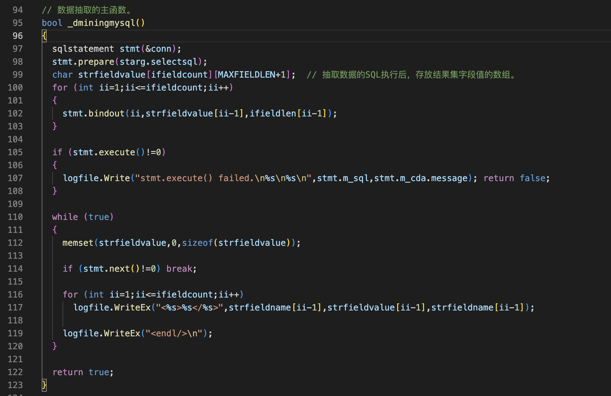

从数据原表中抽取数据生成xml格式

过程
===


最重要的一步
---



完整代码
===

```c++
/*
 *  程序名：dminingmysql3.cpp，本程序是数据中心的公共功能模块，用于从mysql数据库源表抽取数据，生成xml文件。
 *  作者：gmc。
*/
#include "_public.h"
#include "_mysql.h"

// 程序运行参数的结构体。
struct st_arg
{
  char connstr[101];     // 数据库的连接参数。
  char charset[51];      // 数据库的字符集。
  char selectsql[1024];  // 从数据源数据库抽取数据的SQL语句。
  char fieldstr[501];    // 抽取数据的SQL语句输出结果集字段名，字段名之间用逗号分隔。
  char fieldlen[501];    // 抽取数据的SQL语句输出结果集字段的长度，用逗号分隔。
  char bfilename[31];    // 输出xml文件的前缀。
  char efilename[31];    // 输出xml文件的后缀。
  char outpath[301];     // 输出xml文件存放的目录。
  char starttime[52];    // 程序运行的时间区间
  char incfield[31];     // 递增字段名。
  char incfilename[301]; // 已抽取数据的递增字段最大值存放的文件。
  int  timeout;          // 进程心跳的超时时间。
  char pname[51];        // 进程名，建议用"dminingmysql_后缀"的方式。
} starg;

#define MAXFIELDCOUNT  100  // 结果集字段的最大数。
//#define MAXFIELDLEN    500  // 结果集字段值的最大长度。
int MAXFIELDLEN=-1;   // 结果集字段值的最大长度，存放fieldlen数组中元素的最大值。

char strfieldname[MAXFIELDCOUNT][31];    // 结果集字段名数组，从starg.fieldstr解析得到。
int  ifieldlen[MAXFIELDCOUNT];           // 结果集字段的长度数组，从starg.fieldlen解析得到。
int  ifieldcount;                        // strfieldname和ifieldlen数组中有效字段的个数。
int  incfieldpos=-1;                     // 递增字段在结果集数组中的位置。

connection conn;

CLogFile logfile;

// 程序退出和信号2、15的处理函数。
void EXIT(int sig);

void _help();

// 把xml解析到参数starg结构中。
bool _xmltoarg(char *strxmlbuffer);

// 判断当前时间是否在程序运行的时间区间内。
bool instarttime();

// 数据抽取的主函数。
bool _dminingmysql();

CPActive PActive;  // 进程心跳。

int main(int argc,char *argv[])
{
  if (argc!=3) { _help(); return -1; }

  // 关闭全部的信号和输入输出。
  // 设置信号,在shell状态下可用 "kill + 进程号" 正常终止些进程。
  // 但请不要用 "kill -9 +进程号" 强行终止。
  // CloseIOAndSignal(); 
  signal(SIGINT,EXIT); signal(SIGTERM,EXIT);

  // 打开日志文件。
  if (logfile.Open(argv[1],"a+")==false)
  {
    printf("打开日志文件失败（%s）。\n",argv[1]); return -1;
  }

  // 解析xml，得到程序运行的参数。
  if (_xmltoarg(argv[2])==false) return -1;

  // 判断当前时间是否在程序运行的时间区间内。
  if (instarttime()==false) return 0;

  // PActive.AddPInfo(starg.timeout,starg.pname);  // 把进程的心跳信息写入共享内存。
  // 注意，在调试程序的时候，可以启用类似以下的代码，防止超时。
  PActive.AddPInfo(5000,starg.pname);

  // 连接数据库。
  if (conn.connecttodb(starg.connstr,starg.charset)!=0)
  {
    logfile.Write("connect database(%s) failed.\n%s\n",starg.connstr,conn.m_cda.message); return -1;
  }

  logfile.Write("connect database(%s) ok.\n",starg.connstr);

  _dminingmysql();

  return 0;
}

// 数据抽取的主函数。
bool _dminingmysql()
{
  sqlstatement stmt(&conn);
  stmt.prepare(starg.selectsql);
  char strfieldvalue[ifieldcount][MAXFIELDLEN+1];  // 抽取数据的SQL执行后，存放结果集字段值的数组。
  for (int ii=1;ii<=ifieldcount;ii++)
  {
    stmt.bindout(ii,strfieldvalue[ii-1],ifieldlen[ii-1]);
  }

  if (stmt.execute()!=0)
  {
    logfile.Write("stmt.execute() failed.\n%s\n%s\n",stmt.m_sql,stmt.m_cda.message); return false;
  }

  while (true)
  {
    memset(strfieldvalue,0,sizeof(strfieldvalue));

    if (stmt.next()!=0) break;

    for (int ii=1;ii<=ifieldcount;ii++)
      logfile.WriteEx("<%s>%s</%s>",strfieldname[ii-1],strfieldvalue[ii-1],strfieldname[ii-1]);

    logfile.WriteEx("<endl/>\n");
  }

  return true;
}

void EXIT(int sig)
{
  printf("程序退出，sig=%d\n\n",sig);

  exit(0);
}

void _help()
{
  printf("Using:/project/tools1/bin/dminingmysql logfilename xmlbuffer\n\n");

  printf("Sample:/project/tools1/bin/procctl 3600 /project/tools1/bin/dminingmysql /log/idc/dminingmysql_ZHOBTCODE.log \"<connstr>127.0.0.1,root,mysqlpwd,mysql,3306</connstr><charset>utf8</charset><selectsql>select obtid,cityname,provname,lat,lon,height from T_ZHOBTCODE</selectsql><fieldstr>obtid,cityname,provname,lat,lon,height</fieldstr><fieldlen>10,30,30,10,10,10</fieldlen><bfilename>ZHOBTCODE</bfilename><efilename>HYCZ</efilename><outpath>/idcdata/dmindata</outpath><timeout>30</timeout><pname>dminingmysql_ZHOBTCODE</pname>\"\n\n");
  printf("       /project/tools1/bin/procctl   30 /project/tools1/bin/dminingmysql /log/idc/dminingmysql_ZHOBTMIND.log \"<connstr>127.0.0.1,root,mysqlpwd,mysql,3306</connstr><charset>utf8</charset><selectsql>select obtid,date_format(ddatetime,'%%%%Y-%%%%m-%%%%d %%%%H:%%%%i:%%%%s'),t,p,u,wd,wf,r,vis,keyid from t_zhobtmind where keyid>:1 and ddatetime>timestampadd(minute,-120,now())</selectsql><fieldstr>obtid,ddatetime,t,p,u,wd,wf,r,vis,keyid</fieldstr><fieldlen>10,19,8,8,8,8,8,8,8,15</fieldlen><bfilename>ZHOBTMIND</bfilename><efilename>HYCZ</efilename><outpath>/idcdata/dmindata</outpath><starttime></starttime><incfield>keyid</incfield><incfilename>/idcdata/dmining/dminingmysql_ZHOBTMIND_HYCZ.list</incfilename><timeout>30</timeout><pname>dminingmysql_ZHOBTMIND_HYCZ</pname>\"\n\n");

  printf("本程序是数据中心的公共功能模块，用于从mysql数据库源表抽取数据，生成xml文件。\n");
  printf("logfilename 本程序运行的日志文件。\n");
  printf("xmlbuffer   本程序运行的参数，用xml表示，具体如下：\n\n");

  printf("connstr     数据库的连接参数，格式：ip,username,password,dbname,port。\n");
  printf("charset     数据库的字符集，这个参数要与数据源数据库保持一致，否则会出现中文乱码的情况。\n");
  printf("selectsql   从数据源数据库抽取数据的SQL语句，注意：时间函数的百分号%需要四个，显示出来才有两个，被prepare之后将剩一个。\n");
  printf("fieldstr    抽取数据的SQL语句输出结果集字段名，中间用逗号分隔，将作为xml文件的字段名。\n");
  printf("fieldlen    抽取数据的SQL语句输出结果集字段的长度，中间用逗号分隔。fieldstr与fieldlen的字段必须一一对应。\n");
  printf("bfilename   输出xml文件的前缀。\n");
  printf("efilename   输出xml文件的后缀。\n");
  printf("outpath     输出xml文件存放的目录。\n");
  printf("starttime   程序运行的时间区间，例如02,13表示：如果程序启动时，踏中02时和13时则运行，其它时间不运行。"\
         "如果starttime为空，那么starttime参数将失效，只要本程序启动就会执行数据抽取，为了减少数据源"\
         "的压力，从数据库抽取数据的时候，一般在对方数据库最闲的时候时进行。\n");
  printf("incfield    递增字段名，它必须是fieldstr中的字段名，并且只能是整型，一般为自增字段。"\
          "如果incfield为空，表示不采用增量抽取方案。");
  printf("incfilename 已抽取数据的递增字段最大值存放的文件，如果该文件丢失，将重新抽取全部的数据。\n");
  printf("timeout     本程序的超时时间，单位：秒。\n");
  printf("pname       进程名，尽可能采用易懂的、与其它进程不同的名称，方便故障排查。\n\n\n");
}

// 把xml解析到参数starg结构中。
bool _xmltoarg(char *strxmlbuffer)
{
  memset(&starg,0,sizeof(struct st_arg));

  GetXMLBuffer(strxmlbuffer,"connstr",starg.connstr,100);
  if (strlen(starg.connstr)==0) { logfile.Write("connstr is null.\n"); return false; }

  GetXMLBuffer(strxmlbuffer,"charset",starg.charset,50);
  if (strlen(starg.charset)==0) { logfile.Write("charset is null.\n"); return false; }

  GetXMLBuffer(strxmlbuffer,"selectsql",starg.selectsql,1000);
  if (strlen(starg.selectsql)==0) { logfile.Write("selectsql is null.\n"); return false; }

  GetXMLBuffer(strxmlbuffer,"fieldstr",starg.fieldstr,500);
  if (strlen(starg.fieldstr)==0) { logfile.Write("fieldstr is null.\n"); return false; }

  GetXMLBuffer(strxmlbuffer,"fieldlen",starg.fieldlen,500);
  if (strlen(starg.fieldlen)==0) { logfile.Write("fieldlen is null.\n"); return false; }

  GetXMLBuffer(strxmlbuffer,"bfilename",starg.bfilename,30);
  if (strlen(starg.bfilename)==0) { logfile.Write("bfilename is null.\n"); return false; }

  GetXMLBuffer(strxmlbuffer,"efilename",starg.efilename,30);
  if (strlen(starg.efilename)==0) { logfile.Write("efilename is null.\n"); return false; }

  GetXMLBuffer(strxmlbuffer,"outpath",starg.outpath,300);
  if (strlen(starg.outpath)==0) { logfile.Write("outpath is null.\n"); return false; }

  GetXMLBuffer(strxmlbuffer,"starttime",starg.starttime,50);  // 可选参数。

  GetXMLBuffer(strxmlbuffer,"incfield",starg.incfield,30);  // 可选参数。

  GetXMLBuffer(strxmlbuffer,"incfilename",starg.incfilename,300);  // 可选参数。

  GetXMLBuffer(strxmlbuffer,"timeout",&starg.timeout);   // 进程心跳的超时时间。
  if (starg.timeout==0) { logfile.Write("timeout is null.\n");  return false; }

  GetXMLBuffer(strxmlbuffer,"pname",starg.pname,50);     // 进程名。
  if (strlen(starg.pname)==0) { logfile.Write("pname is null.\n");  return false; }

  // 1、把starg.fieldlen解析到ifieldlen数组中；
  CCmdStr CmdStr;

  // 1、把starg.fieldlen解析到ifieldlen数组中；
  CmdStr.SplitToCmd(starg.fieldlen,",");

  // 判断字段数是否超出MAXFIELDCOUNT的限制。
  if (CmdStr.CmdCount()>MAXFIELDCOUNT)
  {
    logfile.Write("fieldlen的字段数太多，超出了最大限制%d。\n",MAXFIELDCOUNT); return false;
  }

  for (int ii=0;ii<CmdStr.CmdCount();ii++)
  {
    CmdStr.GetValue(ii,&ifieldlen[ii]);
    // if (ifieldlen[ii]>MAXFIELDLEN) ifieldlen[ii]=MAXFIELDLEN;   // 字段的长度不能超过MAXFIELDLEN。
    if (ifieldlen[ii]>MAXFIELDLEN) MAXFIELDLEN=ifieldlen[ii];   // 得到字段长度的最大值。
  }

  ifieldcount=CmdStr.CmdCount();

  // 2、把starg.fieldstr解析到strfieldname数组中；
  CmdStr.SplitToCmd(starg.fieldstr,",");

  // 判断字段数是否超出MAXFIELDCOUNT的限制。
  if (CmdStr.CmdCount()>MAXFIELDCOUNT)
  {
    logfile.Write("fieldstr的字段数太多，超出了最大限制%d。\n",MAXFIELDCOUNT); return false;
  }

  for (int ii=0;ii<CmdStr.CmdCount();ii++)
  {
    CmdStr.GetValue(ii,strfieldname[ii],30);
  }

  // 判断strfieldname和ifieldlen两个数组中的字段是否一致。
  if (ifieldcount!=CmdStr.CmdCount())
  {
    logfile.Write("fieldstr和fieldlen的元素数量不一致。\n"); return false;
  }

  // 3、获取自增字段在结果集中的位置。
  if (strlen(starg.incfield)!=0)
  {
    for (int ii=0;ii<ifieldcount;ii++)
      if (strcmp(starg.incfield,strfieldname[ii])==0) { incfieldpos=ii; break; }

    if (incfieldpos==-1)
    {
      logfile.Write("递增字段名%s不在列表%s中。\n",starg.incfield,starg.fieldstr); return false;
    }
  }

  return true;
}

// 判断当前时间是否在程序运行的时间区间内。
bool instarttime()
{
  // 程序运行的时间区间，例如02,13表示：如果程序启动时，踏中02时和13时则运行，其它时间不运行。
  if (strlen(starg.starttime)!=0)
  {
    char strHH24[3];
    memset(strHH24,0,sizeof(strHH24));
    LocalTime(strHH24,"hh24");  // 只获取当前时间中的小时。
    if (strstr(starg.starttime,strHH24)==0) return false;
  }

  return true;
}
```

