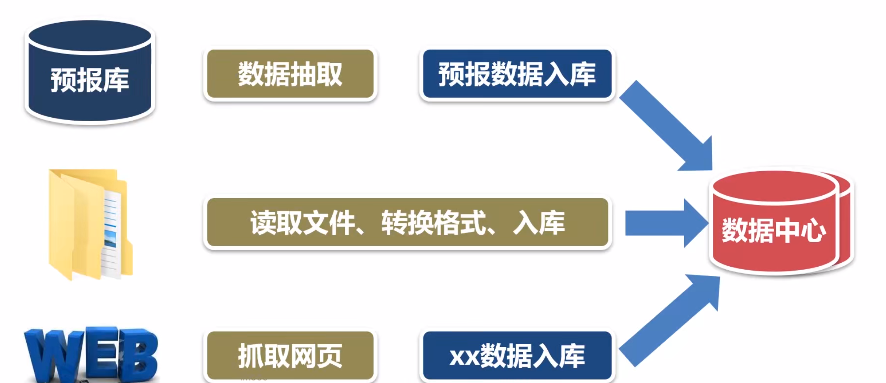
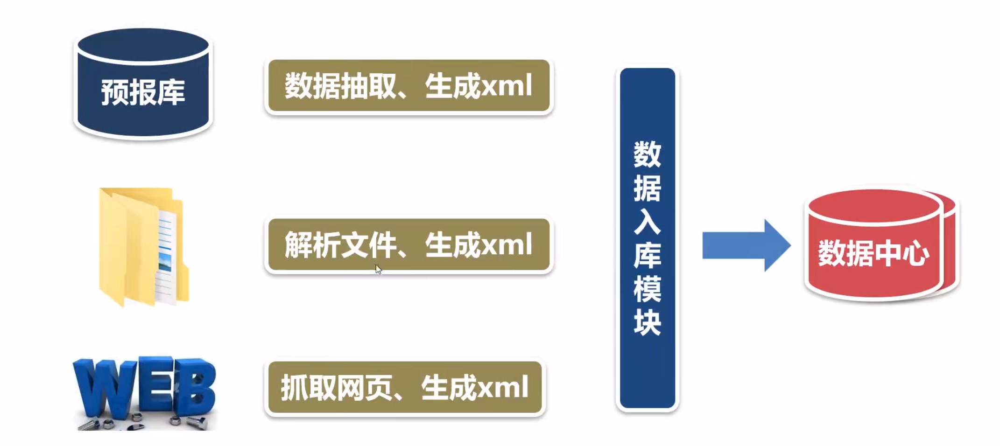

前言
===

- 通用的功能模块，只需要配置参数就可以把xml文件入库
- 支持对表的插入和修改两种操作
- 支持多种数据库

前提
---

- 生成xml文件时，数据的标签与表字段名相同
- 在参数配置文件描述了xml文件与表的对应关系

步骤
---

- 读取目录中的xml文件，查找XML文件与表对应的关系
- 从数据字典中查找表的字段信息
- 解析xml文件，把数据插入表，如果记录已存在，以主键字段为条件，更新表中的记录

