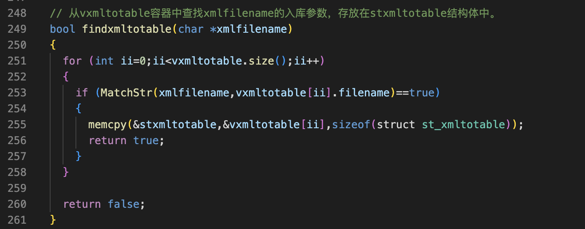
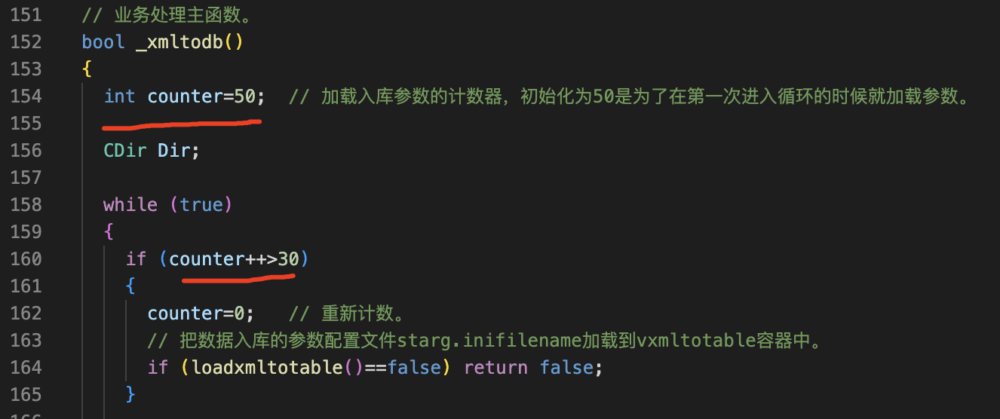
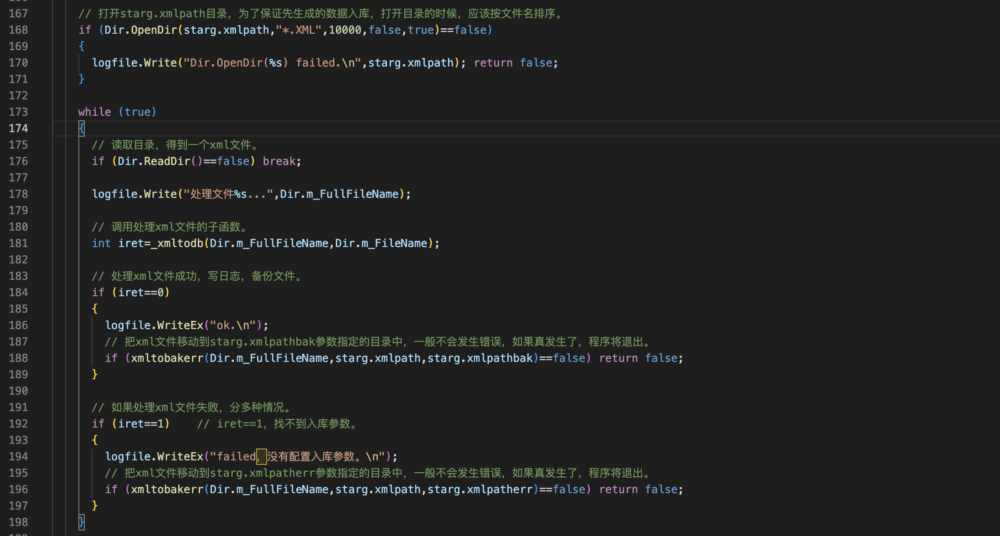

实现加载入库参数，解析参数，读取目录中的文件，备份文件

准备
===


过程
===

开发难度较大

- 把数据入库的参数配置文件starg.inifilename加载到容器中
- 打开start.xmlpath目录

- 读取目录，得到一个xml文件
- 处理xml文件
- 调用处理文件的自函数
- 处理xml文件成功，写日志，备份文件
- 如果处理xml失败，分多种情况

一、声明结构体和容器
---


二、写函数的结构体
---

先是加载参数的函数


再来写查找容器的函数



三、
---

加载入库的参数的代码，不能只加载一次参数，也不能每次循环都加载参数，不太合适，最好的方法是每隔一段时间加载一次参数，使用计数器



四、打开，处理(待入库文件目录)starg.xmlpath
---

主函数中



### 写函数的结构体


把xml文件移动到备份目录或者错误目录


完整代码
===

```c++
/*
 *  程序名：xmltodb2.cpp，本程序是数据中心的公共功能模块，用于把xml文件入库到MySQL的表中。
 *  作者：gmc。
*/
#include "_public.h"
#include "_mysql.h"

struct st_arg
{
  char connstr[101];     // 数据库的连接参数。
  char charset[51];      // 数据库的字符集。
  char inifilename[301]; // 数据入库的参数配置文件。
  char xmlpath[301];     // 待入库xml文件存放的目录。
  char xmlpathbak[301];  // xml文件入库后的备份目录。
  char xmlpatherr[301];  // 入库失败的xml文件存放的目录。
  int  timetvl;          // 本程序运行的时间间隔，本程序常驻内存。
  int  timeout;          // 本程序运行时的超时时间。
  char pname[51];        // 本程序运行时的程序名。
} starg;

// 显示程序的帮助
void _help(char *argv[]);

// 把xml解析到参数starg结构中
bool _xmltoarg(char *strxmlbuffer);

CLogFile logfile;

connection conn;
 
void EXIT(int sig);

// 业务处理主函数。
bool _xmltodb();

struct st_xmltotable
{
  char filename[101];    // xml文件的匹配规则，用逗号分隔。
  char tname[31];        // 待入库的表名。
  int  uptbz;            // 更新标志：1-更新；2-不更新。
  char execsql[301];     // 处理xml文件之前，执行的SQL语句。
} stxmltotable;
vector<struct st_xmltotable> vxmltotable;   // 数据入库的参数的容器。
// 把数据入库的参数配置文件starg.inifilename加载到vxmltotable容器中。
bool loadxmltotable();
// 从vxmltotable容器中查找xmlfilename的入库参数，存放在stxmltotable结构体中。
bool findxmltotable(char *xmlfilename);

// 调用处理xml文件的子函数，返回值：0-成功，其它的都是失败，失败的情况有很多种，暂时不确定。
int _xmltodb(char *fullfilename,char *filename);

// 把xml文件移动到备份目录或错误目录。
bool xmltobakerr(char *fullfilename,char *srcpath,char *dstpath);

int main(int argc,char *argv[])
{
  if (argc!=3) { _help(argv); return -1; }

  // 关闭全部的信号和输入输出。
  // 设置信号,在shell状态下可用 "kill + 进程号" 正常终止些进程。
  // 但请不要用 "kill -9 +进程号" 强行终止。
  // CloseIOAndSignal();
  signal(SIGINT,EXIT); signal(SIGTERM,EXIT);

  if (logfile.Open(argv[1],"a+")==false)
  {
    printf("打开日志文件失败（%s）。\n",argv[1]); return -1;
  }

  // 把xml解析到参数starg结构中
  if (_xmltoarg(argv[2])==false) return -1;

  if (conn.connecttodb(starg.connstr,starg.charset) != 0)
  {
    printf("connect database(%s) failed.\n%s\n",starg.connstr,conn.m_cda.message); EXIT(-1);
  }

  logfile.Write("connect database(%s) ok.\n",starg.connstr);

  // 业务处理主函数。
  _xmltodb();
}

// 显示程序的帮助
void _help(char *argv[])
{
  printf("Using:/project/tools1/bin/xmltodb logfilename xmlbuffer\n\n");

  printf("Sample:/project/tools1/bin/procctl 10 /project/tools1/bin/xmltodb /log/idc/xmltodb_vip1.log \"<connstr>127.0.0.1,root,mysqlpwd,mysql,3306</connstr><charset>utf8</charset><inifilename>/project/tools/ini/xmltodb.xml</inifilename><xmlpath>/idcdata/xmltodb/vip1</xmlpath><xmlpathbak>/idcdata/xmltodb/vip1bak</xmlpathbak><xmlpatherr>/idcdata/xmltodb/vip1err</xmlpatherr><timetvl>5</timetvl><timeout>50</timeout><pname>xmltodb_vip1</pname>\"\n\n");

  printf("本程序是数据中心的公共功能模块，用于把xml文件入库到MySQL的表中。\n");
  printf("logfilename   本程序运行的日志文件。\n");
  printf("xmlbuffer     本程序运行的参数，用xml表示，具体如下：\n\n");

  printf("connstr     数据库的连接参数，格式：ip,username,password,dbname,port。\n");
  printf("charset     数据库的字符集，这个参数要与数据源数据库保持一致，否则会出现中文乱码的情况。\n");
  printf("inifilename 数据入库的参数配置文件。\n");
  printf("xmlpath     待入库xml文件存放的目录。\n");
  printf("xmlpathbak  xml文件入库后的备份目录。\n");
  printf("xmlpatherr  入库失败的xml文件存放的目录。\n");
  printf("timetvl     本程序的时间间隔，单位：秒，视业务需求而定，2-30之间。\n");
  printf("timeout     本程序的超时时间，单位：秒，视xml文件大小而定，建议设置30以上。\n");
  printf("pname       进程名，尽可能采用易懂的、与其它进程不同的名称，方便故障排查。\n\n");
}

// 把xml解析到参数starg结构中
bool _xmltoarg(char *strxmlbuffer)
{
  memset(&starg,0,sizeof(struct st_arg));

  GetXMLBuffer(strxmlbuffer,"connstr",starg.connstr,100);
  if (strlen(starg.connstr)==0) { logfile.Write("connstr is null.\n"); return false; }

  GetXMLBuffer(strxmlbuffer,"charset",starg.charset,50);
  if (strlen(starg.charset)==0) { logfile.Write("charset is null.\n"); return false; }

  GetXMLBuffer(strxmlbuffer,"inifilename",starg.inifilename,300);
  if (strlen(starg.inifilename)==0) { logfile.Write("inifilename is null.\n"); return false; }

  GetXMLBuffer(strxmlbuffer,"xmlpath",starg.xmlpath,300);
  if (strlen(starg.xmlpath)==0) { logfile.Write("xmlpath is null.\n"); return false; }

  GetXMLBuffer(strxmlbuffer,"xmlpathbak",starg.xmlpathbak,300);
  if (strlen(starg.xmlpathbak)==0) { logfile.Write("xmlpathbak is null.\n"); return false; }

  GetXMLBuffer(strxmlbuffer,"xmlpatherr",starg.xmlpatherr,300);
  if (strlen(starg.xmlpatherr)==0) { logfile.Write("xmlpatherr is null.\n"); return false; }

  GetXMLBuffer(strxmlbuffer,"timetvl",&starg.timetvl);
  if (starg.timetvl< 2) starg.timetvl=2;   
  if (starg.timetvl>30) starg.timetvl=30;

  GetXMLBuffer(strxmlbuffer,"timeout",&starg.timeout);
  if (starg.timeout==0) { logfile.Write("timeout is null.\n"); return false; }

  GetXMLBuffer(strxmlbuffer,"pname",starg.pname,50);
  if (strlen(starg.pname)==0) { logfile.Write("pname is null.\n"); return false; }

  return true;
}

void EXIT(int sig)
{
  logfile.Write("程序退出，sig=%d\n\n",sig);

  conn.disconnect();

  exit(0);
}

// 业务处理主函数。
bool _xmltodb()
{
  int counter=50;  // 加载入库参数的计数器，初始化为50是为了在第一次进入循环的时候就加载参数。

  CDir Dir;

  while (true)
  {
    if (counter++>30)
    {
      counter=0;   // 重新计数。
      // 把数据入库的参数配置文件starg.inifilename加载到vxmltotable容器中。
      if (loadxmltotable()==false) return false;
    }

    // 打开starg.xmlpath目录，为了保证先生成的数据入库，打开目录的时候，应该按文件名排序。
    if (Dir.OpenDir(starg.xmlpath,"*.XML",10000,false,true)==false)
    {
      logfile.Write("Dir.OpenDir(%s) failed.\n",starg.xmlpath); return false;
    }

    while (true)
    {
      // 读取目录，得到一个xml文件。
      if (Dir.ReadDir()==false) break;

      logfile.Write("处理文件%s...",Dir.m_FullFileName);

      // 调用处理xml文件的子函数。
      int iret=_xmltodb(Dir.m_FullFileName,Dir.m_FileName);

      // 处理xml文件成功，写日志，备份文件。
      if (iret==0)
      {
        logfile.WriteEx("ok.\n");
        // 把xml文件移动到starg.xmlpathbak参数指定的目录中，一般不会发生错误，如果真发生了，程序将退出。
        if (xmltobakerr(Dir.m_FullFileName,starg.xmlpath,starg.xmlpathbak)==false) return false;
      }

      // 如果处理xml文件失败，分多种情况。
      if (iret==1)    // iret==1，找不到入库参数。
      {
        logfile.WriteEx("failed，没有配置入库参数。\n");
        // 把xml文件移动到starg.xmlpatherr参数指定的目录中，一般不会发生错误，如果真发生了，程序将退出。
        if (xmltobakerr(Dir.m_FullFileName,starg.xmlpath,starg.xmlpatherr)==false) return false;
      }
    }

    break;
    sleep(starg.timetvl);
  }

  return true;
}

// 调用处理xml文件的子函数，返回值：0-成功，其它的都是失败，失败的情况有很多种，暂时不确定。
int _xmltodb(char *fullfilename,char *filename)
{
  // 从vxmltotable容器中查找filename的入库参数，存放在stxmltotable结构体中。
  if (findxmltotable(filename)==false) return 1; 

  return 0;
}

// 把数据入库的参数配置文件starg.inifilename加载到vxmltotable容器中。
bool loadxmltotable()
{
  vxmltotable.clear();

  CFile File;
  if (File.Open(starg.inifilename,"r")==false)
  {
    logfile.Write("File.Open(%s) 失败。\n",starg.inifilename); return false;
  }

  char strBuffer[501];

  while (true)
  {
    if (File.FFGETS(strBuffer,500,"<endl/>")==false) break;

    memset(&stxmltotable,0,sizeof(struct st_xmltotable));

    GetXMLBuffer(strBuffer,"filename",stxmltotable.filename,100); // xml文件的匹配规则，用逗号分隔。
    GetXMLBuffer(strBuffer,"tname",stxmltotable.tname,30);        // 待入库的表名。
    GetXMLBuffer(strBuffer,"uptbz",&stxmltotable.uptbz);          // 更新标志：1-更新；2-不更新。
    GetXMLBuffer(strBuffer,"execsql",stxmltotable.execsql,300);   // 处理xml文件之前，执行的SQL语句。
   
    vxmltotable.push_back(stxmltotable);
  }

  logfile.Write("loadxmltotable(%s) ok.\n",starg.inifilename);

  return true;
}

// 从vxmltotable容器中查找xmlfilename的入库参数，存放在stxmltotable结构体中。
bool findxmltotable(char *xmlfilename)
{
  for (int ii=0;ii<vxmltotable.size();ii++)
  {
    if (MatchStr(xmlfilename,vxmltotable[ii].filename)==true)
    {
      memcpy(&stxmltotable,&vxmltotable[ii],sizeof(struct st_xmltotable));
      return true;
    }
  }

  return false;
}

// 把xml文件移动到备份目录或错误目录。
bool xmltobakerr(char *fullfilename,char *srcpath,char *dstpath)
{
  char dstfilename[301];   // 目标文件名。
  STRCPY(dstfilename,sizeof(dstfilename),fullfilename);

  UpdateStr(dstfilename,srcpath,dstpath,false);    // 小心第四个参数，一定要填false。

  if (RENAME(fullfilename,dstfilename)==false)
  {
    logfile.Write("RENAME(%s,%s) failed.\n",fullfilename,dstfilename); return false;
  }

  return true;
}
```

