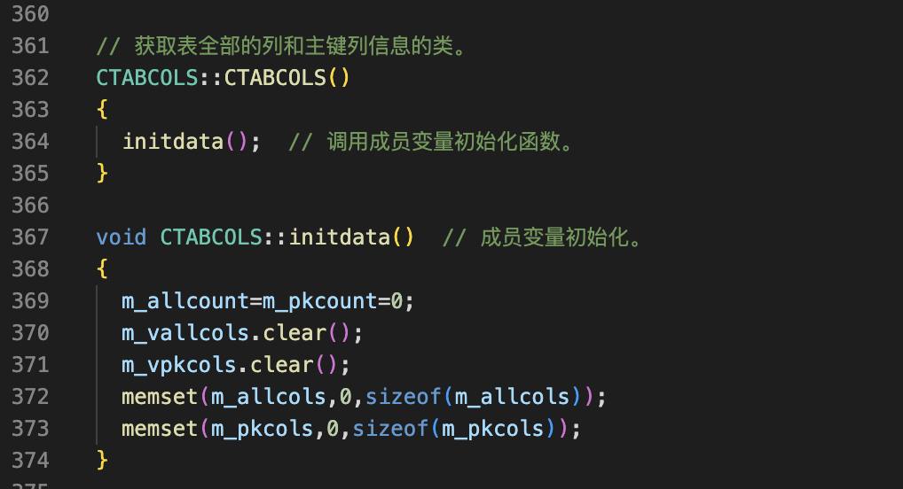
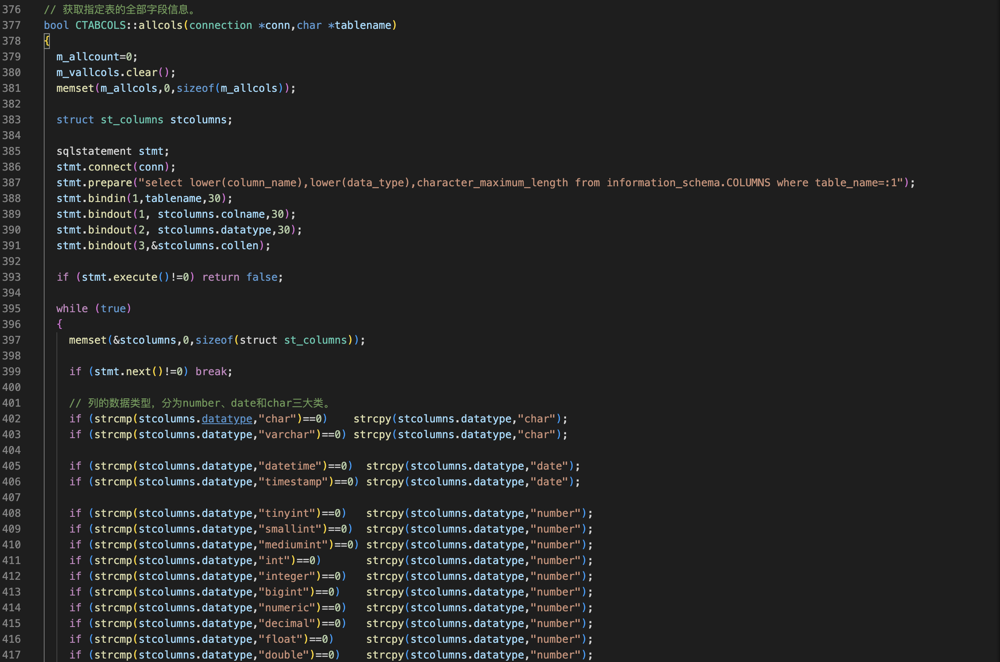
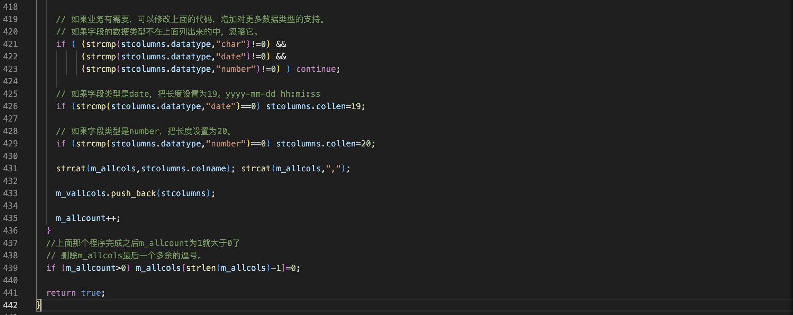
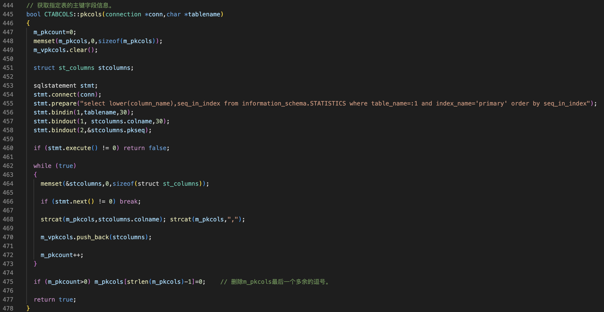

目的
===

开始处理文件

在入库参数中，有xml文件名与表对应关系，在处理文件之前先查询mysql的数据字典，把表的字段信息拿出来，有了字段和表的信息就可以拼接出插入和修改表的SQL语句，再准备插入和修改表的SQL语句绑定输入变量 

-  获取表全部的字段和主键信息

- 在处理xml文件之前，如果stxmltotable.execsql不为空，就执行它
- 打开xml文件
- 用循环来处理文件的每一行

过程
===

1、 获取表全部的字段和主键信息
---


### 实现这个类的功能



获取指定表的全部字段信息



 获取指定表的主键字段信息。



2 处理运行时报错
---

在xmltodb业务子函数添加


在业务处理主函数中添加


最终代码
===

```c++
/*
 *  程序名：xmltodb3.cpp，本程序是数据中心的公共功能模块，用于把xml文件入库到MySQL的表中。
 *  作者：。
*/
#include "_public.h"
#include "_mysql.h"

// 表的列(字段)信息的结构体。
struct st_columns
{
  char  colname[31];  // 列名。
  char  datatype[31]; // 列的数据类型，分为number、date和char三大类。
  int   collen;       // 列的长度，number固定20，date固定19，char的长度由表结构决定。
  int   pkseq;        // 如果列是主键的字段，存放主键字段的顺序，从1开始，不是主键取值0。
};

// 获取表全部的列和主键列信息的类。
class CTABCOLS
{
public:
  CTABCOLS();

  int m_allcount;   // 全部字段的个数。
  int m_pkcount;    // 主键字段的个数。

  vector<struct st_columns> m_vallcols;  // 存放全部字段信息的容器。
  vector<struct st_columns> m_vpkcols;   // 存放主键字段信息的容器。

  char m_allcols[3001];  // 全部的字段名列表，以字符串存放，中间用半角的逗号分隔。
  char m_pkcols[301];    // 主键字段名列表，以字符串存放，中间用半角的逗号分隔。

  void initdata();  // 成员变量初始化。

  // 获取指定表的全部字段信息。
  bool allcols(connection *conn,char *tablename);

  // 获取指定表的主键字段信息。
  bool pkcols(connection *conn,char *tablename);
};

struct st_arg
{
  char connstr[101];     // 数据库的连接参数。
  char charset[51];      // 数据库的字符集。
  char inifilename[301]; // 数据入库的参数配置文件。
  char xmlpath[301];     // 待入库xml文件存放的目录。
  char xmlpathbak[301];  // xml文件入库后的备份目录。
  char xmlpatherr[301];  // 入库失败的xml文件存放的目录。
  int  timetvl;          // 本程序运行的时间间隔，本程序常驻内存。
  int  timeout;          // 本程序运行时的超时时间。
  char pname[51];        // 本程序运行时的程序名。
} starg;

// 显示程序的帮助
void _help(char *argv[]);

// 把xml解析到参数starg结构中
bool _xmltoarg(char *strxmlbuffer);

CLogFile logfile;

connection conn;
 
void EXIT(int sig);

// 业务处理主函数。
bool _xmltodb();

struct st_xmltotable
{
  char filename[101];    // xml文件的匹配规则，用逗号分隔。
  char tname[31];        // 待入库的表名。
  int  uptbz;            // 更新标志：1-更新；2-不更新。
  char execsql[301];     // 处理xml文件之前，执行的SQL语句。
} stxmltotable;
vector<struct st_xmltotable> vxmltotable;   // 数据入库的参数的容器。
// 把数据入库的参数配置文件starg.inifilename加载到vxmltotable容器中。
bool loadxmltotable();
// 从vxmltotable容器中查找xmlfilename的入库参数，存放在stxmltotable结构体中。
bool findxmltotable(char *xmlfilename);

// 处理xml文件的子函数，返回值：0-成功，其它的都是失败，失败的情况有很多种，暂时不确定。
int _xmltodb(char *fullfilename,char *filename);

// 把xml文件移动到备份目录或错误目录。
bool xmltobakerr(char *fullfilename,char *srcpath,char *dstpath);

int main(int argc,char *argv[])
{
  if (argc!=3) { _help(argv); return -1; }

  // 关闭全部的信号和输入输出。
  // 设置信号,在shell状态下可用 "kill + 进程号" 正常终止些进程。
  // 但请不要用 "kill -9 +进程号" 强行终止。
  // CloseIOAndSignal();
  signal(SIGINT,EXIT); signal(SIGTERM,EXIT);

  if (logfile.Open(argv[1],"a+")==false)
  {
    printf("打开日志文件失败（%s）。\n",argv[1]); return -1;
  }

  // 把xml解析到参数starg结构中
  if (_xmltoarg(argv[2])==false) return -1;

  if (conn.connecttodb(starg.connstr,starg.charset) != 0)
  {
    printf("connect database(%s) failed.\n%s\n",starg.connstr,conn.m_cda.message); EXIT(-1);
  }

  logfile.Write("connect database(%s) ok.\n",starg.connstr);

  // 业务处理主函数。
  _xmltodb();
}

// 显示程序的帮助
void _help(char *argv[])
{
  printf("Using:/project/tools1/bin/xmltodb logfilename xmlbuffer\n\n");

  printf("Sample:/project/tools1/bin/procctl 10 /project/tools1/bin/xmltodb /log/idc/xmltodb_vip1.log \"<connstr>127.0.0.1,root,mysqlpwd,mysql,3306</connstr><charset>utf8</charset><inifilename>/project/tools/ini/xmltodb.xml</inifilename><xmlpath>/idcdata/xmltodb/vip1</xmlpath><xmlpathbak>/idcdata/xmltodb/vip1bak</xmlpathbak><xmlpatherr>/idcdata/xmltodb/vip1err</xmlpatherr><timetvl>5</timetvl><timeout>50</timeout><pname>xmltodb_vip1</pname>\"\n\n");

  printf("本程序是数据中心的公共功能模块，用于把xml文件入库到MySQL的表中。\n");
  printf("logfilename   本程序运行的日志文件。\n");
  printf("xmlbuffer     本程序运行的参数，用xml表示，具体如下：\n\n");

  printf("connstr     数据库的连接参数，格式：ip,username,password,dbname,port。\n");
  printf("charset     数据库的字符集，这个参数要与数据源数据库保持一致，否则会出现中文乱码的情况。\n");
  printf("inifilename 数据入库的参数配置文件。\n");
  printf("xmlpath     待入库xml文件存放的目录。\n");
  printf("xmlpathbak  xml文件入库后的备份目录。\n");
  printf("xmlpatherr  入库失败的xml文件存放的目录。\n");
  printf("timetvl     本程序的时间间隔，单位：秒，视业务需求而定，2-30之间。\n");
  printf("timeout     本程序的超时时间，单位：秒，视xml文件大小而定，建议设置30以上。\n");
  printf("pname       进程名，尽可能采用易懂的、与其它进程不同的名称，方便故障排查。\n\n");
}

// 把xml解析到参数starg结构中
bool _xmltoarg(char *strxmlbuffer)
{
  memset(&starg,0,sizeof(struct st_arg));

  GetXMLBuffer(strxmlbuffer,"connstr",starg.connstr,100);
  if (strlen(starg.connstr)==0) { logfile.Write("connstr is null.\n"); return false; }

  GetXMLBuffer(strxmlbuffer,"charset",starg.charset,50);
  if (strlen(starg.charset)==0) { logfile.Write("charset is null.\n"); return false; }

  GetXMLBuffer(strxmlbuffer,"inifilename",starg.inifilename,300);
  if (strlen(starg.inifilename)==0) { logfile.Write("inifilename is null.\n"); return false; }

  GetXMLBuffer(strxmlbuffer,"xmlpath",starg.xmlpath,300);
  if (strlen(starg.xmlpath)==0) { logfile.Write("xmlpath is null.\n"); return false; }

  GetXMLBuffer(strxmlbuffer,"xmlpathbak",starg.xmlpathbak,300);
  if (strlen(starg.xmlpathbak)==0) { logfile.Write("xmlpathbak is null.\n"); return false; }

  GetXMLBuffer(strxmlbuffer,"xmlpatherr",starg.xmlpatherr,300);
  if (strlen(starg.xmlpatherr)==0) { logfile.Write("xmlpatherr is null.\n"); return false; }

  GetXMLBuffer(strxmlbuffer,"timetvl",&starg.timetvl);
  if (starg.timetvl< 2) starg.timetvl=2;   
  if (starg.timetvl>30) starg.timetvl=30;

  GetXMLBuffer(strxmlbuffer,"timeout",&starg.timeout);
  if (starg.timeout==0) { logfile.Write("timeout is null.\n"); return false; }

  GetXMLBuffer(strxmlbuffer,"pname",starg.pname,50);
  if (strlen(starg.pname)==0) { logfile.Write("pname is null.\n"); return false; }

  return true;
}

void EXIT(int sig)
{
  logfile.Write("程序退出，sig=%d\n\n",sig);

  conn.disconnect();

  exit(0);
}

// 业务处理主函数。
bool _xmltodb()
{
  int counter=50;  // 加载入库参数的计数器，初始化为50是为了在第一次进入循环的时候就加载参数。

  CDir Dir;

  while (true)
  {
    if (counter++>30)
    {
      counter=0;   // 重新计数。
      // 把数据入库的参数配置文件starg.inifilename加载到vxmltotable容器中。
      if (loadxmltotable()==false) return false;
    }

    // 打开starg.xmlpath目录，为了保证先生成的数据入库，打开目录的时候，应该按文件名排序。
    if (Dir.OpenDir(starg.xmlpath,"*.XML",10000,false,true)==false)
    {
      logfile.Write("Dir.OpenDir(%s) failed.\n",starg.xmlpath); return false;
    }

    while (true)
    {
      // 读取目录，得到一个xml文件。
      if (Dir.ReadDir()==false) break;

      logfile.Write("处理文件%s...",Dir.m_FullFileName);

      // 调用处理xml文件的子函数。
      int iret=_xmltodb(Dir.m_FullFileName,Dir.m_FileName);

      // 处理xml文件成功，写日志，备份文件。
      if (iret==0)
      {
        logfile.WriteEx("ok.\n");
        // 把xml文件移动到starg.xmlpathbak参数指定的目录中，一般不会发生错误，如果真发生了，程序将退出。
        if (xmltobakerr(Dir.m_FullFileName,starg.xmlpath,starg.xmlpathbak)==false) return false;
      }

      // 1-没有配置入库参数；2-待入库的表不存在；
      if ( (iret==1) || (iret==2) )
      {
        if (iret==1) logfile.WriteEx("failed，没有配置入库参数。\n");
        if (iret==2) logfile.WriteEx("failed，待入库的表（%s）不存在。\n",stxmltotable.tname);

        // 把xml文件移动到starg.xmlpatherr参数指定的目录中，一般不会发生错误，如果真发生了，程序将退出。
        if (xmltobakerr(Dir.m_FullFileName,starg.xmlpath,starg.xmlpatherr)==false) return false;
      }

      // 数据库错误，函数返回，程序将退出。
      if (iret==4)
      {
        logfile.WriteEx("failed，数据库错误。\n"); return false;
      }
    }

    break;
    sleep(starg.timetvl);
  }

  return true;
}

// 处理xml文件的子函数，返回值：0-成功，其它的都是失败，失败的情况有很多种，暂时不确定。
int _xmltodb(char *fullfilename,char *filename)
{
  // 从vxmltotable容器中查找filename的入库参数，存放在stxmltotable结构体中。
  if (findxmltotable(filename)==false) return 1; 

  CTABCOLS TABCOLS;

  // 获取表全部的字段和主键信息，如果获取失败，应该是数据库连接已失效。
  // 在本程序运行的过程中，如果数据库出现异常，一定会在这里发现。
  //数据库的错误代码统一用4
  if (TABCOLS.allcols(&conn,stxmltotable.tname)==false) return 4;
  if (TABCOLS.pkcols(&conn,stxmltotable.tname)==false)  return 4;
  
  // 如果TABCOLS.m_allcount为0，说明表根本不存在，返回2。
  if (TABCOLS.m_allcount==0) return 2; // 待入库的表不存在。

  // 拼接生成插入和更新表数据的SQL。

  // prepare插入和更新的sql语句，绑定输入变量。

  // 在处理xml文件之前，如果stxmltotable.execsql不为空，就执行它。

  // 打开xml文件。

/*
  while (true)
  {
    // 从xml文件中读取一行。

    // 解析xml，存放在已绑定的输入变量中。

    // 执行插入和更新的SQL。
  }
*/

  return 0;
}

// 把数据入库的参数配置文件starg.inifilename加载到vxmltotable容器中。
bool loadxmltotable()
{
  vxmltotable.clear();

  CFile File;
  if (File.Open(starg.inifilename,"r")==false)
  {
    logfile.Write("File.Open(%s) 失败。\n",starg.inifilename); return false;
  }

  char strBuffer[501];

  while (true)
  {
    if (File.FFGETS(strBuffer,500,"<endl/>")==false) break;

    memset(&stxmltotable,0,sizeof(struct st_xmltotable));

    GetXMLBuffer(strBuffer,"filename",stxmltotable.filename,100); // xml文件的匹配规则，用逗号分隔。
    GetXMLBuffer(strBuffer,"tname",stxmltotable.tname,30);        // 待入库的表名。
    GetXMLBuffer(strBuffer,"uptbz",&stxmltotable.uptbz);          // 更新标志：1-更新；2-不更新。
    GetXMLBuffer(strBuffer,"execsql",stxmltotable.execsql,300);   // 处理xml文件之前，执行的SQL语句。
   
    vxmltotable.push_back(stxmltotable);
  }

  logfile.Write("loadxmltotable(%s) ok.\n",starg.inifilename);

  return true;
}

// 从vxmltotable容器中查找xmlfilename的入库参数，存放在stxmltotable结构体中。
bool findxmltotable(char *xmlfilename)
{
  for (int ii=0;ii<vxmltotable.size();ii++)
  {
    if (MatchStr(xmlfilename,vxmltotable[ii].filename)==true)
    {
      memcpy(&stxmltotable,&vxmltotable[ii],sizeof(struct st_xmltotable));
      return true;
    }
  }

  return false;
}

// 把xml文件移动到备份目录或错误目录。
bool xmltobakerr(char *fullfilename,char *srcpath,char *dstpath)
{
  char dstfilename[301];   // 目标文件名。
  STRCPY(dstfilename,sizeof(dstfilename),fullfilename);

  UpdateStr(dstfilename,srcpath,dstpath,false);    // 小心第四个参数，一定要填false。

  if (RENAME(fullfilename,dstfilename)==false)
  {
    logfile.Write("RENAME(%s,%s) failed.\n",fullfilename,dstfilename); return false;
  }

  return true;
}

/*
// 表的列(字段)信息的结构体。
struct st_columns
{
  char  colname[31];  // 列名。
  char  datatype[31]; // 列的数据类型，分为number、date和char三大类。
  int   collen;       // 列的长度，number固定20，date固定19，char的长度由表结构决定。
  int   pkseq;        // 如果列是主键的字段，存放主键字段的顺序，从1开始，不是主键取值0。
};
*/

// 获取表全部的列和主键列信息的类。
CTABCOLS::CTABCOLS()
{
  initdata();  // 调用成员变量初始化函数。
}

void CTABCOLS::initdata()  // 成员变量初始化。
{
  m_allcount=m_pkcount=0;
  m_vallcols.clear();
  m_vpkcols.clear();
  memset(m_allcols,0,sizeof(m_allcols));
  memset(m_pkcols,0,sizeof(m_pkcols));
}

// 获取指定表的全部字段信息。
bool CTABCOLS::allcols(connection *conn,char *tablename)
{
  m_allcount=0;
  m_vallcols.clear();
  memset(m_allcols,0,sizeof(m_allcols));

  struct st_columns stcolumns;

  sqlstatement stmt;
  stmt.connect(conn);
  stmt.prepare("select lower(column_name),lower(data_type),character_maximum_length from information_schema.COLUMNS where table_name=:1");
  stmt.bindin(1,tablename,30);
  stmt.bindout(1, stcolumns.colname,30);
  stmt.bindout(2, stcolumns.datatype,30);
  stmt.bindout(3,&stcolumns.collen);

  if (stmt.execute()!=0) return false;

  while (true)
  {
    memset(&stcolumns,0,sizeof(struct st_columns));
  
    if (stmt.next()!=0) break;

    // 列的数据类型，分为number、date和char三大类。
    if (strcmp(stcolumns.datatype,"char")==0)    strcpy(stcolumns.datatype,"char");
    if (strcmp(stcolumns.datatype,"varchar")==0) strcpy(stcolumns.datatype,"char");

    if (strcmp(stcolumns.datatype,"datetime")==0)  strcpy(stcolumns.datatype,"date");
    if (strcmp(stcolumns.datatype,"timestamp")==0) strcpy(stcolumns.datatype,"date");
    
    if (strcmp(stcolumns.datatype,"tinyint")==0)   strcpy(stcolumns.datatype,"number");
    if (strcmp(stcolumns.datatype,"smallint")==0)  strcpy(stcolumns.datatype,"number");
    if (strcmp(stcolumns.datatype,"mediumint")==0) strcpy(stcolumns.datatype,"number");
    if (strcmp(stcolumns.datatype,"int")==0)       strcpy(stcolumns.datatype,"number");
    if (strcmp(stcolumns.datatype,"integer")==0)   strcpy(stcolumns.datatype,"number");
    if (strcmp(stcolumns.datatype,"bigint")==0)    strcpy(stcolumns.datatype,"number");
    if (strcmp(stcolumns.datatype,"numeric")==0)   strcpy(stcolumns.datatype,"number");
    if (strcmp(stcolumns.datatype,"decimal")==0)   strcpy(stcolumns.datatype,"number");
    if (strcmp(stcolumns.datatype,"float")==0)     strcpy(stcolumns.datatype,"number");
    if (strcmp(stcolumns.datatype,"double")==0)    strcpy(stcolumns.datatype,"number");

    // 如果业务有需要，可以修改上面的代码，增加对更多数据类型的支持。
    // 如果字段的数据类型不在上面列出来的中，忽略它。
    if ( (strcmp(stcolumns.datatype,"char")!=0) &&
         (strcmp(stcolumns.datatype,"date")!=0) &&
         (strcmp(stcolumns.datatype,"number")!=0) ) continue;

    // 如果字段类型是date，把长度设置为19。yyyy-mm-dd hh:mi:ss
    if (strcmp(stcolumns.datatype,"date")==0) stcolumns.collen=19;

    // 如果字段类型是number，把长度设置为20。
    if (strcmp(stcolumns.datatype,"number")==0) stcolumns.collen=20;

    strcat(m_allcols,stcolumns.colname); strcat(m_allcols,",");

    m_vallcols.push_back(stcolumns);

    m_allcount++;
  }
  //上面那个程序完成之后m_allcount为1就大于0了
  // 删除m_allcols最后一个多余的逗号。
  if (m_allcount>0) m_allcols[strlen(m_allcols)-1]=0;

  return true;
}

// 获取指定表的主键字段信息。
bool CTABCOLS::pkcols(connection *conn,char *tablename)
{
  m_pkcount=0;
  memset(m_pkcols,0,sizeof(m_pkcols));
  m_vpkcols.clear();

  struct st_columns stcolumns;

  sqlstatement stmt;
  stmt.connect(conn);
  stmt.prepare("select lower(column_name),seq_in_index from information_schema.STATISTICS where table_name=:1 and index_name='primary' order by seq_in_index");
  stmt.bindin(1,tablename,30);
  stmt.bindout(1, stcolumns.colname,30);
  stmt.bindout(2,&stcolumns.pkseq);

  if (stmt.execute() != 0) return false;

  while (true)
  {
    memset(&stcolumns,0,sizeof(struct st_columns));

    if (stmt.next() != 0) break;

    strcat(m_pkcols,stcolumns.colname); strcat(m_pkcols,",");

    m_vpkcols.push_back(stcolumns);

    m_pkcount++;
  }

  if (m_pkcount>0) m_pkcols[strlen(m_pkcols)-1]=0;    // 删除m_pkcols最后一个多余的逗号。

  return true;
}
```

