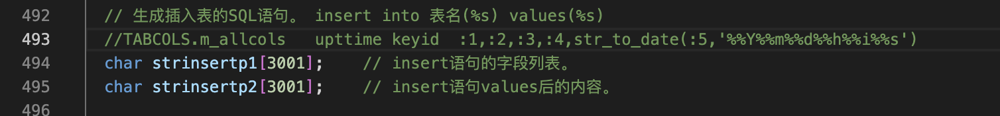
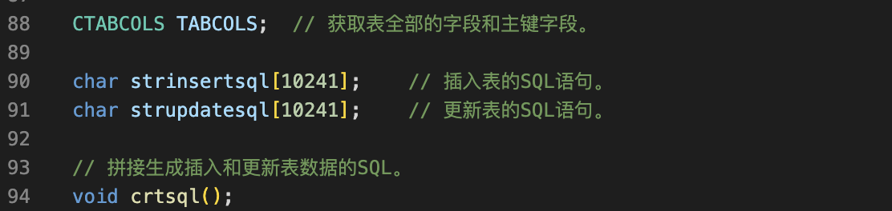
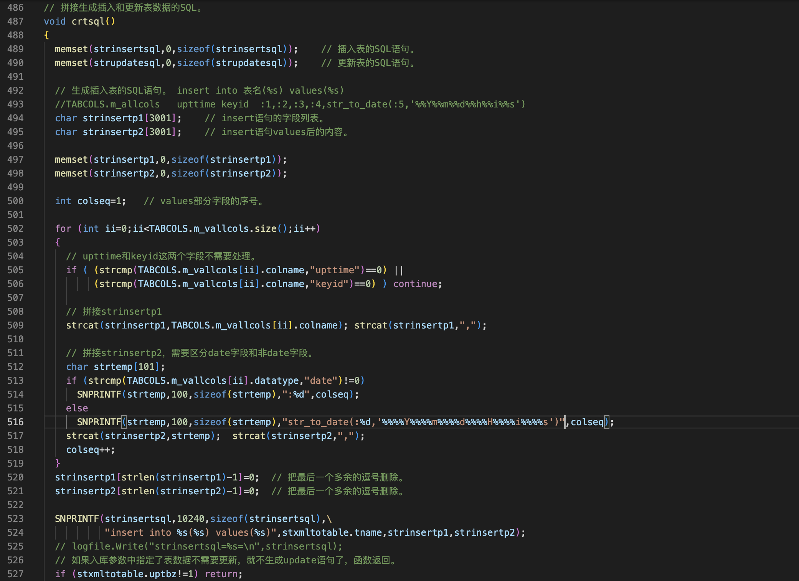
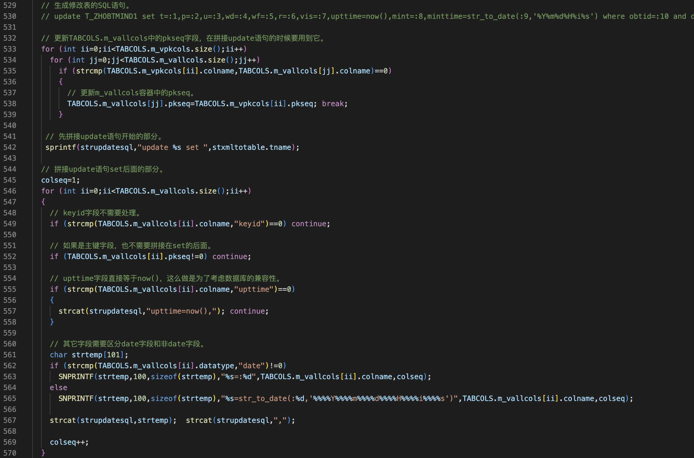
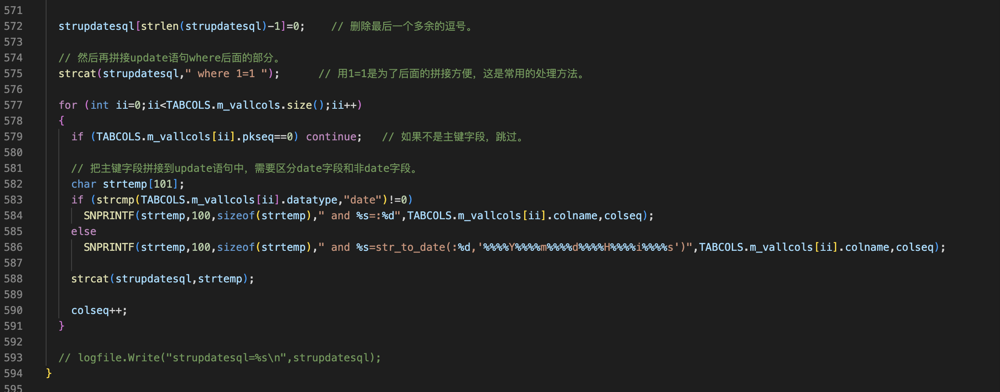
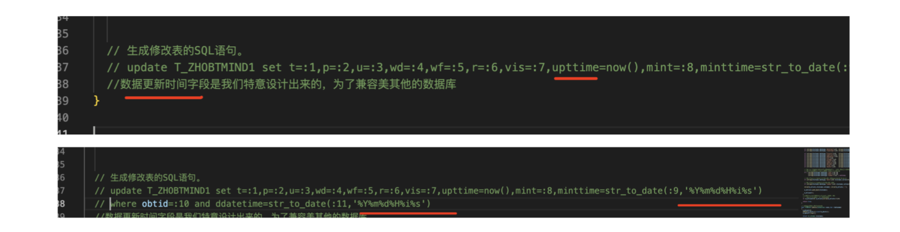
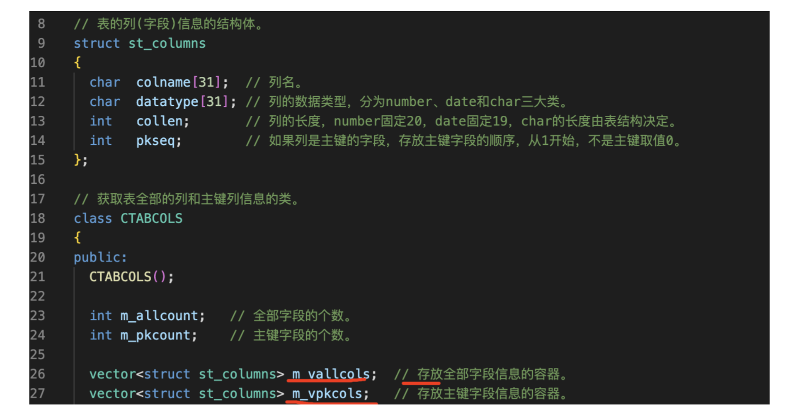
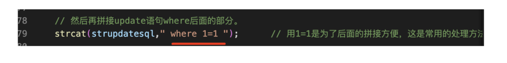
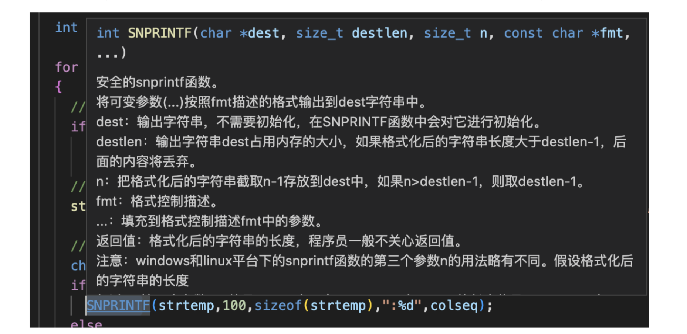

上一节我们把表全部的字段和组件信息从数据字典中拿出来了，并且还做了一些合法性的判断，这一节根据表的字段和组件信息拼接生成插入和更新表的sql语句

这一节在处理这里时有些麻烦

过程
===

1 声明
---

2 写结构体
---

拼接生成插入和更新表数据的SQL。

有两个任务：

- 生成插入表的SQL语句 insert into 表名(%s) values(%s)

- 生成修改表的SQL语句

细节
===

知识点
===

1 数据更新时间字段是我们特意设计出来的，为了兼容美其他的数据库用函数取当前时间

2 修改表的sql语句也不用管keyid字段

3 日期型字段都需要用函数转换

4 为了方便写代码我们m_vpkcols容器的pkseq成员，更新m_vallcols容器的pkseq成员，不更新也可以，但拼接sql语句的时候要反复查找两个容器比较麻烦

5 如果是主键字段也不需要拼接在set后面，因为更新的条件是主键字段，所以主键字段只会出现在where后面

6 用where 1=1 这样后面只要有条件就是一个and条件，and条件

如果用户在多条件查询页面中，不选择任何字段、不输入任何关键词，那么，必将返回表中所有数据；如果用户在页面中，选择了部分字段并且输入了部分查询关键词，那么，就按用户设置的条件进行查询。

7 TABCOLS.m_allcols包含了表全部的字段，在插入表中有两个字段我们是不需要填的 更新时间(upttime)取系统当前时间，另一个是自增字段keyid

拼接strinsertp2 需要区分date字段和非date字段,如果不是日期型拼接一个:和一个序号colseq

8
