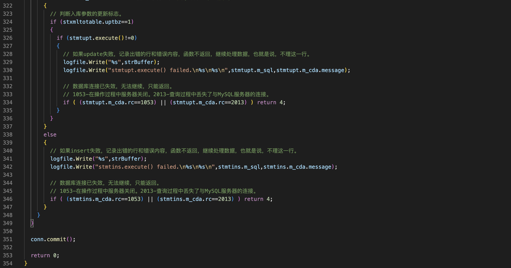
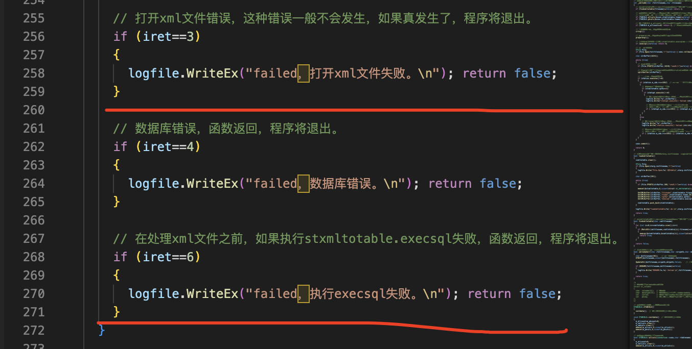

这节课主要内容是读取xml文件把数据插入和更新到表中

过程
===

1 声明
---


2 写结构体
---


3 在处理XML文件的子函数添加
---



4 业务处理主函数
---




完整代码
===

```c++
/*
 *  程序名：xmltodb6.cpp，本程序是数据中心的公共功能模块，用于把xml文件入库到MySQL的表中。
 *  作者：gmc。
*/
#include "_public.h"
#include "_mysql.h"

// 表的列(字段)信息的结构体。
struct st_columns
{
  char  colname[31];  // 列名。
  char  datatype[31]; // 列的数据类型，分为number、date和char三大类。
  int   collen;       // 列的长度，number固定20，date固定19，char的长度由表结构决定。
  int   pkseq;        // 如果列是主键的字段，存放主键字段的顺序，从1开始，不是主键取值0。
};

// 获取表全部的列和主键列信息的类。
class CTABCOLS
{
public:
  CTABCOLS();

  int m_allcount;   // 全部字段的个数。
  int m_pkcount;    // 主键字段的个数。

  vector<struct st_columns> m_vallcols;  // 存放全部字段信息的容器。
  vector<struct st_columns> m_vpkcols;   // 存放主键字段信息的容器。

  char m_allcols[3001];  // 全部的字段名列表，以字符串存放，中间用半角的逗号分隔。
  char m_pkcols[301];    // 主键字段名列表，以字符串存放，中间用半角的逗号分隔。

  void initdata();  // 成员变量初始化。

  // 获取指定表的全部字段信息。
  bool allcols(connection *conn,char *tablename);

  // 获取指定表的主键字段信息。
  bool pkcols(connection *conn,char *tablename);
};

struct st_arg
{
  char connstr[101];     // 数据库的连接参数。
  char charset[51];      // 数据库的字符集。
  char inifilename[301]; // 数据入库的参数配置文件。
  char xmlpath[301];     // 待入库xml文件存放的目录。
  char xmlpathbak[301];  // xml文件入库后的备份目录。
  char xmlpatherr[301];  // 入库失败的xml文件存放的目录。
  int  timetvl;          // 本程序运行的时间间隔，本程序常驻内存。
  int  timeout;          // 本程序运行时的超时时间。
  char pname[51];        // 本程序运行时的程序名。
} starg;

// 显示程序的帮助
void _help(char *argv[]);

// 把xml解析到参数starg结构中
bool _xmltoarg(char *strxmlbuffer);

CLogFile logfile;

connection conn;
 
void EXIT(int sig);

// 业务处理主函数。
bool _xmltodb();

struct st_xmltotable
{
  char filename[101];    // xml文件的匹配规则，用逗号分隔。
  char tname[31];        // 待入库的表名。
  int  uptbz;            // 更新标志：1-更新；2-不更新。
  char execsql[301];     // 处理xml文件之前，执行的SQL语句。
} stxmltotable;
vector<struct st_xmltotable> vxmltotable;   // 数据入库的参数的容器。
// 把数据入库的参数配置文件starg.inifilename加载到vxmltotable容器中。
bool loadxmltotable();
// 从vxmltotable容器中查找xmlfilename的入库参数，存放在stxmltotable结构体中。
bool findxmltotable(char *xmlfilename);

// 处理xml文件的子函数，返回值：0-成功，其它的都是失败，失败的情况有很多种，暂时不确定。
int _xmltodb(char *fullfilename,char *filename);

// 把xml文件移动到备份目录或错误目录。
bool xmltobakerr(char *fullfilename,char *srcpath,char *dstpath);

CTABCOLS TABCOLS;  // 获取表全部的字段和主键字段。

char strinsertsql[10241];    // 插入表的SQL语句。
char strupdatesql[10241];    // 更新表的SQL语句。

// 拼接生成插入和更新表数据的SQL。
void crtsql();

// prepare插入和更新的sql语句，绑定输入变量。
#define MAXCOLCOUNT  300                    // 每个表字段的最大数。
#define MAXCOLLEN    100                    // 表字段值的最大长度。
char strcolvalue[MAXCOLCOUNT][MAXCOLLEN+1]; // 存放从xml每一行中解析出来的值。
sqlstatement stmtins,stmtupt;               // 插入和更新表的sqlstatement对象。
void preparesql();

// 在处理xml文件之前，如果stxmltotable.execsql不为空，就执行它。
bool execsql();

// 解析xml，存放在已绑定的输入变量strcolvalue数组中。
void splitbuffer(char *strBuffer);

int main(int argc,char *argv[])
{
  if (argc!=3) { _help(argv); return -1; }

  // 关闭全部的信号和输入输出。
  // 设置信号,在shell状态下可用 "kill + 进程号" 正常终止些进程。
  // 但请不要用 "kill -9 +进程号" 强行终止。
  // CloseIOAndSignal();
  signal(SIGINT,EXIT); signal(SIGTERM,EXIT);

  if (logfile.Open(argv[1],"a+")==false)
  {
    printf("打开日志文件失败（%s）。\n",argv[1]); return -1;
  }

  // 把xml解析到参数starg结构中
  if (_xmltoarg(argv[2])==false) return -1;

  if (conn.connecttodb(starg.connstr,starg.charset) != 0)
  {
    printf("connect database(%s) failed.\n%s\n",starg.connstr,conn.m_cda.message); EXIT(-1);
  }

  logfile.Write("connect database(%s) ok.\n",starg.connstr);

  // 业务处理主函数。
  _xmltodb();
}

// 显示程序的帮助
void _help(char *argv[])
{
  printf("Using:/project/tools1/bin/xmltodb logfilename xmlbuffer\n\n");

  printf("Sample:/project/tools1/bin/procctl 10 /project/tools1/bin/xmltodb /log/idc/xmltodb_vip1.log \"<connstr>127.0.0.1,root,mysqlpwd,mysql,3306</connstr><charset>utf8</charset><inifilename>/project/tools/ini/xmltodb.xml</inifilename><xmlpath>/idcdata/xmltodb/vip1</xmlpath><xmlpathbak>/idcdata/xmltodb/vip1bak</xmlpathbak><xmlpatherr>/idcdata/xmltodb/vip1err</xmlpatherr><timetvl>5</timetvl><timeout>50</timeout><pname>xmltodb_vip1</pname>\"\n\n");

  printf("本程序是数据中心的公共功能模块，用于把xml文件入库到MySQL的表中。\n");
  printf("logfilename   本程序运行的日志文件。\n");
  printf("xmlbuffer     本程序运行的参数，用xml表示，具体如下：\n\n");

  printf("connstr     数据库的连接参数，格式：ip,username,password,dbname,port。\n");
  printf("charset     数据库的字符集，这个参数要与数据源数据库保持一致，否则会出现中文乱码的情况。\n");
  printf("inifilename 数据入库的参数配置文件。\n");
  printf("xmlpath     待入库xml文件存放的目录。\n");
  printf("xmlpathbak  xml文件入库后的备份目录。\n");
  printf("xmlpatherr  入库失败的xml文件存放的目录。\n");
  printf("timetvl     本程序的时间间隔，单位：秒，视业务需求而定，2-30之间。\n");
  printf("timeout     本程序的超时时间，单位：秒，视xml文件大小而定，建议设置30以上。\n");
  printf("pname       进程名，尽可能采用易懂的、与其它进程不同的名称，方便故障排查。\n\n");
}

// 把xml解析到参数starg结构中
bool _xmltoarg(char *strxmlbuffer)
{
  memset(&starg,0,sizeof(struct st_arg));

  GetXMLBuffer(strxmlbuffer,"connstr",starg.connstr,100);
  if (strlen(starg.connstr)==0) { logfile.Write("connstr is null.\n"); return false; }

  GetXMLBuffer(strxmlbuffer,"charset",starg.charset,50);
  if (strlen(starg.charset)==0) { logfile.Write("charset is null.\n"); return false; }

  GetXMLBuffer(strxmlbuffer,"inifilename",starg.inifilename,300);
  if (strlen(starg.inifilename)==0) { logfile.Write("inifilename is null.\n"); return false; }

  GetXMLBuffer(strxmlbuffer,"xmlpath",starg.xmlpath,300);
  if (strlen(starg.xmlpath)==0) { logfile.Write("xmlpath is null.\n"); return false; }

  GetXMLBuffer(strxmlbuffer,"xmlpathbak",starg.xmlpathbak,300);
  if (strlen(starg.xmlpathbak)==0) { logfile.Write("xmlpathbak is null.\n"); return false; }

  GetXMLBuffer(strxmlbuffer,"xmlpatherr",starg.xmlpatherr,300);
  if (strlen(starg.xmlpatherr)==0) { logfile.Write("xmlpatherr is null.\n"); return false; }

  GetXMLBuffer(strxmlbuffer,"timetvl",&starg.timetvl);
  if (starg.timetvl< 2) starg.timetvl=2;   
  if (starg.timetvl>30) starg.timetvl=30;

  GetXMLBuffer(strxmlbuffer,"timeout",&starg.timeout);
  if (starg.timeout==0) { logfile.Write("timeout is null.\n"); return false; }

  GetXMLBuffer(strxmlbuffer,"pname",starg.pname,50);
  if (strlen(starg.pname)==0) { logfile.Write("pname is null.\n"); return false; }

  return true;
}

void EXIT(int sig)
{
  logfile.Write("程序退出，sig=%d\n\n",sig);

  conn.disconnect();

  exit(0);
}

// 业务处理主函数。
bool _xmltodb()
{
  int counter=50;  // 加载入库参数的计数器，初始化为50是为了在第一次进入循环的时候就加载参数。

  CDir Dir;

  while (true)
  {
    if (counter++>30)
    {
      counter=0;   // 重新计数。
      // 把数据入库的参数配置文件starg.inifilename加载到vxmltotable容器中。
      if (loadxmltotable()==false) return false;
    }

    // 打开starg.xmlpath目录，为了保证先生成的数据入库，打开目录的时候，应该按文件名排序。
    if (Dir.OpenDir(starg.xmlpath,"*.XML",10000,false,true)==false)
    {
      logfile.Write("Dir.OpenDir(%s) failed.\n",starg.xmlpath); return false;
    }

    while (true)
    {
      // 读取目录，得到一个xml文件。
      if (Dir.ReadDir()==false) break;

      logfile.Write("处理文件%s...",Dir.m_FullFileName);

      // 调用处理xml文件的子函数。
      int iret=_xmltodb(Dir.m_FullFileName,Dir.m_FileName);

      // 处理xml文件成功，写日志，备份文件。
      if (iret==0)
      {
        logfile.WriteEx("ok.\n");
        // 把xml文件移动到starg.xmlpathbak参数指定的目录中，一般不会发生错误，如果真发生了，程序将退出。
        if (xmltobakerr(Dir.m_FullFileName,starg.xmlpath,starg.xmlpathbak)==false) return false;
      }

      // 1-没有配置入库参数；2-待入库的表不存在；
      if ( (iret==1) || (iret==2) )
      {
        if (iret==1) logfile.WriteEx("failed，没有配置入库参数。\n");
        if (iret==2) logfile.WriteEx("failed，待入库的表（%s）不存在。\n",stxmltotable.tname);

        // 把xml文件移动到starg.xmlpatherr参数指定的目录中，一般不会发生错误，如果真发生了，程序将退出。
        if (xmltobakerr(Dir.m_FullFileName,starg.xmlpath,starg.xmlpatherr)==false) return false;
      }

      // 打开xml文件错误，这种错误一般不会发生，如果真发生了，程序将退出。
      if (iret==3)
      {
        logfile.WriteEx("failed，打开xml文件失败。\n"); return false;
      }

      // 数据库错误，函数返回，程序将退出。
      if (iret==4)
      {
        logfile.WriteEx("failed，数据库错误。\n"); return false;
      }

      // 在处理xml文件之前，如果执行stxmltotable.execsql失败，函数返回，程序将退出。
      if (iret==6)
      {
        logfile.WriteEx("failed，执行execsql失败。\n"); return false;
      }
    }

    break;
    sleep(starg.timetvl);
  }

  return true;
}

// 处理xml文件的子函数，返回值：0-成功，其它的都是失败，失败的情况有很多种，暂时不确定。
int _xmltodb(char *fullfilename,char *filename)
{
  // 从vxmltotable容器中查找filename的入库参数，存放在stxmltotable结构体中。
  if (findxmltotable(filename)==false) return 1; 

  // 获取表全部的字段和主键信息，如果获取失败，应该是数据库连接已失效。
  // 在本程序运行的过程中，如果数据库出现异常，一定会在这里发现。
  if (TABCOLS.allcols(&conn,stxmltotable.tname)==false) return 4;
  if (TABCOLS.pkcols(&conn,stxmltotable.tname)==false)  return 4;
  
  // 如果TABCOLS.m_allcount为0，说明表根本不存在，返回2。
  if (TABCOLS.m_allcount==0) return 2; // 待入库的表不存在。

  // 拼接生成插入和更新表数据的SQL。
  crtsql();

  // prepare插入和更新的sql语句，绑定输入变量。
  preparesql();

  // 在处理xml文件之前，如果stxmltotable.execsql不为空，就执行它。
  if (execsql()==false) return 6;

  // 打开xml文件。
  CFile File;
  if (File.Open(fullfilename,"r")==false) { conn.rollback(); return 3; } // 打开xml文件错误。

  char strBuffer[10241];

  while (true)
  {
    // 从xml文件中读取一行。
    if (File.FFGETS(strBuffer,10240,"<endl/>")==false) break;

    // 解析xml，存放在已绑定的输入变量strcolvalue数组中。
    splitbuffer(strBuffer);

    // 执行插入和更新的SQL。
    if (stmtins.execute()!=0)
    {
      if (stmtins.m_cda.rc==1062)  // 违反唯一性约束，表示记录已存在。
      {
        // 判断入库参数的更新标志。
        if (stxmltotable.uptbz==1)
        {
          if (stmtupt.execute()!=0)
          {
            // 如果update失败，记录出错的行和错误内容，函数不返回，继续处理数据，也就是说，不理这一行。
            logfile.Write("%s",strBuffer);
            logfile.Write("stmtupt.execute() failed.\n%s\n%s\n",stmtupt.m_sql,stmtupt.m_cda.message);

            // 数据库连接已失效，无法继续，只能返回。 
            // 1053-在操作过程中服务器关闭。2013-查询过程中丢失了与MySQL服务器的连接。
            if ( (stmtupt.m_cda.rc==1053) || (stmtupt.m_cda.rc==2013) ) return 4;
          }
        }
      }
      else
      {
        // 如果insert失败，记录出错的行和错误内容，函数不返回，继续处理数据，也就是说，不理这一行。
        logfile.Write("%s",strBuffer);
        logfile.Write("stmtins.execute() failed.\n%s\n%s\n",stmtins.m_sql,stmtins.m_cda.message);

        // 数据库连接已失效，无法继续，只能返回。
        // 1053-在操作过程中服务器关闭。2013-查询过程中丢失了与MySQL服务器的连接。
        if ( (stmtins.m_cda.rc==1053) || (stmtins.m_cda.rc==2013) ) return 4; 
      }
    }
  }

  conn.commit();

  return 0;
}

// 把数据入库的参数配置文件starg.inifilename加载到vxmltotable容器中。
bool loadxmltotable()
{
  vxmltotable.clear();

  CFile File;
  if (File.Open(starg.inifilename,"r")==false)
  {
    logfile.Write("File.Open(%s) 失败。\n",starg.inifilename); return false;
  }

  char strBuffer[501];

  while (true)
  {
    if (File.FFGETS(strBuffer,500,"<endl/>")==false) break;

    memset(&stxmltotable,0,sizeof(struct st_xmltotable));

    GetXMLBuffer(strBuffer,"filename",stxmltotable.filename,100); // xml文件的匹配规则，用逗号分隔。
    GetXMLBuffer(strBuffer,"tname",stxmltotable.tname,30);        // 待入库的表名。
    GetXMLBuffer(strBuffer,"uptbz",&stxmltotable.uptbz);          // 更新标志：1-更新；2-不更新。
    GetXMLBuffer(strBuffer,"execsql",stxmltotable.execsql,300);   // 处理xml文件之前，执行的SQL语句。
   
    vxmltotable.push_back(stxmltotable);
  }

  logfile.Write("loadxmltotable(%s) ok.\n",starg.inifilename);

  return true;
}

// 从vxmltotable容器中查找xmlfilename的入库参数，存放在stxmltotable结构体中。
bool findxmltotable(char *xmlfilename)
{
  for (int ii=0;ii<vxmltotable.size();ii++)
  {
    if (MatchStr(xmlfilename,vxmltotable[ii].filename)==true)
    {
      memcpy(&stxmltotable,&vxmltotable[ii],sizeof(struct st_xmltotable));
      return true;
    }
  }

  return false;
}

// 把xml文件移动到备份目录或错误目录。
bool xmltobakerr(char *fullfilename,char *srcpath,char *dstpath)
{
  char dstfilename[301];   // 目标文件名。
  STRCPY(dstfilename,sizeof(dstfilename),fullfilename);

  UpdateStr(dstfilename,srcpath,dstpath,false);    // 小心第四个参数，一定要填false。

  if (RENAME(fullfilename,dstfilename)==false)
  {
    logfile.Write("RENAME(%s,%s) failed.\n",fullfilename,dstfilename); return false;
  }

  return true;
}

/*
// 表的列(字段)信息的结构体。
struct st_columns
{
  char  colname[31];  // 列名。
  char  datatype[31]; // 列的数据类型，分为number、date和char三大类。
  int   collen;       // 列的长度，number固定20，date固定19，char的长度由表结构决定。
  int   pkseq;        // 如果列是主键的字段，存放主键字段的顺序，从1开始，不是主键取值0。
};
*/

// 获取表全部的列和主键列信息的类。
CTABCOLS::CTABCOLS()
{
  initdata();  // 调用成员变量初始化函数。
}

void CTABCOLS::initdata()  // 成员变量初始化。
{
  m_allcount=m_pkcount=0;
  m_vallcols.clear();
  m_vpkcols.clear();
  memset(m_allcols,0,sizeof(m_allcols));
  memset(m_pkcols,0,sizeof(m_pkcols));
}

// 获取指定表的全部字段信息。
bool CTABCOLS::allcols(connection *conn,char *tablename)
{
  m_allcount=0;
  m_vallcols.clear();
  memset(m_allcols,0,sizeof(m_allcols));

  struct st_columns stcolumns;

  sqlstatement stmt;
  stmt.connect(conn);
  stmt.prepare("select lower(column_name),lower(data_type),character_maximum_length from information_schema.COLUMNS where table_name=:1");
  stmt.bindin(1,tablename,30);
  stmt.bindout(1, stcolumns.colname,30);
  stmt.bindout(2, stcolumns.datatype,30);
  stmt.bindout(3,&stcolumns.collen);

  if (stmt.execute()!=0) return false;

  while (true)
  {
    memset(&stcolumns,0,sizeof(struct st_columns));
  
    if (stmt.next()!=0) break;

    // 列的数据类型，分为number、date和char三大类。
    if (strcmp(stcolumns.datatype,"char")==0)    strcpy(stcolumns.datatype,"char");
    if (strcmp(stcolumns.datatype,"varchar")==0) strcpy(stcolumns.datatype,"char");

    if (strcmp(stcolumns.datatype,"datetime")==0)  strcpy(stcolumns.datatype,"date");
    if (strcmp(stcolumns.datatype,"timestamp")==0) strcpy(stcolumns.datatype,"date");
    
    if (strcmp(stcolumns.datatype,"tinyint")==0)   strcpy(stcolumns.datatype,"number");
    if (strcmp(stcolumns.datatype,"smallint")==0)  strcpy(stcolumns.datatype,"number");
    if (strcmp(stcolumns.datatype,"mediumint")==0) strcpy(stcolumns.datatype,"number");
    if (strcmp(stcolumns.datatype,"int")==0)       strcpy(stcolumns.datatype,"number");
    if (strcmp(stcolumns.datatype,"integer")==0)   strcpy(stcolumns.datatype,"number");
    if (strcmp(stcolumns.datatype,"bigint")==0)    strcpy(stcolumns.datatype,"number");
    if (strcmp(stcolumns.datatype,"numeric")==0)   strcpy(stcolumns.datatype,"number");
    if (strcmp(stcolumns.datatype,"decimal")==0)   strcpy(stcolumns.datatype,"number");
    if (strcmp(stcolumns.datatype,"float")==0)     strcpy(stcolumns.datatype,"number");
    if (strcmp(stcolumns.datatype,"double")==0)    strcpy(stcolumns.datatype,"number");

    // 如果业务有需要，可以修改上面的代码，增加对更多数据类型的支持。
    // 如果字段的数据类型不在上面列出来的中，忽略它。
    if ( (strcmp(stcolumns.datatype,"char")!=0) &&
         (strcmp(stcolumns.datatype,"date")!=0) &&
         (strcmp(stcolumns.datatype,"number")!=0) ) continue;

    // 如果字段类型是date，把长度设置为19。yyyy-mm-dd hh:mi:ss
    if (strcmp(stcolumns.datatype,"date")==0) stcolumns.collen=19;

    // 如果字段类型是number，把长度设置为20。
    if (strcmp(stcolumns.datatype,"number")==0) stcolumns.collen=20;

    strcat(m_allcols,stcolumns.colname); strcat(m_allcols,",");

    m_vallcols.push_back(stcolumns);

    m_allcount++;
  }

  // 删除m_allcols最后一个多余的逗号。
  if (m_allcount>0) m_allcols[strlen(m_allcols)-1]=0;

  return true;
}

// 获取指定表的主键字段信息。
bool CTABCOLS::pkcols(connection *conn,char *tablename)
{
  m_pkcount=0;
  memset(m_pkcols,0,sizeof(m_pkcols));
  m_vpkcols.clear();

  struct st_columns stcolumns;

  sqlstatement stmt;
  stmt.connect(conn);
  stmt.prepare("select lower(column_name),seq_in_index from information_schema.STATISTICS where table_name=:1 and index_name='primary' order by seq_in_index");
  stmt.bindin(1,tablename,30);
  stmt.bindout(1, stcolumns.colname,30);
  stmt.bindout(2,&stcolumns.pkseq);

  if (stmt.execute() != 0) return false;

  while (true)
  {
    memset(&stcolumns,0,sizeof(struct st_columns));

    if (stmt.next() != 0) break;

    strcat(m_pkcols,stcolumns.colname); strcat(m_pkcols,",");

    m_vpkcols.push_back(stcolumns);

    m_pkcount++;
  }

  if (m_pkcount>0) m_pkcols[strlen(m_pkcols)-1]=0;    // 删除m_pkcols最后一个多余的逗号。

  return true;
}

// 拼接生成插入和更新表数据的SQL。
void crtsql()
{
  memset(strinsertsql,0,sizeof(strinsertsql));    // 插入表的SQL语句。
  memset(strupdatesql,0,sizeof(strupdatesql));    // 更新表的SQL语句。

  // 生成插入表的SQL语句。 insert into 表名(%s) values(%s)
  char strinsertp1[3001];    // insert语句的字段列表。
  char strinsertp2[3001];    // insert语句values后的内容。

  memset(strinsertp1,0,sizeof(strinsertp1));
  memset(strinsertp2,0,sizeof(strinsertp2));
  
  int colseq=1;   // values部分字段的序号。

  for (int ii=0;ii<TABCOLS.m_vallcols.size();ii++)
  {
    // upttime和keyid这两个字段不需要处理。
    if ( (strcmp(TABCOLS.m_vallcols[ii].colname,"upttime")==0) ||
         (strcmp(TABCOLS.m_vallcols[ii].colname,"keyid")==0) ) continue;
    
    // 拼接strinsertp1
    strcat(strinsertp1,TABCOLS.m_vallcols[ii].colname); strcat(strinsertp1,",");

    // 拼接strinsertp2，需要区分date字段和非date字段。
    char strtemp[101];
    if (strcmp(TABCOLS.m_vallcols[ii].datatype,"date")!=0)
      SNPRINTF(strtemp,100,sizeof(strtemp),":%d",colseq);
    else
      SNPRINTF(strtemp,100,sizeof(strtemp),"str_to_date(:%d,'%%%%Y%%%%m%%%%d%%%%H%%%%i%%%%s')",colseq);

    strcat(strinsertp2,strtemp);  strcat(strinsertp2,",");

    colseq++;
  }

  strinsertp1[strlen(strinsertp1)-1]=0;  // 把最后一个多余的逗号删除。
  strinsertp2[strlen(strinsertp2)-1]=0;  // 把最后一个多余的逗号删除。

  SNPRINTF(strinsertsql,10240,sizeof(strinsertsql),\
           "insert into %s(%s) values(%s)",stxmltotable.tname,strinsertp1,strinsertp2);

  // logfile.Write("strinsertsql=%s=\n",strinsertsql);

  // 如果入库参数中指定了表数据不需要更新，就不生成update语句了，函数返回。
  if (stxmltotable.uptbz!=1) return;

  // 生成修改表的SQL语句。
  // update T_ZHOBTMIND1 set t=:1,p=:2,u=:3,wd=:4,wf=:5,r=:6,vis=:7,upttime=now(),mint=:8,minttime=str_to_date(:9,'%Y%m%d%H%i%s') where obtid=:10 and ddatetime=str_to_date(:11,'%Y%m%d%H%i%s')

  // 更新TABCOLS.m_vallcols中的pkseq字段，在拼接update语句的时候要用到它。
  for (int ii=0;ii<TABCOLS.m_vpkcols.size();ii++)
    for (int jj=0;jj<TABCOLS.m_vallcols.size();jj++)
      if (strcmp(TABCOLS.m_vpkcols[ii].colname,TABCOLS.m_vallcols[jj].colname)==0)
      {
        // 更新m_vallcols容器中的pkseq。
        TABCOLS.m_vallcols[jj].pkseq=TABCOLS.m_vpkcols[ii].pkseq; break;
      }

   // 先拼接update语句开始的部分。
   sprintf(strupdatesql,"update %s set ",stxmltotable.tname);

  // 拼接update语句set后面的部分。
  colseq=1;
  for (int ii=0;ii<TABCOLS.m_vallcols.size();ii++)
  {
    // keyid字段不需要处理。
    if (strcmp(TABCOLS.m_vallcols[ii].colname,"keyid")==0) continue;

    // 如果是主键字段，也不需要拼接在set的后面。
    if (TABCOLS.m_vallcols[ii].pkseq!=0) continue;

    // upttime字段直接等于now()，这么做是为了考虑数据库的兼容性。
    if (strcmp(TABCOLS.m_vallcols[ii].colname,"upttime")==0)
    {
      strcat(strupdatesql,"upttime=now(),"); continue;
    }

    // 其它字段需要区分date字段和非date字段。
    char strtemp[101];
    if (strcmp(TABCOLS.m_vallcols[ii].datatype,"date")!=0)
      SNPRINTF(strtemp,100,sizeof(strtemp),"%s=:%d",TABCOLS.m_vallcols[ii].colname,colseq);
    else
      SNPRINTF(strtemp,100,sizeof(strtemp),"%s=str_to_date(:%d,'%%%%Y%%%%m%%%%d%%%%H%%%%i%%%%s')",TABCOLS.m_vallcols[ii].colname,colseq);

    strcat(strupdatesql,strtemp);  strcat(strupdatesql,",");

    colseq++;
  }

  strupdatesql[strlen(strupdatesql)-1]=0;    // 删除最后一个多余的逗号。

  // 然后再拼接update语句where后面的部分。
  strcat(strupdatesql," where 1=1 ");      // 用1=1是为了后面的拼接方便，这是常用的处理方法。

  for (int ii=0;ii<TABCOLS.m_vallcols.size();ii++)
  {
    if (TABCOLS.m_vallcols[ii].pkseq==0) continue;   // 如果不是主键字段，跳过。

    // 把主键字段拼接到update语句中，需要区分date字段和非date字段。
    char strtemp[101];
    if (strcmp(TABCOLS.m_vallcols[ii].datatype,"date")!=0)
      SNPRINTF(strtemp,100,sizeof(strtemp)," and %s=:%d",TABCOLS.m_vallcols[ii].colname,colseq);
    else
      SNPRINTF(strtemp,100,sizeof(strtemp)," and %s=str_to_date(:%d,'%%%%Y%%%%m%%%%d%%%%H%%%%i%%%%s')",TABCOLS.m_vallcols[ii].colname,colseq);

    strcat(strupdatesql,strtemp);  

    colseq++;
  }

  // logfile.Write("strupdatesql=%s\n",strupdatesql);
}

// prepare插入和更新的sql语句，绑定输入变量。
void preparesql()
{
  // 绑定插入sql语句的输入变量。
  stmtins.connect(&conn);
  stmtins.prepare(strinsertsql);

  int colseq=1;        // values部分字段的序号。

  for (int ii=0;ii<TABCOLS.m_vallcols.size();ii++)
  {
    // upttime和keyid这两个字段不需要处理。
    if ( (strcmp(TABCOLS.m_vallcols[ii].colname,"upttime")==0) ||
         (strcmp(TABCOLS.m_vallcols[ii].colname,"keyid")==0) ) continue;
 
    // 注意，strcolvalue数组的使用不是连续的，是和TABCOLS.m_vallcols的下标是一一对应的。
    stmtins.bindin(colseq,strcolvalue[ii],TABCOLS.m_vallcols[ii].collen);

    colseq++;
  }
  
  // 绑定更新sql语句的输入变量。
  // 如果入库参数中指定了表数据不需要更新，就不处理update语句了，函数返回。
  if (stxmltotable.uptbz!=1) return;

  stmtupt.connect(&conn);
  stmtupt.prepare(strupdatesql);

  colseq=1;        // set和where部分字段的序号。

  // 绑定set部分的输入参数。
  for (int ii=0;ii<TABCOLS.m_vallcols.size();ii++)
  {
    // upttime和keyid这两个字段不需要处理。
    if ( (strcmp(TABCOLS.m_vallcols[ii].colname,"upttime")==0) ||
         (strcmp(TABCOLS.m_vallcols[ii].colname,"keyid")==0) ) continue;
  
    // 如果是主键字段，也不需要拼接在set的后面。
    if (TABCOLS.m_vallcols[ii].pkseq!=0) continue;

    // 注意，strcolvalue数组的使用不是连续的，是和TABCOLS.m_vallcols的下标是一一对应的。
    stmtupt.bindin(colseq,strcolvalue[ii],TABCOLS.m_vallcols[ii].collen);

    colseq++;
  }

  // 绑定where部分的输入参数。
  for (int ii=0;ii<TABCOLS.m_vallcols.size();ii++)
  {
    // 如果不是主键字段，跳过，只有主键字段才拼接在where的后面。
    if (TABCOLS.m_vallcols[ii].pkseq==0) continue;
    
    // 注意，strcolvalue数组的使用不是连续的，是和TABCOLS.m_vallcols的下标是一一对应的。
    stmtupt.bindin(colseq,strcolvalue[ii],TABCOLS.m_vallcols[ii].collen);

    colseq++;
  }
}

// 在处理xml文件之前，如果stxmltotable.execsql不为空，就执行它。
bool execsql()
{
  if (strlen(stxmltotable.execsql)==0) return true;

  sqlstatement stmt;
  stmt.connect(&conn);
  stmt.prepare(stxmltotable.execsql);
  if (stmt.execute()!=0)
  {
    logfile.Write("stmt.execute() failed.\n%s\n%s\n",stmt.m_sql,stmt.m_cda.message); return false;
  }

  return true;
}

// 解析xml，存放在已绑定的输入变量strcolvalue数组中。
void splitbuffer(char *strBuffer)
{
  memset(strcolvalue,0,sizeof(strcolvalue));

  char strtemp[31];

  for (int ii=0;ii<TABCOLS.m_vallcols.size();ii++)
  {
    // 如果是日期时间字段，提取数值就可以了。
    // 也就是说，xml文件中的日期时间只要包含了yyyymmddhh24miss就行，可以是任意分隔符。
    if (strcmp(TABCOLS.m_vallcols[ii].datatype,"date")==0)
    {
      GetXMLBuffer(strBuffer,TABCOLS.m_vallcols[ii].colname,strtemp,TABCOLS.m_vallcols[ii].collen);
      PickNumber(strtemp,strcolvalue[ii],false,false);
      continue;
    }

    // 如果是数值字段，只提取数字、+-符号和圆点。
    if (strcmp(TABCOLS.m_vallcols[ii].datatype,"number")==0)
    {
      GetXMLBuffer(strBuffer,TABCOLS.m_vallcols[ii].colname,strtemp,TABCOLS.m_vallcols[ii].collen);
      PickNumber(strtemp,strcolvalue[ii],true,true);
      continue;
    }

    // 如果是字符字段，直接提取。
    GetXMLBuffer(strBuffer,TABCOLS.m_vallcols[ii].colname,strcolvalue[ii],TABCOLS.m_vallcols[ii].collen);
  }
}
```

