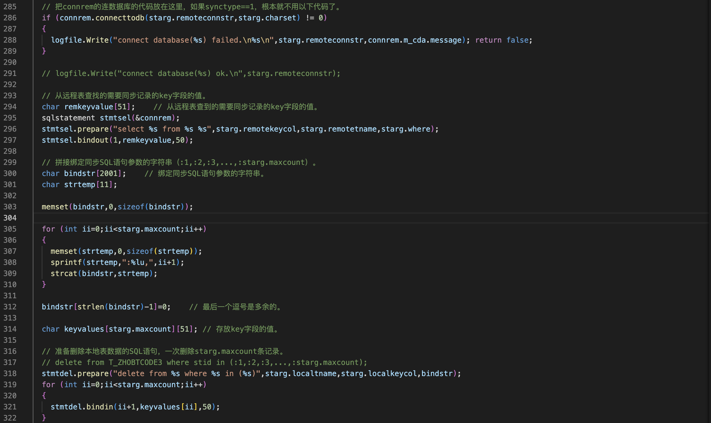

账户基本信息数据量比较大，对表有插入和修改操作，这种数据我们假设全国站点参数表的数据量很大，采用分批同步的方法，同步的条件一般为时间戳字段，比如说更新时间，如果同步程序每隔一小时启动一次那么可以把同步条件设置为更新时间在1.5小时或2小时之内

交易流水这种表的数据量非常大，只有插入操作，没有修改操作，同步这种表最好的方法是增量同步，也可以采用刷新同步的方法

过程
===

- 连接远程数据库
- 从远程表中查找的需要同步记录的key字段的值
- 拼接绑定同步SQL语句参数的字符串

就是这个效果

- 准备删除本地表数据的SQL语句，一次删除starg.maxcount条记录
- 准备插入本地表数据的SQL语句，一次插入starg.maxcount条记录
- 获取需要同步数据的结果集

业务处理主函数
---

