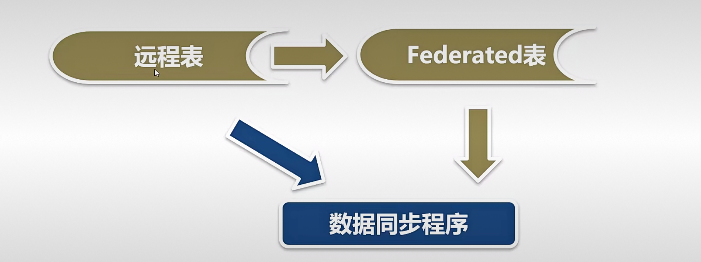

开发刷新同步数据模块
===

- 全表刷新，适用于数据量不大的表，能保证数据的完整性
- 分批刷新，适用于数据量较大的表，不能保证数据的完整性

刷新同步-全表刷新
---

- 删除本地表中全部的记录
- 把Federated表中全部的记录插入本地表

刷新同步-分批刷新
---

### 有两个细节：

在第一个步骤，从远程表查询需要同步的数据而不是Federated表，原因是Federated表不支持普通索引，如果同步的条件不是主键，也不是唯一键，就会进行全表扫描，第二个原因是就算Federated表支持普通索引效率也不如直接访问远程表的效率高

需要一个循环，在循环里面执行第二步和第三步，直到全部的数据被处理完

### 缺点：

分批同步，不能够同步删除操作，但是我们在设计表的时候，可以避免删除操作

- 从远程表中查询需要同步的数据，把结果集分成若干批，每批记录数在50-256之间
- 删除本地表中指定批的记录
- 把Federated表中指定批的记录插入本地表

