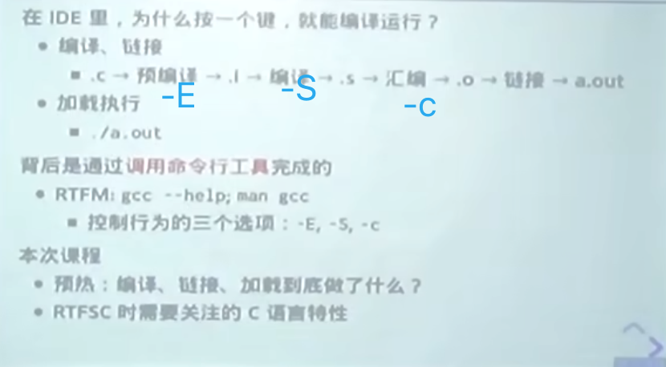
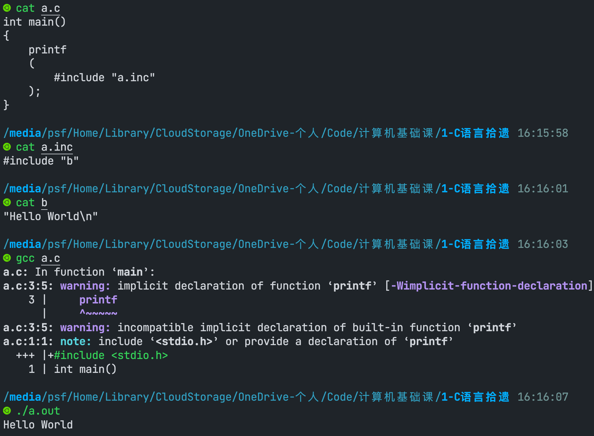
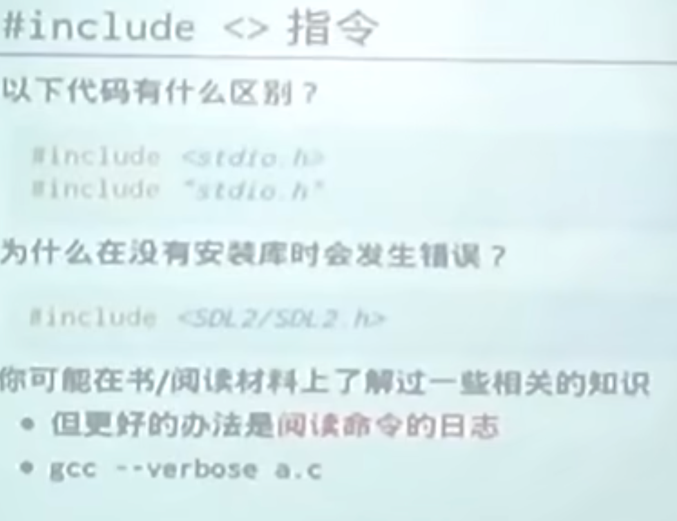
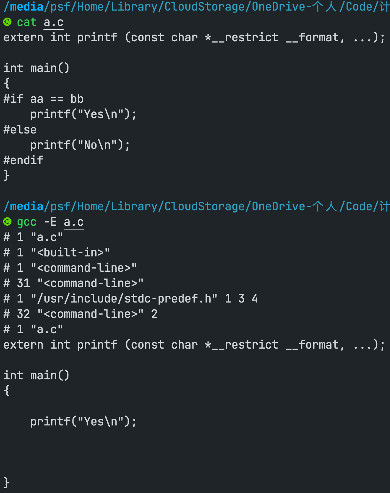

vim a.out
:%!xxd可以将二进制文件转换为可读的文本

### #include "" 和 #include <> 有什么区别
使用`gcc --verbose a.c`命令 `verbose`有啰嗦的意思

> #include "" / <>
```shell
#include "..." search starts here:
#include <...> search starts here:
 /usr/lib/gcc/aarch64-linux-gnu/9/include
 /usr/local/include
 /usr/include/aarch64-linux-gnu
 /usr/include
```
如果我们把a.c中的`#include "a.inc"` 改为 `#include <a.inc>` 那么会出错，变成到上面列出的路径中查找a.inc
这时需要添加编译参数 `gcc a.c -I./` `-I.`的意思是将当前目录添加到 `<>` 查找的path中
此时的path为： （对了`.` 当前目录）
```shell
#include "..." search starts here:
#include <...> search starts here:
 .
 /usr/lib/gcc/aarch64-linux-gnu/9/include
 /usr/local/include
 /usr/include/aarch64-linux-gnu
 /usr/include
```

默认的gcc 配置参数
``` bash
Configured with: ../src/configure -v --with-pkgversion='Ubuntu 9.4.0-1ubuntu1~20.04.1' --with-bugurl=file:///usr/share/doc/gcc-9/README.Bugs --enable-languages=c,ada,c++,go,d,fortran,objc,obj-c++,gm2 --prefix=/usr --with-gcc-major-version-only --program-suffix=-9 --program-prefix=aarch64-linux-gnu- --enable-shared --enable-linker-build-id --libexecdir=/usr/lib --without-included-gettext --enable-threads=posix --libdir=/usr/lib --enable-nls --enable-clocale=gnu --enable-libstdcxx-debug --enable-libstdcxx-time=yes --with-default-libstdcxx-abi=new --enable-gnu-unique-object --disable-libquadmath --disable-libquadmath-support --enable-plugin --enable-default-pie --with-system-zlib --with-target-system-zlib=auto --enable-objc-gc=auto --enable-multiarch --enable-fix-cortex-a53-843419 --disable-werror --enable-checking=release --build=aarch64-linux-gnu --host=aarch64-linux-gnu --target=aarch64-linux-gnu
```

默认的编译指令
```bash
/usr/lib/gcc/aarch64-linux-gnu/9/cc1 -quiet -v -imultiarch aarch64-linux-gnu a.c -quiet -dumpbase a.c -mlittle-endian -mabi=lp64 -auxbase a -version -fasynchronous-unwind-tables -fstack-protector-strong -Wformat -Wformat-security -fstack-clash-protection -o /tmp/ccJQ5nG1.s
```

> #include 就是复制粘贴

我们可以使用gcc -E 来查看
如果在我们的C文件中，只用到了printf。那么我们可以只添加`extern int printf (const char *__restrict __format, ...);`函数，而不用使用#include <stdio.h>
这时的gcc -E a.c为：


#### 为什么 aa == bb呢？
```c
extern int printf (const char *__restrict __format, ...);

int main()
{
#ifdef __x86_64__
    printf("x86_64\n");
#else
    printf("aarch\n");
#endif

#if aa == bb
    printf("Yes\n");
#else
    printf("No\n");
#endif
}
```
因为宏aa 和 bb未被定义。此时为空 == 空。所以输出Yes